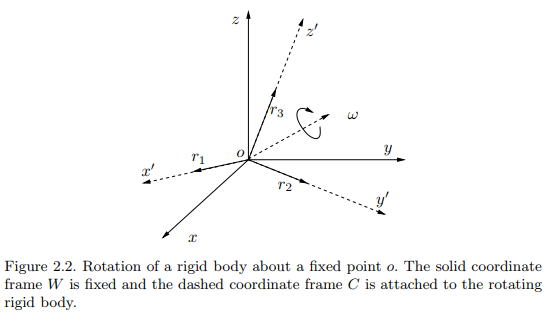

# Representation of a Three-Dimensional Moving Scene

Reference: An Invitation to 3-D vision, Chapter 2. 

## CheatSheet

|         | Rotation | Transformation |
|:--------|:--------|:--------|
| vector form | $ w \in \mathbb{R}^3 $ | $ \xi = \begin{bmatrix} w & v \end{bmatrix}^T \in \mathbb{R}^6 $ : twist coordinates |
| exponential coordinates | $ \widehat{w} \in so(3) \subset \mathbb{R}^{3 \times 3} $  $ \widehat{w} \doteq  \begin{bmatrix} 0 & -w_3 & w_2 \\\\ w_3 & 0 & -w_1 \\\\ -w_2 & w_1 & 0 \end{bmatrix} $ | $ \hat{\xi} \in se(3) \subset \mathbb{R}^{4 \times 4} $ : twist  $ \widehat{\xi} \doteq \begin{bmatrix} \widehat{w} & v \\\\ 0 & 0 \end{bmatrix} $ |
| matrix form | $ R = e^{\hat{w}} \in SO(3) \subset \mathbb{R}^{3 \times 3} $ | $ T = e^{\hat{\xi}} \in SE(3) \subset \mathbb{R}^{4 \times 4} $ |
| exponential map | $ e^{\widehat{w}t} = I + \widehat{w}sin(t) + \widehat{w} ^2 (1-cos(t)) $ where $ \begin{Vmatrix} w \end{Vmatrix}=1 $ | $ e^{\widehat{\xi}t}  = \begin{bmatrix} e^{\widehat{w}} & \left( I - e^{\widehat{w}} \right) \widehat{w} v + w \widehat{w}^T v \\\\ 0 & 1 \end{bmatrix} $ |

## 2.1 Three-dimensional Euclidean space

A point in the Euclidean space:

$$
\mathbf{X} \doteq \begin{bmatrix} X_1 \\ X_2 \\ X_3 \end{bmatrix} \in \mathbb{R}^3,   \mathbb{E}^3
$$

A vector in the Euclidean space 

$$
v \doteq \mathbf{Y - X} \in \mathbb{R}^3
$$

Inner product of two vectors:

$$
\left\langle u,v \right\rangle \doteq u^Tv = u_1 v_1 + u_2 v_2 + u_3 v_3, \forall u,v \in \mathbb{R}^3
$$

Cross product of two vectors:

$$
u \times v \doteq \begin{bmatrix} u_2v_3 - u_3v_2 \\ u_3v_1 - u_1v_3 \\ u_1v_2 - u_2v_1 \end{bmatrix} \in \mathbb{R}^3
$$

For fixed $ u $, the cross product can be represented by a map from $ \mathbb{R}^3 $  to $ \mathbb{R}^3: u \mapsto u \times v $. We define this mapping matrix by

$$
\widehat{u} \doteq  \begin{bmatrix} 0 & -u_3 & u_2 \\ u_3 & 0 & -u_1 \\ -u_2 & u_1 & 0 \end{bmatrix} \in \mathbb{R}^{3 \times 3}
$$

such that $ u \times v = \widehat{u}v $. Note that $ \widehat{u} $ is a skew-symmetric matrix, i.e. $ \widehat{u}^T = -\widehat{u} $.   

The cross product defines a (one-to-one) map between a vector  u  and a $3 \times 3$ skew-symmetric matrix  $ \widehat{u} $. The map is defined by a *hat-operator*

$$
\wedge : \mathbb{R}^3 \rightarrow so(3); u \mapsto \widehat{u}.
$$

## 2.2 Rigid-body motion

> **Rigid-body**: the distance between any pair of points $ (p,q) $ on it does not change over time as the object moves.
> 

> **Euclidean transformation**: a map that preserves the Euclidean distance between every pair of points. The set of all Euclidean transformation in 3-D space is denoted by $ E(3) $.
> 
> $$
> g: \mathbb{R}^3 \to \mathbb{R}^3; X \mapsto g(X)
> $$
> 

Suppose a vector $  v=\mathbf{Y} - \mathbf{X} $. After the transformation of $g$, we obtain a new vector
$$ u = g_*(v) \doteq g(\mathbf{Y}) - g(\mathbf{X}) $$ where $$  \begin{Vmatrix} g_*(v) \end{Vmatrix} = \begin{Vmatrix} v \end{Vmatrix}. $$

Some Euclidean transformations are not physically realizable. For example the map

$$
f: \begin{bmatrix} X_1, X_2, X_3 \end{bmatrix} \mapsto \begin{bmatrix} X_1, X_2, -X_3 \end{bmatrix}
$$
preserves distances but **not orientations**. (reflection)

> The map or transformation induced by a rigid-body motion is called a **special Euclidean transformation**. The word "*special*" indicates the fact that a transformation is orientation-preserving. 
> 

> Rigid-body motion or special Euclidean transformation: A map that **preserves the norm and the cross product of any two vectors**
>
> 1. norm: $$ \begin{Vmatrix} g_*(v) \end{Vmatrix} = \begin{Vmatrix} v \end{Vmatrix}, \forall v \in \mathbb{R}^3 $$
> 2. cross product: $$ g_*(u) \times g_*(v) = g_*(u \times v), \forall u, v \in \mathbb{R}^3 $$
> 3. (consequently) angle or inner product: $$ \left\langle u,v \right\rangle = \left\langle g_*(u), g_*(v) \right\rangle $$
> 

Let us define a Cartesian coordinate frame, with its principal axes given by three *orthonormal* vectors $ e_1, e_2, e_3 \in \mathbb{R}^3 $ ($e_1 \times e_2 = e_3 $, right-handed frame)

$$
e_i^T e_j = \delta_{ij} \doteq \begin{cases} 1 & \mbox{if } i = j \\ 0 & \mbox{if } i \ne j \end{cases}
$$

After a rigid-body motion $ g $,

$$
g_*(e_i)^T g_*(e_j) = \delta_{ij} , \quad g_*(e_1) \times g_*(e_2) = g_*(e_3) 
$$

The resulting vectors still form a right-handed frame.

When a camera moves, the camera frame also moves along with the camera. The configuration of the camera is then determined by two components:

1. Translational part $ T $ : the vector between the origin of the world frame and that of the camera frame.
2. Rotational part $ R $ : the relative orientation of the camera frame $ C $, with coordinate axes $ (x,y,z) $, relative to the fixed world frame $ W $ with coordinate axes $ (X,Y,Z) $

## 2.3 Rotational motion and its representations

### 2.3.1 Orthogonal matrix representation of rotations

The frame  C  relative to the frame  W  is determined by the three orthonormal vectors: 

$$
r_1=g_*(e_1), r_2=g_*(e_2), r_3=g_*(e_3) \in \mathbb{R}^3. 
$$

Then the configuration of the rotating object  is determined by the $ 3 \times 3 $ matrix $
R_{wc} \doteq \begin{bmatrix} r_1, r_2, r_3 \end{bmatrix} \in \mathbb{R}^3  $

Since $ r_1, r_2, r_3 $ form an orthonormal frame, 

$$
\begin{align}
& r_i^T r_j = \delta_{ij} \doteq \begin{cases} 1 & \mbox{if } i = j \\ 0 & \mbox{if } i \ne j \end{cases} \\\\
& R_{wc}^T R_{wc} = R_{wc} R_{wc}^T = I, \quad R_{wc}^{-1} = R_{wc}^T: \text{orthogonal matrix}
\end{align}
$$

Since we only deal with a right-handed frame, $ det(R_{wc}) = +1 $. Hence $ R_{wc} $ is a special orthogonal matrix, which is denoted by

> $$ SO(3) \doteq \left\{ R \in \mathbb{R}^{3\times3} \middle|\ R^TR=I,\ det(R)=+1 \right\} $$

The space $ SO(3) $ is referred as the *special orthogonal group* of $ \mathbb{R}^3 $ or simply *rotation group*.

Suppose that for a given point $ p $, its coordinates in the world frame $ W $ is $ X_w = \left[ X_{1w}, X_{2w}, X_{3w} \right] $.   

Since $ r_1, r_2, r_3 $ form a basis for $ \mathbb{R}^3 $, $ X_w $ can also be expressed as

$$
X_w = X_{1c}r_1 + X_{2c}r_2 + X_{3c}r_3
$$

where $ X_c = \left[ X_{1c}, X_{2c}, X_{3c} \right] $ is the coordinates of the same point $ p $ in the frame $ C $ relative to the frame $ W $. 

$$
\begin{aligned}
& X_w = X_{1c}r_1 + X_{2c}r_2 + X_{3c}r_3 = R_{wc}X_c \\\\
& X_c = R^{-1}_{wc}X_w = R^T_{wc}X_w
\end{aligned}
$$

$ R_{wc} $ transforms the coordinates $ X_c $ in the frame $ C $ to its coordinates $ X_w $ in the frame $ W $

### 2.3.2 Canonical exponential coordinates for rotations

Given a trajectory $ R(t) $ that describes a continuous rotational motion, the rotation must satisfy $ R(t)^TR(t) = I$.

By computing the derivative with respect to time $ t $,

$$
\dot{R} R^T(t) + R(t) \dot{R}^T(t) = 0 \quad \Rightarrow  \quad \dot{R}(t) R^T(t) = -(\dot{R}(t) R^T(t))^T
$$

The resulting equation shows that $ \dot{R}(t) R^T(t) \in \mathbb{R}^{3 \times 3} $ is a skew-symmetric matrix. There must exist a vector $ w(t) \in \mathbb{R}^3 $ such that 

$$
\begin{aligned}
& \dot{R}(t) R^T(t) = \widehat{w}(t) \\\\
& \dot{R}(t) = \widehat{w}(t) R(t) 
\end{aligned}
$$

The space of all skew-symmetric matrices is denoted by
> $$
> so(3) \doteq \left\{ \widehat{w} \in \mathbb{R}^{3 \times 3} \mid w\in \mathbb{R}^3 \right\}.
> $$
>

Note that $ so(3) $ depends only on three parameters.  

Since the above equation is a linear ordinary differential equation (ODE), $ R(t) $ can be interpreted as the state transition matrix. Assuming $ R(0) = I $, the solution is

$$
\begin{align}
& R(t) = e^{\widehat{w}t} \\\\
& \text{where } e^{\widehat{w}t} \text{ is the matrix exponential} \\\\
& e^{\widehat{w}t} = I + \widehat{w}t + {(\widehat{w}t)^2 \over 2!} + \cdots + {(\widehat{w}t)^n \over n!} + \cdots
\end{align}
$$

The matrix exponential indeed defines a map from the space $ so(3) $ to $ SO(3) $, the so-called *exponential map*

> $$ exp: so(3) \to SO(3); \quad \widehat{w} \mapsto e^{\widehat{w}} $$

We can verify the matrix $ e^{\widehat{w}t} $ is a rotation matrix.

$$
\left( e^{\widehat{w}t} \right)^{-1} = e^{-\widehat{w}t} = e^{\widehat{w}^Tt} = \left( e^{\widehat{w}t} \right)^T 
$$

Hence $ \left( e^{\widehat{w}t} \right)^T e^{\widehat{w}t} = I $.

> The **physical interpretation** of $ R(t) = e^{\widehat{w}t} $ is that if $ \begin{Vmatrix} w \end{Vmatrix} = 1 $, $ R(t) = e^{\widehat{w}t} $ is simply a rotation around the axis $ w \in \mathbb{R}^3 $ by an angle $ t $ radians.

> Theorem 2.8 (**Logarithm** of $ SO(3) $). For any $ R \in SO(3) $, there exists a (not necessarily unique) $ w \in \mathbb{R}^3 $ such that $ R = exp( \widehat{w} ) $. We denote the inverse of the exponential map by $ \widehat{w} = log(R) $. 

> Theorem 2.9 (**Rodrigues'** formula for a rotation matrix). Given $ w \in \mathbb{R}^3$, the matrix exponential $ R = e^{\widehat{w}} $ is given by 
>
> $$
> e^{\widehat{w}} = I + {\widehat{w} \over \begin{Vmatrix} w \end{Vmatrix}} sin(\begin{Vmatrix} w \end{Vmatrix}) + {\widehat{w}^2 \over \begin{Vmatrix} w \end{Vmatrix}^2} (1 - cos(\begin{Vmatrix} w \end{Vmatrix})
> $$
>

if $ \begin{Vmatrix} w \end{Vmatrix} = 1 $, $ {\widehat{w} \over \begin{Vmatrix} w \end{Vmatrix}} = \widehat{w}, \begin{Vmatrix} wt \end{Vmatrix} = t $, so that

$$
e^{\widehat{w}t} = I + \widehat{w}sin(t) + \widehat{w} ^2 (1-cos(t))
$$

Note that the exponential map is not commutative.

$$
e^{\widehat{w}_1} e^{\widehat{w}_2} \neq e^{\widehat{w}_2} e^{\widehat{w}_1} \neq e^{\widehat{w}_1 + \widehat{w}_2}
$$

## 2.4 Rigid-body motion and its representations

The figure illustrates a moving rigid object with a coordinate frame $ C $. The coordinates of the point $ p $ is either $ X_w $ in the world frame or $ X_c $ in the object frame. The relationship between them is given by  

$$
X_w = R_{wc}X_c + T_{wc}
$$

where $ R_{wc} \in SO(3) $ is the relative rotation between two frames and $ T_{wc} \in \mathbb{R}^3 $. The vector from the origin of the frame $ C $ to the point $ p $ in the world frame $ W $ is $ R_{wc}X_c $.  

We denote the full rigid-body motion by $ g_{wc} = \left( R_{wc}, T_{wc} \right ) $, or simply $ g = \left( R, T \right ) $. In compact form, we rewrite

$$
X_w = g_{wc}\left( X_c \right)
$$

The set of all possible configurations of a rigid body can then be described by the space of rigid-body motions or *special Euclidean transformations*

> $$
> SE(3) \doteq \left\{ g = (R, T) \mid R \in SO(3), T \in \mathbb{R}^3 \right\}
> $$
>

### 2.4.1 Homogeneous representation

Rigid body motion, \\( X_w = R_{wc}X_c + T_{wc} \\), is not linear but affine. An affine transformation can be converted to linear on by homogeneous coordinates. In homogeneous coordinates, a point $ p \in \mathbb{R}^3 $ and a vector $ v \in \mathbb{R}^3 $ are represented as

$$
\begin{aligned}
& \bar{X} \doteq \begin{bmatrix} \mathbf{X} \\ 1 \end{bmatrix} \in \mathbb{R}^4 \\\\
& \bar{v} \doteq \begin{bmatrix} v \\ 0 \end{bmatrix} 
= \begin{bmatrix} \mathbf{X}(p) \\ 1 \end{bmatrix} - \begin{bmatrix} \mathbf{X}(q) \\ 1 \end{bmatrix}
= \begin{bmatrix} v_1 \\ v_2 \\ v_3 \\ 0 \end{bmatrix}
\in \mathbb{R}^4
\end{aligned}
$$

Using the homogeneous notation, the rigid-body motion can then be rewritten in a **linear** form.

$$
\bar{X}_w = \begin{bmatrix} X_w \\ 1 \end{bmatrix} 
= \begin{bmatrix} R_{wc} & T_{wc} \\ 0 & 1 \end{bmatrix}
\begin{bmatrix} \mathbf{X}_c \\ 1 \end{bmatrix}
\doteq \bar{g}_{wc} \bar{X}_c
$$

$ \bar{g}\_{wc} \in \mathbb{R}^{4 \times 4} $ is called the *homogeneous representation*  of the rigid-body motion $ g_{wc} = \left( R\_{wc}, T\_{wc} \right) \in SE(3) $. 

We can represent a rigid-body transformation of coordinates by a linear matrix multiplication. A matrix representation of the special Euclidean transformation is given by

> $$
> SE(3) \doteq \left\{ 
> \bar{g} = \begin{bmatrix} R & T \\ 0 & 1 \end{bmatrix}
> \middle| R \in SO(3), T \in \mathbb{R}^3 
> \right\} 
> \in \mathbb{R}^{4 \times 4}
> $$
>

From the above definition, $ SE(3) $ forms a *group*.

$$
\begin{align}
& \forall g_1, g_2, g \in SE(3), \\\\
& \bar{g}_1 \bar{g}_2 = 
\begin{bmatrix} R_1 & T_1 \\ 0 & 1 \end{bmatrix}
\begin{bmatrix} R_2 & T_2 \\ 0 & 1 \end{bmatrix}
= \begin{bmatrix} R_1R_2 & R_1T_2 + T_1 \\ 0 & 1 \end{bmatrix}
\in SE(3) \\\\
& \bar{g}^{-1} = \begin{bmatrix} R & T \\ 0 & 1 \end{bmatrix}^{-1}
= \begin{bmatrix} R^T & -R^T T \\ 0 & 1 \end{bmatrix}
\end{align}
$$

Note that *rigid motions act differently on points (rotation and translation) and vectors (only rotation)*

$$
\begin{align}
& \bar{g}(\bar{\mathbf{X}}) = \bar{g} \begin{bmatrix} \mathbf{X} \\ 1 \end{bmatrix} = R\mathbf{X} + T \\\\
& \bar{g}(v) = \bar{g} \begin{bmatrix} v \\ 0 \end{bmatrix} = Rv
\end{align}
$$

### 2.4.2 Canonical exponential coordinates for rigid-body motions

From now on, for simplicity let us omit "-" to indicate homogeneous representation and simply use $ g $.

Consider a moving rigid body described by $ SE(3): g(t) = \left( R(t), T(t) \right) $ or in the homogeneous representation

$$
\begin{align}
& g(t) = \begin{bmatrix} R(t) & T(t) \\ 0 & 1 \end{bmatrix} 
\in \mathbb{R}^{4 \times 4} \\\\
& \dot{g}(t) g^{-1}(t) = 
\begin{bmatrix} \dot{R}(t) & \dot{T}(t) \\ 0 & 1 \end{bmatrix} 
\begin{bmatrix} R(t)^T & -R(t)^T T(t) \\ 0 & 1 \end{bmatrix} \\\\
& = \begin{bmatrix} \dot{R}(t) R^T(t) & \dot{T}(t) - \dot{R}(t) R^T(t) T(t) \\ 0 & 1 \end{bmatrix} \in \mathbb{R}^{4 \times 4}
\end{align}
$$

We know that $ \dot{R}(t) R^T(t) $ is a skew-symmetric matrix: there exists $ \widehat{w}(t) \in so(3) $ such that $ \widehat{w} = \dot{R}(t) R^T(t) $. 

By defining a vector $ v(t) = \dot{T} - \widehat{w}(t)T(t) $, the above equation becomes a matrix, called a **twist**,

$$
\widehat{\xi}(t) = \dot{g}(t) g^{-1}(t) = 
\begin{bmatrix} \widehat{w}(t) & v(t) \\ 0 & 0 \end{bmatrix}
\in \mathbb{R}^{4 \times 4}
$$

Then we have $$ \dot{g}(t) = \dot{g}(t) g^{-1}(t) g(t) = \widehat{\xi}(t) g(t) $$.

The set of all twists is denoted by 

> $$
> se(3) \doteq \left\{ \widehat{\xi} = 
> \begin{bmatrix} \widehat{w} & v \\ 0 & 0 \end{bmatrix}
> \middle|\ \widehat{w} \in so(3), v \in \mathbb{R}^3
> \right\} \subset \mathbb{R}^{4 \times 4}
> $$
>

We also define two operators, $\wedge$ and $\vee$, to convert between a twist $ \widehat{\xi} \in se(3) $ and its **twist coordinates** $ \xi \in \mathbb{R}^6 $ as follows:

$$
\begin{align}
& \begin{bmatrix} \widehat{w} & v \\ 0 & 0 \end{bmatrix}^{\vee}
\doteq \begin{bmatrix} w \\ v \end{bmatrix}
\in \mathbb{R}^6 \\\\
& \begin{bmatrix} w \\ v \end{bmatrix}^{\wedge} \doteq
\begin{bmatrix} \widehat{w} & v \\ 0 & 0 \end{bmatrix}
\in \mathbb{R}^{4 \times 4}
\end{align}
$$

Consider a case that $ \widehat{\xi} $ is a constant matrix: $$ \dot{g}(t) = \widehat{\xi} g(t) $$. This is a time-invariant linear ordinary differential equation. Assuming $ g(0) = I $, the solution is

$$
\begin{align}
& g(t) = e^{\widehat{\xi}t} \\\\
& \text{where the twist exponential is} \\\\
& e^{\widehat{\xi}t} = I + \widehat{\xi}t + {(\widehat{\xi}t)^2 \over 2!} + \cdots + {(\widehat{\xi}t)^n \over n!} + \cdots
\end{align}
$$

By [Rodrigues'](#Rodrigues) formula and properties of matrix exponential,

$$
e^{\widehat{\xi}t} = 
\begin{bmatrix} e^{\widehat{w}} & 
\left( I - e^{\widehat{w}} \right) \widehat{w} v 
+ w \widehat{w}^T v \\
0 & 1
\end{bmatrix}
= \begin{bmatrix} R & T \\ 0 & 1 \end{bmatrix}
, \text{ if }\ w \neq 0.
$$

The exponential map defines a transformation from the space $se(3)$ to $SE(3)$,

$$
exp: se(3) \to SE(3);  \quad \widehat{\xi} \mapsto e^{\widehat{\xi}t}
$$

The twist $ \widehat{\xi} \in se(3) $ is also called the exponential coordinates for $SE(3)$

> Theorem 2.11 (**Logarithm** of $SE(3)$). For any $ g \in SE(3) $, there exist  (not necessarily unique) twist coordinates $ \xi \in (v, w) $ such that $ g = exp(\hat{\xi}) $. We denote the inverse to the exponential map by $ \hat{\xi} = log(g) $

