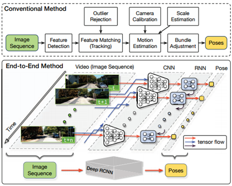
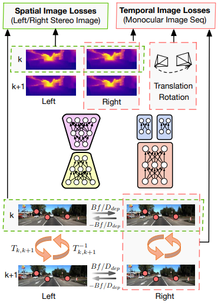
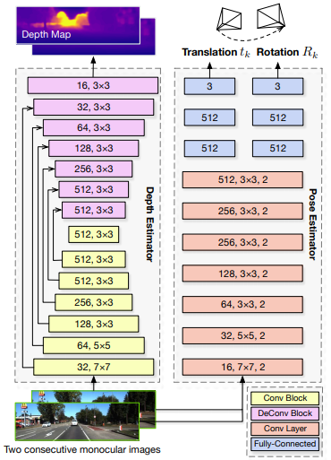
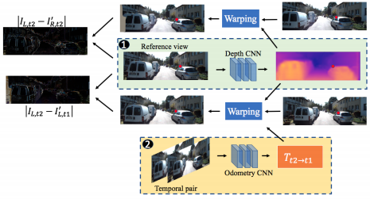
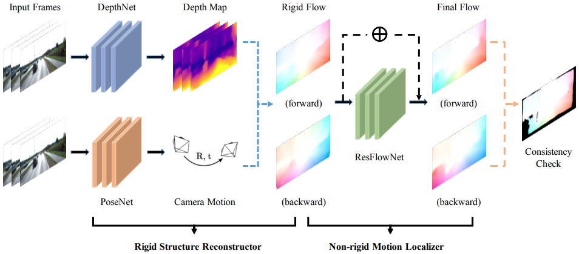

# 1. DeepVO

| 제목 | DeepVO: Towards End-to-End Visual Odometry with Deep Recurrent Convolutional   Neural Networks |
|:--------|:--------|
| 저자 | Sen Wang, Ronald Clark, Hongkai Wen and Niki Trigoni (Oxford) |
| 출판 | ICRA, 2017 |

| Mono VO | Depth Prediction | Learning   | Absolute Scale | Open source |
| ---- | ---------------- | ---------- | -------------- | ------------- |
| O    | X                | Supervised | O              | X           |

## 특징

초기에 나온 supervised 방식의 MVO(Monocular Visual Odometry) 기술이다. 뒤에 다룰 unsupervised 기술들과는 좀 결이 다르다. 목표도 두 프레임 사이의 상대 포즈를 계산하는 것이 아니라 RNN을 이용하여 절대 포즈를 직접 추정하도록 학습한다. 입력을 넣을 때는 두 이미지를 겹쳐서 (stack) 넣는다.

전후 이미지 두 장을 겹쳐 CNN에 입력을 넣고 CNN feature를 LSTM에 넣어서 현재의 절대 pose를 출력한다. 출력 pose와 GT (ground truth) pose 사이의 차이가 loss가 된다.

# 2. Left-Right Consistency

| 제목 | Unsupervised Monocular Depth Estimation with Left-Right Consistency |
|:--------|:--------|
| 저자 | Clément Godard, Oisin Mac Aodha, Gabriel J. Brostow (University College London) |
| 출판 | CVPR, 2017 |

| Mono VO | Depth Prediction | Learning   | Absolute Scale | Open source |
| ---- | ---------------- | ---------- | -------------- | ------------- |
| X   | O               | Unsupervised | O            | O          |

**github**: <https://github.com/mrharicot/monodepth>

## 특징

Depth를 직접 예측하는 것이 아니라 disparity를 출력한다. Visual odometry는 하지 않는다. 왼쪽 이미지($$I^l$$)로부터 두 개의 disparity map을 만든다. (**left-to-right disparity ($$d^r$$), right-to-left disparity ($$d^l$$)** )  

## Loss

Disparity map을 이용해 한쪽 이미지로부터 반대쪽 이미지를 복원한 후 실제 반대쪽 이미지와 비교하여 loss를 계산한다. Loss는 세 가지가 있다. 

- SSIM: photometric image reconstruction cost

  

- Dispartiy smoothness: smoothe disparties but low weight at edges

  

- Left-right consistency: consistency between two disparity maps, 두 disparity map이 정확하다면 L2R disparity ($$d^l_{ij}$$)와 R2L disparity ($$d^r_{ij}$$)가 서로 역관계에 있어야 한다.

  

  

## Implementation detail

1. ReLU 대신 ELU (Exponential Linear Unit) 사용: ReLU는 금방 수렴하고 더 학습해도 개선되지 않는다.

   

2. Deconvolution 대신 upsampling 사용: 참고 논문(42)에 따르면 deconvolution은 checkerboard artifact 생기므로 resize 후 convolution이 낫다. [영어 설명](https://distill.pub/2016/deconv-checkerboard/), [한글 설명](https://enginius.tistory.com/702)
3. Multi scale training 할 때, lower resolution부터 순서대로 학습하지 않고 모든 scale을 한번에 학습하는게 안정적인 학습이 된다.
4. Batch normalization은 성능에 도움이 되지 않는다.
5. Data augmentation 수행: random gamma, brightness, color shifts

# 3. SfmLearner

| 제목 | Unsupervised Learning of Depth and Ego-Motion from Video |
|:--------|:--------|
| 저자 | Tinghui Zhou, Matthew Brown, Noah Snavely, David G. Lowe (google) |
| 출판 | CVPR, July 2017 |

| Mono VO | Depth Prediction | Learning   | Absolute Scale | Open source |
| ---- | ---------------- | ---------- | -------------- | ------------- |
| O    | O               | Unsupervised | X           | O          |

**github**: <https://github.com/tinghuiz/SfMLearner> (tensorflow)

## 특징

아마도 **최초로 Unsupervised learning으로 MVO와 Depth Estimation을 동시에 학습**한 논문일 것이다. Image sequences로만 학습하기 때문에 실제 스케일은 알지 못한다.  

이 모델은 두 개의 네트워크가 있는데 한 장의 이미지로부터 depth를 추정하는 Depth network와 두 장의 이미지로부터 둘 사이의 상대적인 pose를 추정하는 Pose network이 있다. 여기서도 소스 이미지(source image)를 변환(warping)하여 타겟 이미지(target image) 만들어내고 실제 타겟 이미지와의 차이(photometric error)를 손실(loss)로 사용한다. 

특정 타겟 이미지 픽셀 ($$p_t$$)에 해당하는 소스 이미지 픽셀 ($$p_s$$)을 계산하는 식은 다음과 같다. 

식을 해석하면 타겟 픽셀 ($$p_t$$)에 inverse projection과 depth를 곱하여 타겟 좌표계에서의 3차원 좌표를 계산하고 ($$\hat{D}_t(p_t)K^{-1}$$), 이를 소스 좌표계의 3차원 좌표로 변환하고 ($$\hat{T}_{t \to s}$$), 다시 이를 이미지 좌표로 projection ($$K$$) 한다는 뜻이다. 모든 타겟 픽셀에 대해 위 연산을 하면 소스 이미지 전체를 타겟 좌표계에서 찍은 것처럼 합성(synthesize)할 수 있다. 이론적으로 depth map과 pose가 잘 추정이 되었다면 합성된 이미지가 타겟 이미지와 동일해야 한다.   

구체적인 네트워크 구조는 아래와 같다. Depth network는 encoder-decoder 구조이다. Pose network은 Explanability network와 feature layer를 공유한다. 마지막 feature에서 몇 번의 convolution을 더 거친 후 **global average pooling으로 pose를 출력**하고, deconvolution을 붙여 이미지와 크기가 같은 explainability map을 만든다. Explainability map은 photometric error를 구할 때 weight 역할을 한다. occlusion이나 moving object 들로 인해 한 장의 이미지에서 depth를 추정하기 어려운 영역들에 낮은 weight를 주고자 만든 것이다.   

## Loss

photometric loss는 다음과 같다. 특정 타겟 이미지($$I_t(p)$$)에서 나온 depth map으로 주변 여러 이미지($$I_1,...,I_N \to \hat{I}_s(p)$$)를 변환하여 모든 픽셀에 대해 오차를 더한다. 이때 explainability ($$\hat{E}_s$$)가 곱해진다.  

단순 photometric loss는 이미지에서 변화가 별로 없는(low gradient, textureless) 영역에서 학습 효과가 없다. 그래서  global한 관점에서 depth를 추정할 수 있도록 depth network를 가운데가 좁은 encoder-decoder 구조로 설계하고 loss도 multi scale로 계산한다.

전체 loss 함수는 multi-scale에 대해서 photometric loss + smoothness  loss + explainability에 대한 regularization term으로 계산한다.

# 4. UnDeepVO

| 제목 | UnDeepVO: Monocular Visual Odometry through Unsupervised Deep Learning |
|:--------|:--------|
| 저자 | Ruihao Li, Sen Wang, Zhiqiang Long and Dongbing Gu |
| 출판 | ICRA, May 2017 |

| Mono VO | Depth Prediction | Learning   | Absolute Scale | Open source |
| ---- | ---------------- | ---------- | -------------- | ------------- |
| O    | O               | Unsupervised | O            | X           |

## 특징

DeepVO의 후속작으로 MVO와 depth prediction을 Unsupervised learning으로 동시에 학습한 논문이다. SfmLearner와 비슷한데 **차이점은 Stereo 영상을 학습에 사용하여 실제 스케일까지 학습할 수 있다**는 것이다. 학습에는 두 개의 영상이 들어가서 두 영상의 depth map과 둘 사이의 pose (translation + rotation)가 나온다. 가장 중요한 학습 원리는 왼쪽 영상을 pose와 depth 정보를 이용해 오른쪽 카메라에서 찍은 것처럼 image warping을 하고 원래 오른쪽 영상과 비교하여 차이(photometric error)가 줄어들도록 학습시키는 것이다. 이 학습을 temporal sequence image에 적용하면 (시간 상 k와 k+1 이미지로 학습) 스케일을 알 수가 없다. 하지만 stereo pair image에도 적용하여 스케일을 알도록 depth를 학습시키고 temporal sequence 학습에서 pose는 depth와 스케일이 맞아야 하니 pose도 실제 스케일에 맞춰지게 된다. 이런 오묘한 원리를 이용해 pose나 depth에 대한 ground truth가 없어도 unsupervised learning으로 스케일까지 정확한 VODE(Visual Odometry and Depth Estimation)가 가능해진다.  

네트워크 구조는 depth estimation을 위한 encoder-decoder 구조 하나, pose estimation을 위한 double-head 구조가 하나있다. Translation과 rotation을 하나의 출력으로 학습시키면 둘 사이의 weight 조절이 필요한데 이처럼 따로 학습시키면 그럴필요가 없다.  

## Loss

### Losses from stereo image pair

스테레오 이미지를 이용한 학습은 둘 사이의 pose는 알려져 있으므로 depth map을 disparity map으로 쉽게 변환할 수 있다. 이를 통해 왼쪽 이미지를 오른쪽 이미지로부터 복원 가능하고 그 반대도 가능하다.

1. Photometric consistency: 오른쪽 이미지를 카메라에서 찍은것 처럼 변환한 이미지($$I'_l$$) 와 원래 왼쪽 이미지($$I_l$$) 사이의 차이를 SSIM과 L1 distance의 조합으로 구성

   

2. Disparity consistency: 왼쪽 depth map으로 만든 disparity map $$D^l_{dis}$$과 오른쪽 depth map으로 만든 disparity map $$D^r_{dis}$$는 서로 역방향 관계에 있으므로 $$D^r_{dis}$$를 반대방향으로 뒤집은 $$D^{l'}_{dis}$$는 $$D^l_{dis}$$과 같게 나와야한다. 이 둘 사이의 차이를 loss로 학습한다. (Left-right consistency loss와 유사)

   

3. Pose consistency: 오른쪽 image sequence에서 추정한 시간 k와 k+1 사이의 pose와 왼쪽에서 동일한 시간에 추정한 pose는 같아야 한다. (논문에서는 그렇게 썼지만 사실 동일하지 않다.) 그래서 양쪽 이미지 sequence에서 추정한 pose의 차이를 loss로 사용한다.

   

### Losses from temporal image sequences

Temporal image sequences에서는 pose estimator에서 추정한 pose와 depth map을 이용해 disparity map을 구한다. dispartiy map은 역시 반대쪽 이미지 복원에 사용하여 photometric error를 계산한다.

1. Photometric consistency: 시간 k+1의 이미지를 시간 k의 포즈에서 찍은 것처럼  변환한 이미지($$I'_l$$)와 원래 시간 k의 이미지와 ($$I_l$$) 사이의 차이를 SSIM과 L1 distance의 조합으로 구성

   

2. 3D geometric registration: 시간 k+1의 point cloud ($$P_{k+1}$$)를 시간 k의 포즈로 변환한  point cloud ($$P'_k$$)와 원래 시간 k의 point cloud ($$P_k$$) 사이의 차이를 L1 distance로 계산

   

# 5. Deep-VO-Feat

| 제목 | Unsupervised Learning of Monocular Depth Estimation and Visual Odometry   with Deep Feature Reconstruction |
|:--------|:--------|
| 저자 | Huangying Zhan, Ravi Garg, Chamara Saroj Weerasekera, Kejie Li, Harsh Agarwal,  Ian M. Reid |
| 출판 | CVPR, June 2018 |

| Mono VO | Depth Prediction | Learning   | Absolute Scale | Open source |
| ---- | ---------------- | ---------- | -------------- | ------------- |
| O    | O               | Unsupervised | O          | O          |

**github**: <https://github.com/Huangying-Zhan/Depth-VO-Feat> (caffe)

## 특징

CVPR 2018부터 SfmLearner와 비슷한 목적을 가진 논문들이 여러 편씩 나오기 시작했다. UnDeepVO처럼 스테레오 영상을 이용해 실제 스케일의 depth와 pose를 학습하는 논문이다. 기존 연구는 이미지만 다른 좌표계로 합성해서 원래 영상과 합성된 영상 사이의 차이를 줄이는 방향으로 학습했지만, 여기서는 **CNN feature도 합성해서 원래 feature와 합성된 feature 사이의 차이도 loss**에 들어간다. 즉 이미지의 지역적 특성이 같다면 CNN feature도 같을 것이고 따라서 feature도 이미지처럼 다른 좌표계로 합성하면 원래 그곳에서 나온 feature와 동일해야 한다는 논리다. (feature reconstruction loss)   

같은 물체를 어느 방향에서 찍어도 같은 화소값이 나온다고 가정하는 것을 Lambertial assumption이라 하는데 항상 성립하는 것은 아니므로 시점에 따라 같은 위치의 RGB 값이 달라질 수 있고 이는 photometric consistency loss를 오염시킨다. 그래서 photometric consistency에만 의존하지 않고 이보다 더 밝기에 강인하다고 생각되는 (검증하진 않았다.) CNN feature를 복원하는 loss를 만든 것이다.  

네트워크 구성은 UndeepVO와 유사하다. Depth CNN과 Odometry CNN으로 구성되어 있고 이를 이용해 어떤 이미지를 다른 pose에서 찍은 것처럼 합성한 이미지를 만들어 loss를 계산한다. 학습에 스테레오 이미지를 활용하여 실제 스케일을 학습할 수 있다. 차이점은 **Depth CNN이 depth를 바로 추정하지 않고 inverse depth를 추정**한다는 것이다. Odometry CNN은 FC layer를 통해 pose를 6차원 벡터(se3)로 출력한다.

## Loss

논문에 학습과정을 위와 같이 그렸는데 해석하면 다음과 같다.

1. 기준 이미지 ($$I_{L,t2}$$)를 Depth CNN에 넣어 depth map($$D_{L,t2}$$)을 만든다.
2. 기준 이미지 ($$I_{L,t2}$$)와 이전 시간 이미지 ($$I_{L,t1}$$)을 Odometry CNN에 입력하여 좌표계 이동($$T_{t2 \to t1}$$)을 추정한다. 
3. Depth map($$D_{L,t2}$$)과 좌표계 이동($$T_{t2 \to t1}$$)을 이용하여 이전 이미지($$I_{L,t1}$$)를 현재 좌표계로 합성한 $$I'_{L,t1}$$을 만든다.
4. Depth map($$D_{L,t2}$$)과 스테레오 변환($$T_{L \to R}$$)을 이용하여 오른쪽 이미지($$I_{R,t2}$$)를 왼쪽 좌표계로 합성한 $$I'_{R,t2}$$을 만든다.
5. Depth map($$D_{L,t2}$$)과 좌표계 이동($$T_{t2 \to t1}$$)을 이용하여 이전 이미지에서 나온 CNN feature($$F_{L,t1}$$)를 현재 좌표계로 합성한 $$F'_{L,t1}$$을 만든다.
6. Depth map($$D_{L,t2}$$)과 스테레오 변환($$T_{L \to R}$$)을 이용하여 오른쪽 CNN feature($$F_{R,t2}$$)를 왼쪽 좌표계로 합성한 $$F'_{R,t2}$$을 만든다.
7. 합성한 이미지와 기준 이미지 ($$I_{L,t2}$$), 합성한 feature와 기준 feature ($$F_{L,t2}$$)의 차이로 loss를 계산한다.

전체 loss는 세 가지 요소로 구성되어 있다.

- 이미지 합성 함수와 image construction loss

  

  

- Feature 합성 함수와 feature construction loss

  

  

- Edge-aware smootheness loss: 이미지 변화($$\partial_x I_{m,n}$$)가 낮은 곳에서 depth 변화($$\partial_x D_{m,n}$$)가 높으면 loss가 커짐

  

# 6. GeoNet

| 제목 | GeoNet: Unsupervised Learning of Dense Depth, Optical Flow and Camera Pose |
|:--------|:--------|
| 저자 | Zhichao Yin and Jianping Shi |
| 출판 | CVPR, June 2018 |

| Mono VO | Depth Prediction | Learning   | Absolute Scale | Open source |
| ---- | ---------------- | ---------- | -------------- | ------------- |
| O    | O               | Unsupervised | O          | O          |

**github**: <https://github.com/yzcjtr/GeoNet> (tensorflow 1.1)

## 특징

GeoNet은 Visual Odometry, Depth Prediction 외에도 Optical Flow까지 추정하는 모델이다. 세 가지 일을 하므로 거기에 해당하는 세 가지 서브 네트워크가 있다.

- DepthNet: 한 장의 이미지로부터 depth map 출력한다. "global high-level and local detailed" 정보를 동시에 전달하기 위해 encoder-decoder 구조에 skip connection을 추가하였고 multi-scale 결과를 출력한다.
- PoseNet: image sequence를 한번에 받아 타겟 이미지를 기준으로 다른 이미지들의 상대 pose 출력한다. 마지막에 global average pooling으로 translational vector와 euler angle을 포함한 6차원 벡터를 출력한다.
- ResFlowNet: depth map과 pose로부터 계산된 rigid flow에서 움직이는 물체로부터 발생하는 추가적인 flow 출력한다. 입력으로는 두 이미지 ($$I_s, I_t$$), rigid flow ($$f^{rig}_{t \to s}$$), rigid flow로 합성된 이미지 ($$\tilde{I}^{rig}_s$$), 합성된 이미지와 원본 이미지와의 오차가 채널로 합쳐서 들어간다. DepthNet과 동일하게 encoder-decoder 구조에 skip connection을 추가하였고 multi-scale 결과를 출력한다.

GeoNet은 아래 그림처럼 두 단계로 구성된다. 첫 번째 단계에서는 DepthNet과 PoseNet에서 출력한 depth map과 pose를 이용하여 rigid flow를 아래 식으로 계산한다. 움직이는 물체를 고려하지 않고 정적 환경의 rigid transformation에 의한 optical flow만 계산한 것이다.  그림을 보면 forward, backward 두 방향의 flow를 모두 계산한다.

두 번째 단계는 ResFlowNet에서 움직이는 물체에 의해 발생하는 residual flow를 출력한다. Residual flow를 보면 움직이는 물체를 찾아낼 수 있다. 최종적인 flow는 두 가지 flow를 합쳐서 구한다: $$ f^{full}_{t \to s}=f^{rig}_{t \to s}+f^{res}_{t \to s} $$  이때도 역시 forward, backward 두 방향 모두 계산한다.

## Training and Loss

네트워크 구성처럼 학습도 두 단계로 진행된다. 먼저 DepthNet과 PoseNet을 학습시킨 다음, 두 네트워크를 고정시킨채 ResFlowNet을 학습시킨다. 

전체 loss는 다음과 같이 다섯개 항목으로 구성되는데 한번에 여러 pose를 출력하므로 <t, s>가 여러가지가 되고 multi-scale이기 때문에 스케일 별로 loss를 계산하여 더한다.

1. Rigid warping loss: (Left-right consistency나 UndeepVO처럼) 합성한 이미지와 타겟 이미지의 질적인 차이를 L1 norm과 SSIM의 조합으로 계산한다.

   

2. Edge-aware depth smoothness loss: (Deep-VO-Feat과 마찬가지로) 이미지 변화($$\nabla I(p_t)$$)가 낮은 곳에서 depth 변화($$\nabla D(p_t)$$)가 높으면 loss가 커짐

   

3. Full flow warping loss: full flow ($$ f^{full}_{t \to s}$$)로 합성한 이미지와 타겟 이미지의 차이를 Rigid warping loss처럼 계산

4. Flow smoothness loss: depth smoothness loss처럼 flow flow에 대한 smoothness 계산

5. Geometric consistency loss: Left-right consistency loss 처럼 forward flow와 backward flow 사이에 역관계성을 측정한다. 역관계는 occluded region(한 쪽 영상에서만 보이는 부분)에서는 성립할 수 없으므로 그 부분을 제외하기 위해 $$[\delta(p_t)]$$를 곱한다. $$[\delta(p_t)]$$는 forward-backwad 오차가 작은 곳에서는 1이고 큰 곳에서는 0이 되는 함수다.

   

   

# 7. LKVOLearner

| 제목 | Learning Depth from Monocular Videos using Direct Methods    |
| :--- | :----------------------------------------------------------- |
| 저자 | Chaoyang Wang, Jose Miguel Buenaposada, Rui Zhu, Simon Lucey |
| 출판 | CVPR, June 2018                                              |

| Mono VO | Depth Prediction | Learning     | Absolute Scale | Open source |
| ------- | ---------------- | ------------ | -------------- | ----------- |
| O       | O                | Unsupervised | X              | O           |

**github**: <https://github.com/MightyChaos/LKVOLearner> (PyTorch 0.3.1)

## 특징

기본적인 SfmLearner의 골격에 Geometric한 방법과 결합한 논문이다. Depth CNN과 Pose CNN을 학습시키는 것은 똑같다. 아래 그림에서 $$I_2$$를 reference 이미지로 하고 나머지를 source 이미지로 써서 photometric error를 줄이는 방향으로  학습하는 것도 같다. 아래 그림에 이 논문의 특징이 드러나 있다.

- 아래 그림에서 (1)은 다른 논문처럼 CNN에서 직접 regression을 하는 방법이다.
- (2)는 Pose CNN 대신 DVO (Direct Visual Odometry)를 쓴 방법이다. 기반 논문은 "Realtime visual odometry from dense rgb-d images (2011, ICCV)" 이다. LSD-SLAM이나 DSO처럼 픽셀 오차를 최소화하는 방법이다.
- (3)은 DVO를 쓰는데 initial guess를 identity가 아닌 Pose CNN의 결과를 쓰는 방법이다. 이 논문의 핵심 contribution이라 할 수 있다.

## Training and Loss

초기에는 그림의 (1)처럼 일반적인 방법으로 Pose CNN과 Depth CNN을 동시에 학습시킨다. 이후에 Pose CNN은 DVO의 initial guess로만 쓰이고 DVO의 결과를 받아서 Depth CNN만 더 fine-tuing을 한다.  

여기서 특징적인 것은 기존에 back propagation 할 때 depth 보정 신호로만 Depth CNN을 학습하던 것과는 달리 pose 보정신호로부터도 Depth CNN을 학습시킨다는 것이다. 그림의 (2)처럼 pose를 외부에서 받아서 depth만 학습시킨다고 했을 때 수식은 다음과 같다.

- $$f_d()$$: depth predictor
- $$f_p()$$: pose predictor based on DVO
- $$L_{ap}()$$: appearance dissimilarity loss ($$L_{ap}()$$)
- $$L_{prior}()$$: depth smoothness loss

여기서 pose predictor에 들어가는 depth $$D$$를 Depth CNN의 결과로 입력하면 식이 다음과 같이 된다.  

DVO에서 출력되는 pose $$\bold{p}$$는 입력 depth에 따라 결정되는 함수이기 때문에 아래와 같이 chain-rule에 의해 pose를 통해서도 depth를 학습할 수 있다.

## Details

- 논문에서 DVO 대신 DDVO (Differential DVO)라고 그냥 DVO와 차이를 두는데 정확한 차이는 참고논문을 읽어봐야 알 것 같다.

- Depth CNN은 inverse depth map을 출력한다.

- 절대적인 스케일을 알 수 없으므로 단순히 $$L_{prior}()$$를 줄이도록 학습하면 전체적인 depth scale이 점점 줄어든다. 그러므로 depth를 다음과 같이 평균으로 나누는 normalization한 결과를 사용한다. normalization은 성능향상에 큰 도움이 된다.

    

- 모델에는 이미지가 3장씩 들어가고 4단계의 스케일에서 학습한다.

- Appearance dissimilarity loss ($$L_{ap}()$$)를 학습할 때 가장 아래단계에서는 L1 norm과 SSIM을 섞어서 학습한다.

- 학습 영상에서 움직이지 않는 static 영상은 뺀다.

- Inverse depth의 출력을 sigmoid 함수로 0~1 사이로 바꾸고 10배를 곱하고 0.01을 더하여 nemerical stability를 확보한다.

- 테스트 할 때 depth를 GT에 맞춰 재조정한다. $$\tilde{s} = median(D_{gt}) / median(D_{predict})$$ 

- Cityscapes 데이터셋을 이용하는 경우 Cityscapes 데이터셋으로 pretraining을 한 후 KITTI로 fine tuning을 한다.

