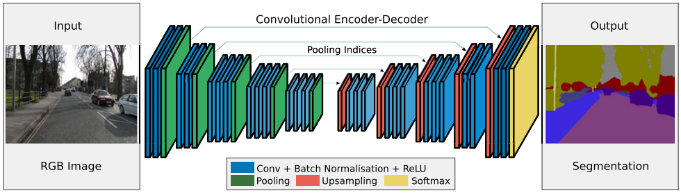
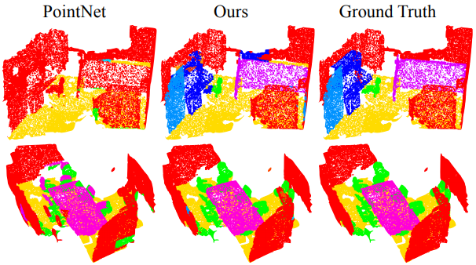

# 1. 개요

이 포스트의 목적은 영상 분리(Image Segmentation)기술에 관한 주요 논문을 소개하는 것이다. 많은 논문을 다 다룰순 없고 비교적 최근에 (2017년 이후) 나온 피인용 횟수가 높은 주요 논문만 다루고자 한다. 크게 두 가지 주제를 다루는데 하나는 일반적인 RGB 영상의 (Instance) Semantic Segmentation이고, 다른 하나는 RGB-D나 Point cloud 등의 3차원 데이터를 다루는 3D Semantic Segmentation이다. 최근 컴퓨터 비전의 연구 동향이 딥러닝에 올인하고 있으므로 여기서 다루는 논문들도 모두 딥러닝에 기반한 연구들이다.

## 1.1 CNN 기초

영상을 다루는 딥러닝 기술은 주로 Convolutional Neural Network (CNN)을 쓴다. 여기에 나올 논문들을 이해하기 위해서는 CNN에 대한 이해가 필수다. CNN에 대한 이해가 부족하다면 아래 링크에서 잠시 공부를 하고 오도록 하자.

- <https://ujjwalkarn.me/2016/08/11/intuitive-explanation-convnets/> : CNN 연산과정을 애니메이션으로 직관적으로 보여줌 (추천)

- <https://towardsdatascience.com/applied-deep-learning-part-4-convolutional-neural-networks-584bc134c1e2#7d8a> : CNN 연산과정을 상세하게 설명
- <https://github.com/vdumoulin/conv_arithmetic> : 다양한 Convolution을 애니메이션으로 시각화

## 1.2 Segmentation 문제 정의

영상 분리 기술은 크게 두 가지가 있다. Semantic segmentation과 instance segmentation 이다. Semantic segmentation은 영상의 각 픽셀이 어떤 **종류**의 객체를 나타내는지를 출력한다. Instance segmentation은 영상의 각 픽셀이 어떤 **독립적인 개체**를 나타내는지를 출력한다. 아래 그림을 보면 이해하기 쉽다. Semantic segmantation은 사람과 자전거를 구분하지만 여러 사람이 있다는 건 알지 못 한다. Instance segmentation은 각 개체를 모두 구분하지만 각 개체가 어떤 종류인지는 모른다. 여기서 주로 다루는 문제는 Semantic segmentation이고 일부는 Instance segmentation도 가능한 것들이 있다.

## 1.3 Semantic Segmentation 기본 구조

CNN을 이용한 많은 segmentation 논문들은 다음과 같은 Encoder-Decoder 구조를 따른다. 

- Encoder: 입력 영상에서 여러 단계에 걸쳐 convolution, max pooling, relu 등을 반복하여 공간적으로 압축된 고차원적인 feature map을 생성 (아래 구조에서 가운데 좁아진 영역)
- Decoder: 압축된 feature map에서 upsampling, deconvolution 등을 반복하여 해상도를 높이면서 영상의 각 픽셀의 의미 해석
- 학습: Decoder에서 나온 semantic map이 사람이 지정한 영상의 의미와 같아지도록 CNN의 가중치들을 학습

다음은 Encoder-Decoder 를 사용한 SegNet의 네트워크 구조다.

# 2. Image Segmentation

## 2.1. PSPNet

**제목**: "Pyramid Scene Parsing Network"

| 출판정보   | 피인용 횟수 | Semantic | Instance | Open source |
| ---------- | ----------- | -------- | -------- | ----------- |
| CVPR, 2017 | 1233        | O        | X        | O           |

PSPNet은 segmantic segmentation의 문제가 사진의 전체적인 맥락을 보지 않고 사물 영역만 보고 판단하려고 하기 때문이라고 주장한다. 예를 들어, '물위에 떠있는 보트'를 '자동차'로 분류하는 경우가 있는데 보트와 자동차의 외관이 비슷해서 얼핏 그럴듯해 보인다. 하지만 **사람은 자동차는 물위에 있을리가 없는 것을 알기 때문에 비슷해 보여도 그런 실수를 하지 않는다.**  

사진의 전체적인 맥락(global context)을 이해시키기 위해 *PSPNet*에서는 **Spatial Pyramid Pooling (SPP)** 구조를 제안한다. 다음은 PSPNet의 진행단계이다.

1. 먼저 사전 학습된 ResNet으로 1/8 크기의 feature map을 뽑는다. (b)
2. feature map을 1x1, 2x2, 3x3, 6x6 네 가지 크기로 average pooling 한다. (c)
3. 1x1 컨볼루션을 통해 feature map의 두께를 줄인다. (채널 수 조정) (c)
4. 다시 원래 feature map 크기에 맞도록 upsampling을 한다. (c)
5. 원래 feature map과 채널 축으로 합친다. (c)
6. 컨볼루션을 적용하여 semantic map을 출력한다. (d)

SPP 과정에서 전체 이미지 영역을 좁은 영역으로 압축 하기 때문에 맨 위의 1x1에서는 이미지 전체를 보게 되고, 2x2는 각각 1/4의 영역을 보게 된다. 이렇게 pooling 된 feature map에서 이미지 전체의 맥락을 이해한 다음 원래의 feature map과 합치면 세부적인 정보와 전체적인 정보가 동시에 담겨진 새로운 feature map이 나오게 된다. 이를 통해 '물위의 자동차' 같은 잘못된 의미를 해석하지 않게 된다.  

다음은 PSPNet의 결과 영상이다.

## 2.2. DeepLab

**제목**: "DeepLab:
Semantic Image Segmentation with Deep Convolutional Nets, Atrous Convolution, and Fully Connected CRFs"

| 출판정보 | 피인용 횟수 | Semantic | Instance | Open source |
| ---- | ---------------- | ---------- | -------------- | ------------- |
| TPAMI, 2017 | 2619            | O | X             | O          |

*DeepLab*에서는 기존 encoder-decoder 방식의 segmentation의 세 가지 문제를 지적하고 각각에 대한 해결방법을 제안하고 있다.

### A. Pooling 과정에서 세부정보 손실

Encoder에서 max pooling으로 feature map의 해상도를 줄이는 이유는 

1. 영상의 자잘한 변화(이동, 회전, 밝기 변화 등)에 강인해지고 
2. 연산량을 줄이고
3. feature map의 한 픽셀이 더 넓은 영역을 보게 해서 (large receptive field) **좁은 영역에 전체적인 맥락(context)을 압축**시키기 위해서다.

이것은 원래 영상 분류 작업에 적합한 구조고 segmentation에서는 픽셀 단위의 세부 정보를 잃어버리는 것이므로 segmentation의 정확도가 떨어지는 원인이 된다. 그래서 *DeepLab*에서는 max pooling을 줄이고 feature map의 크기를 늘리는 대신 수용 영역(receptive field)를 늘리기 위해 **atrous convolution**을 제안한다. 다른 논문에는 dilated convolution 이라는 용어로도 쓰인다.

|  |
| ===== |
| 일반적인 convolution, [출처](<https://github.com/vdumoulin/conv_arithmetic>) |

|  |
| ===== |
| Atrous convolution, [출처](<https://github.com/vdumoulin/conv_arithmetic>)|

컨볼루션을 듬성듬성하게 하기 때문에 연산량을 늘리지 않으면서 수용 영역을 넓힐 수 있다. Semantic Segmentation에서 각 픽셀이 어떤 분류에 해당하는지를 알기 위해서는 각 픽셀 주변 뿐만 아니라 더 넓은 영역을 보아야 하는데 atrous conv.가 그것을 돕는다. 이 논문에서 사용한 VGG16에서는 원래 feature map이 1/32 크기로 나오는데, pooing을 빼고 atrous conv.를 적용하여 1/8 크기의 (상대적으로 고해상도의) feature map을 만들어낸다.

### B. 사물마다 다른 크기

어떤 사물은 영상에서 크게 나오고 어떤건 작게 나오는데 너무 큰 건 영상 전체를 고려해야 하므로 픽셀 단위로 추론하기 어렵고 너무 작은건 신호가 약해서 묻히기 쉽다. CNN 구조에 따라 분리하기 '적당한' 사이즈의 사물만 잘 분리하게 된다. 이 문제를 해결하는 가장 간단한 방법은 하나의 입력 영상을 여러 크기로 바꿔서 입력하는 것이다. 큰 물체를 찾기 위해서는 이미지를 줄여서 넣고 작은 물체를 찾기 위해서는 이미지를 키워서 넣는 것이다. 하지만 이 방법은 여러번 연산을 해야하기 때문에 낭비가 심하다. *DeepLab*에서 제안한 방법은 **Atrous Spatial Pyramid Pooling (ASPP)**이다. 이것은 입력 feature에 간격이 다른 여러개의 atrous conv.를 따로 적용후 다시 합치는 것인데 Inception의 개념과 비슷하다. 간격이 넓은 필터를 통과해 만든 feature에서는 상대적으로 큰 사물을 찾기에 적합하고, 간격이 좁은 필터를 통과한 feature에서는 작은 사물을 찾기에 적합하다. 마지막에 Multi-scale의 feature map들을 합치면 다양한 크기의 사물들을 분리해낼 수 있다.

|  |
| ===== |
| Atrous Spatial Pyramid Pooling (ASPP) [출처](http://inhi.kim/archives/date/2018/05) |

|  |
| ===== |
| Inception Model [출처](https://www.kdnuggets.com/2017/08/intuitive-guide-deep-network-architectures.html) |

|  |
| ===== |
| DeepLab의 CNN 구조 [출처](https://towardsdatascience.com/review-deeplabv3-atrous-convolution-semantic-segmentation-6d818bfd1d74) |

### C. 세밀한 외곽선 분리

Encoding 과정에서 feature map을 압축하기 때문에 이를 다시 decoding 하더라도 원래 해상도의 세밀한 외곽선까지 복원하기는 어렵다. *DeepLab*에서는 encoding의 공간적인 압축률을 1/32에서 1/8로 줄였기 때문에 decoding 과정을 생략하고 1/8 해상도에서 바로 segmentation을 한다. 이렇게 나온 결과는 세밀함이 부족하므로 8배 upsampling을 통해 원래 해상도를 복원한 다음 Conditional Random Field(CRF)를 통해 최종 결과물을 만들어 낸다. CRF는 다음 energy function을 최소화하는 pixel label $$x$$를 찾는다.

위 식의 의미는

- CNN에서 나온 semantic label이 정확해야 한다. 예를 들어 '사람' 영역의 픽셀이면 그 픽셀의 '사람'에 대한 확률이 높아야 한다는 것이다.
- 같은 종류로 분류된 픽셀들은 서로 위치상으로 가깝고 영상의 색도 비슷해야 한다.

지금까지 설명한 과정을 그림으로 나타내면 다음과 같다. 아래 과정을 통해 세 가지 문제를 해결해 semantic segmentation의 성능을 높였다는 게 *DeepLab*논문의 골자다.

다음은 *DeepLab*으로 영상 분리한 결과다.

## 2.3 Mask R-CNN

**제목**: "Mask R-CNN"

| 출판정보   | 피인용 횟수 | Semantic | Instance | Open source |
| ---------- | ----------- | -------- | -------- | ----------- |
| ICCV, 2017 | 2593        | O        | O        | O           |

앞서 소개한 논문들은 그 논문 저자의 일생의 역작이었다. 하지만 아래 두 저자는 워낙 유명인사라 이 논문은 겨우 (똑같이!) 8번째로 유명한 논문일 뿐이다. ~~내 후배는 학회에서 Kaiming He에게 싸인도 받았다.~~ 이해가 되는점은 가장 최근 논문이라는 점이다. 앞으로 이 논문이 어디까지 올라가는지 틈틈히 확인해보자.

### A. Faster R-CNN

*Mask R-CNN*을 이해하기 위해서는 기반이 되는 *Faster R-CNN*을 먼저 이해해야 한다. *Faster R-CNN*은 무엇인가? 아래 그림처럼 물체의 종류와 bounding box를 찾아주는 object detector다.

*Faster R-CNN*의 핵심 개념은 **Region Proposal Network (RPN)**과 **RoI Pooing**이다. 영상을 CNN에 입력하여 고차원적인 의미를 담은 feature map을 만들고 RPN에서는 각 feature map의 픽셀마다 k개의 anchor box에 대해 사물이 담겨 있는지 아닌지 (2k scores), 정확한 위치와 크기는 얼마인지 (4k coordinates)를 예측한다. Anchor box는 각 위치마다 크기와 비율이 다른 bounding box의 기본값이라고 보면된다. RPN에서 특정 anchor box에 사물이 있을 확률이 높다고 하면 그 anchor box에서 측정한 bounding box 영역을 원래 feature map에서 추출한다. 

추출된 feature map은 크기가 일정하지 않기 때문에 일정한 크기로 샘플링하는 RoI Pooling 기술을 적용한다. RoI Pooing을 하면 사물 영역에서 추출된 크기가 일정한 feature map이 나오고 그로부터 이 영역의 클래스를 분류하고 bounding box를 regression 한다.

### B. Mask R-CNN

*Mask R-CNN*은 *Faster R-CNN*에서 instance segmentation 기능을 추가하고 RoI Pooing을 RoI Aligning으로 바꾼것이다. 원래 *Faster R-CNN*에서 추출한 크기가 다른 물체의 feature map을 샘플링해서 일정한 크기의 feature map을 만드는게 RoI Pooing이었는데 이렇게 정수로 떨어지지 않는 비율을 억지로 sampling 하니 정확한 위치에서의 feature를 가져오기 어려웠다. 그래서 **RoI를 압축하는 방법을 bilinear interpolation으로 바꾼 게 RoI Align**이다.    

압축된 RoI의 feature map에서 *Faster R-CNN*처럼 클래스 분류와 bounding box regression을 하고 다른 한편으로는 컨볼루션을 반복하여 k개의 binary mask를 출력한다. 만약 분류기에서 '사람'이라는 클래스로 분류가 되었다면 k개의 binary mask 중 '사람'에 해당하는 마스크를 thresholing 하면 그 객체를 분리해낼 수 있다.

Mask R-CNN은 객체를 검출하고 분류하고 픽셀단위로 분리해낼 수 있는 다목적 CNN이다. 다음 그림은 세 가지 문제를 동시에 해결하는 결과를 보여준다.

# 3. 3D Semantic Segmentation

## 3.1. PointNet (++)

**제목**: "PointNet: Deep Learning on Point Sets for 3D Classification and Segmentation"

| 출판정보   | 피인용 횟수 | Semantic | Instance | Open source |
| ---------- | ----------- | -------- | -------- | ----------- |
| CVPR, 2017 | 1020        | O        | X        | O           |

*PointNet*은 3차원 point cloud를 직접 처리할 수 있는 네트워크 구조를 제안했다. 이전까지 딥러닝으로 3차원 데이터를 다루는 방법은 3차원 공간을 일정한 크기의 voxel로 나누어 3차원 컨볼루션(**3D Conv**)을 하던지 아니면 3차원 모델을 여러 시점에서 렌더링한 Multi-View 이미지를 입력으로 넣어 2D 이미지처럼 2D Conv를 적용하기도 했다. 이러한 방법도 나름 효과는 있었지만 3D Conv를 쓰는건 연산도 많이 들고 point cloud를 voxel로 변환하면서 공간 해상도가 많이 떨어지고, Multi-View는 3차원 공간 자체를 이해하지 못한다는 단점이 있다.   

Point cloud를 직접 네트워크에 입력하지 못하는 이유는

1. Point의 개수가 정해지지 않아 입력 데이터의 차원이 일정하지 않고
2. 정렬되지 않은 point들이 들어왔을 때 이를 일정한 방법으로 정렬시킬 방법이 없다. 

이러한 문제로 point cloud를 DNN으로 직접 처리하기 어려웠는데 PointNet의 구조는 point의 개수나 정렬순서에 상관 없이 사물 분류나 분리(segmentation)을 했다는 점에서 혁신적이라 할 수 있다. 이 논문을 학회장에서 처음 봤을때는 이게 돼? 왜 되지? 이상한 구조네... 하고 지나갔던 기억이 난다. 하지만 이제는 3차원 인식에서 꽤 유명한 논문이 되었다.  

*PointNet*은 point cloud 단위이 모양 분류나 semantic segementation을 수행한다. 다음은 segmentation 결과다.

### A. 구조

이 논문은 아래 구조만 이해하면 된다. 

1. n개의 입력 point를 $$n\times3$$  차원의 데이터로 입력한다.

2. T-Net: 입력을 T-Net에 입력하여 $$3\times3$$ 변환 행렬(transformation matrix)을 출력한다.

3. 입력에 2의 변환 행렬을 곱하여 점들이 이동, 회전 등에 영향을 받지 않도록 변환한다.

4. mlp (64,64): 각각의 3차원 point 데이터에 대해 동일한 MLP(Multi Layer Perceptron)를 반복 적용하여 각 point feature의 차원을 64차원으로 늘린다.

    

5. T-Net: 2와 마찬가지로 T-Net을 적용하여 feature들이 점들의 이동, 회전 등에 영향을 받지 않도록 변환한다.

6. mlp (64,128,1024): 각 point에 해당하는 feature vector에 대해서 동일한 MLP를 반복 적용하여 feature의 차원을 1024로 늘린다.

7. max pool: $$n\times1024$$ 차원의 feature map에 max pooling을 적용하여 1024차원의 global feature를 만든다.

8. mlp (512,256,k): global feature에 MLP를 적용하여 point cloud의 클래스를 분류한다.

9. 4의 64차원 feature와 7의 1024차원 global feature를 합쳐서 1088차원의 feature map을 만든다.

10. 각각의 point feature에 대해 동일한 MLP를 반복 적용하여 각 point를 분류한다.

여기서의 핵심은 6~7 단계다.  

- 6에서 max pooling을 통해 입력 데이터의 크기(n)에 상관없이 똑같은 크기로 합쳐버린다. (max pooling을 통해 1024차원 출력) 
- 이렇게 만들어진 global feature가 local feature와 합쳐진다. 합쳐진 1088차원의 벡터는 부분적인 특징과 전체적인 특징을 모두 알게된다.
- segmentation을 point단위의 독립적인 분류 작업으로 생각해서 데이터 크기에 상관없이 segmentation이 가능하다.

### B. PointNet++

**제목**: "PointNet++: Deep Hierarchical Feature Learning on Point Sets in a Metric Space"

| 출판정보   | 피인용 횟수 | Semantic | Instance | Open source |
| ---------- | ----------- | -------- | -------- | ----------- |
| NIPS, 2017 | 563         | O        | X        | O           |

PointNet 이후로 이를 응용한 논문들이 여러개 나왔다. *PointNet++*은 같은 저자의 후속편이다. 영상 분리 연구에서 CNN이 잘 작동하는 것은 컨볼루션을 반복하면서 아주 좁은 지역적인 특성부터 전체적인 특성까지 *점진적으로* 시야를 넓혀가며 고차원적인 특징을 뽑아낼 수 있기 때문이다. 그런데 *PointNet*은 중간과정 없이 point 단위의 특징에 point cloud 전체적인 특징을 바로 붙여버려서 지역적인 구조를 이해하지 못 한다는 단점이 있다. 이를 해결하기 위해 저자가 생각한 방법은 *PointNet* 자체를 컨볼루션처럼 쓰는 것이다. Point cloud를 작은 단위로 나눠서 *PointNet*을 통과시켜 나오는 global feature가 여기서는 local feature가 된다. 아래 그림을 보면 이해가 된다.

1. 입력 데이터를 작은 그룹으로 묶고 각 그룹에 *PointNet*을 적용해 그룹마다 feature vector를 뽑는다. 
2. feature vector들을 다시 그룹으로 묶고 다시 *PointNet*을 적용한다. 
3. 줄어든 feature vector들을 이용해 classification과 segmentation을 진행한다.

이렇게 하면 세부적인 구조를 더 잘 파악하게 되어 분류(classification)나 분리(segmentation) 성능이 올라간다고 한다. 다음은 결과 영상이다.

### C. Frustum PointNets

**제목**: "Frustum PointNets for 3D Object Detection from RGB-D Data"

| 출판정보   | 피인용 횟수 | Semantic | Instance | Open source |
| ---------- | ----------- | -------- | -------- | ----------- |
| CVPR, 2018 | 174         | O        | O        | O           |

이것도 역시 PointNet을 응용한 연구다. Frustum이란 우리말로 절두체인데 원뿔이나 피라미드 모양에서 꼭대기를 자른 모양을 말한다. 아래 그림을 보면 2D 영상에서 자동차의 bounding box를 먼저 찾고 그 박스의 방향으로 Frustum을 그린 것이다. *Frustum PointNets*의 기본 아이디어는 2D 이미지에서 detection과 classification을 한 다음에 절두체 내부의 point cloud에 PointNet을 적용하여 segmentation과 3D box detection을 해결한다는 것이다. *Mask R-CNN*에서 먼저 detection을 한 다음 그 범위에서 segmentation을 하는 것과 비슷한 흐름이다.

자세한 구조는 다음과 같다.

1. RGB 영상으로부터 *PSPNet*을 적용하여 영상에서의 2D bounding box를 찾는다.
2. 2D bounding box 범위 내의 depth를 point cloud로 변환한다.
3. *PointNet*을 이용하여 객체와 배경을 분리한다.
4. 객체의 point cloud만 추출해서 *PointNet*을 통해 3D bounding box를 추정한다.

여기서 유의할 점은 4번에서 하는 일이 단순히 객체의 범위를 찾아서 box를 치는게 아니라 객체를 이해하고 현재 시점에서 보이지 않는 부분까지 포함한 3D box의 범위와 방향까지 추정한다는 것이다. 예를 들어 차를 검출했다고 하면 현재는 차의 앞부분만 point cloud에 보이지만 보이지 않는 뒷부분까지 포함할 수 있는 3D box를 자동차의 방향에 맞춰서 그려준다는 것이다. 이것을 논문에서는 *Amodal 3D box estimation*이라고 한다.

다음은 결과 영상이다. 객체의 방향에 맞춰 box가 회전이 되어있고 보이지 않는 부분까지 box가 늘어나 있는 것을 볼 수 있다.

## 3.2. 3D-SIS

**제목**: "3D-SIS: 3D Semantic Instance Segmentation of RGB-D Scans"

| 출판정보   | 피인용 횟수 | Semantic | Instance | Open source |
| ---------- | ----------- | -------- | -------- | ----------- |
| CVPR, 2019 | 10          | O        | O        | O           |

*3D-SIS*는 3차원 모델에서 semantic segmentation을 하는 논문이다. 그런데 내용을 보면 Mask R-CNN과 상당히 유사한 구조인데 데이터의 차원만 2차원에서 3차원으로 늘어낫을 뿐이다.

### A. Data Representation

공간적인 데이터에서 고차원적인 특징을 추출하기 위해서는 컨볼루션을 쓰는게 상식적인데 3차원 point cloud는 형태가 일정하지 않아서 컨볼루션을 하기에 적합하지 않다. 그래서 일정한 크기를 가진 grid voxel 데이터로 변환해주어야 한다. 여기서는 KinectFusion 등으로 만들수 있는 **Truncated Signed Distance Field (TSDF)**로 3차원 표면을 표현했다. TSDF는 표면으로부터 voxel의 거리를 표면 안쪽은 음수로 바깥쪽은 양수로 표현하여 voxel에 거리값을 채운 3차원 표면을 표현하는 방법이다. 아래 그림에서 얼굴 표면에 해당하는 voxel에는 0이 들어있고 주변에는 voxel과의 거리가 채워져 있다. 표면에서 멀리 떨어진 voxel에는 최대 값인 -1, +1들이 채워져있다. 아래 그림은 2차원이지만 실제로는 3차원 voxel이 이렇게 채워지는 것이다.

### B. 3D Convolution

입력 데이터가 3차원이니 당연히 컨볼루션도 3차원으로 해야한다. 기존에 2차원 컨볼루션을 생각해보자. 입력이 Width * Height * Channels 인 feature map이 들어온다. 공간적으로는 2차원이지만 공간에 따라 다차원의 feature vector를 가지고 있기 때문에 feature map은 3차원이어야 한다. RGB 영상도 3채널 feature map으로 볼 수 있다.

때문에 컨볼루션 커널도 kw * kh * Channels 의 크기를 가져야한다. 커널이 가로 세로축으로만 움직이기 때문에 커널의 채널수는 입력과 같아야 한다. 애니메이션으로 표현하면 다음과 같다.

|  |
| ===== |
| 2D convolution [출처](https://cntk.ai/pythondocs/CNTK_103D_MNIST_ConvolutionalNeuralNetwork.html) |

3차원 데이터에서는 feature map이 4차원이다. 아래 그림에서 3차원 grid는 실제 공간적인 3차원이고 각 grid cell 마다 feature vector가 들어있는 것이다. 그러므로 feature map은 Width * Height * Depth * Channels의 차원을 가진다. 이에 따라 컨볼루션 커널도 3차원 공간을 움직이게 되므로 kw * kh * kd * Channels 차원을 가져야한다.

|  |
| ===== |
| 2D convolution [출처](http://inhi.kim/archives/date/2018/05) |

### C. 3D-SIS 구조

3D-SIS에서는 세 가지 작업을 수행한다.

1. 객체에 대한 3차원 bounding box 추정
2. 객체의 클래스 분류
3. 객체를 픽셀 단위로 segmentation

이 논문에서는 1, 2번을 묶어 (object) detection이라고 하고 3을 mask prediction이라고 한다.

3D-SIS의 처리과정은 위 그림의 번호 순서대로 진행된다.

1. RGB 이미지들로부터 2차원 컨볼루션을 반복하여 2D feature map들을 만든다.
2. Back Projection: 2D feature를 픽셀 별로 해당하는 voxel을 찾아 그곳에 저장한다.
3. View Pooling: 하나의 voxel에는 여러 이미지에서 들어온 feature vector들이 들어있다. 여러 feature vector에 대해 max pooling을 하여 하나의 feature vector로 합친다.
4. 3D Gemetry (3차원 좌표)와 3D Features (grid voxel에 들어있는 feature)에 대해 각각 3D Conv을 적용한다.
5. 두 가지 3D feature map을 합치고 다시 3D Conv을 한다.
6. 5에서 만든 것은 수용 영역이 작으므로 한번 더 3D Conv을 해서 수용 영역을 늘린 feature map을 만든다.
7. 5의 feature map에서는 작은 anchor box를 쓰고 6에서는 큰 anchor box를 설정해놓고 anchor box마다 각 클래스의 물체에 대한 bound box를 추정한다. (objectness)
8. 7에서 구한 bound box 안에 들어있는 feature map 영역을 잘래내고 이를 일정한 크기로 맞추기 위해 RoI Pooing을 한다. 그런 다음 feature를 1차원 벡터로 펴고 fully connected layer를 더해 bound box 내부 객체의 종류를 분류한다.
9. mask prediction을 위한 feature map을 따로 만든다. 여기서는 feature map의 해상도를 줄이지 않는다. (96x96x48 유지)
10. 두 feature map을 합친 후 다시 3D Conv을 한다.
11. 8에서 찾은 bounding box에 해당하는 feature map 영역을 잘라낸다.
12. 3D Conv을 적용하여 각 voxel의 특정 클래스(물체 종류)에 속할 확률을 추론한다.

# 참고자료

<https://www.slideshare.net/WhiKwon/fcn-to-deeplabv3>

<https://towardsdatascience.com/review-deeplabv1-deeplabv2-atrous-convolution-semantic-segmentation-b51c5fbde92d>

<https://towardsdatascience.com/review-deeplabv3-atrous-convolution-semantic-segmentation-6d818bfd1d74>

