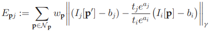

이 포스트는 Visual odometry (VO)와 Visual Simultaneous Localization and Mapping (vSLAM) 분야의 주요 논문들을 분석하여 요약한다.  

# 1. ORB-SLAM2

<table>
<colgroup>
<col width="10%" />
<col width="90%" />
</colgroup>
<thead>
<tr class="header">
<th>제목</th>
<th>ORB-SLAM: A Versatile and Accurate Monocular SLAM System</th>
</tr>
</thead>
<tbody>
<tr>
<td markdown="span">저자</td>
<td markdown="span">Raul Mur-Artal, J. M. M. Montiel, and Juan D. Tardos</td>
</tr>
<tr>
<td markdown="span">출판</td>
<td markdown="span">TRO, 2015</td>
</tr>
<tr>
<td markdown="span">분류</td>
<td markdown="span">Relative scale, SLAM</td>
</tr>
<tr>
<td markdown="span">github</td>
<td markdown="span">https://github.com/raulmur/ORB_SLAM.git</td>
</tr>
</tbody>
</table>

<table>
<colgroup>
<col width="10%" />
<col width="90%" />
</colgroup>
<thead>
<tr class="header">
<th>제목</th>
<th>ORB-SLAM2: An Open-Source SLAM System for Monocular, Stereo,
and RGB-D Cameras</th>
</tr>
</thead>
<tbody>
<tr>
<td markdown="span">저자</td>
<td markdown="span">Raul Mur-Artal and Juan D. Tardos</td>
</tr>
<tr>
<td markdown="span">출판</td>
<td markdown="span">TRO, 2017</td>
</tr>
<tr>
<td markdown="span">분류</td>
<td markdown="span">Abolute scale, SLAM</td>
</tr>
<tr>
<td markdown="span">github</td>
<td markdown="span">https://github.com/raulmur/ORB_SLAM2.git</td>
</tr>
</tbody>
</table>

시작은 이 분야의 전설로부터 시작하는게 좋겠다. ORB feature로 SLAM의 A to Z를 완성시킨 **ORB SLAM**에서 절대 스케일을 알 수 있도록 Stereo, RGB-D 영상을 처리할 수 있게 발전시킨 논문이 **ORB SLAM2**다. 이 논문을 빼고 vSLAM이나 VO를 논할 수 없다. ORB SLAM2를 위주로 정리하되 ORB SLAM에서 물려받은 모듈들은 ORB SLAM 논문을 참고하여 설명하겠다.  

## Data

### Feature

당연한 이야기지만 ORB-SLAM(2)은 ORB feature를 쓴다. ORB는 "ORB: An efficient alternative to SIFT or SURF"란 논문으로 발표 되었다. ORB(Oriented FAST and Rotated BRIEF)라는 이름처럼 FAST corner detector와 회전에 강인한 rBRIEF descriptor를 조합한 feature다. ORB는 binary descriptor라서 추출과 비교가 빠르면서도 매칭 성능이 좋다.  

ORB-SLAM에서는 영상에서 ORB feature를 추출하여 tracking, mapping, relocalization, loop closing 등 feature가 필요한 모든 곳에 ORB를 쓴다.  

FAST keypoint는 프레임당 이미지 크기에 따라 1000 또는 2000 개를 뽑는다. 1.2배 단위로 8단계 이미지 스케일에서 뽑는다. 이미지에 keypoint들이 골고루 분포해야 하므로 그리드로 나눠서 cell 하나당 최소 5개 이상 나오도록 threshold를 조절한다.

### Keypoints

ORB SLAM2에서는 스테레오 영상에서 발견된 stereo keypoint를 $$\mathbf{x}_s=(u_L, v_L, u_R)$$ 형태로 관리한다. 스테레오 캘리브레이션이 완벽하게 되어 epipolar line이 수평하다면 왼쪽 이미지 좌표는 $$(u_L, v_L)$$ 일때 오른쪽 이미지 좌표는 $$(u_R, v_L)$$이 된다. RGB-D 영상인 경우 이를 스테레오 좌표로 변환한다. ($$f_x$$는 horizontal focal length, $$b$$는 baseline between projector and camera인데 어차피 가상의 스테레오를 만드는 것이니 적당히 아무값이나 넣어도 될듯 하다.)

$$
u_R=u_L-{f_xb \over d}
$$

이렇게 하면 스테레오와 RGB-D를 동일하게 처리할 수 있다. keypoint의 depth가 baseline의 40배 이하면 *close*로 분류하고 멀면 *far*로 분류한다. Close keypoint는 한 프레임 안에서 triangulate 하지만 far keypoint는 multi-view를 통해 여러번 봐야 triangulate 할 수 있다.  

단일 카메라에서 찾은 keypoint나 스테레오/RGB-D에서 depth를 찾을 수 없는 keypoint는 monocular keypoint $$\mathbf{x}_m=(u_L, v_L)$$로 정의한다. 이들도 multi-view를 통해 여러번 발견되어야 triangulate 할 수 있다.

불필요한 map point를 지우는 것을 **map point culling** 이라고한다. map point는 다음 조건을 만족해야 한다.

1. 어떤 map point가 보여지기로 기대되는 keyframe 중 25% 이상의 keyframe에서 실제로 보여야한다.
2. Map point는 3개 이상의 keyframe에서 발견되어야 한다.

코드에서 keypoint 가 가지고 있는 정보

### Keyframe

ORB SLAM에서 keyframe은 일단 자주 추가한 후 나중에 불필요한 keyframe을 지운다. keyframe은 다음 조건을 만족할 때 추가된다.

1. 마지막 global relocalization에서 20 프레임 이상 지났을 때
2. 마지막 keyframe을 추가한 후 20 프레임 이상 지났을 때
3. 현재 프레임이 최소 50 point를 추적할 때? (50 point 이하인듯)
4. 현재 프레임이 reference keyframe의 keypoint 중 90% 이하를 추적할 때
5. (ORB SLAM2) 추적 중인 close keypoint 수가 $$\tau_t=100$$개 이하로 떨어지고 현재 프레임에서 $$\tau_c=70$$개 이상의 close stereo keypoint를 만들어 낼 수 있을 때

Keyframe이 추가되면 covisibility graph에 새로운 노드를 추가하고 새 keyframe과 같은 keypoint들을 공유하는 기존 keyframe들을 연결한다.  

불필요한 keyframe을 지우는것을 **keyframe culling**이라고 한다. Keyframe culling policy는 어떤 keyframe의 90% 이상의 point들이 다른 세 개의 keyframe에서 보이면 그 keyframe을 지운다. Feature 매칭은 현재 이미지와 같거나 finer 스케일의 feature들과 매칭한다.

### Covisibility Graph

covisibility graph는 keyframe 사이의 관계를 나타낸 것으로 최소 15개의 map point를 공유한 keyframe들이 연결되고 공유 map point의 개수가 edge의 weight가 된다.

## Bundle Adjustment (BA)

ORB-SLAM2는 여러 단계에서 BA를 한다. BA는 g2o라는 비선형 최적화 라이브러리를 이용해 구현한다. 현재 프레임의 pose는 Motion-only BA, 최근 keyframe의 pose는 Local BA, 전체적인 최적화는 pose-graph optimization과 Full BA로 계산한다. 네 가지 최적화 모두 각각 다른 thread에서 독립적으로 돌아간다.

### A. Motion-only BA

Motion-only BA는 지도의 keypoint들은 고정시킨 채 현재 pose만 최적화한다. 아래의 reprojection error를 최소화하는 pose를 찾는다. (pose는 $$R \in SO(3), t \in \mathbb{R}^3$$ / keypoint 이미지 좌표는 $$\mathbf{x}_s, \mathbf{x}_m$$ / 지도의 3차원 keypoint 좌표는 $$\mathbf{X}$$)

### B. Local BA

새로운 keyframe이 생기면 covisible keyframes $$\mathcal{K}_L$$의 pose와 $$\mathcal{K}_L$$에서 보인 keypoint $$\mathcal{P}_L$$을 최적화한다. $$\mathcal{K}_L$$에 들어있지 않은 keyframe들의 pose도 최적화에 들어간 keypoint들을 봤다면 최적화에 사용되지만 고정된 파라미터로 들어간다.

### C. Loop Closing and Full BA

Loop closing은 DBoW2로 발견하는데 발견하면 일단 pose-graph optimization을 한다. 즉 keypoint들은 계산에서 빼고 covisibility graph에서 pose 관계만 가지고 최적화를 하는 것이다. Pose-graph optimization이 끝나면 Full BA를 한다. Full BA가 끝나면 Full BA를 하는동안 추가된 keyframe, keypoint들을 업데이트한다.

# 2. DSO

<table>
<colgroup>
<col width="10%" />
<col width="90%" />
</colgroup>
<thead>
<tr class="header">
<th>제목</th>
<th>Direct Sparse Odometry</th>
</tr>
</thead>
<tbody>
<tr>
<td markdown="span">저자</td>
<td markdown="span">Jakob Engel, Vladlen Koltun, and Daniel Cremers</td>
</tr>
<tr>
<td markdown="span">출판</td>
<td markdown="span">TPAMI, 2018</td>
</tr>
<tr>
<td markdown="span">분류</td>
<td markdown="span">Relative scale, VO</td>
</tr>
<tr>
<td markdown="span">github</td>
<td markdown="span">https://github.com/JakobEngel/dso</td>
</tr>
</tbody>
</table>

## 서론

ORB-SLAM이 feature-based SLAM의 대표격이라면 direct SLAM의 대표격으로는 LSD-SLAM이 있는데 LSD-SLAM은 이제 좀 지나기도 했고 그보단 같은 저자의 최근 논문인 DSO를 소개하는게 나을 듯 하다. (DSO는 SLAM은 아니고 VO지만 뭐... 그게 그거다.)  

이 논문은 서론이 인상적이다. 그 전까지는 VO를 feature-based와 direct 두 가지 흐름으로 이해하고 있었다. 저자는 영상을 localization에 사용하는 방법에 두 가지 분류 기준이 있고 총 네 가지 종류의 VO가 있다고 한다.  

**Direct vs Indirect**

- Direct: 센서 입력 자체를 그대로 사용하는 방법이다. 영상의 경우 픽셀값을 직접 이용한다. 픽셀들을 다른 시점으로 reprojection 했을 때 픽셀 값의 차이를 계산하는 photometric error를 최소화하는 pose를 찾는다.
- Indirect: 센서 입력에서 '중간 표현(intermediate representation)'을 만들어 사용하는 방법이다. 주로 keypoint와 descriptor의 조합으로 점들을 매칭해서 픽셀들을 다른 시점으로 reprojection 했을 때 영상 좌표의 geometric error를 최소화하는 pose를 찾는다.

**Dense vs Sparse**

- Dense: 영상에서 대부분의 픽셀을 활용하는 방법인데 주로 Direct 방식과 결합된다. 영상 전체적인 optical flow를 쓰는 경우 Indirect Dense 방식이라고 볼 수 있다.
- Sparse: 영상에서 특정 픽셀들만 쓰는 방법으로 주로 keypoint를 추출한다. ORB SLAM과 같은 Indirect Sparse 방식이 가장 널리쓰이는 방식이다. 

**Direct Sparse** 방식은 아직까지 거의 시도된적이 없는데 이 논문에서 최초로 시도하는 방식이다. 픽셀 값 차이를 최소화하는 Direct 방식인데 영상 전체의 픽셀을 사용하지 않고 영상을 샘플링해서 일부만 사용하여 Sparse하게 만든 것이다. 그래서 논문의 제목이 *Direct Sparse Odometry* 다. 

Direct 방식은 카메라의 노출이나 감마 함수 등에 의한 phometric distortion과 rolling shutter에 의한 geometric distortion에 취약할 수 있다. 하지만 저자의 '주장'은 앞으로 컴퓨터 비전을 목적으로 완벽히 photometric calibarion 가능한 카메라들이 사용된다는 것이다.  

이 논문의 Direct Sparse 방식으로 camera poses, camera intrinsics, geometry parameters (inverse depth)를 동시에 최적화한다. 이를 위해 photometric calibration을 최대한 활용한다. (photometric parameter: lens attenuation, gamma correction, exposure time)

## Direct Sparse Model

### Calibration

Direct 방식은 calibration이 매우 중요한데 여기서는 두 가지 calibration을 적용한다. Geometric calibration을 통해 먼저 radial distortion을 제거한 뒤 다시 intrinsic parameter를 계산한다.  

다음 단계로 lens attenuation이나 노출 시간 등에 의한 픽셀 값 변화를 보정하기 위해 photometric calibraiton을 한다. Photometric camera model은 다음과 같다.
$$
\begin{matrix}
I_i(\mathbf{x}) = G(t_iV(\mathbf{x})B_i(\mathbf{x})) \\
I'_i(\mathbf{x}) := t_i B_i(\mathbf{x}) = {G^{-1}(I_i(\mathbf{x})) \over V(\mathbf{x})}
\end{matrix}
$$

- $$G()$$ : sensor response function
- $$t_i$$ : exposure time
- $$V(\mathbf{x})$$ : lens attenuation (vignetting)
- $$I(\mathbf{x})$$ : observed pixel value
- $$I'(\mathbf{x})$$ : calibrated pixel value

DSO에서는 미리 photometric calibration이 되어있는 TUM monoVO 데이터셋에서 제공하는 calibration 파라미터나 함수를 써서 이미지를 먼저 보정한 $$I'(\mathbf{x})$$를 사용한다.  

## Model Formulation

Photometirc error는 샘플링한 픽셀에 대해서만 구하는 것이 아니라 주변 픽셀들까지 같이 계산한다. 아래 그림처럼 중심 픽셀과 주변 픽셀까지 8개의 픽셀에 대해 weighted SSD (sum of squared distance ??)를 계산한다. 

8개 픽셀에 대한 SSD는 다음과 같이 구한다.

- $$t_i$$ : exposure time
- $$a_i, a_j, b_i, b_j$$ : parameters for affine brightness transfer function $$e^{-a_i} (I_i - b_i)$$
- $$d_p$$ : depth of pixel p
- $$\omega_p$$ : gradient dependent weighting, low weight for high gradient pixels

여기서 중요한 점은 point를 inverse depth 하나로만 parameterization 한다는 것이다. keyframe에서 발견된 픽셀이 고정되면 방향이 정해지고 깊이만 추정하면 된다. 다른 모델에서 3차원 좌표를 추정한 것과는 다른 방식이다.

이를 여러 프레임에 걸쳐 photometric error를 더하면 다음과 같다. 이 에러 함수를 최소화하는 camera poses ($$T_i$$), depths ($$d_p$$), intensity affine parameters ($$a_i, b_i$$) 를 찾으면 된다.

DSO는 이러한 최적화를 sliding (time) window에 적용하여 현재 위치를 추적한다.

## Visual Odometry Front-End

Front-end란 최적화 외에 keyframe이나 keypoint 등을 관리하는 모듈이다. DSO는 언제나 7개의 keyframe을 (8)번 식으로 최적화한다.  

Keyframe을 관리하는 방법은 다음과 같다.

1. Initial Frame Tracking: 새로운 keyframe이 생기면 기존의 active point들을 모두 그곳에 projection한다. 새로운 프레임이 들어오면 최신 keyframe과의 관계만 계산한다. 
2. Keyframe Creation: ORB SLAM 처럼 일단 최대한 많은 keyframe들을 생성한다. 조건은 다음과 같다.
   1. 시야 변화: 마지막 keyframe으로부터 optical flow가 커질때
   2. 가려짐 (Occlusion): rotation 없이 pixel을 warping 했을 때 픽셀 오차로 판단
   3. 노출 시간이 급격히 변할 때
3. Keyframe Marginalization: keyframe을 제거하는 과정이다.
   1. 가장 최근 두 개의 keyframe은 남긴다.
   2. 마지막 keyframe에서 특정 keyframe의 point가 5% 이상 보이지 않으면 제거한다.
   3. 7개 이상의 keyframe이 생기면 그 중 마지막 keyframe과 가장 떨어진 keyframe을 제거한다.

DSO는 항상 2000여개의 keypoint를 각 프레임 단위로도, 전체 최적화 윈도우 단위로도 유지한다. Keypoint를 관리하는 방법은 다음과 같다.

1. Candidate Point Selection: 프레임 단위로 candidate point를 만드는 방법이다. 영역을 나눠서 gradient를 구한 뒤 gradient를 영역별로 정규화한다. 이후 다시 이미지 영역을 나눠서 영역별로 gradient가 높은 점들을 선택한다. 만약 threshold를 넘는 gradient 점들이 충분히 나오지 않으면 threshold를 낮춰서 반복한다.  
2. Candidate Point Tracking: 점들을 다음 프레임에서 추적하는데 epipolar line을 따라 photometric error가 가장 낮은 점을 찾는다. 기존에 추정한 depth로 검색 범위를 좁힌다.
3. Candidate Point Activation: 예전 점들이 지워지면 새로운 점들로 채우는데 이미지에 되도록 골고루 점들이 분포하게 하기 위해 기존 점들과 가장 거리가 먼 점들부터 채운다.
4. Outlier and Occlusion Detection: 2에서 epipolar line을 따라 검색할 때 error가 너무 크면 그 점을 버린다. 주변 점들까지 고려한 photometric error가 너무 커도 버린다.

# 3. VINS-Fusion

## Overview

전체적인 구조도다.

## IV. Measurement Preprocessing

### A. Vision Processing Front End

#### Feature extraction and tracking

카메라에서 영상이 들어오면 feature를 추적한다. "Good feature to track"으로 특징점을 찾고 KLT optical flow로 추적한다. 영상마다 100~300개의 feature를 추출한다. 특징점 사이에 최소거리 조건을 두어 영상에 고르게 특징점이 추출되도록 한다. 2차원 특징 좌표는 undistort 한 뒤 unit sphere로 projection 한다. RANSAC 알고리즘으로 Fundamental matrix를 계산하여 outlier를 제거한다.  

#### New key frame criterion

이 때 keyframe을 고른다. 현재 프레임과 최신 keyframe 사이의 평균 parallax가 threshold를 넘으면 새 keyframe으로 사용한다. 그런데 parallax는 rotation만으로도 생길 수 있으므로 short-term gyro integration을 이용해 parallax를 보정한다. 혹은 tracked feature 수가 일정 threshold 아래로 내려가면 새로운 keyframe을 만든다.  

### B. IMU Preintegration

일반적으로 IMU의 측정 속도(수백Hz)가 카메라(수십Hz)에 비해서 훨씬 빠르기 때문에 두 센서 중 느린 카메라를 기준으로 위치를 추적한다. 카메라 프레임 인덱스를 k라 할 때 다음 프레임인 k+1 사이에는 수십번의 IMU 속도/가속도 측정 정보가 쌓인다. 이 정보를 누적하여 k와 k+1 사이의 상대적인 위치, 이동속도, 회전속도의 변화량을 계산하는 것을 **IMU preintegration**이라고 한다.

IMU 센서로부터 읽는 가속도과 회전속도는 다음과 같은 구성 요소가 있다.

- Eq 1-1) acceleration measurement = true acceleration + acc. bias + rotated gravity acc. in body frame at time t + random noise
    - 따라서 실제 가속은, $$\mathbf{a}_t = \hat{\mathbf{a}}_t - \mathbf{b} - \mathbf{R}^t_w \mathbf{g}^w - \mathbf{n}_a$$
    - 실제 가속을 전역좌표계로 변환하면, $$\mathbf{R}^w_t\mathbf{a}_t = \mathbf{R}^w_t \left(\hat{\mathbf{a}}_t - \mathbf{b} - \mathbf{R}^t_w \mathbf{g}^w - \mathbf{n}_a \right) = \mathbf{R}^w_t \left(\hat{\mathbf{a}}_t - \mathbf{b} - \mathbf{n}_a \right) - \mathbf{g}^w$$
- Eq 1-2) gyro rotational velocity = true rotational velocity + bias + random noise
    - 따라서 실제 회전 속도는, $$\boldsymbol{\omega}_t = \hat{\boldsymbol{\omega}}_t - \mathbf{b}_{\omega_t} - \mathbf{n}_\omega$$

#### Quaternion-based IMU Preintegration

Preintegration에 대한 자세한 수식은 Appendix A.에 나와있다. 아래 식은 전역좌표계에서 위치, 이동속도, 회전속도를 IMU 정보를 이용해 시간 k에서 k+1로 업데이트한다. (이건 preintegration이 아니다.)

- Eq 23-1) position of body at k+1 in world frame = position of body at k in world frame + movement by constant velocity + movement by acceleration
    - 적분 안에는 Eq 1-1)에서 계산한 true acceration term
- Eq 23-2) velocity of body at k+1 in world frame = velocity of body at k in world frame + velocity change by acceleration
- Eq 23-3) quaternion of body at k+1 in world frame = quaternion of body at k in world frame * rotation by rotational velocity
    - 적분 안에는 Eq 1-2)에서 계산한 true rotational velocity

이렇게 적분하는 방식은 계산식 자체에 추정해야 할 상태인 $$\mathbf{R}^w_t$$가 들어가 있기 때문에 optimization을 하면서 각 프레임의 상태가 변하면 처음부터 다시 integration을 해야하기 때문에 비효율적이다. 그래서 아래와 같은 **preintegration** 알고리즘을 사용한다.

앞서 나온 Eq 23-1과 비교하면 superscript(위첨자)가 w에서 b_k로 달라졌다. 이제 전역좌표계가 아닌 시간 k의 지역좌표계에서 계산하는 것이다.

- Eq 25-1, Eq 26-1) Eq 23-1에서 $$\mathbf{R}^{b_k}_\omega$$를 곱하면 첫 번째 식이 나온다.
    $$
    \mathbf{p}^{b_k}_{b_{k+1}} = \mathbf{R}^{b_k}_\omega \mathbf{p}^w_{b_{k+1}} \\
    = \mathbf{R}^{b_k}_\omega \left( \mathbf{p}^{\omega}_{b_k} + \mathbf{v}^{\omega}_{b_k} \Delta t_k \right)
    + \int\int_{t \in [t_k, t_{k+1}]} \mathbf{R}^{b_k}_\omega \left( \mathbf{R}^w_t \left(\hat{\mathbf{a}}_t - \mathbf{b} - \mathbf{n}_a \right) - \mathbf{g}^w \right) dt^2 \\
    = \mathbf{R}^{b_k}_\omega \left( \mathbf{p}^{\omega}_{b_k} + \mathbf{v}^{\omega}_{b_k} \Delta t_k \right)
    + \int\int_{t \in [t_k, t_{k+1}]} \mathbf{R}^{b_k}_\omega \left( \mathbf{R}^w_t \left(\hat{\mathbf{a}}_t - \mathbf{b} - \mathbf{n}_a \right) \right) dt^2
    + \int\int_{t \in [t_k, t_{k+1}]} \mathbf{g}^w dt^2 \\
    = \mathbf{R}^{b_k}_\omega \left( \mathbf{p}^{\omega}_{b_k} + \mathbf{v}^{\omega}_{b_k} \Delta t_k - {1 \over 2} \mathbf{g}^\omega \Delta t_k^2 \right)
    + \int\int_{t \in [t_k, t_{k+1}]} \left( \mathbf{R}^{b_k}_t \left(\hat{\mathbf{a}}_t - \mathbf{b} - \mathbf{n}_a \right) \right) dt^2 \\
    = \mathbf{R}^{b_k}_\omega \left( \mathbf{p}^{\omega}_{b_k} + \mathbf{v}^{\omega}_{b_k} \Delta t_k - {1 \over 2} \mathbf{g}^\omega \Delta t_k^2 \right) + \boldsymbol{\alpha}^{b_k}_{b_k+1}
$$
    
- Eq 25-2, Eq 26-2) 이동속도도 마찬가지로 Eq 23-2에서 $$\mathbf{R}^{b_k}_\omega$$를 곱하면 두 번째 식이 나온다.

- Eq 25-3, Eq 26-3) 회전속도도 마찬가지로 Eq 23-3에서 $$\mathbf{q}^{b_k}_\omega$$를 곱하면 세 번째 식이 나온다.

식을 보면 여전히 상대적인 위치 이동 $$\mathbf{p}^{b_k}_{b_{k+1}}$$을 계산하기 위해서는 전역좌표계와 연관된  $$b_k$$ 프레임의 상태 $$\mathbf{R}^{b_k}_\omega$$가 들어가긴 하지만 이건 프레임 단위로 한번만 계산하는 것이라 부담이 크진 않다. 중요한 것은 preintegration term인 Eq 26에서 전역좌표계와 관련된 항이 없기 때문에 이건 순수히 $$b_k$$ 프레임의 지역좌표계에서만 계산하게 된다. 그러면 **$$b_k$$ 프레임의 상태가 변하더라도 preintegration term은 다시 계산하지 않아도 된다.**  

다만 preintegration term에서 $$\mathbf{b}$$ (bias estimation)가 변하게 되면 다시 preintegration을 계산해야 하는데 이때 bias 변화가 작으면 first-order talyor expansion으로 근사치를 구하고 bias 변화가 클때만 다시 preintegration을 계산한다. 이러한 방법으로 preintegration의 계산량을 크게 줄일 수 있다.

#### Discrete-time integration

Eq 26의 preintegration term에는 시간에 대한 적분이 들어간다. IMU 데이터는 discrete time으로 들어오기 때문에 적분이 아닌 다른 integration 방법이 필요하다. Discrete-time integration은 여러가지 방법이 있지만 간단한 zero-order hold 방식을 사용한다.

식에서 i는 프레임 k와 k+1 사이의 IMU 데이터 인덱스다. 

- Eq 27-1) position at i+1 in b_k frame = position at i + movement by constant velocity + movement by acceleration = position at i + velocity at i * delta t + 1/2 * rotation to b_k frame * (measured acceleration - estimated bias) * delta t^2
- Eq 27-2) velocity at i+1 in b_k frame = velocity at i + rotation to b_k * (measured acceleration - estimated bias) * delta t
- Eq 27-3) quaternion at i+1 in b_k frame = quaternion at i * rotation at i = quaternion at i * [1, (measured acceleration - estimated bias) * delta t]

#### Covariance propagation

Preintegration에서는 다섯 개의 state 변수를 추적한다.
$$
\mathbf{x} = \begin{bmatrix} \boldsymbol{\alpha}^{b_k}_t &
\boldsymbol{\beta}^{b_k}_t & \boldsymbol{\theta}^{b_k}_t &
\mathbf{b}_{a_t} & \mathbf{b}_{w_t}
\end{bmatrix}
$$
state의 error propagtion은 다음식으로 정리할 수 있다.

- new errror = transformation matrix * old error + noise
- $$n_t$$는 가속도, 회전속도, 가속도 편향, 회전속도 편향에 대한 랜덤 노이즈를 의미한다.
- $$n_t$$의 노이즈 크기는 다음 변수로 정의한다: $$Q = diag \begin{pmatrix} \boldsymbol{\sigma}^2_a & \boldsymbol{\sigma}^2_w & \boldsymbol{\sigma}^2_{b_a} & \boldsymbol{\sigma}^2_{w_t} \end{pmatrix}$$ 

Covariance는 0에서 시작해서 IMU 데이터가 들어올 때마다 Eq 31 같이 업데이트 한다.

Jacobian은 $$\mathbf{J}_{k+1} = {\partial\mathbf{x}_{k+1} \over \partial\mathbf{x}_{k}}$$ 이라고 볼 수 있다. 그런데 $$\mathbf{x}_{k+1}$$과 $$\mathbf{x}_k$$의 관계는 수십차례의 적분이 누적된 것이기 때문에 analytical하게 구할 수 없다. 대신 Eq 32처럼 재귀적인 방식으로 데이터가 들어올 때마다 누적해서 구할 수 있다.

#### Bias correction

Eq 26에서 말했다시피 bias가 업데이트 되면 preintegration 결과가 달라져야 한다. bias 업데이트 가 작으면 Talyor expansion으로 근사치를 구한다. Jacobian은 Eq 32에서 구한 것을 쓴다.

$$
\mathbf{J}^\alpha_{b_\alpha} = {\delta \boldsymbol{\alpha}^{b_k}_{b_{k+1}} 
\over \delta \mathbf{b}_{\alpha_k}}, \quad
\mathbf{J}^\alpha_{b_w} = {\delta \boldsymbol{\alpha}^{b_k}_{b_{k+1}} 
\over \delta \mathbf{b}_{w_k}}, \quad
\mathbf{J}^\beta_{b_\alpha} = {\delta \boldsymbol{\beta}^{b_k}_{b_{k+1}} 
\over \delta \mathbf{b}_{\alpha_k}}, \quad
\mathbf{J}^\beta_{b_w} = {\delta \boldsymbol{\beta}^{b_k}_{b_{k+1}} 
\over \delta \mathbf{b}_{w_k}}, \quad
\mathbf{J}^\gamma_{b_w} = {\delta \boldsymbol{\gamma}^{b_k}_{b_{k+1}} 
\over \delta \mathbf{b}_{w_k}}
$$
예시) $$\mathbf{J}^\alpha_{b_\alpha}$$: 프레임 k와 k+1 사이의 상대적인 가속도를 k+1의 가속도 편향으로 미분  

Eq 33은 bias estimation의 변화인 ($$\delta \mathbf{b}_{\alpha_k}, \ \delta \mathbf{b}_{w_k}$$)에 따라 preintegration 값을 업데이트 한다. 

만약 bias estimation이 optimization을 통해서 크게 변한다면 다시 Eq 27을 통해 preintegration을 해야한다.

## V. Estimator Initialization

### A. Vision-only SfM in Sliding Window

