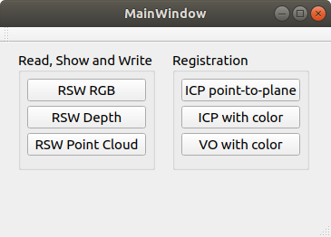
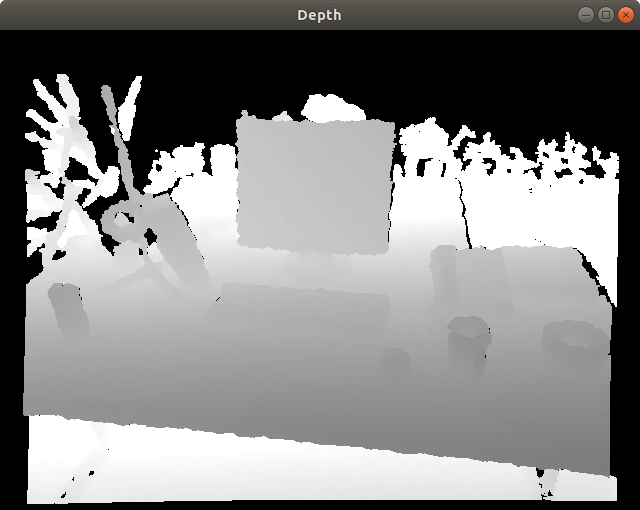
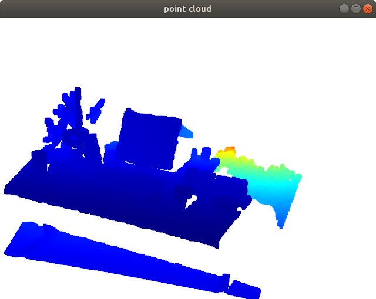
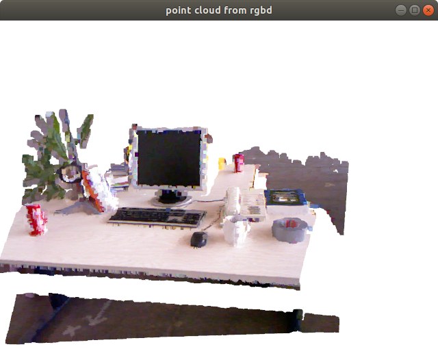
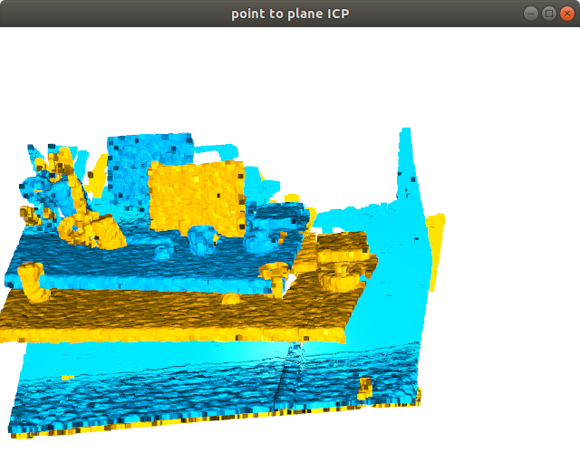
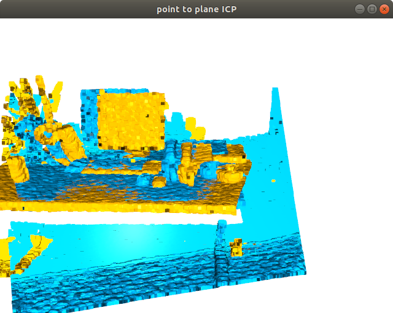
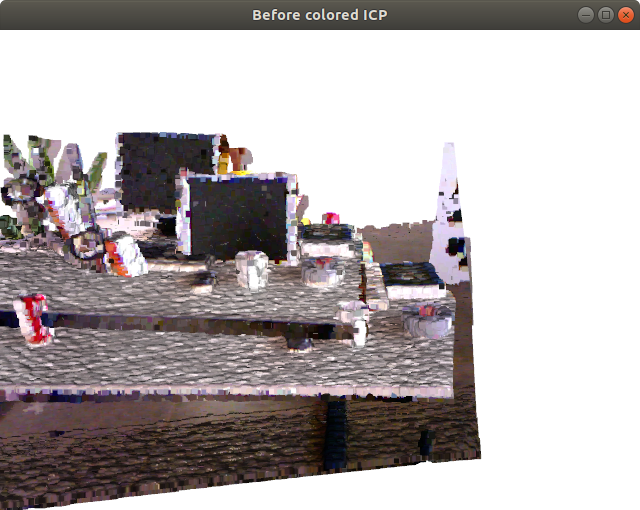
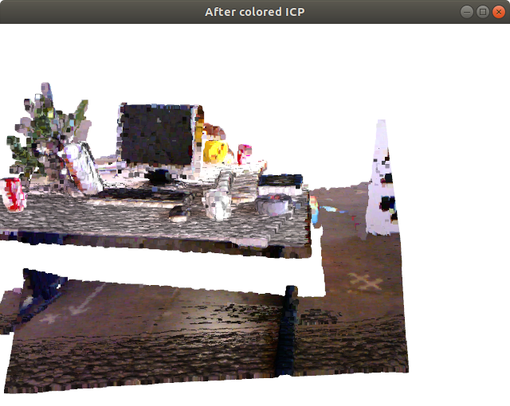

# 1. What is Open3D?

Open3D는 3차원 데이터를 다루기 위한 도구들을 모은 라이브러리다. 3차원 데이터란 (RGB-)Depth 영상, point cloud, 3D voxel, mesh 등 다양한 표현들이 있다. Open3D가 제공하는 기능들 크게 보면 다음과 같다.

- 다양한 종류의 3차원 데이터를 위한 자료 구조(클래스) 제공
- 데이터 종류마다 다른 표준 파일 포맷을 읽고 쓰는 기능
- 2차원/3차원 데이터를 시각화(visualization)하는 기능
- 2차원 영상 처리 알고리즘 (필터링 등)
- 3차원 데이터를 위한 다양한 알고리즘
  - Local/Global Registration (ICP 등)
  - Normal Estimation
  - K-D Tree
  - TSDF Volume Integration
  - Pose-graph Optimization

이러한 기능은 원래 PCL(Point Cloud Library)에도 있었다. 하지만 Open3D는 이와 차별화되는 특징들이 있다. 

- 3rd Party 라이브러리에 대한 의존성 최소화: 한마디로 **설치가 쉽다.** PCL을 한 번 빌드하려면 그 전에 최소 대여섯개의 3rd Party 라이브러리를 설치하던지 직접 소스에서 빌드를 하고 PCL과 링크를 시켜줘야 했다. (이 작업에만 하루가 걸린다.) 하지만 Open3D는 3rd Party 라이브러리 수도 적고 필요한 것들은 Open3D 저장소에 포함되어 있다. 그래서 3rd Party를 따로 받을 필요 없이 Open3D 내부에서 함께 빌드하면 된다.
- 가벼움: 3rd Party 라이브러리가 적고 내부 구조를 단순하게 만들어서 라이브러리 설치 파일의 개수나 용량도 적다.
- Python/C++ 지원: Open3D의 공식 문서는 Python 기반으로 설명하고 있다. 내부적으로는 C++로 구현하여 최적화 시켰지만 Python API를 만들어 Python에서 쓰기가 더 쉽다. [(Python Documentation)](http://www.open3d.org/docs/release/) C++ API도 당연히 있지만 이건 설명하는 문서가 없고 API reference와 다양한 예제 파일들을 보며 사용법을 익혀야 한다. [(C++ API reference)](http://www.open3d.org/docs/release/cpp_api/index.html), [(C++ examples)](https://github.com/intel-isl/Open3D/tree/master/examples/Cpp) 참고로 PCL도 Python API가 있다. [(링크)](https://github.com/strawlab/python-pcl)
- C++사용의 편의성: PCL은 C++의 template 문법을 거의 모든 곳에 적용하여 최적화나 확장성은 좋지만 코딩을 하기에는 매우 불편한점이 많다. Open3D는 자주 쓰이는 타입 하나로만 한정하여 코드를 읽고 쓰기가 더 편하다.
- Cross platform: Ubuntu/Windows/MacOS 에서 모두 작동한다. 

2018년 2월에 최초 릴리즈된 신생 프로젝트이기 때문에 PCL에는 있지만 Open3D에는 없는 기능(segmentation 등)이 좀 있다. 하지만 같은 기능의 알고리즘도 더 최신 알고리즘이 들어갔고 Open3D에는 PCL에 없는 Graph Optimization이나 PointNet 등도 지원한다. 오픈 소스로서 앞으로 더 발전할 가능성이 높다.

**여담**  

Open3D 개발사는 인텔(Intel)인데 인텔에서 3차원 센서도 만들면서 관련 소프트웨어도 개발한 것 같다. 여러 사람이 개발했지만 압도적으로 많이 기여한 한 명이 있는데 박재식이라는 한국 사람이다. 카이스트 박사 후 인텔에서 일하다 최근 포스텍으로 갔다고 한다.


# 2. How to Install

Open3D를 Python으로 사용할 경우 단순히 `pip install open3d-python` 만 치면 된다.  

하지만 C++을 사용할 경우 소스코드를 <https://github.com/intel-isl/Open3D> 에서 받아 빌드를 해야한다. OpenCV나 PCL처럼 복잡하지 않고 오래 걸리지 않는다. 아래 가이드는 Ubuntu (16.04 or 18.04)를 기준으로 설명한다.


## 2.1 Build Library


1. 저장소 받기 (**--recursive** 옵션에 주의)

   ```
   git clone --recursive https://github.com/intel-isl/Open3D
   cd Open3D
   ```

2. 의존성 설치

   ```
   sudo ./util/scripts/install-deps-ubuntu.sh
   sudo apt install cmake-qt-gui
   ```

3. cmake-gui 실행

   ```
   mkdir build
   cd build
   cmake-gui ..
   ```

4. "Configure" and "Finish" 클릭

5. "BUILD_xxx" 옵션 세팅

   1. 체크해제: **PYBIND11** and **PYTHON_MODULE**
   2. 체크: **SHARED_LIBS**, **TINYFILEDIALOGS** and **EIGEN3**

6. "CMAKE_INSTALL_PREFIX" 에 라이브러리 설치 경로 지정

7. "Configure", "Generate" 누르고 cmake-gui 나가기

8. 빌드 및 설치

   ```
   make -j3
   make install
   cp lib/* /path/to/install/lib/
   ```


## 2.2 Import Open3D to QtCreator Project

QtCreator에서 프로젝트를 만든 후 `.pro` 파일에 다음 스크립트 추가

```c
INCLUDEPATH += <install path>/open3d/include \
               <install path>/open3d/include/Open3D/3rdparty/fmt/include \
               <install path>/open3d/include/Open3D/3rdparty/Eigen

LIBS += -L<install path>/open3d/lib \
        -lOpen3D
```


# 3. Open3D Tutorial (C++)

이 포스트에서 주로 다루는 것은 Open3D에 대한 C++ API를 사용하는 방법이다. Python으로 사용하는 방법은 이미 공식문서가 너무 잘되어 있어서 필요하면 언제든 보고 따라할 수 있다. [(Python Basic Tutorial)](http://www.open3d.org/docs/release/tutorial/Basic/index.html) 여기서는 공식 문서에서는 다루지 않지만 회사에서 더 많이 쓰이는 C++로 사용하는 방법에 대해 설명하고자 한다. 문서화 되진 않았지만 C++도 [API reference](http://www.open3d.org/docs/release/cpp_api/index.html)와, [예제](https://github.com/intel-isl/Open3D/tree/master/examples/Cpp)를 제공하여 사용법을 알 수 있게 해놓았다. 여기서 다루는 주제는 크게 두 가지다.

1. **File IO and Visualization**: 파일에서 데이터를 읽고 화면에서 확인 후 저장하는 방법을 익힌다.
2. **Point Cloud Registration**: point cloud를 ICP를 통해 정합해보고 RGB 정보를 이용한 ICP도 알아본다.

예제 프로그램은 다음과 같은 Qt GUI를 통해 각 기능을 하나씩 실행해 볼 수 있도록 했다.  




예제에서 사용하는 주로 namespace는 다음과 같다. 이 namespace 안에 클래스와 함수의 이름들만 봐도 기능을 알 수 있다.

- open3d::geometry : Image나 PointCloud 같은 자료형이 들어있다.
- open3d::io : geometry 자료형을 파일로 읽고 쓰는 함수들이 있다.
- open3d::visualization : DrawGeometries()처럼 시각화 관련 함수들이 있다.
- open3d::registration : PointCloud 사이의 registration 함수들이 있다.


## 3.1 File IO and Visualization

OpenCV에서 제공하지 않는 point cloud를 저장하는 `.pcd` 파일 형식이나 mesh를 저장하는 `.ply` 형식을 읽어주는 것만으로도 Open3D는 써볼 가치가 있다. 


###  3.1.1 Depth Image

GUI에서 "RSW Depth"를 클릭하면 다음 함수가 실행된다. 일단 16bit PNG 형식으로 저장된 Depth 이미지를 읽는다. 그리고 1) depth 이미지를 보여주고 파일로 저장하는 것과 2) point cloud로 변환해서 보여주는 것 두 가지 모습을 보여준다. RGB 영상도 거의 동일한 방법으로 읽고 보여줄 수 있다.

```cpp
void MainWindow::on_pushButton_rsw_points_clicked()
{
    IoVis_Examples::ReadShowWrite_PointCloud("../samples/color1.png", 
			"../samples/depth1.png", "../results/pointcloud1.pcd");
}
```

#### a. Read depth file

`open3d::io::CreateImageFromFile()`를 쓰면 영상 파일을 읽을 수 있고 `IsEmpty()`라는 멤버 함수를 이용해 잘 불러왔는지 확인할 수 있다. 

```cpp
// iovis_examples.h
void IoVis_Examples::ReadShowWrite_Depth(const char* srcname, 
								const char* dstname, bool write_scaled)
{
    o3ImagePtr depth_ptr = open3d::io::CreateImageFromFile(srcname);
    if(depth_ptr->IsEmpty())  {
        open3d::utility::LogError("Failed to read {}\n\n", srcname);
        return;
    }
    LogImageDimension(image_ptr, "color image");
    // 출력: [Open3D INFO] depth image size: 640 x 480 x 1 (2 bytes per channel)
	// ...
```

출력으로 받은 타입 `o3ImagePtr`은 원래의 타입 이름이 길어서 다음과 같이 짧은 별명을 정의한 것이다. 위 코드에서 `o3ImagePtr` 대신 `auto`를 써도 무방하지만 `auto` 타입을 쓰면 IDE에서 자동완성을 안해줘서 코딩하기가 불편하다. 그렇다고 긴 이름을 다 쓰기 귀찮으니 짧은 별명을 정의한 것이다.

```cpp
// definitions.h
typedef open3d::geometry::Image o3Image;
typedef std::shared_ptr<o3Image> o3ImagePtr;
typedef open3d::geometry::PointCloud o3PointCloud;
typedef std::shared_ptr<o3PointCloud> o3PointCloudPtr;
```

예제에서는 모든 타입을 `std::shared_ptr`로 감싸서 사용한다. 파일을 읽어올 때 `shared_ptr`로 주기도 하고, 변수 전달이나 메모리 관리 측면에서 간편하기 때문이다.  

`LogImageDimension()`은 영상의 너비, 높이, 채널 수, 데이터 하나의 바이트 수를 `LogInfo()`  함수를 통해 보여준다. `LogInfo()` 는 마치 파이썬처럼 `{}` 안에 변수를 순서대로 넣어주므로 결과를 출력할 때 편리하게 쓸 수 있다.  

```cpp
void IoVis_Examples::LogImageDimension(o3ImagePtr img_ptr, std::string name)
{
    open3d::utility::LogInfo("{} size: {:d} x {:d} x {:d} ({:d} bytes per channel)\n",
           name, img_ptr->width_, img_ptr->height_, img_ptr->num_of_channels_,
           img_ptr->bytes_per_channel_);
}
```


#### b. Visualize Depth

Depth 영상을 화면에 보여주기 위해서는 FloatImage로 변형해주어야 한다. `ConvertDepthToFloatImage(scale);` 함수로 바꿀 수 있는데 기존에 16bit 정수로 된 depth를 scale 값으로 나눠서 대부분의 값이 0~1 사이에 들어가도록 적당한 scale 값을 지정해줘야한다. scale을 작게 너무 작게 잡으면 1이 넘는 픽셀이 다 햐얗게 보이고 너무 크게 넣으면 전체적으로 너무 어둡게 보이므로 depth 최대값에 가까운 값을 넣어줘야 한다. 아래쪽 코드는 원래 depth와 float으로 변환된 depth값을 읽어서 비교한다. scale에 넣은만큼 10000배 차이가 나는 것을 볼 수 있다.

```cpp
    // convert depth scale
    auto depth_float = depth_ptr->ConvertDepthToFloatImage(10000.0);
    if(depth_float->IsEmpty())
    {
        open3d::utility::LogError("Failed to convert to float image\n");
        return;
    }
    LogImageDimension(depth_float, "depth float image");
    
    // compare depth
    int raw_depth = *depth_ptr->PointerAt<uint16_t>(400, 320, 0);
    float single_depth_float = depth_float->FloatValueAt(400, 320).second;
    open3d::utility::LogInfo("raw depth={}, float depth={}\n", 
                             raw_depth, single_depth_float);
	// 출력: [Open3D INFO] depth float image size: 640 x 480 x 1 (4 bytes per channel)
	// 출력: [Open3D INFO] raw depth=6122, float depth=0.6122
```


데이터를 FloatImage로 변환하고 나면 `DrawGeometries` 함수로 쉽게 화면에 영상을 보여줄 수 있다. 

```cpp
    // show depth
    open3d::visualization::DrawGeometries({depth_float}, "Depth", 
								depth_ptr->width_, depth_ptr->height_);
```





#### c. Write depth image

영상은 `WriteImage()` 라는 함수로 파일에 쓸 수 있는데 float 형으로 변환된 경우 다시 정수형으로 바꿔서 저장해야 한다.

```cpp
    if(write_scaled)
        open3d::io::WriteImage(dstname, *depth_float->CreateImageFromFloatImage<uint8_t>());
    else
        open3d::io::WriteImage(dstname, *depth_ptr);
```


#### d. Visualize point cloud

Depth를 point cloud로 보고 싶다면 point cloud로 변환해야 한다. 변환에 필요한 정보는 카메라의 intrinsic 파라미터다. `SetIntrinsics()` 함수에서 6개의 파라미터를 입력한다.

1. width: 영상 너비
2. height: 영상 높이
3. fx: horizontal focal length
4. fy: vertical focal length
5. cx: 영상 중심점의 x좌표
6. cy: 영상 중심점의 y좌표

Point cloud 또한 DrawGeometries 함수로 화면에 보여줄 수 있다.

```cpp
    // convert depth to point cloud
    open3d::camera::PinholeCameraIntrinsic camera;
    camera.SetIntrinsics(640, 480, 575.0, 575.0, 319.5, 239.5);
    o3PointCloudPtr pointcloud_ptr = o3PointCloud::CreateFromDepthImage(*depth_ptr, camera);

    // show point cloud
	open3d::visualization::DrawGeometries({pointcloud_ptr}, "point cloud");
```

다음은 3차원 point cloud를 표시한 화면이다. Depth를 색상으로 표현하고 있다. 참고로 Open3D의 기본 좌표계는 카메라 좌표계로 x=아래, y=좌측, z=정면(depth) 이다.




### 3.1.2 RGB-Depth Image

GUI에서 "RSW Point Cloud"를 클릭하면 다음 함수가 실행된다.

```cpp
void MainWindow::on_pushButton_icp_point_plane_clicked()
{
    RegistrationExamples::IcpPointCloud("../samples/depth1.png", 
                                        "../samples/depth2.png");
}
```


#### a. Read rgb-d files

RGB 영상과 Depth 영상을 읽는 방법은 `CreateImageFromFile()` 동일하게 읽는다.

```cpp
void IoVis_Examples::ReadShowWrite_PointCloud(const char* colorname, 
                     const char* depthname, const char* pcdname)
{
// read color and depth
    o3ImagePtr color_ptr = open3d::io::CreateImageFromFile(colorname);
    LogImageDimension(color_ptr, "color image");
    o3ImagePtr depth_ptr = open3d::io::CreateImageFromFile(depthname);
    LogImageDimension(depth_ptr, "depth image");
    if(color_ptr->IsEmpty() || depth_ptr->IsEmpty())
    {
        open3d::utility::LogError("Failed to read {} or {}\n\n", 
                                  colorname, depthname);
        return;
    }
	// 출력
	// [Open3D INFO] color image size: 640 x 480 x 3 (1 bytes per channel)
	// [Open3D INFO] depth image size: 640 x 480 x 1 (2 bytes per channel)
```


#### b. Convert to RGB-D image

Open3D에는 RGB-D 영상을 위한 자료형으로 `open3d::geometry::RGBDImage`이 있다. `CreateFromColorAndDepth()` 함수에 들어가는 인자는 다음과 같다.

1. RGB 영상과 Depth 영상
2. depth_scale: depth를 float으로 변환할 때 나눠주는 값
3. depth_trunc: 유효한 depth 최대값
4. convert_rgb_to_intensity: point cloud를 만들 때 색을 RGB로 유지할지 gray scale로 변환할지 결정

```cpp
    double depth_scale = 5000.0, depth_trunc = 3.0;
    bool convert_rgb_to_intensity = false;
    std::shared_ptr<open3d::geometry::RGBDImage> rgbd_ptr =
            open3d::geometry::RGBDImage::CreateFromColorAndDepth(
                *color_ptr, *depth_ptr, depth_scale, depth_trunc, 
                convert_rgb_to_intensity);
```


#### c. Convert to point cloud and show

Point cloud를 위에서 본것처럼 depth에서 바로 만들어도 되지만 colored point cloud를 만들기 위해서는 rgbd 영상으로부터 만들어야 한다. (`CreateFromRGBDImage()`) 이때도 역시 intrinsic 파라미터가 필요한데 상용 센서의 경우 라이브러리에 값이 저장되어 있어서 `enum` 값만 입력해도 된다.

```cpp
    open3d::camera::PinholeCameraIntrinsic intrinsic(
            open3d::camera::PinholeCameraIntrinsicParameters::PrimeSenseDefault);
    o3PointCloudPtr ptcd_ptr = o3PointCloud::CreateFromRGBDImage(*rgbd_ptr, intrinsic);
```

이렇게 만들어진 `PointCloud`에는 세 가지 자료가 들어있다. `points_`는 기본적으로 있어야 하고 `normals_`나 `colors_`는 입력되거나 계산되어야 값이 들어간다. 여기서는 `RGBDImage`로부터 만들어졌으므로 `colors_`는 채워져있고 `normals_`는 비어있는 상태다.

```cpp
// PointCloud.h
class PointCloud : public Geometry3D {
public:
	std::vector<Eigen::Vector3d> points_;
    std::vector<Eigen::Vector3d> normals_;
    std::vector<Eigen::Vector3d> colors_;
```

변수에 접근하여 값을 직접 확인해보자. 변수가 public 이므로 밖에서 직접 접근가능하다.

```cpp
    uint32_t index = 240*480 + 400;
    open3d::utility::LogInfo("check point cloud values: point={} | color={}\n",
                             ptcd_ptr->points_[index].transpose(), 
                             ptcd_ptr->colors_[index].transpose());
	// 출력: [Open3D INFO] check point cloud values: 
	// point=0.259197 0.083068   0.6558 | color=0.811765 0.658824 0.654902
```

이후엔 역시 `DrawGeometries()` 함수로 3차원 point cloud를 보여준다.

```cpp
    open3d::visualization::DrawGeometries({ptcd_ptr}, "point cloud from rgbd");
```




#### d. Write, read and show point cloud

Point cloud 자체를 저장하는 함수는 `WritePointCloud()` 가 있다. 입력인자에 `write_ascii`는 true면 데이터를 읽을 수 있는 텍스트로 저장하고 false면 압축률 좋은 binary 형태로 저장한다.  

Point cloud를 파일에서 읽는 함수는 말 그대로 `CreatePointCloudFromFile()`다. 첫 번째 인자는 파일이름이고 두 번째는 파일 형식, 세 번째는 과정을 print 할지 결정하는 인자다.  

마지막 줄에서는 불러온 point cloud를 다시 보여줘서 데이터를 시각적으로 확인한다.

```cpp
    // write point cloud in ascii format without compression
    bool write_ascii = true, compressed = false;
    open3d::io::WritePointCloud(pcdname, *ptcd_ptr, write_ascii, compressed);

    // read point cloud again
    o3PointCloudPtr neo_ptcd_ptr;
    neo_ptcd_ptr = open3d::io::CreatePointCloudFromFile(pcdname, 
                                                   "pcd", true);

    // show loaded point cloud
    open3d::visualization::DrawGeometries({neo_ptcd_ptr}, "loaded point cloud");
```


## 3.2 Point Cloud Registration

Point Cloud Registration이란 비슷한 모양을 가진 두 개의 point cloud가 포개어지도록 정합시키는 것을 말한다. 계산적인 측면에서 봤을 때는 source point cloud를 target point cloud에 정합시킬 수 있는 rigid transformation을 계산하는 것이다. 주로 ICP (Iterative Closest Points)라는 알고리즘이 사용되는데 Open3D에서는 다양한 registration 알고리즘을 제공한다. 

1. Point-to-point ICP: 단순히 점과 점 사이의 거리를 최소화하도록 두 point cloud를 정합한다.
2. Point-to-plane ICP: source의 점과 target의 표면 사이의 수직거리를 최소화하도록 두 point cloud를 정합한다.
3. Colored ICP: ICP에서 점들 사이의 연결관계를 찾을 때 color 정보까지 이용하여 더욱 정확하고 빠르게 수렴시키는 알고리즘이다.
4. Global registration: 위의 ICP 알고리즘들은 약간 틀어진 두 개의 point cloud를 정합할 수 있는 local regitration 알고리즘이다. 하지만 두 point cloud의 자세가 크게 다르면 ICP를 통해 정합할 수 없다. Global registration은 feature 매칭을 통해 global correspondence를 찾아 초기 자세에 상관없이 정합할 수 있는 알고리즘이다.

여기서는 2번과 3번 알고리즘을 사용하는 예제를 공부한다.

Registration에 필요한 파라미터들은 `RegPar`라는 namespace에 미리 입력해두었다.

```cpp
// registration_examples.cpp
namespace RegPar
{
const double depth_scale = 5000.0;  // from TUM RGBD format
const double depth_trunc = 4.0;
const double max_correspondence_dist = 0.3;
const Eigen::Matrix4d init_pose = Eigen::Matrix4d::Identity();
const open3d::geometry::KDTreeSearchParamHybrid kdtree(0.01, 20);
const open3d::camera::PinholeCameraIntrinsic intrinsic(
        open3d::camera::PinholeCameraIntrinsicParameters::PrimeSenseDefault);
const open3d::registration::ICPConvergenceCriteria convergence(
        1e-6, 1e-6, 20);
}
```

- depth_scale: 정수형 depth를 실수형 depth로 변환할 때 나눠주는 값, meter 단위를 만들어주기 위해 5000으로 정했다.
- depth_trunc: point cloud로 변환하는 depth의 최대값, 이 이상의 depth는 사용되지 않는다.
- max_correspondence_dist: 점 사이의 매칭을 찾는 최대 거리 범위
- init_pose: transformation 계산의 시작점, 보통 4x4 identity matrix를 넣는다.
- kdtree: kd-tree 객체, normal estimation 등에 쓰인다. 생성자 인자는 voxel grid의 크기와 최대 검색 개수를 나타낸다.
- intrinsic: 카메라의 instrinsic 파라미터를 저장한 객체
- convergence: 반복을 정지할 조건을 저장한 객체, 생성자의 인자는 반복을 정지할 오차의 감소 비율과 크기, 최대 반복 횟수를 나타낸다.


### 3.2.1 Point-to-plane ICP

GUI에서 "ICP point-to-plane"를 클릭하면 다음 함수가 실행된다.

```cpp
    RegistrationExamples::IcpPointCloud("../samples/depth1.png", 
                                        "../samples/depth2.png");
```


#### a. Read rgb-d files

`CreateImageFromFile()`로 두 개의 Depth 영상을 읽는다.

```cpp
void RegistrationExamples::IcpPointCloud(const char* srcdepthfile, 
										 const char* tgtdepthfile)
{
	// read
    o3ImagePtr src_depth = open3d::io::CreateImageFromFile(srcdepthfile);
    o3ImagePtr tgt_depth = open3d::io::CreateImageFromFile(tgtdepthfile);
    if(src_depth->IsEmpty() || tgt_depth->IsEmpty())
    {
        open3d::utility::LogError("Failed to read {} or {}", srcdepthfile, tgtdepthfile);
        return;
    }
```


#### b. Convert to point cloud

3.1.1에서도 했듯이 depth 영상을 point cloud로 변환하는데 중간에 FloatDepth로 변환하는 과정을 생략하고 바로 point cloud로 변환한다. 이때 FloatDepth로 변환에 필요한 입력인자 `RegPar::depth_scale, RegPar::depth_trunc`와 point cloud로의 변환에 필요한 `RegPar::intrinsic, RegPar::init_pose` (카메라 intrinsic 파라미터와 초기 자세 관계)를 모두 입력해야 한다.  

```cpp
    // convert depth to point cloud
    o3PointCloudPtr src_cloud = o3PointCloud::CreateFromDepthImage(
        *src_depth, RegPar::intrinsic, RegPar::init_pose, 
        RegPar::depth_scale, RegPar::depth_trunc);
    o3PointCloudPtr tgt_cloud = o3PointCloud::CreateFromDepthImage(
        *tgt_depth, RegPar::intrinsic, RegPar::init_pose, 
        RegPar::depth_scale, RegPar::depth_trunc);
    // estimate normal
    src_cloud->EstimateNormals(RegPar::kdtree, true);
    tgt_cloud->EstimateNormals(RegPar::kdtree, true);
    // draw two point clouds
    ShowTwoPointClouds(src_cloud, tgt_cloud, 
        RegPar::init_pose, "point to plane ICP");
```

변환 후 `Crop()` 함수로 범위를 point cloud의 범위를 자르는데 이유는 뒤쪽으로 길에 늘어진 point cloud가 정합에 도움이 되지 않기 때문이다.  

이후 `ShowTwoPointClouds()`로 두 개의 point cloud를 화면의 띄워 비교한다. color 정보가 없으면 정해진 색을 칠해버린다. (`PaintUniformColor()`) 원본 데이터를 그대로 보존하기 위해서는 PointCloud 데이터를 deep copy 해야 하는데 현재로서는 그런 기능이 없다. 그래서 원본의 복사본을 만들기 위해 넓은 범위를 주고 crop을 했다.  

`source`의 좌표들을 `transform` 입력인자로 좌표계 변환 후 화면에 표시한다. 지금은 identity matrix를 입력했기 때문에 정합되지 않은 두 개의 point cloud가 보인다.

```cpp
void RegistrationExamples::ShowTwoPointClouds(o3PointCloudPtr source, 
		o3PointCloudPtr target, Eigen::Matrix4d_u transform, 
        const std::string title)
{
    // since there is no deep copy function, use crop instead
    Eigen::Vector3d range(10000.0, 10000.0, 10000.0);
    o3PointCloudPtr source_tmp = source->Crop(-range, range);
    o3PointCloudPtr target_tmp = target->Crop(-range, range);
    // set uniform color to point cloud
    if(!source_tmp->HasColors())
        source_tmp->PaintUniformColor(Eigen::Vector3d(1, 0.7, 0));
    if(!target_tmp->HasColors())
        target_tmp->PaintUniformColor(Eigen::Vector3d(0, 0.7, 1));
    source_tmp->Transform(transform);
    open3d::visualization::DrawGeometries({source_tmp, target_tmp}, title);
}
```


두 개의 point cloud를 비교해보면 target(하늘색)은 source(노란색)에 비해 좌측으로, 위로, 뒤로 움직인 모습이다. 이를 좌표로 해석해보면 source가 target에 붙기 위해서는 -x, -y,+z 방향으로 움직여야 한다.




#### c. Run ICP

ICP 알고리즘은 `open3d::registration::RegistrationICP`에 구현되어 있다. 6개의 입력인자가 있는데 처음 두 개는 point cloud고 나머지는 대부분 `RegPar`에 미리 지정한 값이고 `point_to_plane` 만 새로운 값이다. 5번째 인자는 ICP에서 최소화 시킬 거리를 정한다. 이걸 `TransformationEstimationPointToPoint`로 하면 point-to-point ICP가 되고 아래 코드처럼 `TransformationEstimationPointToPlane`으로 하면 point-to-plane ICP가 된다.  

결과는 `open3d::registration::RegistrationResult result` 로 나오는데 내부에 fitness, transformation, correspondence 등의 정보를 담고 있다.

```cpp
    // point-to-plane ICP
    open3d::registration::TransformationEstimationPointToPlane point_to_plane;
    open3d::registration::RegistrationResult result =
		open3d::registration::RegistrationICP(
        		*src_cloud, *tgt_cloud,
        		RegPar::max_correspondence_dist, 
        		RegPar::init_pose, point_to_plane, RegPar::convergence);

    open3d::utility::LogInfo("point-to-plane ICP result: \n"
                             "fitness={}, transformation=\n{}\n",
                             result.fitness_, result.transformation_);

    // draw registration result
    ShowTwoPointClouds(src_cloud, tgt_cloud, result.transformation_, 
                       "point to plane ICP");
```


결과를 보면 앞뒤, 위아래로로는 잘 붙었는데 좌우로는 덜 붙은 것을 볼 수 있다. 이는 ICP가 좌우를 맞출만한 기준면(양 옆의 벽 등)이 적기 때문에 알고리즘이 정상 작동해도 이런 결과가 나올수 있다.




### 3.2.2 Colored ICP

GUI에서 "ICP with color"를 클릭하면 다음 함수가 실행된다. 이번에는 rgb-depth 영상이 아닌 point cloud를 저장한 PCD 형식의 파일을 읽어서 ICP를 한다. 이를 위해 rgb, depth 영상을 point cloud로 변환하여 저장해주는 `RegistrationExamples::RgbDepthToPCD()` 함수를 구현했다. 이 함수가 실행된 뒤 저장된 PCD 파일을 읽어 colored ICP를 실행한다.

```cpp
void MainWindow::on_pushButton_icp_colored_clicked()
{
   if(!open3d::utility::filesystem::FileExists("../results/ptcloud1.pcd"))
        RegistrationExamples::RgbDepthToPCD("../samples/color1.png", 
				"../samples/depth1.png", "../results/ptcloud1.pcd");
   if(!open3d::utility::filesystem::FileExists("../results/ptcloud2.pcd"))
        RegistrationExamples::RgbDepthToPCD("../samples/color2.png", 
				"../samples/depth2.png", "../results/ptcloud2.pcd");
    RegistrationExamples::IcpColoredPointCloud("../results/ptcloud1.pcd",
                                               "../results/ptcloud2.pcd");
}
```


#### a. Read pcd files

앞서 저장한 두 개의 point cloud 파일을 읽고 이를 화면에 보여준다.

```cpp
void RegistrationExamples::IcpColoredPointCloud(const char* srcpcdfile, 
                                                const char* tgtpcdfile)
{
    // read
    o3PointCloudPtr src_cloud = open3d::io::CreatePointCloudFromFile(srcpcdfile);
    o3PointCloudPtr tgt_cloud = open3d::io::CreatePointCloudFromFile(tgtpcdfile);
    if(src_cloud->IsEmpty() || tgt_cloud->IsEmpty())
    {
        open3d::utility::LogError("Failed to read {} or {}", srcpcdfile, tgtpcdfile);
        return;
    }
    // draw initial state
    ShowTwoPointClouds(src_cloud, tgt_cloud, 
					Eigen::Matrix4d_u::Identity(), "Before colored ICP");
```




#### b. Run colored ICP

`open3d::registration::RegistrationColoredICP`는 RGB 정보까지 이용하여 더욱 정확한 transformation을 계산할 수 있다. 입력인자로는 두 개의 point cloud와 `RegPar`에 정의된 변수들이 들어간다. 결과도 point-to-plane ICP와 동일하게 `open3d::registration::RegistrationResult result` 형식으로 나온다.

```cpp
    // colored ICP
    open3d::registration::RegistrationResult result =
            open3d::registration::RegistrationColoredICP(
        			*src_cloud, *tgt_cloud, 
        			RegPar::max_correspondence_dist,
        			RegPar::init_pose, RegPar::convergence);
    open3d::utility::LogInfo("colored ICP result: \n"
                             "fitness={}, transformation=\n{}\n",
                             result.fitness_, result.transformation_);
    // draw results
    ShowTwoPointClouds(src_cloud, tgt_cloud, 
                       result.transformation_, "After colored ICP");
```


정합된 두 개의 point cloud를 보면 거의 두 개가 구분이 되지 않을 정도로 잘 포개진 것을 볼 수 있다.



