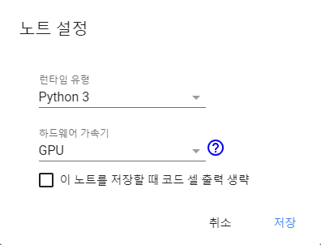
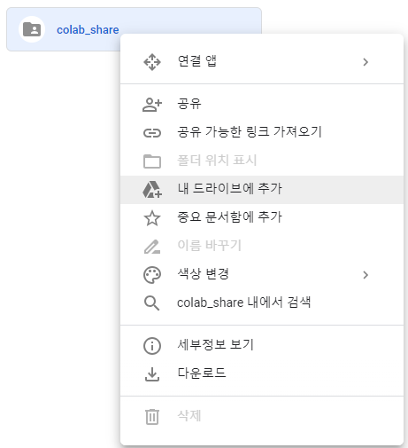

# About This Lecture

이 강의는 로봇학회 여름학교에 참가하신 분들을 대상으로 "Deep Learning based Viusal Odometry and Depth Estimation" (딥러닝 기반 VODE) 라는 주제로 강의를 합니다. 강의순서는 다음과 같습니다. 

1. **Setup and Train First!**: 뭔지 모르지만 일단 설치하고 학습을 돌려봅니다.
   1. Setup Colab Instance
   2. Start Training
2. **Install Prerequisites in Your Brain**: VODE를 이해하기 위한 사전지식을 공부합니다.
3. **Understanding VODE**: 최신 논문을 리뷰하면서 딥러닝 기반 VODE 구현 방법에 대해 자세히 알아봅니다.
4. **Crack the Code**: TF 2.0으로 다시 구현한 SfmLearner 코드를 보며 구현 과정을 이해합니다.


# Setup and Train First!

딥러닝은 일단 학습이죠? VODE에 대해 공부할 동안 Colab의 GPU가 놀고 있는 꼴을 볼 수 없기 때문에 일단 코드를 받아서 학습을 시켜봅니다.  


## 1. Setup Colab Instance

### 1.1 노트북 만들기

자신의 구글 드라이브에 로그인하여 새로운 폴더를 만든 후 "우클릭 - 더보기 - Colaboratory"를 클릭하여 새 노트북을 엽니다.


노트북에서 "런타임 - 런타임 유형 변경"을 클릭하여 유형을 다음과 같이 변경한다.




### 1.2 인스턴스 상태 확인

리눅스 명령어를 이용해 클라우드 인스턴스의 상태를 확인해 봅니다.

```
!echo "===== OS 확인 ====="
!cat /etc/issue.net
!echo "===== CPU 확인 ====="
!cat /proc/cpuinfo | grep "model name"
!echo "===== GPU 모델 확인 ====="
!nvidia-smi --query-gpu=name --format=csv,noheader
!echo "===== 메모리 확인 ====="
!cat /proc/meminfo | grep "Mem"
!echo "===== 스토리지 확인 ====="
!df -h | grep "/dev/sda1"
!echo "===== 현재 경로 확인 ====="
!pwd
!echo "===== 현재 경로의 내용 확인 ====="
!ls
```

```text
===== OS 확인 =====
Ubuntu 18.04.2 LTS
===== CPU 확인 =====
model name	: Intel(R) Xeon(R) CPU @ 2.30GHz
model name	: Intel(R) Xeon(R) CPU @ 2.30GHz
===== GPU 모델 확인 =====
Tesla T4
===== 메모리 확인 =====
MemTotal:       13335268 kB
MemFree:        10842400 kB
MemAvailable:   12548144 kB
===== 스토리지 확인 =====
/dev/sda1       365G   40G  326G  11% /opt/bin
===== 현재 경로 확인 =====
/content
===== 현재 경로의 내용 확인 =====
sample_data
```


### 1.3 설치된 버전 확인

우리가 사용할 파이썬은 Python 3.6 이고 딥러닝 프레임워크는 Tensorflow 2.0 입니다. 현재 설치된 버전을 확인해 봅시다.

```
!echo "===== 파이썬 버전 확인 ====="
!python --version
!echo "===== 텐서플로 버전 확인 ====="
!python -c "import tensorflow as tf; print(tf.__version__)"
```

```
===== 파이썬 버전 확인 =====
Python 3.6.8
===== 텐서플로 버전 확인 =====
1.14.0
```


### 1.4 텐서플로 2.0 설치

텐서플로의 최신 버전은 `2.0.0-beta1` 입니다. 텐서플로 2.0은 아직 베타버전이기 때문에 설치시 버전을 지정해줘야 합니다. 그리고 `numpy` 최신 버전과 호환이 잘 안되는 문제가 있어서 `1.16` 버전을 설치합니다.

```
!pip install --upgrade "numpy<1.17" numpy-quaternion numba scipy matplotlib tensorflow==2.0.0-beta1 pykitti opencv-python
```

설치를 했으면 다시 텐서플로 버전을 확인해봅시다.

```
!echo "===== 파이썬 버전 확인 ====="
!python --version
!echo "===== 텐서플로 버전 확인 ====="
!python -c "import tensorflow as tf; print(tf.__version__)"
```

```
===== 파이썬 버전 확인 =====
Python 3.6.8
===== 텐서플로 버전 확인 =====
2.0.0-beta1
```

버전이 2.0으로 업그레이드 된 것을 확인할 수 있습니다.


## 2. Start Training

우선 구글의 GPU가 놀지 못하도록 학습을 실행한 후 이론적인 설명을 하겠습니다. 


### 2.1 Copy data from Google Drive

학습은 코드로만 할 수 있는건 아닙니다. 데이터가 있어야 합니다. 데이터는 구글 드라이브의 공유 기능을 이용해 공유합니다. 자신의 구글 드라이브에 로그인한 후 공유 폴더 링크로 들어가 공유 폴더를 자신의 드라이브에 추가합니다.  아래 링크는 수정될 수 있으니 강의 웹페이지를 참고하세요.

```
https://drive.google.com/open?id=1c2hLPIwCfKKwq44LClGDQHgCq0sFG4ED
```




이후 Colab에서 자신의 구글 드라이브를 클라우드 인스턴스의 폴더로 마운트합니다. 아래 코드를 실행하면 인증 코드(verification code)를 얻을 수 있는 링크가 뜹니다. 링크로 들어가 로그인 후 권한을 주면 인증 코드를 얻을 수 있습니다. 인증 코드를 아래 칸에 입력하면 또 다른 인증 코드(authorization code)를 입력하라고 링크가 뜨는데 똑같이 반복하면 됩니다.

```
# 구글 드라이브와 연동 인증
from google.colab import auth
auth.authenticate_user()
# 구글 드라이브의 root가 '/content/grive/My Drive'로 mount 됨
from google.colab import drive
drive.mount('/content/gdrive')
```


**"Mounted at /content/gdrive"** 라는 메시지가 뜨면 `/content`에 `/gdrive` 폴더가 추가된 것을 확인할 수 있습니다. 데이터 폴더는 `/content/gdrive/My Drive/colab_data` 경로를 통해 접근할 수 있습니다.

```
!ls /content
!ls "/content/gdrive/My Drive/colab_data"
```


Google drive가 폴더로 연결되었지만 데이터를 읽어오려면 인터넷을 통해야하고 그러다보면 속도가 느립니다. 빠른 학습을 위해서는 클라우드 인스턴스로 복사해주는 것이 좋습니다. 용량이 크므로 시간이 좀 소요될 수 있습니다.

```
%cp -r "/content/gdrive/My Drive/colab_data" "/content"
!ls /content/colab_data
```


### 2.1 Clone and Train

저장소에서 실습 코드를 내려 받습니다.

```
!git clone https://github.com/goodgodgd/vode-summer-2019.git
%cd vode-summer-2019
!ls
```

다운받은 깃헙 저장소에는 데이터 경로들을 지정한 `config.py`가 필요합니다. Colab 전용으로 미리 만들어둔 `config-colab.py`를 복사해 사용합니다.

```
%cd /content/vode-summer-2019
%cp config-colab.py config.py
!cat config.py
```

이제 모든 준비가 끝났습니다. `main.py`를 실행하면 됩니다. 모든 과정은 `main.py` 내부에서 사용자 입력을 받아 지정한 작업을 하도록 되어있습니다.

```
!python main.py
```


# Ok then, Who am I?


