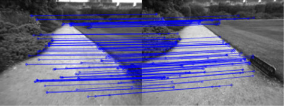
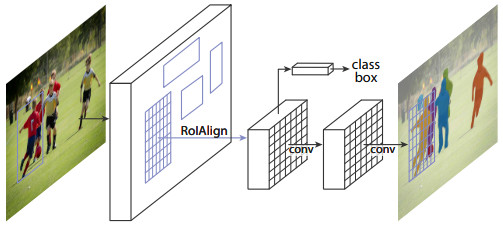
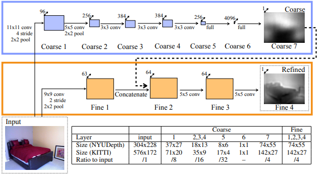

# About This Lecture

이 강의는 로봇학회 여름학교에 참가하신 분들을 대상으로 "Deep Learning based Viusal Odometry and Depth Estimation" (딥러닝 기반 VODE)  라는 주제로 강의를 합니다. 강의순서는 다음과 같습니다. 

1. **Setup and Train First!**: 뭔지 모르지만 일단 설치하고 학습을 돌려봅니다.
2. **Install Prerequisites in Your Brain**: VODE를 이해하기 위한 사전지식을 공부합니다.
   1. What is VODE?
   2. Visual Odometry
   3. Depth Estimation
   4. Pose Representation
3. **Understanding VODE**: SfmLearner 등 최신 VODE 관련 논문을 리뷰합니다.
4. **Crack the Code**: TF 2.0으로 다시 구현한 SfmLearner 코드를 보며 구현 과정을 이해합니다.

# Install Prerequisites in Your Brain

이번 시간에는 VODE를 이해하기 위해 필요한 사전지식을 공부합니다.

## 1 What is VODE?

오늘 공부하려는 내용을 한 문장으로 표현하자면 다음과 같습니다.

> Complementary learning of visual odometry and depth estimation by deep neural network in an unsupervised way
>
> 깊은 신경망에 의한 시각적 위치인식과 깊이 추정의 상호보완적인 비지도 학습

각 키워드의 의미를 알아봅시다.

- Visual odometry (VO): 연속된 영상으로부터 카메라의 자세 변화를 추정하는 기술
- (Monocular) Depth Estimation (DE): 한 장의 영상으로부터 영상의 깊이(depth)를 예측하는 기술이다. 원래 영상의 깊이를 알기 위해서는 스테레오 이미지나 ToF 센서 등을 통해서 측정해야 한다. 하지만 인간이 한 장의 사진에서 대략적인 깊이를 유추할 수 있듯이 딥러닝을 통해 깊이를 직접 학습시킬 수 있다.
- Deep neural network (DNN): VO와 DE를 각각 다른 DNN으로 구현한다.
- Complementary, Unsupervised: VO와 DE를 위한 두 개의 DNN을 **비지도 학습**으로 학습시킬 수 있는 이유는 서로가 **상호보완적**이기 때문이다. Pose와 Depth 두 정보가 있으면 한 장의 영상을 다른 시점에서 찍은 것처럼 **합성(synthesize)** 할 수 있다. VODE 연구는 대부분 이러한 합성이 잘 이루어지도록 학습을 유도한다.

딥러닝 기반 VODE 기술에 대해 자세히 논하기 앞서 저 키워드들이 의미하는 바를 제대로 이해해야 합니다. 이번 시간은 VO와 DE의 역사적 맥락을 짚어보고 VO에서 출력해야 할 자세(pose)의 표현방법에 대해 간단히 알아봅니다.

## 2. Visual Odometry

Visual odometry에서 odometry란 원래 로봇의 움직임을 계산하거나 기록하는 장치란 뜻으로 쓰였습니다. 대표적으로 로봇 바퀴에 달린 인코더(encoder)나 IMU (Inertial Measurement Unit) 등을 이용해 로봇의 자세변화를 계산하거나 장치들이 있습니다.  **Visual Odometry는** 로봇의 자세 변화를 직접적으로 측정할 수 없는 영상을 이용해서 odometry처럼 자세 변화를 추정하는 기술입니다. 비슷한 연구분야로 Visual Simultaneous Localization and Mapping (vSLAM) 기술인데 이는 자세의 변화량을 누적시키는 VO에 전역 지도구축 기술을 더하여 누적되는 위치 오차를 loop closing으로 해소할 수 있는 기술입니다. 아래 그림은 누적된 오차를 loop closing으로 해결한 모습으로 보여줍니다. vSLAM에서 loop closing 기능만 빼면 위치인식 측면에서는 VO와 같아지므로 두 기술이 함께 비교되는 경우가 많습니다.

|  |
| Loop closing 전후의 경로 비교 [1] |

VO/vSLAM 분야는 크게 두 가지 갈래로 연구가 되고 있습니다.

1. Indirect method: 영상에서 keypoint와 descriptor를 이용하여 두 영상 사이에 특징점들을 매칭하고 이를 이용해 영상 사이의 자세변화를 알아내는 방법이다. 매칭된 픽셀들의 이동량을 이용해 상대적인 자세를 계산한다.

   

2. Direct method: 특징점 같은 가공된 데이터를 사용하지 않고 영상의 픽셀 값을 그대로 사용하는 방법이다. A시점의 영상의 어떤 픽셀을 다른 시점 B로 옮겼을 때 A의 픽셀 값과 B의 픽셀값이 같아지도록 하는 상대적인 자세를 계산한다.

Indirect 방식은 먼저 점들을 정확히 매칭시켜놓고 이를 설명할 수 있는 상대 자세를 계산하는 것이고 Direct 방식은 우선 임의의 상대 자세를 이용해 점들을 다른 시점으로 옮겨놓고 옮겨진 점들의 픽셀 값이 다른 시점의 픽셀 값과 같아지도록 상대 자세를 맞춰나가는 방식입니다. 두 방식은 여전히 경쟁을 하고 있고 두 방식 모두 정확도와 속도면에서 상향 평준화 되었기 때문에 어느쪽이 더 좋다고 정할순 없지만 장단점이 있습니다. 

<table>
<colgroup>
<col width="16%" />
<col width="42%" />
<col width="42%" />
</colgroup>
<thead>
<tr class="header">
<th>    </th>
<th>Indirect method</th>
<th>Direct method</th>
</tr>
</thead>
<tbody>
<tr>
<td markdown="span">대표논문</td>
<td markdown="span">ORB-SLAM, ORB-SLAM2</td>
<td markdown="span">LSD-SLAM, DSO</td>
</tr>
<tr>
<td markdown="span">장점</td>
<td markdown="span">상대적으로 노이즈에 강인하고 다른 카메라나 데이터에 쉽게 적용 가능</td>
<td markdown="span">다수의 픽셀을 활용하기 때문에 특징이 부족한 상황에 강인함</td>
</tr>
<tr>
<td markdown="span">단점</td>
<td markdown="span">영상 특징이 부족한 상황에 취약</td>
<td markdown="span">픽셀 노이즈나 rolling shutter, 노출 변화 등에 민감하여 활용 난이도가 높음</td>
</tr>
</tbody>
</table>

### Q) VO에 딥러닝을 써야할까?

두 방식 모두 좋은 성능을 보이고 있는데 굳이 여기에 딥러닝을 갖다 붙여야 할까요? 기존의 전문가 시스템 (either direct or indirect)에서 **수학적 최적화로 정확한 계산**을 하고 있는데 왜 딥러닝을 써야할까요? 이는 마치 덧셈을 딥러닝으로 해결하고자 하는 것과 같습니다.  

제가 보기에는 기존 방식에 치명적인 단점이 있습니다. **구현 난이도**가 지나치게 높다는 것입니다. 논문을 볼 때 주로 성능을 보고 구현 난이도는 간과하기 쉬운 부분이지만 후속 연구를 하거나 그 기술을 응용해서 쓰고 싶은 사람에겐 중요한 점입니다. VO/vSLAM 연구도 이제 꽤 성숙한 단계에 들었기 때문에 성능은 좋아졌지만 그와 비례해서 구현의 난이도가 저세상으로 가버렸습니다. 다음 그림은 ORB-SLAM의 모듈 구성입니다.

저 모듈 하나하나가 논문 주제들인데 저걸 다 높은 수준으로 구현하는 것 뿐만 아니라 multi-thread를 통해 고속으로 처리해야 하는 그 어려운 일을 Raul Mur-Artal 이라는 저자가 해버렸지 말입니다... 외부에서 가져다 쓴 모듈도 많지만 코드를 보면 성능을 올리기 위해 상당히 디테일하게 구현했다는 느낌을 받을 수 있습니다.  

다음은 주요 논문들을 구현한 소스코드의 양을 비교한 표입니다.  

| 논문        | 전체 소스 길이 (lines) | 코드 길이 (lines) |
| ----------- | ---------------------- | ----------------- |
| ORB-SLAM    |                        |                   |
| LSD-SLAM    |                        |                   |
| DSO         |                        |                   |
| Vins-Fusion |                        |                   |

C++의 코드 양이 다른 언어에 비해 좀 많긴 하지만 이건 너무 많고 C++ 언어 자체의 난이도까지 감안하면 진입 장벽이 상당히 높다고 볼 수 있습니다.  

여기서 딥러닝을 써보고 싶은 동기가 생깁니다. 성능이 잘 나올지는 모르겠지만 어쨌건 딥러닝은 아무리 복잡한 과정도 하나의 네트워크로 해결하는 마법을 부리고 많은 경우 성능도 괜찮은 수준으로 나오기 때문입니다. Image Segmentation을 예로 들어보겠습니다. 

요즘은 segmentation은 딥러닝으로 하는게 상식이지만 딥러닝이 유행하기 전에 유명했던 논문으로 "Contour Detection and Hierarchical Image Segmentation"(TPAMI, 2010)이 있습니다. 그 논문을 보면 segmentation결과를 만들기 위해 거쳐야 하는 중간 단계가 수십가지나 됩니다. 논문을 보면서 저자의 장인정신에 감동~~보다는 소름~~이 느껴졌던 기억이 납니다.

|  |
|  |
| Contour Detection and Hierarchical Image Segmentation |

하지만 요즘은 Mask-RCNN 등 DNN 하나로 끝나는 세상입니다. 딥러닝을 활용한 연구가 쉬운건 아니지만 예전에 한땀한땀 손으로 빚어가던 시절보다는 수월하게 좋은 성능을 낼 수 있게 됐습니다.   

|  |
| Mask R-CNN |

다시 VO로 돌아가보면 상황이 비슷합니다. 다만 차이가 있다면 semantic segmentation이 전문가 시스템으로는 성능에 한계가 뚜렷했던 반면 VO는 이미 전문가 시스템으로 좋은 성능을 내고 있다는 것입니다. 결론부터 말하면 아직까지는 VO에서는 전문가 시스템이 더 좋은 성능을 내고 있습니다. 하지만 그렇기 때문에 연구할 가치가 있는 것이고 연구가 오래되지 않았으므로 앞으로 성능은 개선될 여지가 많을 것입니다.

## 3. (Monocular) Depth Estimation

"Single image (or monocular) depth estimation (or depth prediction)"로 검색할 수 있는 이 분야는 한장의 이미지로부터 영상의 깊이를 추정하는 기술입니다. 여기에 수학적 근거는 없고 semantic segmentation을 학습하듯 입력과 출력을 기계적으로 학습시키는 것 뿐입니다. 그래서 VO와는 다르게 DE에서는 딥러닝을 사용하는 것이 자연스러워 보입니다.  

예전에 딥러닝이 유행하기 전에 Andrew Ng의 "Learning Depth from Single Monocular Images" (NIPS, 2006)를 본적이 있는데 영상에서 hand craft feature를 만들어서 실제 depth와 단순히 linear regression을 했습니다. (물론 논문엔 더 많은 내용이 있습니다.)   

### 3.1 Supervised Deep Learning Approach

이후 딥러닝이 유행하면서 딥러닝의 풍부한 convolution feature를 활용한 논문들이 나옵니다. 대표적으로 흔히 'Eigen'이라 불리는 "Depth Map Prediction from a Single Image
using a Multi-Scale Deep Network" (NIPS, 2014) 입니다. 아래 그림처럼 global course level depth를 만드는 네트워크와 local fine level depth를 만드는 네트워크 두 가지를 학습시켜 최종적인 depth map을 만듭니다. 어쨌든 이 논문은 RGB 영상을 입력했을 때 데이터셋의 ground truth depth가 나오도록 DNN 모델을 지도 학습(supervised learning)한 것입니다. 

논문의 인용수가 구글에서 보면 천건이 넘습니다. 이 논문이 유명한 이유는 (아마) 최초로 딥러닝을 활용한 DE를 구현한 상징성도 있지만 이후 논문에서 마르고 닳도록 사용되는 **성능 평가방법**을 제안했기 때문입니다. 이후 모든 논문들이 "Eigen" 논문과 동일한 방식으로 성능을 평가하고 있습니다. 심지어 학습 데이터와 평가 데이터를 나누는 방식까지 "Eigen split"이라 부르며 따라하고 있습니다. 다음은 CVPR 2018에 나온 GeoNet 논문의 성능 테이블입니다. 맨위에 "Eigen"부터 시작하여 많은 논문들이 같은 기준으로 평가된 것을 볼 수 있습니다.  

### 3.2 Unsupervised Deep Learning Approach

"Eigen"에서 한 단계 더 나아가 비지도학습으로 depth를 학습하는 논문이 나옵니다. 논문 제목은 "Unsupervised Monocular Depth Estimation with Left-Right Consistency" (CVPR, 2017), 줄여서 **monoDepth**라고 부릅니다. 이 논문은 다음과 같은 원리를 이용합니다.

1. 스테레오 카메라에서 카메라 사이의 상대 자세를 알고 
2. depth혹은 disparity를 알 수 있다면
3. 오른쪽 시점의 이미지를 왼쪽 이미지로부터 재구성(reconstruct) 할 수 있다.

monoDepth의 학습 목표는 오른쪽 이미지를 재구성 하는 것이 아니라 **오른쪽 이미지를 재구성 할 수 있는 depth를 학습**하는 것입니다. 구하기 어려운 GT depth가 필요없고 비교적 구하기 쉬운 스테레오 이미지만 있으면 depth를 학습할 수 있기 때문에 학습을 더 쉽게 할 수 있습니다.

DNN 구조는 아래와 같이 좁아졌다 넓어지는 Encoder-Decoder 구조로 되어있고 왼쪽 이미지($$I^l$$)로부터 두 개의 disparity map을 만듭니다. (**left-to-right disparity ($$d^r$$), right-to-left disparity ($$d^l$$)**)  Disparity map으로 두 이미지를 반대쪽 시점으로 재구성하여 반대쪽 시점의 이미지와 같아지도록 DNN을 학습시키는 것입니다. 재구성한 이미지와 원래 이미지 사이의 차이를 **photometric loss**라고 하는데 이 loss가 이후 오늘 공부할 VODE 논문의 주요 loss가 됩니다.

Monocular Depth Estimation은 아직 세밀한 정확도는 부족하기 때문에 LiDAR를 완전히 대체하긴 어렵지만 대략적인 depth라도 있다면 위치인식에 도움을 줄 수 있고 자동차가 아닌 로봇의 경우 판단오차가 치명적이지 않으므로 장애물 회피 등에 사용될 수 있습니다.  

---

오늘 배울 VODE는 VO와 DE를 동시에 학습하는 것인데 monoDepth 처럼 스테레오 이미지 없이 단안 카메라의 연속 프레임만 가지고도 VO와 DE를 동시에 학습할 수 있는 기술입니다. 어느쪽을 주 목표로 하던 따로 학습하는 것보다는 동시에 학습하는 것이 성능이 좋기 때문에 대부분의 논문들이 이런 흐름으로 가고 있습니다.

## 4. Pose Representation

VO를 학습을 통해 해결할 수 있다고 했는데 VO-DNN의 출력은 어떻게 나와야 할까요? 두 프레임 사이의 상대적인 자세를 어떻게 표현해야 할까요?

참고자료

1. https://www.researchgate.net/figure/Loop-closing-example-Ho-and-Newman-2007-a-A-snapshot-of-a-SLAM-just-before-loop_fig9_311948486