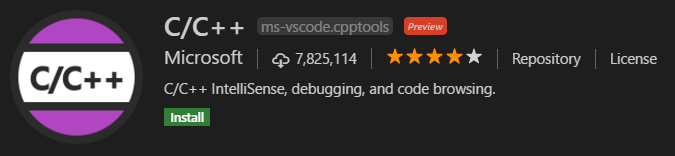

# Visual Studio Code 환경세팅 (C++)


개인적으로 Visual Studio 싫어하기 때문에 그동안 크로스 플랫폼을 지원하는 IDE인 QtCreator를 쓰다가 이제서야 Visual Studio Code (vscode)를 써보기로 했다. Atom이나 Sublime Text처럼 컴파일러 없이 Editing 기능 위주로 되어있고 리눅스에서 설치되고 gcc를 사용할 수 있고 이제는 vscode가 주류가 된지 한참 됐기 때문에 나도 흐름을 따라 보려고 한다.  

여기서는 우분투 18.04를 기준으로 vscode의 설치부터 개발 환경 세팅 하는 과정을 설명하고자 한다.


## 1. Installation

### 1.1 vscode 설치

```
# gcc/g++ 설치
$ sudo apt install build-essential
# 설치
$ sudo snap install code --classic
# 삭제
$ sudo snap remove code
# 실행
$ code
```

vscode를 실행하면 왼쪽에 이런 버튼들이 있다. 버튼에 따라 왼쪽 패널의 내용이 전환된다. 여기 다섯 개의 화면을 잘 알아야 vscode를 잘 쓸 수 있다.


- Explorer (`Ctrl+Shift+E`): 프로젝트 디렉토리 내부의 파일들을 보여준다.
- Search (`Ctrl+Shift+F`): 프로젝트에서 특정 키워드를 찾거나 교체(replace)할 수 있다.
- Source Control (`Ctrl+Shift+G`): Git과 같은 버전관리 시스템을 GUI로 사용할 수 있다.
- Debug and Run (`Ctrl+Shift+D`): 디버깅 모드로 실행한다.
- Extensions (`Ctrl+Shift+X`): 확장 플러그인들을 검색하고 설치할 수 있다.


### 1.2 C/C++ Extension 설치

vscode는 거의 모든 프로그래밍 언어를 개발할 수 있는 플랫폼 역할을 하고 이 위에 수많은 확장 플러그인(extensions)들이 있다. 특정 언어를 사용하기 위해서는 그에 맞는 플러그인을 설치해야 한다. C/C++을 사용하기 위해서는 `C/C++` 확장을 설치해야 한다.  

오른쪽 [Extensions] 버튼을 누르고 `C/C++`을 검색 후 녹색 [install] 버튼을 눌러 설치한다.




## 2. Configuration

vscode는 대부분의 설정을 UI가 아닌 JSON 파일로 관리한다. [File]-[Settings]-[Preferences] (`Ctrl+Comma`)에서 UI를 이용해 전반적인 설정을 바꿀수도 있지만 이것 또한 JSON 파일로 대체 가능하다. 아무래도 사용자들이 프로그래머다보니 텍스트 설정에 거부감이 없고 또한 만들어진 설정을 다른 사람과 공유할 수 있다는 장점이 있다.

### 2.1 프로젝트 생성

[File] - [Open Folder]를 눌러 새로운 프로젝트 디렉토리(여기선 "code"란 디렉토리)를 연다.  

[Explorer] 창에서 src 디렉토리를 만들고 그 아래 hello.cpp 파일을 만든다. 아래 그림에서 마우스가 가리키는 아이콘이 [New File]이고 그 옆이 [New Folder]다.


**hello.cpp** 파일은 다음과 같이 작성한다.

```cpp
#include <iostream>
int main()
{
    std::cout << "Hello code" << std::endl;
    return 0;
}
```

참고로 vscode에서 Folder와 Workspace의 차이는 [이 글](<vscode에서 workspace의 개념: <https://stackoverflow.com/a/57134632>>)을 참고하기 바란다. 간단히 말하면 하나의 폴더 아래서 모든 작업을 할 때는 [Open Folder]로 열면 되고 여러개의 루트 폴더가 있는 경우에는 워크스페이스를 만들어야 한다.


### 2.2 빌드 및 실행 설정

vscode는 특정 언어를 위해 만들어진게 아니라 범용 편집기이기 때문에 코드만 짠다고 바로 돌릴순 없다. 코드를 빌드할 컴파일러와 옵션을 지정해줘야 한다. 이를 위해 tasks.json 파일을 작성한다.

[Terminal] - [Configure Default Build Task]를 누르면 현재 작성중인 언어에 맞춰서 tasks.json의 기본 템플릿을 고를 수 있다. 혹은 그냥 빌드 명령어인 `Ctrl+Shift+B`를 눌러도 된다. 옵션 중에 [C/C++: g++ build active file]을 선택한다. g++ 컴파일러를 이용해 빌드 명령시 선택한 파일(active file)을 빌드하는 설정을 하는 것이다. 기본 템플릿은 다음과 같다.

```json
{
    // See https://go.microsoft.com/fwlink/?LinkId=733558 
    // for the documentation about the tasks.json format
    "version": "2.0.0",
    "tasks": [
        {
            "type": "shell",
            "label": "g++ build active file",
            "command": "/usr/bin/g++",
            "args": [
                "-g",
                "${file}",
                "-o",
                "${fileDirname}/${fileBasenameNoExtension}"
            ],
            "options": {
                "cwd": "/usr/bin"
            },
            "problemMatcher": [
                "$gcc"
            ],
            "group": {
                "kind": "build",
                "isDefault": true
            }
        }
    ]
}
```

- type: `shell` or `process`. `shell` 이면 "command"를 쉘 명령어로서 실행, `process`면 프로세스 실행?
- label: 작업의 이름, 빌드 단축기 Ctrl+Shift+B 를 눌렀을 때 선택할 이름
- command: 빌드를 실행할 컴파일러
- args: `command`의 인자
- cwd (Current Working Directory): ~~뭔진 잘 모르겠다.~~
- presentation: 실행했을 때 출력을 어떻게 보여줄지를 설정, 자세한 내용은 [Output behaviour](<https://code.visualstudio.com/docs/editor/tasks#_output-behavior>) 참조
- problemMatcher: Warning이나 Error 문을 보여주는 형식 지정, 자세한 내용은 [Defining a problem matcher](<https://code.visualstudio.com/docs/editor/tasks#_defining-a-problem-matcher>) 참조
- group: `build` or `test`. `build`면 [Run build task] (`Ctrl+Shift+B`) 실행시 해당 task가 실행되고 `test`면 실행 명령을 내렸을 때 해당 task가 실행된다. `"isDefault": true`를 설정하면 빌드시 빌드 옵션을 선택하지 않고 바로 이 task를 실행한다.

기본 템플릿을 다음과 같이 수정하였다.

```json
{
    "version": "2.0.0",
    "tasks": [
        {
            "type": "shell",
            "label": "g++ build active file",
            "command": "/usr/bin/g++",
            "args": [
                "-g",
                "${file}",
                "-o",
                "${workspaceFolder}/bin/${fileBasenameNoExtension}"
            ],
            "problemMatcher": {
                "fileLocation": [
                    "relative",
                    "${workspaceFolder}"
                ],
                "pattern": {
                    "regexp": "^(.*):(\\d+):(\\d+):\\s+(warning|error):\\s+(.*)$",
                    "file": 1,
                    "line": 2,
                    "column": 3,
                    "severity": 4,
                    "message": 5
                }
            },
            "group": {
                "kind": "build",
                "isDefault": true
            }
        },

        {
            "type": "shell",
            "label": "execute",
            "command": "cd ${workspaceFolder}/bin && ./${fileBasenameNoExtension}",
            "group": {
                "kind": "test",
                "isDefault": true
            }
        },
    ]
}
```

기본 템플릿에서 달라진 점은 `problemMatcher`를 세부 설정한 것과 빌드된 실행파일에 대한 실행 task를 추가한 것이다. `command`가 프로젝트 경로로 이동해 빌드시 만든 실행 파일(`${fileBasenameNoExtension}`)을 실행한다. `group`을 `test`로 했기 때문에 아래 task는 vscode에서 실행 명령을 내릴때 실행된다.  

또 하나는 실행 파일 생성 경로를  소스 파일이 있는 곳이 아닌 `${workspaceFolder}/bin`로 지정한 것이다. 실행 파일과 소스 파일을 분리하기 위한 것인데 그냥 이대로 빌드하면 `${workspaceFolder}/bin` 경로가 없어서 에러가 나므로 **프로젝트 경로에 `bin` 디렉토리를 만들어줘야 한다.**

**[참고자료]** <https://yjcode.tistory.com/1>

#### 수정

여기 나온 tasks.json은 `command` 부분은 빼고 나머지만 참고하면 될것 같다. 그 이유는 아래 **3. CMake**에서 확인할 수 있다.


### 2.3 단축키 설정

빌드 단축키는 `Ctrl+Shift+B` 로 지정되어 있지만 실행 단축키가 없다. 빌드 키도 세 개를 눌러야해서 좀 불편하므로 빌드와 실행에 관한 단축키를 지정해보자.  

[File] - [Preferences] - [Keyboard Shortcuts] 메뉴로 들어가면 vscode의 모든 단축키를 보고 수정할 수 있다. 여기서 특정 작업을 더블 클릭하면 단축키 입력 창이 나오고 특정 키 조합을 누르면 단축키로 저장이 된다.  

하지만 이걸 일일이 찾아서 바꾸는 것도 번거롭기 때문에 이것도 역시 json으로 설정하는 것이 편하다. 오른쪽 위에 **Open Keyboard Shortcuts (JSON)** 버튼이 있다. 누르면 사용자가 추가 설정할 수 있는 keybindings.json 파일이 열린다. 혹은 [Command Palette] (`Ctrl+Shift+B`) - [Preferences: Open Keyboard Shortcuts (JSON)]를 선택해도 된다.  keybindings.json을 다음과 같이 채우고 저장한다. 이 파일은 프로젝트 디렉토리에 저장되지 않고 vscode 전역 설정으로 저장된다.

```json
// Place your key bindings in this file to override the defaults
[
    // build
    {
        "key": "ctrl+b",
        "command": "workbench.action.tasks.build", 
    },
    // run
    {
        "key": "ctrl+r",
        "command": "workbench.action.tasks.test", 
    },
    // replace keys for overlapping tasks
    {
        "key": "ctrl+shift+b",
        "command": "workbench.action.toggleSidebarVisibility"
    },
    {
        "key": "ctrl+shift+r",
        "command": "workbench.action.openRecent"
    },
]
```

`Ctrl+B`로 빌드를 하고 `Ctrl+R`로 실행을 하도록 설정했다. 그리고 기존에 그 단축키를 쓰던 다른 작업의 단축키를 겹치지 않게 다른걸로 수정했다.

단축키를 이용해 빌드 후 실행한 결과다. 아래쪽 터미널 창을 보면 "Hello code"가 뜨면서 정상작동 됐음을 볼 수 있다.


### 2.4 C/C++ 언어 설정

C/C++ 언어만을 위한 설정은 `c_cpp_properties.json`에서 관리한다. [Command Palette] (`Ctrl+Shift+P`) - [C/C++: Edit Configuration]을 검색하면 (UI)와 (JSON) 두 가지 옵션이 뜬다. (JSON)을 선택하면 바로 JSON 파일을 편집 할 수 있지만 (UI)를 선택하면 UI를 통해 마우스 클릭으로 선택가능 한 옵션을 보고 선택할 수 있다. (UI)를 선택해보자.


설정은 다음과 같이 한다.

- Configuration name: linux (기본값)
- Compiler path: /usr/bin/g++ (변경)
- IntelliSense mode: gcc-x64 (변경)
- Include path: ${workspaceFolder}/** (기본값)
- C++ standard: c++17 (기본값)

이와 같이 설정하고 따로 저장하는 버튼은 없고 그냥 설정 창을 닫으면 설정 내용이 `c_cpp_properties.json` 파일로 저장된다. 생성된 파일은 다음과 같다. 그냥 JSON 파일 바로 열어서 아래 내용을 붙여넣어도 된다.

```json
{
    "configurations": [
        {
            "name": "Linux",
            "includePath": [
                "${workspaceFolder}/**"
            ],
            "defines": [],
            "compilerPath": "/usr/bin/g++",
            "cStandard": "c11",
            "cppStandard": "c++17",
            "intelliSenseMode": "gcc-x64"
        }
    ],
    "version": 4
}
```

여기서 눈여겨 봐야할 것은 **includePath**다. 헤더 파일을 검색할 경로를 지정하는 곳이다. 경로 뒤에 `/**`가 붙어있으면 해당 경로 아래의 모든 디렉토리를 재귀적으로 검색해준다는 뜻이다. 다른 곳의 헤더 파일을 가져다 쓸 경우 여기에 추가하면 된다. 그리고 **cppStandard**도 사용하고자 하는 C++ 버전을 지정할 수 있는 유용한 설정이다.


### 2.5 디버깅

프로그래밍을 하다보면 에러나 버그를 잡기 위해 디버깅을 쓸 때가 많다. vscode는 디버깅 환경을 제공한다. 디버깅을 실습해보기 위한 간단한 코드를 새로 작성해보자. 다음 코드를 `src` 폴더 아래 `testdbg.cpp`로 저장한다.

```cpp
#include <iostream>
using namespace std;

int main()
{
    int a = 2;
    int b = a + 2;
    cout << a << " + " << 2 << " = " << b << endl;
    return 0;
}
```

아래 그림처럼 8번 라인 옆을 클릭하면 빨간 점이 찍힌다. 디버깅 모드에서 코드를 정지시킬 break point다.


**디버깅 실행 명령키는 F5** 다. `F5`를 눌러서 커맨드 팔레트가 뜨면 [C++ (GDB/LLDB)] - [g++ build and debug active file]을 선택한다. 그러면 다음과 같은 launch.json 파일이 생긴다. 아니면 [Command Palette] (`Ctrl+Shift+P`) - [Debug: open launch.json]을 선택해도 파일을 열 수 있다. 파일 내용을 아래와 같이 수정한다. 기본 템플릿에서 `program`이 지정하는 실행 파일 경로를 수정하였다.

```json
{
    // Use IntelliSense to learn about possible attributes.
    // Hover to view descriptions of existing attributes.
    // For more information, visit: https://go.microsoft.com/fwlink/?linkid=830387
    "version": "0.2.0",
    "configurations": [
        {
            "name": "g++ build and debug active file",
            "type": "cppdbg",
            "request": "launch",
            "program": "${workspaceFolder}/bin/${fileBasenameNoExtension}",
            "args": [],
            "stopAtEntry": false,
            "cwd": "${workspaceFolder}",
            "environment": [],
            "externalConsole": false,
            "MIMode": "gdb",
            "setupCommands": [
                {
                    "description": "Enable pretty-printing for gdb",
                    "text": "-enable-pretty-printing",
                    "ignoreFailures": true
                }
            ],
            "preLaunchTask": "g++ build active file",
            "miDebuggerPath": "/usr/bin/gdb"
        }
    ]
}
```

launch.json을 저장 후 다시 `F5`를 누르면 이제 디버깅이 시작된다. break point에 멈춰서 그곳의 변수 값들을 보여주고 디버깅 진행을 제어할 수 있는 툴바 버튼들도 뜬다.


오른쪽에 보이는 **WATCH** 패널에서 보고 싶은 변수를 추가해서 볼 수 있다.

**[참고자료]**  

<https://webnautes.tistory.com/1158>  

<https://yjcode.tistory.com/3>  


## 3. CMake

다른 블로그들을 참조하여 **2. Configuration**을 작성했는데 계속 vscode를 공부하다보니 위에서 만든 tasks.json은 완전 헛짓거리다. 빌드 커맨드가 g++을 직접 사용하기 때문에 cpp 파일을 하나밖에 빌드할 수 없다. 소스 파일이 다수가 되면 tasks.json에서 어떻게 빌드한단 말인가? vscode 설정 방법을 검색해보면 다 저렇게 나오는데 나도 속을 뻔했다. (그렇지만 **2. Configuration**에서 쓴 내용은 command 설정만 빼고 나머진 유효하다.)

다수의 소스 파일을 빌드하기 위해서는 최소한 Make가, 좀 더 수월하게 하려면 CMake까지 필요하다. vscode가 Visual Studio처럼 빌드 도구까지 제공하진 않는거다. 그래서 다시 vscode에서 CMake를 활용하여 빌드하는 방법을 정리하고자 한다.


### 3.1 CMake Extension 설치

[Extensions] (`Ctrl+Shift+X`)에서 CMake 관련 확장 두 가지를 설치해보자.

#### CMake

`CMakeLists.txt` 작성시 CMake 매크로 등을 자동완성 시켜주는 툴이다.


#### CMake Tools

vscode에서 cmake 관련 기능을 추가하는 툴이다. 설치하면 왼쪽에 [Extensions] 패널 버튼 아래 [CMake] 패널 버튼이 생기고 그곳에서 configure나 build를 할 수 있다.


### 3.2 프로젝트 만들기

[File]-[Open Folder]로 CMake를 사용하는 새로운 디렉토리를 열어보자. 여기서는 code_cmake 란 이름으로 만들었다. src/hello.cpp 와 CMakeLists.txt 를 만들고 다음과 같이 작성하였다.


**hello.cpp**

```cpp
#include <iostream>
int main()
{
    std::cout << "Hello CMake in code" << std::endl;
    return 0;
}
```

**CMakeLists.txt**

```cmake
cmake_minimum_required(VERSION 3.0)
project(hello)
set(CMAKE_CXX_COMPILER g++)
set(SOURCES src/hello.cpp)
add_executable(${PROJECT_NAME} ${SOURCES})
```


### 3.3 Configure and Build

Configure는 CMake를 실행하여 Makefile을 만드는 과정이다. [Command Palette] (`Ctrl+Shift+P`) - [CMake: Configure]를 선택하던지 왼쪽의 [CMake] 패널을 열어 상단의 [Configure] 버튼을 눌러도 된다. 


[Configure]를 처음 실행하면 아래와 같이 컴파일러를 고르라고 하는데 비슷한 것들이 많아 뭐가 다른건지 헷갈렸다. 기본 `g++`이 있는데 `c++`도 있고 `g++-7`도 따로 있다.


그래서 터미널을 열어 확인해봤다. 결론은 **g++ == g++-7 == c++** 이다. 셋 중 아무거나 골라도 된다. 위 옵션 중에서는 첫 번째인 [GCC 7.4.0]을 골랐다. gcc와 g++의 차이는 [여기](<https://www.freelancinggig.com/blog/2017/11/10/difference-gcc-g/>)를 참고하길 바란다.

```
ian@ian:~$ ll /usr/bin/*+
lrwxrwxrwx 1 root root    21  9월  4 22:07 /usr/bin/c++ -> /etc/alternatives/c++*
lrwxrwxrwx 1 root root     5  5월 21  2019 /usr/bin/g++ -> g++-7*
...
ian@ian:~$ ll /etc/alternatives/*+
lrwxrwxrwx 1 root root 12  9월  4 22:07 /etc/alternatives/c++ -> /usr/bin/g++*
```

어쨌든 Configure를 하면 build 폴더가 생기고 CMake 관련 파일들이 생긴다.  

Configure를 하고 나면 Build를 할 수 있다. 빌드 실행은 세 가지 방법이 있다.

1. `F7`
2. [Command Palette] (`Ctrl+Shift+P`) - [CMake: Build] 선택
3. 왼쪽 CMake 패널 상단의 [Build] 버튼 클릭

간단히 `F7`을 눌러 빌드하면 실행파일이 생성된다. 사실 **Configure를 하지 않고 빌드(F7)를 해도 알아서 Configure를 하고 Build까지 해준다.**


### 3.4 Run task

빌드로 만들어진 실행 파일은 [Command Palette] (`Ctrl+Shift+P`) - [CMake: Run Without Debugging] 혹은 `Shift+F5`로 실행할 수 있다. 아래 TERMINAL 패널에 다음과 같은 결과가 나온다.

```
ian@ian:~/workspace/code_cmake$ /home/ian/workspace/code_cmake/build/hello
Hello CMake in code
```

그냥 TERMINAL 패널에서 직접 실행해도 된다.

```
ian@ian:~/workspace/code_cmake$ cd build/
ian@ian:~/workspace/code_cmake/build$ ./hello 
Hello CMake in code
```


### 3.5 Build Type 설정

빌드 타입(Build Type)은 크게 **Debug** (디버깅 타입)와 **Release** (배포 타입) 두 가지가 있는데 Debug 타입으로 빌드하면 컴파일러가 프로그램을 전혀 최적화하지 않고 코드를 그대로 기계어로 번역해주고 Release 타입으로 빌드하면 여러가지 최적화와 꼼수 등을 동원해서 프로그램이 같은 동작을 더 빨리 할 수 있게 빌드 한다. 

빌드 타입 설정은 원래 CMakeLists.txt 에서 설정할 수 있다. 아래 줄을 중간에 추가하면 Release 타입을 선택할 수 있다.

```cmake
set(CMAKE_BUILD_TYPE Release)
```

그런데 이렇게 하고 `Shift+F5`로 프로그램을 실행하려 했더니 아래와 같은 메시지만 뜨고 실행이 되지 않는다.

```
[cms-driver] Found no matching code model for the current build type. This shouldn't be possible
[cms-driver] Found no matching code model for the current build type. This shouldn't be possible
[cms-driver] Found no matching code model for the current build type. This shouldn't be possible
```

구글링을 좀 해보니 만들어진 실행파일이 CMake Tools에서 기대했던 빌드 타입이 아니라서 실행이 안된단다. 즉 기본적으로 Debug 타입을 예상하고 있는데 Release 타입의 실행 파일이 있어서 문제가 생긴것 같다.  

CMake Tools에서는 *CMake Variants*라는 개념이 있는데 Configure 하기 전에 사전에 지정해서 선택할 수 있는 빌드 옵션? 같은 무엇이다(;;) CMake Variant에 대한 자세한 내용은 [여기](<https://vector-of-bool.github.io/docs/vscode-cmake-tools/variants.html>)를 참고한다. 여기서 중요한건 CMake Variants에서 미리 빌드 타입을 지정해 놓았기 때문에 그와 다른 빌드 타입을 `CMakeLists.txt`에 지정하면 `CMakeLists.txt`에서 지정한 타입대로 빌드는 되지만 단축키(`Shift+F5`)로 실행할 수는 없다. (TERMINAL에서 실행은 된다.)

그냥 `CMakeLists.txt`에서 `CMAKE_BUILD_TYPE`을 설정하지 않으면 CMake Variants의 기본 설정대로 Debug 타입으로 빌드가 되고 단축키로 실행도 잘 된다. *하지만* Debug 타입은 정말 디버깅 할때나 쓰는거지 일반적인 작업을 할 때는 Release 타입으로 하는 것이 속도가 빨라서 결과를 더 빨리 확인할 수 있다. 일단 빌드 타입을 확인할 수 있게 `CMakeLists.txt`를 다음과 같이 수정한다. 빌드 타입 설정은 일단은 주석처리 해놓는다.

```
cmake_minimum_required(VERSION 3.0)
project(hello)
set(CMAKE_CXX_COMPILER g++)
# set(CMAKE_BUILD_TYPE Release)
message("build type: " ${CMAKE_BUILD_TYPE})
set(SOURCES src/hello.cpp)
add_executable(${PROJECT_NAME} ${SOURCES})
```

수정 후 Configure를 해보면 OUTPUT 패널에 다음과 같이 뜬다. 현재는 디버그 타입으로 설정된 것을 볼 수 있다.

```
[cmake] build type: Debug
[cmake] Configuring done
[cmake] Generating done
```

CMake Variants의 설정을 바꾸려면 커맨드 팔레트(`Ctrl+Shift+P`) -> `CMake: Select Variant`를 선택하면 네 가지 옵션이 나온다: Debug, Release, MinSizeRel, RelWithDebInfo   

이중에 Release를 선택하고 다시 Configure를 해보면 이제 빌드 타입이 바뀐것을 볼 수 있다.

```
[cmake] build type: Release
[cmake] Configuring done
[cmake] Generating done
```

CMake Variants에서 Release를 선택하고 나면 `CMakeLists.txt`에 빌드 타입 설정의 주석을 풀어도 단축키로 프로그램 실행이 잘된다.

**[참고자료]** CMake Variants: <https://vector-of-bool.github.io/docs/vscode-cmake-tools/variants.html>


### 3.6 CMake Tools Configuration

어디선가 오픈소스를 받아서 CMake로 빌드할때 cmake 명령어에 `-DVAR_NAME=VALUE` 형식의 옵션들을 여러개 붙이는 경우가 많다. CMake 설정에 옵션들이 존재할 때 CMake Tool에서 이 옵션들을 선택하려면 `settings.json`에서 **cmake.configureSettings**를 수정해야 한다.  

[File] - [Preferences] - [Settings] - [Extenstions] - [CMake Tools Configurations]에 가면 CMake에 대한 많은 설정을 할 수 있다. 하지만 UI에서 원하는 설정을 찾는 것도 어려운 일이고 그냥 JSON 파일을 여는 것이 낫다. [Command Palette] (`Ctrl+Shift+P`) - [Preferences: Open Settings (JSON)]을 선택하면 settings.json 파일이 열린다.

여기에 CMake 관련한 설정을 추가하면 되는데 설정할 수 있는 변수 목록은 [여기](<https://vector-of-bool.github.io/docs/vscode-cmake-tools/settings.html>)에서 확인할 수 있다.  

예를 들어 빌드 디렉토리를 프로젝트 내부에 두지 않고 프로젝트 디렉토리 옆에 build-hello 란 디렉토리를 쓰고 싶다면 다음 줄을 추가한다.

```
{
	...
	"cmake.buildDirectory" : "${workspaceRoot}/../build-hello"
}
```

CMake 변수들은 `"cmake.configureSettings"` 아래서 지정할 수 있다. 다음은 [다른 블로그](https://booiljung.github.io/technical_articles/c_language/build_cmake_in_vscode_on_linux.html)에서 가져온 librealsense2를 빌드하는 옵션을 지정한 예시다.

```
{
	...
	"cmake.configureSettings": {
        "BUILD_CSHARP_BINDINGS" : true,
        "BUILD_CV_EXAMPLES" : false,
        "BUILD_CV_KINFU_EXAMPLE" : false,
        "BUILD_EXAMPLES" : true,
        "BUILD_GRAPHICAL_EXAMPLES" : true,
        "BUILD_UNITY_BINDINGS" : true,
        "BUILD_EASYLOGGINGPP" : true,
        "BUILD_WITH_TM2" : false,
        "DOTNET_VERSION_EXAMPLES" : "4.5",
        "DOTNET_VERSION_LIBRARY" : "4.5",
        "GLFW_BUILD_DOCS" : true,
        "GLFW_BUILD_EXAMPLES" : true,
        "GLFW_BUILD_TESTS" : true,
        "GLFW_INSTALL" : true,
        "GLFW_USE_HYBRID_HPG" : true,
        "GLFW_VULKAN_STATIC" : false,
        "OpenCV_DIR" : "C:/usr/opencv.4.1.debug",
        "UNITY_PATH" : "C:/Program Files/Unity/Editor/Unity.exe",
        "USE_MSVC_RUNTIME_LIBRARY_DLL" : true,
    },
    ...
}
```

**[참고자료]** Configuring CMake Tools: <https://vector-of-bool.github.io/docs/vscode-cmake-tools/settings.html>  


### 3.7 CMake Tools를 쓰지 않는 방법

**2. Configuration**에서 했던 것처럼 tasks.json을 만들어 vscode 자체의 빌드와 실행과정에서 CMake 명령어를 실행하도록 해도 된다. [Terminal] - [Configure Default Build Task] - [Others]를 선택하여 tasks.json를 아래와 같이 작성하자. **2.2**에서 만든것과 거의 같고 `command`만 수정하였다. `command` 내용을 보면 build 디렉토리를 만들어서 그곳에서 cmake와 make를 실행하는 간단한 내용이다.

```json
{
    "version": "2.0.0",
    "tasks": [
        {
            "type": "shell",
            "label": "cmake and make build",
            // command 에서 cmake와 make 사용
            "command": "mkdir -p build && cd build && cmake .. && make",
            // arg는 필요 없고 이 아래는 2.2와 똑같음
            "problemMatcher": {
                "fileLocation": [
                    "relative",
                    "${workspaceFolder}"
                ],
                "pattern": {
                    "regexp": "^(.*):(\\d+):(\\d+):\\s+(warning|error):\\s+(.*)$",
                    "file": 1,
                    "line": 2,
                    "column": 3,
                    "severity": 4,
                    "message": 5
                }
            },
            "group": {
                "kind": "build",
                "isDefault": true
            }
        },

        {
            "type": "shell",
            "label": "execute",
            // 어차피 hello라는 실행 파일이 나올 것이므로 실행파일 직접 지정
            "command": "cd ${workspaceFolder}/build && ./hello",
            "group": {
                "kind": "test",
                "isDefault": true
            }
        },
    ]
}
```

이제 CMake Tool의 영향을 전혀 받지 않고 순수하게 시스템의 CMake를 활용하므로 모든 설정을 CMakeLists.txt 안에서 하면 된다.

```cmake
cmake_minimum_required(VERSION 3.0)
project(hello)
set(CMAKE_CXX_COMPILER g++)
set(CMAKE_BUILD_TYPE Release)
set(SOURCES src/hello.cpp)
add_executable(${PROJECT_NAME} ${SOURCES})
```

**2.3 단축키 설정**에서 단축키를 설정해놨다면 `Ctrl+B`로 빌드가 되고 `Ctrl+R`로 실행이 될 것이다. 앞서 **3.3~3.4**에서 설정했던 것 보다 훨씬 더 간단하다. 옵션이 많은 복잡한 프로젝트의 경우엔 `command`에 옵션 인자를 추가하거나 `CMakeCache.txt`를 수정해야 할것 같다.

**[참고자료]** <https://webnautes.tistory.com/933>


## 4. Docker 원격 코딩

도커(Docker)가 무엇이고 어떻게 쓰는지는 다음 링크들을 참고하길 바란다. 꼭 다음 개념들이 무엇이고 어떤 역할을 하는지 알고 넘어가야 한다: **Docker, docker image, docker container, Dockerfile, docker-compose, docker-compose.yaml**

- 도커 컴포즈를 활용하여 완벽한 개발 환경 구성하기: <https://www.44bits.io/ko/post/almost-perfect-development-environment-with-docker-and-docker-compose>
- Docker with GUI Tutorial (내가 쓴것): <https://goodgodgd.github.io/ian-flow/archivers/docker-tutorial>
- Docker 설치: <https://docs.docker.com/v17.09/engine/installation/linux/docker-ce/ubuntu/>
- Docker-compose 설치: <https://docs.docker.com/compose/install/>

아래는 Dockerfile이나 docker-compose.yaml 을 직접 작성할 때 필요한 링크다.

- Dockerfile 작성방법1: <https://docs.docker.com/develop/develop-images/dockerfile_best-practices/>
- Dockerfile 작성방법2: <https://docs.docker.com/engine/reference/builder>
- docker-compose.yaml 작성방법: <https://docs.docker.com/compose/compose-file/#compose-file-structure-and-examples>

도커는 주로 웹 개발하는 분들이 많이 쓰는데 나 같은 경우에는 C++ 프로젝트를 개발할 때 필요한 여러가지 라이브러리를 시스템에 직접 설치하는 것이 부담스러워서 도커를 사용한다. C++ 프로젝트는 만들때마다 dependency 버전이 다르기 때문에 예전에 만들었던 프로젝트를 현재 환경에서 다시 실행하는 것이 어렵다. 그래서 1) 시스템 패키지를 깨끗하게 유지하고 2) 나중에 재현 가능한 환경을 만들기 위해 도커를 사용한다.

### 4.1 도커 컨테이너 실행

도커 컨테이너에 접속해서 작업을 하려면 일단 도커 컨테이너를 만들어야 하고 컨테이너에 맞는 이미지가 없으면 이미지부터 빌드해야 한다. 기존에 만들었던 **code_cmake** 프로젝트 안에서 Dockerfile 이라는 파일을 작성한다.  

**Dockerfile**은 도커 이미지를 빌드하기 위해 필요한 파일이다. 어떤 이미지를 기반으로 해서 어떤 설정이나 패키지 설치를 추가하여 새로운 이미지를 만드는 것이다. 아래 예시는 `ubuntu:18.04` 이미지를 기반으로 기본적인 빌드 툴들을 설치한 이미지를 만들도로록 Dockerfile을 작성한 것이다.

```dockerfile
# Ubuntu 18.04를 상속
FROM ubuntu:18.04

# 이미지 빌드 중엔 CLI 환경이 사용자 입력을 받을 수 없는 환경임을 알려줌
ENV DEBIAN_FRONTEND=noninteractive
# 도커 내부 빌드
RUN apt-get update \
    && apt-get upgrade \
    && apt-get install -y \
    build-essential \
    cmake \
    git \
    python3-dev
```

이 파일을 이용해서 `ubuntu-dev:1.0`라는 이름의 도커 이미지를 빌드하는 명령어는 다음과 같다.

```
$ docker build -t ubuntu-dev:1.0
# 이미지 확인
$ docker image list
REPOSITORY   TAG   IMAGE ID       CREATED          SIZE
ubuntu-dev   1.0   8c0c3065d72b   19 minutes ago   512MB
...
```

`ubuntu-dev:1.0` 이미지로부터 `ubuntu-remote`라는 컨테이너를 만들고 컨테이너의 쉘에 접속하는 명령어는 다음과 같다. `docker run`은 Dockerfile이 위치한 곳에서 실행해야 한다.

```bash
$ docker run --name ubuntu-remote -it -v ${PWD}:/work ubuntu-dev:1.0 bash
# 도커 내부 쉘에 접속됨
root@ca07e7e558ef:/# cd work/
root@ca07e7e558ef:/work# ls
CMakeLists.txt  Dockerfile  build  src
root@ca07e7e558ef:/work# exit
```

- `docker run` : 새로운 컨테이너를 만들면서 주어진 명령을 실행하는 명령어다.
- `--name ubuntu-remote` : 컨테이너의 이름을 지정한다.
- `-it` : interative terminal을 열수 있는 옵션이다.
- `-v (--volume) ${PWD}:/work` : 현재 디렉토리를 컨테이너 내부의 /work 디렉토리와 공유한다. 호스트와 컨테이너 사이의 공용 디렉토리를 만드는 것이다.
- `ubuntu-dev:1.0` : 컨테이너를 만들 이미지를 지정한다.
- `bash` : 컨테이너를 만든 후 bash 쉘을 실행한다.

종료된 컨테이너를 다시 시작하고 도커 내부 쉘에 접근하는 명령어는 다음과 같다.

```bash
$ docker start ubuntu-remote 
ubuntu-remote
$ docker exec -it ubuntu-remote bash 
root@ae8c95956ee6:/# exit
$ docker ps -a
CONTAINER ID  IMAGE           COMMAND  CREATED        STATUS           PORTS  NAMES
ae8c95956ee6  ubuntu-dev:1.0  "bash"   2 minutes ago  Up About a minute       ubuntu-remote
...
```

`docker ps -a`를 했을 때 `STATUS`가 `Up`으로 나와야 컨테이터가 실행중인 것이고 그래야 vscode에서 접속할 수 있다.  `Exited` 상태라면 `docker start ubuntu-remote` 명령어로 컨테이너를 활성화한다.


### 4.2 vscode에서 컨테이너 내부 접근

vscode에서 컨테이너에 접근하기 위해서는 **Remote Development** 확장이 필요하다.


설치하면 왼쪽에 Remote Explorer 패널이 생긴다. [Command Palette] (`Ctrl+Shift+P`) - [Remote-Containers: Attatch to Running Container...] 를 선택하면 현재 활성화된 컨테이너 목록이 뜨고 이 중에 [ubuntu-remote]를 선택하면 된다.

새 창이 뜨면 컨테이너 내부에서 /work 디렉토리를 연다. 그곳의 파일들은 호스트의 **code_cmake** 프로젝트 파일과 동일하지만 이제는 컨테이너에서 그 파일들을 접근하고 있는 것이다. 왼쪽의 Remote Explorer 패널을 보면 다음과 같이 나올 것이다.


각 컨테이너를 우클릭하면 `Start container`나 `Stop container` 메뉴가 떠서 UI로 컨테이너를 실행하고 끄는 것도 가능하다. 호스트에서 했던 것과 똑같이 `Ctrl+B`를 눌러 빌드하고 `Ctrl+R`을 눌러서 실행도 가능하다.


심지어 컨테이너 내부의 쉘에 접근하기 위해 따로 터미널에서 `docker exec -it ubuntu-remote bash`를 실행할 필요도 없다. 그냥 vscode의 TERMINAL 패널이 이미 컨테이너에 접속되어 있다.


그래서 C++로 무언가를 개발 할 때 버전에 민감하면서 지저분하게 많이 깔아야 하는 라이브러리를 쓴다면 (boost나 opencv, ros 같은...) 이를 시스템에 직접 깔지 말고 라이브러리가 설치된 도커 이미지를 만들고 컨테이너를 실행해서 쓰는 것이 좋다. 예전엔 이렇게 하면 개발과정이 불편한 점이 있었다. 아무리 폴더를 공유해서 호스트에서 vscode로 코드 편집을 한다고 하더라도 호스트 pc에는 라이브러리가 없기 때문에 자동완성이 되지 않아서 불편했다. 이제 vscode에서 도커 내부 접속까지 알아서 해주니 깔끔하면서도 편리해졌다.   

... 이제 vscode 사용법을 알았으니 작업시작이다!

