# About This Lecture

이 강의는 한양대학교 미래자동차공학부 학생들을 대상으로 "Deep Learning based Viusal Odometry and Depth Estimation" (DL-VODE, or simply VODE) 라는 주제로 강의를 합니다. 강의순서는 다음과 같습니다. 

1. **Prerequisites for VODE**: VODE를 이해하기 위한 사전지식을 공부합니다.
    1. What is VODE?
    2. Visual Odometry
    3. Depth Estimation
    4. Pose Representation
3. **Understanding DL-VODE**: VODE의 학습 원리를 이해하고 핵심 과정을 실습합니다.
4. **Paper Review**: SfmLearner 등 최신 VODE 관련 논문을 리뷰합니다.

이 강의는 딥러닝 뿐만 아니라 3차원 컴퓨터 비전(3D Computer Vision)에 관한 내용을 다량 포함하고 있습니다. 이 강의를 통해 배울수 있는 것은 다음과 같습니다.

- 비지도 학습 방식 딥러닝
- 2차원 영상과 3차원 형상과의 관계
- 좌표계 변환

# Install Prerequisites in Your Brain

이번 시간에는 VODE를 이해하기 위해 필요한 사전지식을 공부합니다.

## 1. What is VODE?

오늘 공부하려는 내용을 한 문장으로 표현하자면 다음과 같습니다.

> Complementary learning of visual odometry and depth estimation by deep neural network in an unsupervised way
>
> 깊은 신경망에 의한 시각적 위치인식과 깊이 추정의 상호보완적인 비지도 학습

각 키워드의 의미를 알아봅시다.

- Visual odometry (VO): 연속된 영상으로부터 카메라의 자세 변화를 추정하는 기술
- (Monocular) Depth Estimation (DE): 한 장의 영상으로부터 영상의 깊이(depth)를 예측하는 기술이다. 원래 영상의 깊이를 알기 위해서는 스테레오 이미지나 ToF 센서 등을 통해서 측정해야 한다. 하지만 인간이 한 장의 사진에서 대략적인 깊이를 유추할 수 있듯이 딥러닝을 통해 깊이를 직접 학습시킬 수 있다.
- Deep neural network (DNN): VO와 DE를 각각 다른 DNN으로 구현한다.
- Complementary, Unsupervised: VO와 DE를 위한 두 개의 DNN을 **비지도 학습**으로 학습시킬 수 있는 이유는 서로가 **상호보완적**이기 때문이다. Pose와 Depth 두 정보가 있으면 한 장의 영상을 다른 시점에서 찍은 것처럼 **합성(synthesize)** 할 수 있다. VODE 연구는 대부분 이러한 합성이 잘 이루어지도록 학습을 유도한다.

위치추적(VO)과 거리측정(DE)은 다양한 분야에 쓰임이 많지만 특히 3D 모델링, 지도구축 및 자율주행 시스템에서 필수적인 기술입니다. VODE는 이 모든 것을 하나의 카메라로 해결할 수 있고 심지어 딥러닝으로 구현도 비교적 쉽게 할 수 있습니다. 아직 정확도를 보완해야 하지만 기술의 컨셉이 매력적이라서 지속적으로 발전하고 있는 연구분야 입니다. 딥러닝 전체적으로 보면 다양한 분야중에 하나일 뿐이지만 3차원 컴퓨터 비전 자체는 역사가 있는 주요 연구분야이고 인공지능에서도 중요한 역할을 하므로 딥러닝 외에 이런 분야를 접해보는 것도 의미가 있을 것입니다. 기존의 전통적인 기술이 딥러닝을 만나 어떻게 발전했는지 보다보면 여러분들도 새로운 아이디어를 얻을 수 있을 것입니다.

딥러닝 기반 VODE 기술에 대해 자세히 논하기 앞서 저 키워드들이 의미하는 바를 제대로 이해해야 합니다. 이번 시간은 VO와 DE의 역사적 맥락을 짚어보고 VO에서 출력해야 할 자세(pose)의 표현방법에 대해 간단히 알아봅니다.

## 2. Visual Odometry

Visual odometry에서 odometry란 원래 로봇의 움직임을 계산하거나 기록하는 장치란 뜻으로 쓰였습니다. 대표적으로 로봇 바퀴에 달린 인코더(encoder)나 IMU (Inertial Measurement Unit) 등을 이용해 로봇의 자세변화를 계산하거나 장치들이 있습니다.  **Visual Odometry**는 로봇의 자세 변화를 직접적으로 측정할 수 없는 영상을 이용해서 odometry처럼 자세 변화를 추정하는 기술입니다. 비슷한 연구분야로 **Visual Simultaneous Localization and Mapping (vSLAM)** 이라는 기술인데 이는 자세의 변화량을 누적시키는 VO에 전역 지도구축 기술을 더하여 누적되는 위치 오차를 loop closing으로 해소할 수 있는 기술입니다. 아래 그림은 누적된 오차를 loop closing으로 해결한 모습으로 보여줍니다. vSLAM에서 loop closing 기능만 빼면 위치인식 측면에서는 VO와 같아지므로 두 기술이 함께 비교되는 경우가 많습니다.

| 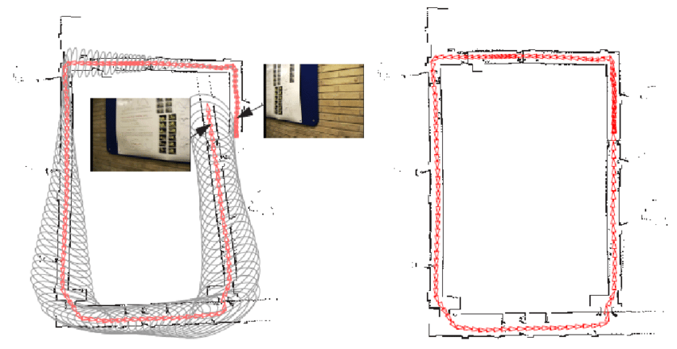 |
| Loop closing 전후의 경로 비교 [출처](https://www.researchgate.net/figure/Loop-closing-example-Ho-and-Newman-2007-a-A-snapshot-of-a-SLAM-just-before-loop_fig9_311948486) |

VO/vSLAM 분야는 크게 두 가지 갈래로 연구가 되고 있습니다.

1. Indirect method: 영상에서 keypoint와 descriptor를 이용하여 두 영상 사이에 특징점들을 매칭하고 이를 이용해 영상 사이의 자세변화를 알아내는 방법이다. 매칭된 픽셀들의 이동량을 이용해 상대적인 자세를 계산한다.

   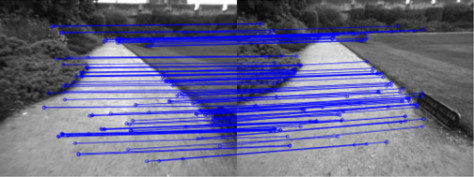

2. Direct method: 특징점 같은 가공된 데이터를 사용하지 않고 영상의 픽셀 값을 그대로 사용하는 방법이다. A시점의 영상의 어떤 픽셀을 다른 시점 B로 옮겼을 때 A의 픽셀 값과 B의 픽셀값이 같아지도록 하는 상대적인 자세를 계산한다.

두 방법이 장단점이 있지만 보통은 Indirect method가 더 쉽게 좋은 성능을 내기 때문에 여기서부터는 Indirect method를 기준으로 설명드리겠습니다.

### Q) VO에 딥러닝을 써야할까?

두 방식 모두 좋은 성능을 보이고 있는데 굳이 여기에 딥러닝을 갖다 붙여야 할까요? 기존의 전문가 시스템 (either direct or indirect)에서 **수학적 최적화로 정확한 계산**을 하고 있는데 왜 딥러닝을 써야할까요? 이는 마치 덧셈을 딥러닝으로 해결하고자 하는 것과 같습니다.  

제가 보기에는 기존 방식에 치명적인 단점이 있습니다. **구현 난이도**가 지나치게 높다는 것입니다. 논문을 볼 때 주로 성능을 보고 구현 난이도는 간과하기 쉬운 부분이지만 후속 연구를 하거나 그 기술을 응용해서 쓰고 싶은 사람에겐 중요한 점입니다. VO/vSLAM 연구도 이제 꽤 성숙한 단계에 들었기 때문에 성능은 좋아졌지만 그와 비례해서 구현의 난이도가 저세상으로 가버렸습니다. 다음 그림은 ORB-SLAM의 모듈 구성입니다.

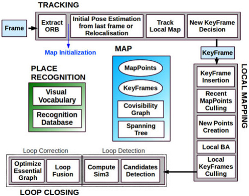

저 모듈 하나하나가 논문 주제들인데 저걸 다 높은 수준으로 구현하는 것 뿐만 아니라 multi-thread를 통해 고속으로 처리해야 하는 그 어려운 일을 Raul Mur-Artal 이라는 저자가 해버렸지 말입니다... 외부에서 가져다 쓴 모듈도 많지만 코드를 보면 성능을 올리기 위해 상당히 디테일하게 구현했다는 느낌을 받을 수 있습니다.  

다음은 주요 논문들을 구현한 소스코드의 양을 비교한 표입니다.  

| 논문        | 전체 소스 길이 (lines) | 코드 길이 (lines) |
| ----------- | ---------------------- | ----------------- |
| ORB-SLAM    | 32435                  | 20359             |
| DSO         | 25985                  | 16051             |
| Vins-Fusion | 33238                  | 23070             |
| LSD-SLAM    | 27204                  | 16454             |

C++의 코드 양이 다른 언어에 비해 좀 많긴 하지만 이건 너무 많고 C++ 언어 자체의 난이도까지 감안하면 진입 장벽이 상당히 높다고 볼 수 있습니다.  

여기서 딥러닝을 써보고 싶은 동기가 생깁니다. 성능이 잘 나올지는 모르겠지만 어쨌건 딥러닝은 아무리 복잡한 과정도 하나의 네트워크로 해결하는 마법을 부리고 많은 경우 성능도 괜찮은 수준으로 나오기 때문입니다. Image Segmentation을 예로 들어보겠습니다. 

요즘은 segmentation은 딥러닝으로 하는게 상식이지만 딥러닝이 유행하기 전에 유명했던 논문으로 "Contour Detection and Hierarchical Image Segmentation"(TPAMI, 2010)이 있습니다. 그 논문을 보면 segmentation결과를 만들기 위해 거쳐야 하는 중간 단계가 수십가지나 됩니다. 논문을 보면서 저자의 장인정신에 감동~~보다는 소름~~이 느껴졌던 기억이 납니다.  

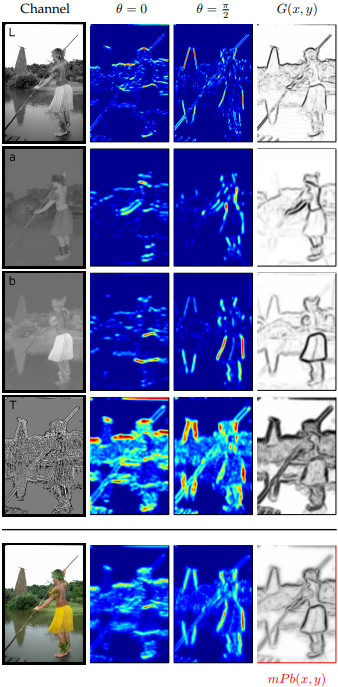

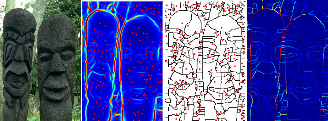

이러한 복잡한 알고리즘이 필요한 이유는 현실 세계의 복잡성이 영상에 그대로 반영되기 때문입니다. 카메라로 찍는 영상들은 대상에 따라 모양과 특성이 다르고 같은 대상이라도 어떤 환경에서 어떤 방향으로 찍으냐에 따라 전혀 다른 영상이 될수 있습니다. 이러한 복잡성을 가진 영상 데이터에서 공통적으로 적용되는 **일반적인 규칙**을 이끌어 내기 위해서는 여러 단계의 **추상화**를 거쳐야 합니다. 영상에서 물체의 외곽선을 찾아내는 것이나 특정 물체의 영역을 묶어서 표현하는 것도 추상화라 할 수 있습니다. 다양한 상황에 모두 적용되는 일반적인 알고리즘을 만들어내기 위해 다양한 추상화 기법을 여러단계에 걸쳐서 적용하는 것입니다.

하지만 요즘은 Mask-RCNN 등 DNN 하나로 끝나는 세상입니다. 딥러닝은 사람이 손으로 일일이 구현했던 추상화를 자동으로 만들어주는 역할을 한다고 볼 수 있습니다. 딥러닝을 활용한 연구가 쉬운건 아니지만 예전에 한땀한땀 손으로 빚어가던 시절보다는 수월하게 좋은 성능을 낼 수 있게 됐습니다.   

| 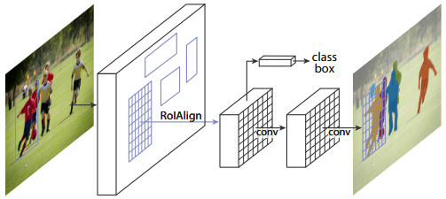 |
| Mask R-CNN |

다시 VO로 돌아가보면 상황이 비슷합니다. VO는 두 영상에서 특징점을 추출하여 두 영상의 특징점을 매칭하는 것이 가장 기본적인 추상화입니다. 그런데 상황에 따라 특징점은 항상 잘못 매칭될 수 있기 때문에 이를 보완하기 위한 다른 추상화 알고리즘들이 더 붙을수록 성능이 좋아지는 구조입니다.

다만 차이가 있다면 semantic segmentation이 전문가 시스템으로는 성능에 한계가 뚜렷했던 반면 VO는 이미 전문가 시스템으로 좋은 성능을 내고 있다는 것입니다. 결론부터 말하면 아직까지는 VO에서는 전문가 시스템이 더 좋은 성능을 내고 있습니다. 하지만 그렇기 때문에 연구할 가치가 있는 것이고 연구가 오래되지 않았으므로 앞으로 성능은 개선될 여지가 많을 것입니다.

## 3. (Monocular) Depth Estimation

"Single image (or monocular) depth estimation (or depth prediction)"로 검색할 수 있는 이 분야는 한장의 이미지로부터 영상의 픽셀 별 깊이(depth)를 추정하는 기술입니다. 아래 그림에서 출력으로 나온 영상을 depth map 혹은 depth image 라고 부릅니다. 깊이를 추정하는데 수학적 근거는 없고 semantic segmentation을 학습하듯 입력 영상의 패턴과 출력(depth)을 기계적으로 학습시키는 것 뿐입니다. 그래서 VO와는 다르게 DE에서는 딥러닝을 사용하는 것이 자연스러워 보입니다.  

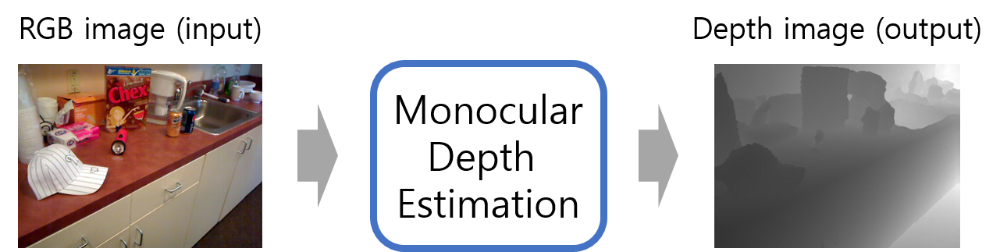

예전에 딥러닝이 유행하기 전에 Andrew Ng의 "Learning Depth from Single Monocular Images" (NIPS, 2006)를 본적이 있는데 위에서 본 segmentation 과정처럼 영상에서 수십가지 hand craft feature map을 만들어서 실제 depth와 단순히 linear regression을 했습니다. (물론 논문엔 더 많은 내용이 있습니다.)   

### 3.1. Supervised Deep Learning Approach

이후 딥러닝이 유행하면서 딥러닝의 풍부한 convolution feature를 활용한 논문들이 나옵니다. 대표적으로 흔히 'Eigen'이라 불리는 "Depth Map Prediction from a Single Image using a Multi-Scale Deep Network" (NIPS, 2014) 입니다. 아래 그림처럼 global course level depth를 만드는 네트워크와 local fine level depth를 만드는 네트워크 두 가지를 학습시켜 최종적인 depth map을 만듭니다. 어쨌든 이 논문은 RGB 영상을 입력했을 때 데이터셋의 ground truth depth가 나오도록 DNN 모델을 지도 학습(supervised learning)한 것입니다.  

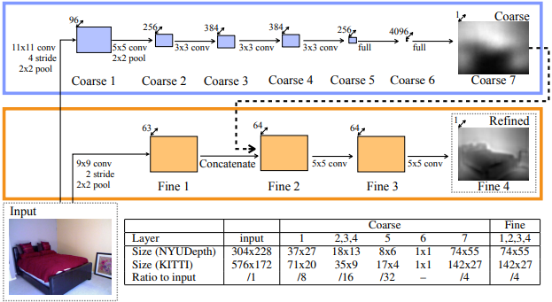

지도 학습을 하려면 Label (ground truth) 데이터, 즉 실제 픽셀 별 거리 데이터가 필요합니다. 실제 Depth map을 측정할 수 있는 depth camera가 있는데 대표적으로 아래 사진에 보이는 Kinect v1 (2010)과 2014년에 나온 Kinect v2 (2014)가 있습니다. 간단한 측정 원리는 센서에서 적외선을 쏘아서 이 적외선이 사물에 반사되어 돌아오는 시간을 측정하여 사물과의 거리를 추정하는 것입니다. 이러한 센서들은 RGB 영상과 Depth 영상을 동시에 촬영 가능하기 때문에 RGB-D camera라고 부릅니다. 지도 학습 방식의 연구들은 Kinect 센서로부터 얻은 RGB 영상을 모델의 입력으로 넣고 모델의 출력으로 나온 Depth 영상이 센서에서 측정한 Depth 영상과 비슷해지도록 학습을 시킵니다.

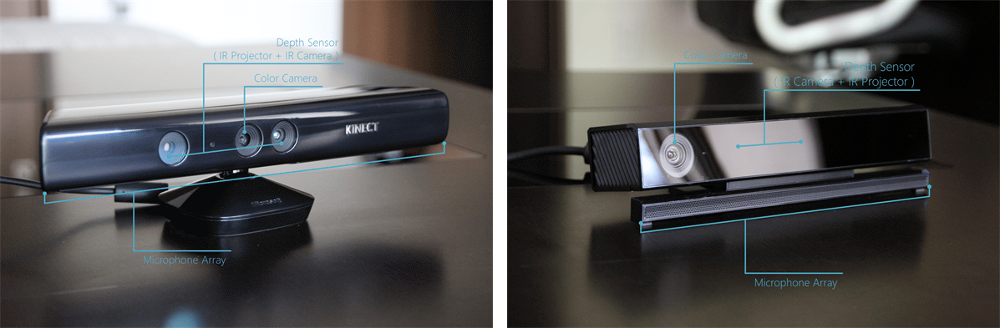

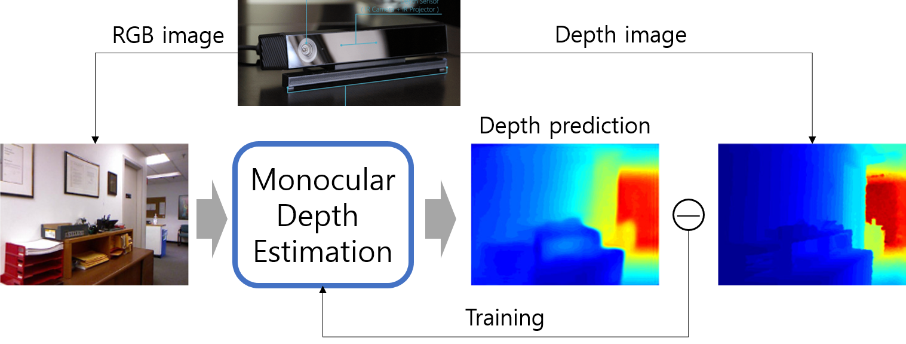

하지만 이러한 지도 학습 방식은 문제의 여지가 있습니다. 일단 일반적인 카메라가 아닌 상대적으로 비싼 RGB-D 카메라로만 학습 데이터를 얻을 수 있고 센서의 한계로 측정할 수 있는 거리가 제한되고 실외가 아닌 실내에서만 Depth 데이터를 얻을 수 있고 Depth 영상에 depth가 비어있는 픽셀들이 있는 등 여러 제약사항이 있습니다. 그래서 비지도 학습으로 Depth를 추정하는 연구들이 나왔고 오늘 다룰 주요 내용도 비지도 학습 기반의 VO와 DE(Depth Estimation) 입니다.

### 3.2. Unsupervised Deep Learning Approach

"Eigen"에서 한 단계 더 나아가 비지도 학습으로 depth를 학습하는 논문이 나옵니다. 논문 제목은 "Unsupervised Monocular Depth Estimation with Left-Right Consistency" (CVPR, 2017)인데, 줄여서 **monoDepth**라고 부릅니다. 이 논문에서는 RGB-D 영상이 아닌 스테레오(Stereo) 영상을 이용해 학습합니다.  

스테레오(stereo) 카메라는 두 개의 카메라가 일정한 거리 간격을 두고 두 장의 이미지를 동시에 찍을 수 있는 카메라입니다. 아래 그림에서 보이는 카메라가 대표적인 스테레오 카메라인 Bumblebee2 카메라고 두 장의 영상은 두 개의 카메라에서 동시에 찍은 영상입니다. 스테레오 영상을 이용하면 비교적 단순한 알고리즘에 의해 depth를 계산할 수 있는데 RGB-D 카메라와 비교하면 스테레오 카메라는 상대적으로 깊이 정확도가 낮은 반면 야외에서도 촬영 가능하다는 장점이 있습니다.  

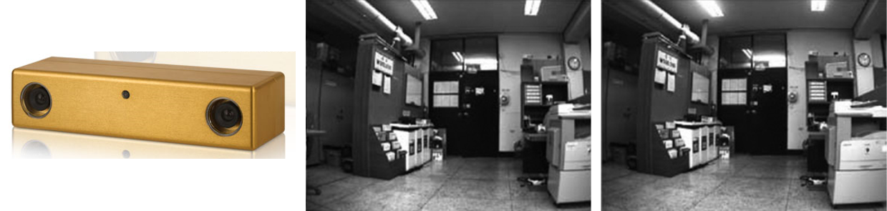

 이 논문은 다음과 같은 원리를 이용해 학습합니다.

1. 스테레오 카메라에서 두 카메라 사이의 거리를 알고 
2. 왼쪽 영상의 depth (혹은 disparity)를 알 수 있다면
3. 오른쪽 시점의 이미지를 왼쪽 이미지로부터 재구성(reconstruct) 할 수 있다.

monoDepth의 학습 목표는 오른쪽 이미지를 재구성 하는 것이 아니라 **오른쪽 이미지를 재구성 할 수 있는 depth를 학습**하는 것입니다. 구하기 어려운 Depth label 데이터가 필요없고 비교적 구하기 쉬운 스테레오 이미지만 있으면 depth를 학습할 수 있기 때문에 학습을 더 쉽게 할 수 있습니다.

DNN 구조는 아래와 같이 좁아졌다 넓어지는 Encoder-Decoder 구조로 되어있고 depth가 아닌 disparity를 출력합니다. Disparity란 두 영상 사이에 같은 점을 나타내는 픽셀의 위치 차이인데 Depth와 역수 관계에 있습니다. 즉 disparity를 알면 depth를 알 수 있습니다. 이 모델은 왼쪽 이미지($$I^l$$)로부터 두 개의 disparity map을 출력합니다. (**left-to-right disparity ($$d^r$$), right-to-left disparity ($$d^l$$)**)  

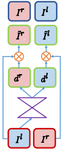

Disparity map으로 두 이미지를 서로 반대쪽 시점으로 재구성하여 반대쪽 시점의 이미지와 같아지도록 DNN을 학습시키는 것입니다. 재구성한 이미지와 원래 이미지 사이의 차이를 **photometric loss**라고 하는데 이 loss가 이후 오늘 공부할 VODE 논문의 주요 loss가 됩니다.

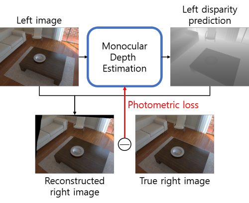

Monocular Depth Estimation은 아직 세밀한 정확도는 부족하기 때문에 거리 측정 센서를 완전히 대체하긴 어렵지만 대략적인 depth라도 있다면 위치인식에 도움을 줄 수 있고 자동차가 아닌 로봇의 경우 판단오차가 치명적이지 않으므로 장애물 회피 등에 사용될 수 있습니다.  

---

오늘 배울 VODE는 VO와 DE를 동시에 학습하는 것인데 monoDepth 처럼 스테레오 이미지 없이 단안 카메라의 연속 프레임만 가지고도 VO와 DE를 동시에 학습할 수 있는 기술입니다. 어느쪽을 주 목표로 하던 따로 학습하는 것보다는 동시에 학습하는 것이 성능이 좋기 때문에 대부분의 연구들이 이런 흐름으로 가고 있습니다.

## 4. Computer Vision Basic

Visual Odometry 라는 기술은 사실 선형대수와 3차원 컴퓨터 비전(Computer Vision)을 깊이 있게 이해해야만 배울수 있는 기술입니다. 하지만 여기서는 어려운 수학을 건너뛰고 결과를 바로 얻을 수 있는 딥 러닝을 활용해서 기존의 VO 알고리즘을 대체하는 연구들을 다루고 있습니다. 그래서 VO 자체를 깊이있게 알 필요는 없지만 기본적인 카메라 모델 정도는 알아두는 것이 좋을 것 같습니다.  

사람의 눈이 빛을 받아들여 시신경에서 빛의 세기를 감지하여 뇌에서 이를 종합하여 영상을 만들어 내듯이 카메라도 렌즈를 통해 들어온 빛을 작은 기판위에 밀집된 미세한 센서들이 감지하여 영상을 만들어냅니다. 아래 그림은 전형적인 핀홀(pinhole) 카메라 모델의 개념도입니다.  

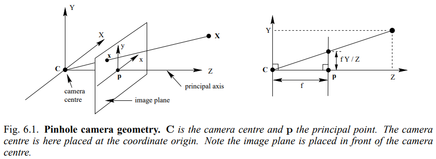

그림에서 카메라는 Z 축을 향하고 있고 그 앞에 $$\mathbf{X}$$ 라는 점이 있습니다. 원점과 점 사이에는 `image plane`이 있는데 이것은 실제 센서라기 보다는 3차원 형상이 2차원 영상으로 투영되는 가상의 평면입니다. 3차원 상의 점들은 각각의 색(color)을 가지고 있고 그 점이 원점을 향하면서 만나는 `image plane`의 좌표($$x,y$$)에 그 색이 맺혀 영상이 만들어지는 것입니다. 영상을 나타내는 점의 단위를 픽셀(pixel)이라 하는데 이미지 센서에는 픽셀마다 Red, Blue, Green 세 가지 색의 세기(intensity)를 측정할 수 있는 센서가 세 개씩 배치되어 있고 그 세개의 영상을 모으면 우리가 보는 RGB 영상, 즉 컬러 영상이 되는 것입니다.  

이때 물체의 3차원 좌표와 이 점이 영상에 맺히는 픽셀 좌표 사이에는 밀접한 관계가 있습니다. 3차원 좌표$$(X,Y,Z)$$와 픽셀 좌표($$x_{i}, y_{i}$$) 사이의 관계는 핀홀 카메라 모델 그림의 왼쪽을 보면 다음과 같이 비례식으로 쉽게 구할 수 있습니다.  

$$
x_{i} = f_x \left( X \over Z \right) + c_x  \\
y_{i} = f_y \left( Y \over Z \right) + c_y
$$

위 식에서 $$f_x, f_y$$는 원점과 `image plane` 사이의 거리를 나타내는 focal length (초점 거리)고, 사각형의 `image plane`에서는 왼쪽 위가 원점인데 Z축이 통과하는 영상의 중심점의 좌표가 $$c_x, c_y$$ 입니다. 이를 벡터식으로 표현하면 카메라 파라미터들을 하나의 행렬에 담을 수 있는데 이 행렬 $$K$$를 camera projection matrix라 합니다. 간단히 말하면 3차원 좌표에 camera projection matrix를 곱하면 픽셀 좌표가 나온다고 볼 수 있습니다.

$$
\begin{bmatrix} x_{i} \\ y_{i} \\ 1 \end{bmatrix} =
{1 \over Z } \begin{bmatrix} f_x & 0 & c_x \\ 0 & f_y & c_y \\ 0 & 0 & 1 \end{bmatrix} 
\begin{bmatrix} X \\ Y \\ Z \end{bmatrix} \\
\mathbf{p} = {1 \over Z } K \mathbf{P}
$$

이처럼 3차원 좌표와 영상의 픽셀 좌표 사이에는 비례/반비례 관계가 있기 때문에 두 영상에서 똑같은 점들이 다른 픽셀에 보일 때 픽셀의 이동량을 통해 카메라의 움직임을 추정할 수 있습니다. 이것이 Visual Odometry의 기본 원리인데 여기서는 딥 러닝 기반의 접근 방식을 다루기 때문에 기존 VO의 세부적인 내용은 넘어가도록 하겠습니다.

## 5. Pose Representation

VO를 학습을 통해 해결할 수 있다고 했는데 VO-DNN의 출력은 어떻게 나와야 할까요? 두 프레임 사이의 상대적인 자세를 어떻게 표현해야 할까요?  

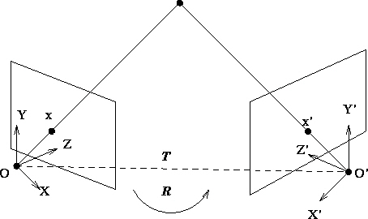

두 개의 카메라가 (혹은 한 카메라가 이동한 두 개의 시점이) 있습니다. 이들 사이의 상대적인 자세(pose)는 두 카메라 사이의 상대적인 이동(translation)과 회전(rotation)으로 표현할 수 있습니다. 이를 다르게 표현하면 두 카메라 사이의 상대 pose는 두 카메라 좌표계 사이의 **Rigid Transformation** (translation + rotation)으로 표현할 수 있다는 뜻입니다.  

3차원 컴퓨터 비전에서 변환(Transformation)이란 주로 좌표계 변환을 의미합니다. 3차원 공간 상의 점(point)은 그 위치 자체를 의미하지만 점의 위치를 정확히 표현하기 위해서는 $$(X, Y, Z)$$와 같은 좌표(coordinates)를 써야 합니다. 즉 특정 기준 좌표계로부터의 상대적인 위치를 숫자로 표현해야 합니다. 위 그림에서 점은 하나지만 좌표계는 두 개가 있습니다. 똑같은 점이 왼쪽 카메라 좌표계와 오른쪽 카메라 좌표계에서는 다른 좌표로 표현이 됩니다. 한쪽 좌표계에서 본 점의 좌표를 다른 쪽 좌표계로 변환하는 것이 바로 좌표계 변환입니다. 두 좌표계 사이의 좌표 변환은 이동과 회전을 통해 계산할 수 있고 각 카메라 마다 좌표계를 가지고 있으므로 카메라의 자세를 좌표계 변환으로 표현할 수 있습니다.

이동은 직관적으로 두 카메라 사이의 상대 위치를 3차원 벡터로 표현하면 되지만 회전을 표현하는 방법은 제가 알기로 최소 네 종류가 있습니다. 이에 따라 rigid transformation도 네 가지로 표현할 수 있습니다.  

### 5.1. Special Eucliean Transformation

카메라의 pose는 rigid transformation (or rigid body motion)으로 표현할 수 있다고 했는데 rigid transformation을 좀더 기술적인(?) 용어로 말하면 **Special Euclidean Transformation** 입니다.  

일단 앞에 "special"은 떼고 Euclidean Transformation만 정의해보면 다음과 같습니다. 쉽게 말해 모양이 늘어나거나 줄어들거나 뒤틀리지 않고 똑같이 유지된다는 것이죠.

> **Euclidean transformation**: a map that preserves the Euclidean distance between every pair of points. The set of all Euclidean transformation in 3-D space is denoted by $ E(3) $.
> $$
> g: \mathbb{R}^3 \to \mathbb{R}^3; X \mapsto g(X) \\
> \begin{Vmatrix} g_*(v) \end{Vmatrix} = \begin{Vmatrix} v \end{Vmatrix}, \forall v \in \mathbb{R}^3
> $$
>

"Special" Euclidean Transformation은 여기에 한가지 조건을 더 붙입니다. 방향이 바뀌지 않아야 한다는 것이죠.  

> The map or transformation induced by a rigid-body motion is called a **special Euclidean transformation**. The word "*special*" indicates the fact that a transformation is **orientation-preserving**. 
>

$$
g_*(u) \times g_*(v) = g_*(u \times v), \forall u, v \in \mathbb{R}^3
$$

아무리 모양을 유지시킨채 회전을 시켜도 좌우반전은 일어나지 않습니다. 상하반전도 마찬가지입니다. 좌우반전이나 상하반전 같은 변환은 Euclidean Transformation은 만족하지만 물리적인 3차원 공간에서는 일어날 수 없는 일입니다. 우리가 일반적으로 쓰는 직교 좌표계는 $$\mathbf{X} \times \mathbf{Y} = \mathbf{Z}$$ 를 만족하는데 이 좌표계를 아무리 "회전"시켜도 저 등식은 성립합니다. 하지만 좌우반전으로 X축만 뒤집으면 ($$\mathbf{X'} = -\mathbf{X}$$) 변환된 좌표계에서는 $$\mathbf{X'} \times \mathbf{Y} = -\mathbf{X} \times \mathbf{Y} = -\mathbf{Z} $$ 이므로 이를 만족할 수 없게됩니다.  

그래서 Euclidean Transformation 중에 **orientation-preserving**한 부분 집합이 Special Euclidean Transformation이고 이것이 물리 세계의 강체 변환(Rigid Transformation)과 동일한 의미를 갖게 됩니다. (강체(rigid body)란 단단해서 모양을 변형할 수 없는 물체이므로 당연히 좌우반전도 할 수 없습니다.)  

이제 3-D Special Euclidean Transformation, 줄여서 **"SE(3)"**라 표기하는 transformation 혹은 pose를 표현하는 방법은 여러가지가 있습니다. 이동(translation)은 공통적으로 3차원 벡터로 표현하지만 회전(rotation)을 표현하는 방법에 따라 달라집니다. 다음은 회전을 표현하는 네 가지 방법입니다.

- Rotation matrix
- Euler angle
- Quaternion
- Twist coordinates

이제 저 표현들을 하나씩 알아봅시다.

### 5.2. Rotation matrix

회전(rotation) 변환은 아래 그림처럼 원점은 그대로 둔채 특정 축을 중심으로 좌표계를 회전시키는 변환입니다. 

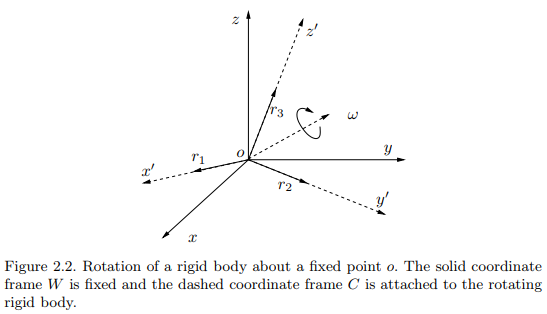

회전 변환은 3x3 matrix로 표현할 수 있는데 임의의 3x3 matrix가 모두 **rotation matrix** 가 될 수 있는건 아닙니다. 3x3 matrix 중에서 rotation matrix가 될 수 있는 matrix 집합을 **Special Orthogonal group, SO(3)**라고 부르고 집합의 조건은 다음 식의 (1)과 같습니다. (2), (3)은 special euclidean trnasformation의 조건을 회전변환으로 다시 쓴 것입니다.

$$
(1)\quad SO(3) \doteq \left\{ R \in \mathbb{R}^{3\times3} \middle|\ R^TR=I,\ det(R)=+1 \right\} \\
(2)\quad \left| \mathbf{x} \right| = \left| R\mathbf{x} \right| \\
(3)\quad (R\mathbf{x_1}) \times (R\mathbf{x_2}) = R(\mathbf{x_1} \times \mathbf{x_2})
$$

$$R^TR=I$$ 조건을 만족하는 matrix 집합을 orthogonal group, $$O(3)$$라고 하는데 이는 euclidean transformation의 회전에 해당합니다. Orthogonal matrix는 (2)처럼 변환이 벡터의 크기에 영향을 주지 않습니다.   

Orthogonal group에 $$det(R)=+1$$ 조건까지 더해야 비로서 (3)을 만족할 수 있고 이것이 special euclidean transformation에 해당하는 "special" orthogonal group (a.k.a rotation matrix) 입니다.  

Rotation matrix ($$R$$)에 translation vector ($$\mathbf{t}$$)를 더해 완성한 SE(3)의 변환 행렬(transformation matrix)는 다음과 같습니다.

$$
SE(3) \doteq \left\{ 
T = \begin{bmatrix} R & \mathbf{t} \\ 0 & 1 \end{bmatrix}
\middle\|\ R \in SO(3), \mathbf{t} \in \mathbb{R}^3 
\right\} 
\in \mathbb{R}^{4 \times 4}
$$

### 5.3. Euler angle

Euler angle이란 임의의 회전을 세 번의 직교 좌표계 축 회전으로 표현하는 방법입니다. 가장 간단예로 xyz euler angle이 있습니다. 직교 좌표계에서 x축으로 $$\alpha$$, y축으로 $$\beta$$, z축으로 $$\gamma$$ 만큼 회전하면 어떤 회전이라도 표현할 수 있다는 것입니다.

$$
\forall R \in SO(3), \exists\ \alpha, \beta, \gamma \\
R=R_x(\alpha)R_y(\beta)R_z(\gamma)
$$

$$
R_x(\alpha) = \begin{bmatrix} 1 & 0 & 0 \\ 
0 & cos\alpha & sin\alpha \\
0 & -sin\alpha & cos\alpha \end{bmatrix} \quad 
R_y(\beta) = \begin{bmatrix} cos\beta & 0 & -sin\beta \\ 
0 & 1 & 0 \\
sin\alpha & 0 & cos\alpha \end{bmatrix} \quad 
R_z(\gamma) = \begin{bmatrix} cos\gamma & sin\gamma & 0 \\ 
-sin\gamma & cos\gamma & 0 \\
0 & 0 & 1 \end{bmatrix}
$$

위의 rotation matrix의 의미는 다음과 같습니다.

1. Coordinate system rotation: 점은 가만히 있고 좌표축이 회전한 경우 $$R\mathbf{p}$$ 연산을 통해 회전된 좌표계에서의 좌표를 구할 수 있습니다. 전역 좌표계에서 지역 좌표계로 들어가는 변환으로 볼 수 있습니다. 

위키를 찾아보면 [rotation matrix](https://en.wikipedia.org/wiki/Rotation_matrix)에 나오는 행렬들과는 부호가 다릅니다. 위키에 나오는 회전 행렬은 다음과 같습니다.

$$
R_x(\alpha) = \begin{bmatrix} 1 & 0 & 0 \\ 
0 & cos\alpha & -sin\alpha \\
0 & sin\alpha & cos\alpha \end{bmatrix} \quad 
R_y(\beta) = \begin{bmatrix} cos\beta & 0 & sin\beta \\ 
0 & 1 & 0 \\
-sin\alpha & 0 & cos\alpha \end{bmatrix} \quad 
R_z(\gamma) = \begin{bmatrix} cos\gamma & -sin\gamma & 0 \\ 
sin\gamma & cos\gamma & 0 \\
0 & 0 & 1 \end{bmatrix}
$$

위키의 rotation matrix의 의미는 두 가지로 볼 수 있습니다.

1. Point rotation: 좌표계는 가만히 있고 점이 원점을 중심으로 회전한 경우 $$R\mathbf{p}$$ 연산을 통해 회전된 좌표를 구할 수 있습니다. 
2. **Pose representation:** transformation matrix로 pose를 표현할 때 $$R\mathbf{p}$$ 연산을 통해 해당 pose에서 본 지역 좌표를 전역 좌표로 변환할 수 있습니다. 사실 이것은 앞서 나온 좌표계 회전으로 해야하는데 카메라가 $$\theta$$ 만큼 회전되어 있을 때 이를 전역 좌표로 변환하려면 좌표계 회전을 $$-\theta$$ 만큼 해야해서 결과적으로 점 회전(point rotation)과 같아집니다.

Euler angle 사용시 회전 순서를 꼭 xyz 순서로 할 필요는 없고 아래 그림과 같은 zxz euler angle도 많이 쓰입니다. 그외에도 여러가지 조합이 있는데 연속으로 같은 축에 대해서 회전하지만 않으면 어떠한 조합도 euler angle이 될 수 있습니다. 예를 들어 xxy, zyy는 안되지만 xyx, yxz는 됩니다.

| 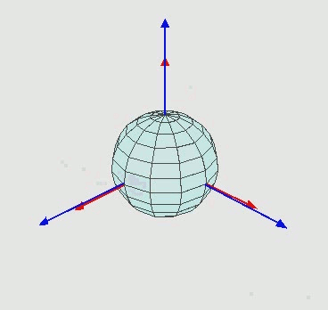 |
| ----- |
| zyz euler angle rotation, [출처](https://hoodymong.tistory.com/3) |

Euler angle은 직교좌표계에 익숙한 사람들에게 직관적으로 이해되지만 단점이 많아서 단점을 잘 이해하고 써야합니다. Euler angle은 유명한 짐벌락 문제(gimbal lock problem, [영상](https://www.youtube.com/watch?v=zc8b2Jo7mno))이 있어서 각도 범위에 제한이 있습니다.

Euler angle을 이용해 SE(3) 변환을 표현한다면 다음과 같은 6차원 벡터가 될 것입니다.

$$
\mathbf{p} = \begin{bmatrix} t_x & t_y & t_z & \alpha & \beta & \gamma \end{bmatrix}^T
$$

### 5.4. Quaternion

4개의 숫자로 표현할 수 있는 quaternion은 일종의 복소수이며 스칼라 $$q_0$$와 벡터 $$\mathbf{q}$$로 이루어졌습니다. 상황에 따라 간단히 4차원 벡터로 표현하기도 합니다. 

$$
q = q_0 + \mathbf{q} = q_0 + q_1\mathbf{i} + q_2\mathbf{j} + q_3\mathbf{k} \\
q = \begin{bmatrix} q_0 \\ q_1 \\ q_2 \\ q_3 \end{bmatrix}
$$

Quaternion으로 회전을 표현할 때는 크기가 1인 **unit quaternion**만 사용할 수 있습니다. ($$\begin{vmatrix} q\end{vmatrix}=1$$)  Unit quaternion에서 스칼라 $$q_0$$는 각도를 의미하고 벡터 $$\mathbf{q}$$는 회전축을 의미합니다. SO(3)에 속하는 임의의 회전변환은 특정 축을 기준으로 특정 각도를 회전시켜 만들수 있습니다. Euler angle은 직교 좌표축으로만 회전했기 때문에 세 번 회전해야 임의의 회전을 만들어낼 수 있지만 임의의 회전축을 사용할 수 있다면 한번의 회전으로 모든 회전을 구현할 수 있습니다.  

어떤 회전이 회전축 $$\mathbf{v}$$를 기준으로 $$\theta$$ 만큼 회전해야 한다면 quaternion으로 다음과 같이 표현할 수 있습니다.  

$$
q = cos{\theta \over 2} + \mathbf{v}sin{\theta \over 2} \\
q = \begin{bmatrix} cos{\theta \over 2} \\ v_x sin{\theta \over 2} \\ 
v_y sin{\theta \over 2} \\ v_z sin{\theta \over 2} \end{bmatrix}
$$

Quaternion으로 실제로 어떤 좌표계를 회전시켜야 한다면 quaternion product를 계산해야 합니다. Quaternion 사이의 곱셈에 해당하는 quaternion product는 다음과 같이 계산합니다.

$$
pq = p_0q_0 - \mathbf{p \cdot q} + p_0\mathbf{q} + q_0\mathbf{p} + \mathbf{p} \times \mathbf{q} \\
pq= 
\begin{bmatrix} p_0 & -p_1 & -p_2 & -p_3 \\ 
p_1 & p_0 & -p_3 & p_2 \\ p_2 & p_3 & p_0 & -p_1 \\ 
p_3 & -p_2 & p_1 & p_0 \end{bmatrix}
\begin{bmatrix} q_0 \\ q_1 \\ q_2 \\ q_3 \end{bmatrix}
= 
\begin{bmatrix} q_0 & -q_1 & -q_2 & -q_3 \\ 
q_1 & q_0 & q_3 & -q_2 \\ q_2 & -q_3 & q_0 & q_1 \\ 
q_3 & q_2 & -q_1 & q_0 \end{bmatrix}
\begin{bmatrix} p_0 \\ p_1 \\ p_2 \\ p_3 \end{bmatrix}
$$

어떤 3차원 벡터 $$\mathbf{p}$$를 $$q$$라는 quaternion으로 회전된 좌표계에서 본 $$\mathbf{p}'$$ 를 계산하는 식은 다음과 같습니다. Quaterion product를 앞 뒤로 두 번하는 것입니다.

$$
\bar p' = q^* \bar p q \\
\bar p = \begin{bmatrix} \mathbf{p} \\ 0 \end{bmatrix}, \quad 
q^*= q_0 - \mathbf{q}
$$

이러한 quaternion 연산이 부담스럽다면 rotation matrix로 변환할수도 있습니다.

$$
\bar p' = q^* \bar p q \\
\mathbf{p}' = Q \mathbf{p} \\
Q = \begin{bmatrix} 
2q_0^2-1 + 2q_1^2 & 2q_1q_2 - 2q_0q_3 & 2q_1q_3 + 2q_0q_2 \\
2q_1q_2 + 2q_0q_3 & 2q_0^2-1 + 2q_2^2 & 2q_2q_3+2q_0q_1 \\
2q_1q_3 - 2q_0q_2 & 2q_2q_3 + 2q_0q_1 & 2q_0^2-1 + 2q_2^3
\end{bmatrix}
$$

반대로 rotation matrix를 quaternion으로 변환하고 싶다면 임의의 rotation matrix에서 회전 축 $$\mathbf{v}$$와 회전 각도 $$\theta$$를 알아내면 됩니다.

$$
R = \begin{bmatrix} r_{11} & r_{12} & r_{13} \\ 
r_{21} & r_{22} & r_{23} \\ 
r_{31} & r_{32} & r_{33} \end{bmatrix} \\
\theta = acos \begin{pmatrix}{Tr(R) - 1 \over 2} \end{pmatrix} \\
\mathbf{v} = \begin{bmatrix} v_1 \\ v_2 \\ v_3 \end{bmatrix}
= {1 \over 2sin\theta} \begin{bmatrix} r_{23} - r_{32} \\ r_{31} - r_{13} \\ r_{12} - r_{21} \end{bmatrix} \\
q = cos{\theta \over 2} + \mathbf{v}sin{\theta \over 2}
$$

Quaternion으로 회전을 표현할때의 장점은 다음과 같습니다.

- 짐벌락 문제와 같은 표현 자체의 결점이 없음
- 임의의 회전을 회전축과 회전각을 이용해 직관적으로 표현 가능
- 9개의 숫자로 표현되고 복잡한 조건을 가진 rotation matrix에 비해 quaternion은 4차원 벡터로 표현할 수 있고 조건이 단순해서 (unit quaternion) 경제적이고 최적화에도 유리함
- rotation matrix를 거치지 않고 quaternion product를 통해 연속적인 회전을 직접 연산가능,   $$R_3 = R_1 R_2 \leftrightarrow q_3 = q_1 q_2$$

Quaternion을 이용해 SE(3) 변환을 표현한다면 이동 벡터와 합친 7차원 벡터가 됩니다.

$$
\mathbf{p} = \begin{bmatrix} t_x & t_y & t_z & q_w & q_x & q_y & q_z \end{bmatrix}^T
$$

### 5.5. Twist Coordinates

*Twist*의 의미를 이해하기 위해서는 어려운 용어들과 미분방정식을 푸는 유도과정을 봐야하지만 여기선 생략하고 결과적인 사용방법만 알아보겠습니다. ORB-SLAM이나 LSD-SLAM 등 대부분의 유명한 VO/SLAM 논문에서는 이 방법으로 회전을 표현합니다.

앞서 quaternion이 euler angle의 문제를 해결했는데 왜 또 다른걸 배워야 할까요? Quaternion도 사용해보면 완벽하게 편하진 않기 때문입니다. Rotation matrix보다는 단순하지만 **unit** quaternion이라는 조건도 걸려있고 원래 3자유도의 회전을 4차원 벡터로 표현하는 것도 아쉬운 점입니다. 앞서 임의의 rotation matrix를 회전각도 $$t$$와 회전축 $$\omega$$로 해석할 수 있다고 했습니다.
$$
R = \begin{bmatrix} r_{11} & r_{12} & r_{13} \\ 
r_{21} & r_{22} & r_{23} \\ 
r_{31} & r_{32} & r_{33} \end{bmatrix} \\
t = acos \begin{pmatrix}{Tr(R) - 1 \over 2} \end{pmatrix} \\
\mathbf{\omega} = \begin{bmatrix} \omega_1 \\ \omega_2 \\ \omega_3 \end{bmatrix}
= {1 \over 2sin(t)} \begin{bmatrix} r_{23} - r_{32} \\ r_{31} - r_{13} \\ r_{12} - r_{21} \end{bmatrix} \\
$$

반대로, 회전각도 $$t$$와 회전축 $$\omega$$로부터 rotation matrix R을 만들어낼 수 있는 공식이 있습니다. 바로 로드리게스 공식입니다.

> **Rodrigues' formula for rotation matrix**: Given $$\omega \in \mathbb{R}^3$$ with $$\begin{Vmatrix} \omega \end{Vmatrix}=1$$ and $$t \in \mathbb{R}^3$$, the matrix exponential $$R = e^{\hat \omega t}$$ is given by the following formula:

$$
e^{\hat \omega t} = I + \hat \omega sin(t) + {\hat \omega}^2(1 - cos(t)) \\
\hat \omega = \begin{bmatrix} 0 & -\omega_3 & \omega_2 \\
\omega_3 & 0 & -\omega_1 \\
-\omega_2 & \omega_1 & 0 \end{bmatrix}
$$

$$\hat \omega$$은 **twist** 혹은 **exponential coordinate**이라 불리며 임의의 3차원 벡터 $$\omega$$로부터 만들어질 수 있는 $$\hat \omega$$의 집합을 $$so(3)$$라고 합니다. 자세히 보면 $$\hat \omega$$의 모양이 벡터 $$\omega$$와의 cross product에 대한 행렬연산이라는 것을 알 수 있습니다.

$$
\mathbf{u} \times \mathbf{v} = 
\begin{bmatrix} 0 & -u_3 & u_2 \\ u_3 & 0 & -u_1 \\
-u_2 & u_1 & 0 \end{bmatrix}
\begin{bmatrix} v_1 \\ v_2 \\ v_3 \end{bmatrix}
= \hat{\mathbf{u}} \mathbf{v}
$$

임의의 twist $$\hat{\mathbf{u}} = \hat \omega t$$는 **exponential map**을 통해 rotation matrix가 될 수 있고 exponential map을 구현한 식이 로드리게스 공식입니다.

$$
exp : so(3) \to SO(3) \\
\hat{\mathbf{u}} \in so(3) \mapsto R = e^{\hat{\mathbf{u}}} \in SO(3)
$$

다시 정리해보면 세 단계의 표현 방식이 있습니다.

| term                                 | expression                                                   |
| ------------------------------------ | ------------------------------------------------------------ |
| twist coordinates                    | $$\mathbf{u} = \omega t \in \mathbb{R}^3$$                   |
| twist or  exponential coordinates | $$\hat{\mathbf{u}} = \begin{bmatrix} 0 & -u_3 & u_2 \\ u_3 & 0 & -u_1 \\ -u_2 & u_1 & 0 \end{bmatrix} \in so(3)$$ |
| rotation matrix                      | $$R = e^{\hat{\mathbf{u}}} \in SO(3)$$                       |

세 가지 표현 모두 동일한 정보를 가지고 있으므로 아무런 제약조건이 없는 3차원 벡터인 "twist coordinates"로 임의의 회전을 표현할 수 있다는 뜻이 됩니다. 이는 앞서 배운 rotation matrix, euler angle, quaternion의 모든 단점들이 해소된 표현 방법이라고 볼 수 있습니다. 3차원으로 표현이 compact하고 아무런 제약조건도 없습니다.

벡터의 표현도 직관적으로 이해할 수 있습니다. Twist coordinate $$\mathbf{u} = \omega t$$ 에서 크기 $$t = \begin{Vmatrix} \mathbf{u} \end{Vmatrix}$$는 각도를 의미하고 방향 $$\omega = {\mathbf{u}  \over \begin{Vmatrix} \mathbf{u} \end{Vmatrix}}$$ 은 회전축을 의미합니다.  

다만 주의할점은 각도가 $$2\pi$$마다 반복되므로 twist coordinates와 rotation matrix는 one-to-one 관계가 아니라 many-to-one 관계라는 것입니다.

$$
R = e^{\hat{\omega} t} = e^{\hat{\omega} (t+2\pi n)}
$$

위에서 본 세 단계의 표현은 이동(translation)을 더한 rigid transformation에도 그대로 적용됩니다. 이동을 $$\mathbf{v} \in \mathbb{R}^3$$로 표현할 때 이동을 포함한 twist coordinates와 twist는 다음과 같이 표현합니다.

$$
\xi = \begin{bmatrix} \mathbf{v} \\ \mathbf{u} \end{bmatrix} \in \mathbb{R}^6 \\
\hat{\xi} = \begin{bmatrix} \hat{\mathbf{u}} & \mathbf{v} \\ 0 & 1 \end{bmatrix} \in se(3)
$$

이로부터 transformation matrix를 구하는 Rodrigues' formula는 다음과 같습니다.

$$
e^{\widehat{\xi}t} = 
\begin{bmatrix} e^{\widehat{w}} & 
\left( I - e^{\widehat{w}} \right) \widehat{w} v 
+ w \widehat{w}^T v \\
0 & 1
\end{bmatrix}
= \begin{bmatrix} R & T \\ 0 & 1 \end{bmatrix} \in SE(3)
$$

---

여기까지 3차원 자세를 나타내는 다양한 방법에 대해서 알아봤습니다. 다음 시간에 배울 VODE에서도 저자마다 다른 표현 방식을 쓰는데 어떤 논문은 euler angle을 쓰고 어떤 논문은 twist coordinate을 쓰기도 합니다. 이러한 표현 방법을 정리해두면 VO/SLAM 관련 논문을 이해하는데 큰 도움이 됩니다.

