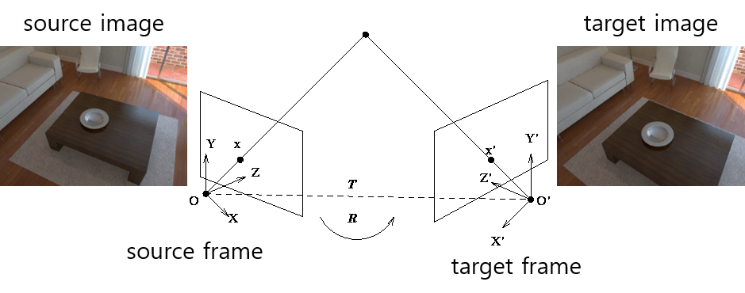
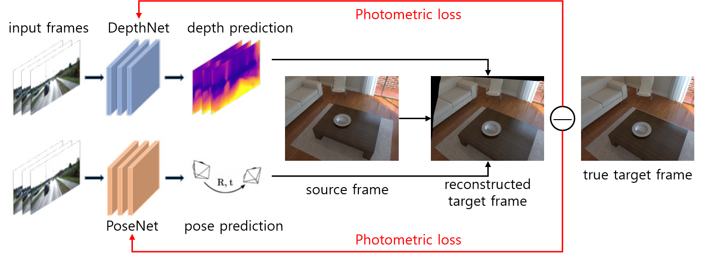
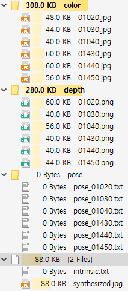
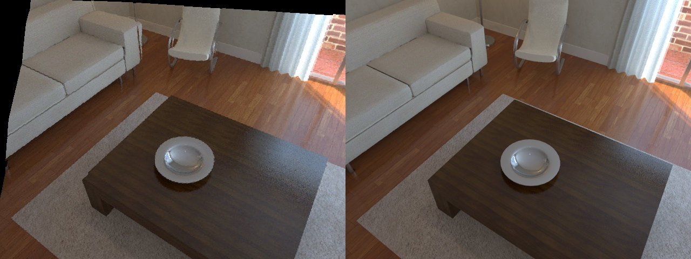

# About This Lecture

이 강의는 "Deep Learning based Viusal Odometry and Depth Estimation" (DL-VODE, or simply VODE) 라는 주제로 강의를 합니다. 강의순서는 다음과 같습니다. 

1. **Prerequisites for VODE**: VODE를 이해하기 위한 사전지식을 공부합니다.
3. **Understanding DL-VODE**: VODE의 학습 원리를 이해하고 핵심 과정을 실습합니다.
   1. DL-VODE structure
   2. Mathemathical derivation of photometric loss
   3. Image reconstruction with code
4. **Paper Review**: SfmLearner 등 최신 VODE 관련 논문을 리뷰합니다.


# Understanding DL-VODE

## 1. DL-VODE structure

(드디어!) 이제 VODE에 대해 자세히 공부해봅시다. VODE는 아래 그림처럼 보통 PoseNet와 DepthNet 두 개로 이루어져 있습니다. 

- PoseNet: 여러 프레임의 영상을 받아 기준 프레임으로부터 다른 프레임의 상대적인 자세를 출력, 보통 3장이나 5장의 영상을 한번에 받아서 가운데 프레임을 기준으로 다른 프레임의 자세를 출력
- DepthNet: 한 장의 이미지를 받아 한 장의 depth map을 출력


(DepthNet으로 만들어진) depth와 (실제로 찍은) RGB 영상이 있으면 3차원 colored point cloud를 만들 수 있습니다. Point cloud를 원래 시점(source frame)과는 다른 시점(target frame)으로 투영(projection) 하면 다른 시점의 RGB 영상을 만들어 낼 수 있습니다.  


이때 원래 시점의 좌표계를 소스 프레임(source frame), 영상을 소스 이미지(source image), 다른 시점의 좌표계를 타겟 프레임(target frame), 영상을 타겟 이미지(target image)라고 부르겠습니다.  



그래서 소스 프레임에서 RGB + Depth 영상이 있다면 타겟 프레임에서의 RGB 영상을 **예측(predict) 혹은 복원(reconstruct)**할 수 있게됩니다. 만약 1) depth가 정확하고, 2) source frame과 target frame 사이의 상대적인 자세를 정확히 계산했다면, 이론적으로는 예측된 이미지와 실제로 target frame에서 찍은 이미지가 같게 나와야 합니다.  

하지만 임의로 초기화한 PoseNet과 DepthNet에서 처음부터 정확하게 나올리 없고 처음에는 부정확한 출력이 나올 것이고 그에 따라 **예측된 타겟 이미지와 실제 타겟 이미지 사이에 차이**가 날 것입니다. 이 차이를 **photometric error**라고 하며 이 차이를 training loss로 사용하여 loss를 줄이기 위해 학습하다보면 예측된 depth와 pose가 정확해진다는 것이 **DL-VODE의 원리**입니다.  



그래서 두 가지를 동시에 학습시키면 ground truth depth나 pose가 필요없이 연속된 RGB 영상만으로 두 네트워크를 학습시킬 수 있습니다. 물론 단안 카메라의 RGB 영상만 사용하면 절대적인 거리나 크기는 알 수 없고 상대적인 것만 알 수 있지만 그것만으로도 유용할 수 있습니다. 또한 스테레오 이미지를 사용하여 절대적인 거리를 출력하는 논문도 있습니다.


## 2. Mathemathical Derivation of Photometric Loss

앞서 말한 photomeric error를 loss로 쓴 것을 photometric loss라고 합니다. Photometric loss를 수학적으로 쓰면 다음과 같습니다.


$$
\mathcal{L}_{photo} = \sum_{p} \left\{I_t(p) - \hat I_{s \to t}(p) \right\} \\
\hat I_{s \to t}(p) = I_s(p') \\
p' = KT_{t \to s} D_t(p)K^{-1}p
$$

첫 번째 식은 photometric loss의 정의로 타켓 프레임에서 찍은 실제 타겟 이미지($$I_t(p)$$)와 소스 이미지를 기반으로 복원한 타겟 이미지($$\hat I_{s \to t}(p)$$) 사이의 차이를 픽셀별로 구하여 합산한다는 뜻입니다. 

두 번째 식은 영상을 복원하는 방법을 표현한 것인데 복원한 타겟 이미지의 픽셀 $$p$$에 해당하는 RGB 값은 소스 이미지의 해당 픽셀 $$p'$$로부터 가져온다는 것입니다.

세 번째 식이 가장 중요한데 소스 이미지의 해당 픽셀 $$p'$$를 계산하는 식입니다. 단계별로 이해하면 어렵지 않습니다.

- Step1: $$K^{-1}p$$ : 여기서 $$p$$는 픽셀의 homogeneous 좌표로 $$(u, v, 1)$$의 꼴을 하고 있으며 camera projection matrix $$K$$ 의 역행렬을 곱하면 $$(\bar X, \bar Y, \bar Z) = \left({X \over Z}, {Y \over Z}, 1\right)$$ 꼴로 unit depth ($$Z=1$$) 평면에서 점의 3차원 좌표를 나타낸다.

- Step2: $$D_t(p)K^{-1}p$$: $$(\bar X, \bar Y, 1)$$에 픽셀 $$p$$에서의 스케일에 해당하는 depth를 곱하면 픽셀의 실제 3차원 좌표$$(X, Y, Z)$$를 구해서 점들이 3차원의 입체적 모양을 갖게 된다.

- Step3: $$T_{t \to s} D_t(p)K^{-1}p$$: 타겟 프레임에서의 3차원 좌표를 소스 프레임의 3차원 좌표로 좌표계를 변환한다.

- Step4: $$KT_{t \to s} D_t(p)K^{-1}p$$: 소스 프레임으로 변환된 3차원 점들을 소스 프레임의 영상 평면에 투영(projection)한다. 즉 타겟 픽셀 $$p$$에 해당하는 소스 픽셀을 계산한 것이다.


## 3. Image Reconstruction with Code

어떤 장면의 어떤 시점에서 찍은 이미지를 이용해 다른 시점의 이미지를 예측하는 것을 논문마다 다양한 용어로 표현하고 있습니다. 명사형으로는 view synthesis, image warping, image reconstruction, 동사형으로는 synthesize, warp, or reconstruct image 라고 표현할 수 있습니다. 다 의미적으로 맞는 말이기 때문에 여러가지 용어가 쓰이더라도 혼동하지 마시기 바랍니다. 여기서는 복원(reconstruct)나 합성(synthesize)을 주로 사용하겠습니다.  

여기서는 RGB, Depth, Pose 세 가지 정보를 이용하여 다른 시점의 영상을 복원하는 과정을 예제 코드와 함께 자세히 살펴보겠습니다.  


### 3.1 Prepare data

먼저 시점을 복원할 데이터를 불러옵니다. `vode-summer-2019` 저장소의 `model/samples` 폴더에는 다음과 같은 샘플 데이터가 있습니다.



6장의 RGB-Depth 영상과 각 영상에 해당하는 pose matrix가 텍스트 파일로 저장되어 있습니다. 샘플들은 ["Augmented ICL-NUIM dataset"](http://redwood-data.org/indoor/dataset.html)에서 일부 데이터를 가져온 것입니다. 두 개의 프레임(RGB+Depth+Pose)을 선택하여 하나는 source로 하나는 target으로 사용하여 source의 RGB 영상을 이용해 target 시점에서의 RGB 영상을 복원하는 것이 목표입니다.


```python
import tensorflow as tf
import numpy as np
import cv2
import quaternion

def load_data(srcidx, tgtidx):
    # load rgb-d images
    src_image = cv2.imread(f"samples/color/{srcidx:05d}.jpg")
    tgt_image = cv2.imread(f"samples/color/{tgtidx:05d}.jpg")
    tgt_depth = cv2.imread(f"samples/depth/{tgtidx:05d}.png", cv2.IMREAD_ANYDEPTH)
    tgt_depth = tgt_depth/1000.
    # compute relative pose matrix that transforms a point in target to source
    src_pose = np.loadtxt(f"samples/pose/pose_{srcidx:05d}.txt")
    tgt_pose = np.loadtxt(f"samples/pose/pose_{tgtidx:05d}.txt")
    t2s_pose = np.matmul(np.linalg.inv(src_pose), tgt_pose)
    print("target to source pose matrix", t2s_pose)
    # camera intrinsic parameter
    intrinsic = np.loadtxt("samples/intrinsic.txt")
    # convert to tf tensor
    src_image = tf.constant(src_image)
    tgt_image = tf.constant(tgt_image)
    tgt_depth = tf.constant(tgt_depth)
    t2s_pose = tf.constant(t2s_pose)
    intrinsic = tf.constant(intrinsic)
    return src_image, tgt_image, tgt_depth, t2s_pose, intrinsic

# main script
np.set_printoptions(precision=3, suppress=True)
src_image, tgt_image, tgt_depth, t2s_pose, intrinsic = load_data(1430, 1450)
```

결과로 다섯개의 출력이 나옵니다.

- src_image: 소스 프레임에서 찍은 RGB  영상 (target 시점으로 변환될 영상)
- tgt_image: 타겟 프레임에서 찍은 RGB  영상
- tgt_depth: 타겟 프레임에서 찍은 Depth 영상
- t2s_pose: 타겟 프레임의 점을 소스 프레임으로 옮길수 있는 변환 행렬(transformation matrix)
- intrinsic: 카메라의 intrinsic 파라미터가 들어있는 camera projection matrix


본 예제에서는 source로 "01430" 영상을, target으로 "01450" 영상을 선택하였습니다. 아래 그림에서 왼쪽이 source, 오른쪽이 target 입니다. Source에 비해 target이 전방(+z), 상방(-y)으로 이동하며 반시계방향으로 카메라가 회전한듯한 모습니다.


### 3.2 Synthesize view

다음으로 영상을 합성하는 상위수준의 함수를 먼저보고 그 뒤 세부 함수로 넘어가겠습니다. 앞서 준비한 데이터를 입력으로 받아 다음 `synthesize_view()`를 실행합니다. 여기서는  주석을 보면서 입력 인자의 의미와 크기, 세부 함수의 대략적인 역할만 이해해봅시다.

```python
def synthesize_view(src_image, tgt_depth, pose, intrinsic):
    """
    synthesize target view images from source view image
    :param src_image: source image nearby the target image [height, width, 3]
    :param tgt_depth: depth map of the target image in meter scale [height, width]
    :param pose: (target to source) camera pose matrix [4, 4]
    :param intrinsic: camera intrinsic parameters [3, 3]
    :return: synthesized target view image [height, width, 3]
    """
    height, width, _ = src_image.get_shape().as_list()
    # 픽셀 좌표 생성 p=(u, v, 1)
    tgt_pixel_coords = pixel_meshgrid(height, width)
    # 픽셀을 3차원 좌표로 변환: step1, step2
    tgt_cam_coords = pixel2cam(tgt_pixel_coords, tgt_depth, intrinsic)
    # 타겟 프레임 좌표를 소스 프레임으로 변환: step3
    src_cam_coords = transform_to_source(tgt_cam_coords, pose)
    # 타겟 픽셀 p에 해당하는 소스 이미지의 픽셀 p'계산: step4 
    src_pixel_coords = cam2pixel(src_cam_coords, intrinsic)
    # 소스 이미지로부터 타겟 이미지 재구성
    tgt_image_synthesized = reconstruct_image_roundup(src_pixel_coords, src_image, tgt_depth)
    return tgt_image_synthesized.numpy()

# main script
tgt_recon_image = synthesize_view(src_image, tgt_depth, t2s_pose, intrinsic)
result = np.concatenate([src_image, tgt_recon_image, tgt_image], axis=1)
cv2.imshow("synthesized", result)
cv2.waitKey()
```


### 3.3 Create pixel coordinates

`pixel_meshgrid()` 함수는 다음과 같은 복원할 타겟 이미지의 모든 픽셀 좌표를 생성합니다. 
$$
uv = \begin{bmatrix} 0 & 1 & 2 & ... & W-1 & 0 & ... & W-1 & ... & 0 & ... & W-1 \\ 
0 & 0 & 0 & ... & 0 & 1 & ... & 1 & ... & H-1 & ... & H-1 \\ 
1 & 1 & 1 & ... & 1 & 1 & ... & 1 & ... & 1 & ... & 1 \end{bmatrix} 
$$


첫 번째 줄은 카메라의 가로 좌표, 두 번째 줄은 세로 좌표, 세 번째 줄은 homogeneous 좌표계를 위한 1이 붙어있습니다. `tf.meshgrid()`라는 함수를 이용하면 쉽게 이러한 배열을 만들어낼 수 있습니다. `tf.meshgrid()`에서 출력된 `ugrid, vgrid`는 (height, width) 모양(shape)을 가졌기 때문에 나중에 연산을 편하게 하기 위해서는 `tf.reshape()`을 이용해 일렬로 펴줘야 합니다.

```python
def pixel_meshgrid(height, width, stride=1):
    """
    :return: pixel coordinates like vectors of (u,v,1) [3, height*width]
    """
    v = np.linspace(0, height-stride, int(height//stride))
    u = np.linspace(0, width-stride,  int(width//stride))
    ugrid, vgrid = tf.meshgrid(u, v)
    uv = tf.stack([ugrid, vgrid], axis=0)
    uv = tf.reshape(uv, (2, -1))
    num_pts = uv.get_shape().as_list()[1]
    uv = tf.concat([uv, tf.ones((1, num_pts), tf.float64)], axis=0)
    return uv
```


### 3.4 Calculate 3D points in target frame

타겟 이미지의 3차원 좌표를 계산합니다. 앞서 만든 각 픽셀 좌표에 해당하는 3차원 좌표를 계산하여 출력합니다. 픽셀 좌표에 projection matrix인 `intrinsic`의 역행렬과 depth를 곱합니다. 그리고 homogeneous 좌표를 만들기 위해 아래 1을 붙입니다.


$$
\begin{bmatrix} u \\ v \\ 1 \end{bmatrix} =
{1 \over Z } \begin{bmatrix} f_x & 0 & c_x \\ 0 & f_y & c_y \\ 0 & 0 & 1 \end{bmatrix} 
\begin{bmatrix} X \\ Y \\ Z \end{bmatrix} \\

\mathbf{p} = {1 \over Z } K \mathbf{P} \\

\mathbf{P} = Z K^{-1} \mathbf{p}
$$


```python
def pixel2cam(pixel_coords, depth, intrinsic):
    """
    :param pixel_coords: (u,v,1) [3, height*width]
    :param depth: [height, width]
    :param intrinsic: [3, 3]
    :return: 3D points like (x,y,z,1) in target frame [4, height*width]
    """
    depth = tf.reshape(depth, (1, -1))
    cam_coords = tf.matmul(tf.linalg.inv(intrinsic), pixel_coords)
    cam_coords *= depth
    num_pts = cam_coords.get_shape().as_list()[1]
    cam_coords = tf.concat([cam_coords, tf.ones((1, num_pts), tf.float64)], axis=0)
    return cam_coords
```


### 3.5 Project Points to Source Frame

타겟 프레임의 3차원 좌표들을 소스 프레임으로 변환한 후 이를 카메라 image plane에 투영하여 소스 프레임의 픽셀 좌표를 계산합니다. `transform_to_source()`은 앞서 만든 3차원 좌표에 transformation matrix를 곱해서 소스 프레임 좌표로 변환합니다.  

`cam2pixel()`은 3차원 좌표에 projection matrix를 곱한 후 스케일을 1로 맞춰서 픽셀 좌표를 계산합니다.


$$
\mathbf{P}^{tgt} = Z K^{-1} \mathbf{p}^{tgt} \\
\mathbf{P}^{src} = T_{tgt \to src} \mathbf{P}^{tgt} \\
\mathbf{p}^{src} = {1 \over Z} K \mathbf{P}^{src}
$$


```python
def transform_to_source(tgt_coords, t2s_pose):
    """
    :param tgt_coords: target frame coordinates like (x,y,z,1) [4, height*width]
    :param t2s_pose: 4x4 pose matrix to transform points from target frame to source frame
    :return: transformed points in source frame like (x,y,z,1) [4, height*width]
    """
    src_coords = tf.matmul(t2s_pose, tgt_coords)
    return src_coords

def cam2pixel(cam_coords, intrinsic):
    """
    :param cam_coords: 3D points in source frame (x,y,z,1) [4, height*width]
    :param intrinsic: intrinsic camera matrix [3, 3]
    :return: projected pixel coodrinates (u,v,1) [3, height*width]
    """
    pixel_coords = tf.matmul(intrinsic, cam_coords[:3, :])
    pixel_coords = pixel_coords / (pixel_coords[2, :] + 1e-10)
    return pixel_coords
```


### 3.6 Reconstruct image

타겟 픽셀 $$p$$에 해당하는 소스 픽셀 $$p`$$를 계산했으면 이를 이용해 타겟 이미지를 복원할 수 있습니다. `reconstruct_image_roundup()`는 소수점으로 나오는 소스 픽셀 좌표를 단순히 반올림해서 처리하는데 실제 DL-VODE 구현에서는 bilinear interpolation을 해야합니다. 아래 함수를 단계별로 나눠서 분석해보겠습니다.


$$
I^{tgt}\left( \mathbf{p}^{tgt}_i \right) 
= I^{src}\left( \mathbf{p}^{src}_i \right) 
= I^{src}\left( {1 \over Z^{src}} K T_{tgt \to src} Z^{tgt} K^{-1} \mathbf{p}^{tgt}_i \right)
$$


```python
def reconstruct_image_roundup(pixel_coords, image, depth):
    """
    :param pixel_coords: floating-point pixel coordinates (u,v,1) [3, height*widht]
    :param image: source image [height, width, 3]
    :return: reconstructed image [height, width, 3]
    """
    # pad 1 pixel around image
    top_pad, bottom_pad, left_pad, right_pad = (1, 1, 1, 1)
    paddings = tf.constant([[top_pad, bottom_pad], [left_pad, right_pad], [0, 0]])
    padded_image = tf.pad(image, paddings, "CONSTANT")
    print(padded_image[0:5, 0:5, 0])
    # adjust pixel coordinates for padded image
    pixel_coords = tf.round(pixel_coords[:2, :] + 1)
    # clip pixel coordinates into padded image region as integer
    ih, iw, ic = image.get_shape().as_list()
    u_coords = tf.clip_by_value(pixel_coords[0, :], 0, iw+1)
    v_coords = tf.clip_by_value(pixel_coords[1, :], 0, ih+1)
    # pixel as (v, u) in rows for gather_nd()
    pixel_coords = tf.stack([v_coords, u_coords], axis=1)
    pixel_coords = tf.cast(pixel_coords, tf.int32)
    # sample pixels from padded image
    flat_image = tf.gather_nd(padded_image, pixel_coords)
    # set black in depth-zero region
    depth_vec = tf.reshape(depth, shape=(-1, 1))
    depth_invalid_mask = tf.math.equal(depth_vec, 0)
    zeros = tf.zeros(flat_image.get_shape(), dtype=tf.uint8)
    flat_image = tf.where(depth_invalid_mask, zeros, flat_image)
    recon_image = tf.reshape(flat_image, shape=(ih, iw, ic))

    return recon_image
```


#### a. Zero-padding

소스 이미지인 `image`의 상하좌우에 zero-pad를 한 줄씩 추가합니다. 아래 그림을 보면 타겟 픽셀에 해당하는 모든 소스 픽셀이 이미지 범위 안에 들어가지는 않습니다. 그래서 소스 픽셀 좌표(`pixel_coords`)를 적절히 처리해주지 않으면 소스 픽셀 좌표의 RGB 값을 접근하는 과정에서 에러가 발생합니다.  


이를 상식적으로 해결하는 방법은 그림의 파란색 화살표처럼 이미지를 범위를 벗어난 소스 픽셀 좌표를 강제로 이미지 범위 안으로 넣는 것입니다. 코드에선 `tf.clip_by_value()` 함수로 이를 구현할 수 있습니다. 그런데 단순히 이미지 범위를 벗어난 픽셀들을 모두 가장자리 픽셀로 대체하면 복원된 이미지가 부정확한 값들로 채워지게 됩니다. (검은색 화살표)  

이것보다는 차라리 이미지 범위를 벗어난 픽셀은 검은색으로 채우는 것이 나을 것입니다. 이미지를 zero-padding 하면 똑같은 과정을 거쳐도 아래 그림처럼 복원된 이미지가 검은색(zero)으로 채워집니다. Zero-padding에 의해 이미지 좌표계가 1씩 늘어나므로 `pixel_coords`에도 이를 반영하여 1씩 늘려줘야 합니다.


```python
    # pad 1 pixel around image
    top_pad, bottom_pad, left_pad, right_pad = (1, 1, 1, 1)
    paddings = tf.constant([[top_pad, bottom_pad], [left_pad, right_pad], [0, 0]])
    padded_image = tf.pad(image, paddings, "CONSTANT")
    print(padded_image[0:5, 0:5, 0])
    # adjust pixel coordinates for padded image
    pixel_coords = tf.round(pixel_coords[:2, :] + 1)
    # clip pixel coordinates into padded image region as integer
    ih, iw, ic = image.get_shape().as_list()
    u_coords = tf.clip_by_value(pixel_coords[0, :], 0, iw+1)
    v_coords = tf.clip_by_value(pixel_coords[1, :], 0, ih+1)
```


#### b. Sample pixel values

위 처리과정을 거친 픽셀 좌표들을 (height*width, 2) 모양으로 묶어서 각 픽셀 좌표에 해당하는 소스 이미지의 픽셀 값을 수집합니다. Tensorflow에서는 인덱스 배열을 통해 tensor의 값을 추출해주는 `gather_nd()`라는 함수를 사용하면 됩니다.  

```python
    # pixel as (v, u) in rows for gather_nd()
    pixel_coords = tf.stack([v_coords, u_coords], axis=1)
    pixel_coords = tf.cast(pixel_coords, tf.int32)
    # sample pixels from padded image
    flat_image = tf.gather_nd(padded_image, pixel_coords)
```

결과로 나온 `flat_image`는 (r, g, b) 픽셀 값들이 픽셀 수만큼 쌓여있는 (height*width, 3) 모양의 배열입니다.


#### c. Set black on zero-depth pixels

소스 픽셀 좌표를 계산할 때 타겟 depth가 0인 곳에서는 3차원 좌표가 (0,0,0)이 나오기 때문에 소스 픽셀 좌표가 계산되지 않습니다. 그렇다고 소스 픽셀 좌표가 (0,0)이 되는것도 아니기 때문에 잘못된 값들이 들어있는 이 픽셀들을 검은색(0)으로 처리해주어야 합니다.  

아래 코드에서는 depth를 1차원 벡터로 변형한 어디가 0인지를 판단하는 bool mask를 만들고 `flat_image`와 모양이 똑같은 0 배열을 준비합니다. Depth가 0인 곳에는 0을 출력하고 아닌 곳에서는 (r,g,b) 값을 출력하게 하기 위해 `tf.where()` 함수를 씁니다. `tf.where()`는 원소 단위로 참/거짓에 따라 두 tensor를 조합한 tensor를 출력합니다. 첫 번째 인자가 참인 곳에서는 두 번째 인자의 원소를, 거짓인 곳에서는 세 번째 인자의 원소를 출력합니다.

```python
    # set black in depth-zero region
    depth_vec = tf.reshape(depth, shape=(-1, 1))
    depth_invalid_mask = tf.math.equal(depth_vec, 0)
    zeros = tf.zeros(flat_image.get_shape(), dtype=tf.uint8)
    flat_image = tf.where(depth_invalid_mask, zeros, flat_image)
```
마지막으로 픽셀 값들이 일렬로 늘어선 `flat_image`를 원래 이미지 형태로 복원하여 최종 출력을 만듭니다.

```python
    recon_image = tf.reshape(flat_image, shape=(ih, iw, ic))
    return recon_image
```


#### d. Result

아래 그림에서 왼쪽은 위 코드를 통해 복원한 타겟 이미지고 오른쪽은 원래 타겟 이미지 입니다. 소스 이미지에 밖에 있던 부분이 검게 처리되긴 했으나 나머지 부분의 거의 비슷한 것을 볼 수 있습니다. 한가지 다른점은 타겟 이미지는 탁자 위쪽면에 카펫이 보이는데 복원된 이미지에서는 보이지 않습니다. 그 이유는 아마도 소스 이미지에 없는 부분을 복원하다보니 잘못된 픽셀이 채워진듯 합니다.




### 3.7. More things to consider

위 예시는 성공적이긴 했지만 실제로 DL-VODE를 학습시키기 위해서는 코드를 수정해야할 부분이 많습니다.  

1. 통상 학습 데이터는 배치(batch) 단위로 들어오기 때문에 앞에 한 차원이 더 붙어서 여러 이미지가 묶여서 들어옵니다. 이를 고려하여 모든 연산의 차원을 확장시켜야 합니다.
2. 배치 내부의 하나의 샘플도 사실은 여러개의 이미지를 가지고 있습니다. VODE 논문들은 보통 3~5 장의 이미지를 하나로 묶어서 하나의 샘플을 이루는데 이들도 하나하나 photometric loss를 따로 계산해야 합니다.
3. 논문 저자들이 공개한 실제 구현 코드를 보면 학습을 원래 이미지 크기에서만 하는 것이 아니라 multi-scale로 학습을 합니다. 스케일 별로 loss 계산 후 합산을 해야합니다.
4. 여기서는 코드를 짧게 하기 위해서 소스 픽셀 좌표를 반올림해서 사용했지만 실제로는 bilinear interpolation을 해야합니다. 단순히 정확도를 위해서가 아니라 interpolation을 해야 이미지를 복원하는 과정이 미분가능해지기 때문입니다. 여기서 보여준 것처럼 특정 픽셀을 샘플링하면 photometric loss가 depth나 pose에 대해 미분가능하지 않습니다. 미분가능해야 학습이 되므로 사실 bilinear interpolation은 필수적인 과정입니다.


#### a. Bilinear Interpolation

DL-VODE를 학습시키기 위해서는 원래의 타겟 이미지와 소스 이미지로부터 합성된 타겟 이미지의 차이를 줄이도록 학습을 시켜야 합니다.


$$
photometric\_loss = \sum_i \left| I^{tgt}\left( \mathbf{p}^{tgt}_i \right) 
- I^{src}\left( {1 \over Z^{src}} K T_{tgt \to src} Z^{tgt} K^{-1} \mathbf{p}^{tgt}_i \right) \right|
$$


photometric loss에서 학습이 가능한 부분은 PoseNet의 출력인 상대 포즈($$T_{src \to tgt}$$) 와 DepthNet의 출력인 깊이 이미지 ($$Z^{tgt}$$) 이고 나머지 변수들은 모두 상수 입니다. 이론적으로 두 값이 실제 값과 같으면 photometric loss가 0이 나와야 합니다. 그런데 픽셀 좌표와 픽셀의 이미지 값과는 사실 아무런 관계가 없습니다. 그러면 두 이미지 사이의 차이를 뺀 photometric loss가 상대 포즈나 깊이 이미지로 미분이 되지 않아서 학습이 안되어야 하는데 어떻게 학습을 하는 걸까요?  

합성된 타겟 이미지, $$I^{src}\left( {1 \over Z^{src}} K T_{tgt \to src} Z^{tgt} K^{-1} \mathbf{p}^{tgt}_i \right)$$ 를 만들때 픽셀의 좌표, $$K T_{tgt \to src} Z^{tgt} K^{-1} \mathbf{p}^{tgt}_i$$ 가 정수가 나오지 않는데 픽셀의 좌표는 정수로만 입력할 수 있으므로 중간 픽셀 좌표에 해당하는 픽셀 값은 주변 픽셀 값들에 대한 중간 값 혹은 평균 값으로 계산해야 합니다. 이런걸 선형 보간(linear interpolation)이라고 하는데 픽셀 좌표가 1차원이 아니라 2차원이므로 두 방향으로 선형 보간을 하기 때문에 'bilinear interpolation'이라고 합니다.  

아래 그림을 보면 이해가 쉽습니다. 좌표가 소수점으로 나와서 주변 네 개의 픽셀이 있을 때 가까운 픽셀에 더 많은 가중치를 주는 것이 당연합니다. 아래 그림에서 검은 점(소수점 픽셀 좌표)은 노란 픽셀에 가까우므로 노란색 영역에 비례하여 큰 가중치를 받고 빨간 픽셀은 비교적 떨어져 있으므로 작은 빨간색 영역에 비례하여 가중치를 받습니다. 네 개의 주변 픽셀에 각각의 가중치를 곱하여 가중 평균을 계산하는 것이 bilinear interpolation 입니다. 


Bilinear interpolation을 하면 픽셀의 좌표와 픽셀의 값이 관계를 갖게 됩니다. 픽셀의 좌표에서 따라 주변 픽셀에 대한 가중치가 달라져서 보간된 픽셀 값이 달라지게 됩니다. 이제 다음 순서를 통해 DepthNet과 PoseNet을 학습시킬 수 있습니다.

1. photometric loss를 줄여야 한다.
2. $$\mathbf{p}^{src}_i = K T_{tgt \to src} Z^{tgt} K^{-1} \mathbf{p}^{tgt}_i$$  식으로 계산되는 소스 픽셀 좌표가 주변 네 개의 픽셀 중에서 타겟 이미지의 픽셀 값 $$I^{tgt}\left( \mathbf{p}^{tgt}_i \right)$$ 과 가장 비슷한 픽셀에 가까워져야 한다.
3. 소스 픽셀 좌표가 원하는 방향으로 조절되도록 모델의 출력인 상대 포즈($$T_{src \to tgt}$$) 와 깊이 이미지 ($$Z^{tgt}$$) 가 조절되어야 한다.
4. 모델의 출력이 조절되도록 DepthNet과 PoseNet의 파라미터들이 학습된다.

이러한 과정이 수학적인 미분을 통해 photometric loss에서부터 모델의 파라미터까지 전파가 되어 두 개의 모델이 하나의 loss로부터 학습될 수 있습니다. 이러한 원리로 대량의 데이터에 대해 photometric loss를 줄이도록 학습하다보면 DL-VODE 모델이 실제에 가까운 depth와 pose를 출력하게 됩니다.


