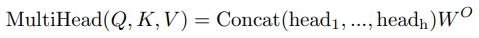

# Introduction

본 포스트는 철저히 내가 공부한 내용을 쉽게 리마인드 하기위해 작성하였다. 앞뒤 내용 빼고 몸통만 설명하므로 자세한 설명이 필요한 분들은 다른 곳을 찾아보시길 바란다.  

# 1. Attention Is All You Need

<table>
<colgroup>
<col width="10%" />
<col width="90%" />
</colgroup>
<thead>
<tr class="header">
<th>Title</th>
<th>Attention Is All You Need</th>
</tr>
</thead>
<tbody>
<tr>
<td markdown="span">Authos</td>
<td markdown="span">Ashish Vaswani외 6명 (모두 Google Brain)</td>
</tr>
<tr>
<td markdown="span">Publisher</td>
<td markdown="span">NIPS, 2017</td>
</tr>
</tbody>
</table>

> 주요 참고 자료: 허민석 <https://www.youtube.com/watch?v=mxGCEWOxfe8&list=PLVNY1HnUlO26qqZznHVWAqjS1fWw0zqnT>

## 1.1. Model Architecture

  

예시를 들 때 편의상 번역기를 가정하고 예시를 만든다. Transformer가 번역기에서 좋은 결과가 나왔을 뿐만 아니라 가장 전형적인 sequence-to-sequence 모델이기 때문이다. 여기서는 "GNU is Not Unix"를 "그누는 유닉스가 아니다"로 번역하는 경우를 생각해본다.

### A. Encoder

#### A.1 Input

'GNU', 'is', 'Not', 'Unix' 각각을 word2vec 같은 워드 임베딩을 통해 벡터로 만든다. 전체 입력의 길이를 $$L_{in}(=4)$$이라 한다. 입력을 하나씩 순서대로 임베딩 하는게 아니라 한번에 모두 임베딩을 계산해야 한다. 임베딩의 결과는 $$M (L_{in},d_{model})$$ 이다.  

Input Embedding에는 순서를 알려주기 위해 다음과 같은 Positional Encoding을 더해준다.  

#### A.2. Linear

인코더에는 모든 입력이 한번에 들어간다. $$(L_{in},d_{model})$$ 모양의 입력이 Query, Key, Value 세 갈래로 들어간다. 각각은 linear 레이어를 통과하여 서로 다른 특성을 학습하게 한다. Multi-Head Attention에서는 여러개의 attention을 위한 다른 입력을 만들어야 하기 때문에 $$h(=8)$$개의 Head가 있다면 사실상 linear 레이어의 출력 차원이 $$h$$배가 되는 셈이다.

Query, Key, Value 모두 처음에는 $$(L_{in},d_{model})$$ 이었는데 각 head의 linear 레이어를 통과하면 Query, Key는 $$(L_{in},d_k)$$가 되고 Value는 $$(L_{in},d_v)$$ 가 된다. Value의 dimension을 다르게 할 수도 있지만 논문에서는 $$d_k=d_v=d_{model}/h=64$$ 로 모두 같게 한다.  

실제 구현을 한다면 $$h$$개의 head를 위해 따로 linear 레이어를 구성하기 보다는 출력 차원이 $$h * d_k$$인 하나의 linear 레이어로 최적화 할 것 같다.  

#### A.3. Self-attention

**Self-attention 내부에는 학습 파라미터가 없다.** "Scaled Dot-Product Attention"그림에 나온대로 단순히 아래 식을 계산할 뿐이다. $$\sqrt{d_k}$$ 로 나눠주는 이유는 학습 효율을 개선하기 위함이다. Dimension이 늘어날수록 전반적으로 dot product($$QK^T$$)의 크기 편차가 커지고 그에 따라 softmax결과로 0에 가까운 값이 많이 나와서 gradient도 0에 가깝게 나온다. Dimension에 비례하여 dot product의 스케일을 줄이면 이러한 현상을 완화할 수 있다고 한다.

$$QK^TV$$의 차원은 $$(L_{in},d_k) \times (d_k,L_{in}) \times (L_{in},d_v) = (L_{in},d_v)$$ 이다. Self-attention 식의 $$Q,K,V$$는 사실 Multi-head attention 식의 $$QW^Q, KW^K, VW^V$$ 이다. 논문에서는 self-attention 식을 먼저 설명해서 편의상 새로운 기호를 쓰지 않고 $$Q,K,V$$를 쓴 것 같다.  

**Self-attention의 의미**는 무엇일까? 첫 번째 dot product $$QK^T$$ 에서 $$(L_{in},L_{in})$$의 행렬이 나오는데 무슨 의미일까? $$QK^T$$의 (i,k) 원소의 의미는 i번째 query와 k번째 key 사의의 연관성이라고 볼 수 있다. "GNU is Not Unix" 예시에서 (0, 2) 원소는 'GNU'와 'Not' 사이의 연관성이다. 이 연관성을 합이 1이 되도록 normalize 하기위해 softmax를 한다.  

단어 사이의 연관성을 계산한 후 Value를 곱하면 $$QK^TV$$의 i번째 행(row)는 i번째 단어에 대한 새로운 임베딩이 된다. 이것은 i번째 단어의 정보 뿐만 아니라, i번째 단어와의 연관성에 따라 모든 단어의 linear combination이기 때문에 전체 문맥에서 가지는 i번째 단어의 의미 같은 것을 알 수 있게 된다. 이점이 RNN과의 가장 큰 차이점이다. 순서대로 입력하지 않고 처음부터 전체를 다 보기 때문에 sequence가 길어져도 멀리 떨어진 단어들 사이의 관계를 파악할 수 있다. 언어 사이의 어순이 달라도 이를 처리할 수 있다.

#### A.4. Multi-head attention

Multi-head attention에서는 self-attention을 여러개 사용하는데 이건 마치 CNN의 convolution에서 채널 마다 다른 특징을 추출하는 것과 비슷한 것 같다. Self-attention도 하나만 있으면 정확한 문맥 파악을 잘 못 할수 있지만 여러가지 self-attention을 쓰면 다양한 문맥적 의미를 탐색하여 최종적으로는 더욱 정확한 의미를 알 수 있다.  

Multi-head attention에서는 $$d_v$$ 차원의 출력이 $$h$$개 나온다. 최종 출력은 입력과 같은 $$d_{model}$$ 이 되어야 하기 때문에 Multi-head의 결과물들을 concat하여 $$h * d_v$$ 차원의 행렬을 만들고 여기에 $$W^O (h*d_v,d_{model})$$을 곱하여 $$d_{model}$$ 차원의 벡터를 출력한다.  

$$(L_{in}, h*d_v) \times (h*d_v, d_{model}) = (L_{in}, d_{model})$$

#### A.5. Feed forward

Multi-head attention 이후 Add&Norm 레이어가 있다. ResNet 처럼 입력을 출력에 더해주는데 이것은 벡터(단어의 임베딩)의 순서 정보를 잊지 않기 위함이다. [Layer Normalization](https://arxiv.org/abs/1607.06450) 까지 적용후 feed forward net(FFN)을 통과하는데 이것은 단순히 Linear-ReLU-Linear 조합이다. 

FFN은 벡터(단어)별로 따로 적용된다. 같은 레이어에서 벡터 별 적용되는 $$W_1, W_2$$는 같지만 레이어 별로 다른 weight를 가진다. 이후 한 번 더 Add&Norm 레이어를 통해 입력과 출력을 더하고 정규화한다.  

#### A.6. Stack

인코더는 self-attention과 FFN이 결합된 하나의 인코더 레이어를 6번 쌓아 만든다. 인코더의 최종 출력만 디코더에 입력으로 들어간다. 인코더는 auto-regressive 하지 않기 때문에 출력이 입력으로 다시 들어가지 않고 병렬로 모든 입력 데이터를 처리한다.

### C. Decoder

디코더도 인코더와 비슷한데 세 가지 차이가 있다.

#### C.1. Input

인코더와 달리 디코더는 auto-regressive 하다. 이전의 출력이 현재의 입력으로 들어간다. 디코더의 첫 입력은 SoS (Start of Sentence)이고 이후 출력이 하나씩 붙어서 점점 입력 단어 수가 늘어난다. 계속 출력이 입력에 추가되다가 EoS (End of Sentence) 가 출력되면 중단된다.  

#### C.2. First multi-head attention

디코더에서는 multi-head attention이 두 개 들어간다. 첫 번째는 **Masked** mutli-head attention 인데 'mask'는 "Scaled Dot-Product Attention" 그림에서 "Mask (opt.)"라고 된 블럭을 말한다. 디코더의 첫 번째 multi-head attention에서만 이 masking이 적용된다.  

논문에서는 auto-regressive한 성질을 유지하기 위해, 즉 미래의 입력을 사용하는 "leftward information"을 막기 위해, softmax 전에 미래 입력에 대한 값들을 $$-\infty$$로 바꿔서 softmax에서 0이 나오도록 했다.  

여기서 의문이었던 점은 원래 입력에 과거부터 현재까지의 단어만 들어오는데 masking 해야 할 미래의 입력이 무엇인지 이해할 수 없었다. 하지만 코드를 보니 학습할 때는 target sentence (GT output)을 디코더에 바로 넣어서 한번에 문장이 나오도록 했다. 즉 "\<SoS\> 그누는 유닉스가 아니다"를 바로 디코더에 입력해서 "그누는 리눅스가 아니다 \<EoS\>"가 나오도록 학습하는 것 같다. 그래서 각 단어별로 그 다음 단어에 대한 입력을 masking 하게 한 것이다. 예를 들면 '그누'라는 단어를 처리 할 때는 '유닉스가', '아니다'를 masking 하는 것이다.

#### C.3. Second multi-head attention

두 번째 multi-head attention은 입력 구성이 다르다. 기존에는 하나의 입력이 세 갈래로 갈라지면서 Query, Key, Value가 됐다. 여기서는 인코더의 최종 출력이 Value, Key로 들어오고 첫 번째 attention의 출력은 Query로만 들어간다.  

다음 레이어로 넘어가는 Value(단어 임베딩?)은 인코더에서 가져오고 인코더의 Key와 디코더의 Query를 dot product 한다. 인코더는 입력 언어(영어)에 대한 정보를 담고 있고 디코더는 새로운 언어(한글)에 대한 정보를 담고 있다. 디코더의 Query를 이용해 인코더의 Value 중에서 이번에 출력될 다음 단어(한글)와 관련된 입력 언어(영어)의 단어 정보를 조합하는 것이다.

### D. Final Output

논문에서도 유툽, 블로그 등에서도 간단히 최종 출력은 Linear - Softmax로 다음 단어가 하나 나오고 끝나는 듯 말하지만 세부적인 내용을 숨기고 있다.  

인코더에서는 입력과 출력의 dimension이 똑같다고 했다. 즉 입력 단어가 5개면 출력되는 임베딩도 5개다. 디코더도 거의 비슷한 구조인데 auto-regressive하게 출력을 내면 출력되는 임베딩의 개수가 늘어날 수 밖에 없다. 처음엔 1개, 다음엔 2개 이런식으로 디코더 자체의 출력 임베딩 수가 늘어나게 된다. 출력 데이터의 차원이 일정하지 않은데 어떻게 Linear 레이어를 적용할까?  

[번역하는 코드](https://github.com/jadore801120/attention-is-all-you-need-pytorch/blob/132907dd272e2cc92e3c10e6c4e783a87ff8893d/transformer/Translator.py#L86)를 보니 for문을 돌면서 auto-regressive 하게 하는 것 같지만 `_get_the_best_score_and_idx` 이 함수가 끝내 잘 이해되진 않았다. 대략 추측하기로는 마지막 Linear - Softmax 레이어도 출력 임베딩 별로 따로 적용하고 그 결과로 나온 단어 별 벡터들을 스텝별로 쌓아두고 그 중에서 가장 좋은 (score가 높은?) 벡터를 선택하는 것 같다. 즉 단어를 순서대로 입력하면 '그누는'이라는 단어가 디코더에 세 번 들어가는데 그 결과로 나온 세 개의 벡터 중에 가장 좋은 것을 선택하는 것 같다.  

## 1.2. Loss

딥러닝 논문이라면 자로고 Loss를 잘 설명해야 하거늘 이 논문에는 loss라는 단어가 아예 없다!  

결과가 softmax로 나오므로 당연히 cross entropy loss를 쓸거라고 생각은 하지만... Loss와 관련된 내용은 label smoothing을 쓴다는 것 뿐이다.  

# 2. DETR

<table>
<colgroup>
<col width="10%" />
<col width="90%" />
</colgroup>
<thead>
<tr class="header">
<th>Title</th>
<th>End-to-End Object Detection with Transformers</th>
</tr>
</thead>
<tbody>
<tr>
<td markdown="span">Authors</td>
<td markdown="span">Nicolas Carion 외 6명 (모두 Facebook AI)</td>
</tr>
<tr>
<td markdown="span">Publisher</td>
<td markdown="span">ECCV, 2020</td>
</tr>
<tr>
<td markdown="span">github</td>
<td markdown="span"> https://github.com/facebookresearch/detr </td>
</tr>
</tbody>
</table>

DETR 모델은 Transformer를 detection에 응용한 첫 논문이다. Transformer가 단순히 시계열 데이터 뿐만 아니라 영상에도 사용될 수 있음을 보여줬다. Detection에 Transformer를 사용하여 생기는 장점으로는 anchor 기반 box decoding이나 NMS (Non-Maxiumum Suppression) 같은 후처리 없이 바로 객체(class + bounding box)를 출력한다는 것이다. DETR은 정해진 $$N$$개의 객체를 출력하고 그 중에서 객체가 아닌 것들은 `no object`로 처리되어 실질적인 출력 객체 수를 조절할 수 있다.  

## 2.1. Model Architecture

### A. Backbone

이미지를 특징 벡터로 만들기 위해 CNN을 사용한다. 

1. 입력: image, $$x_{img} \ (3, H_0, W_0)$$, 파이토치에서는 channel-first dimension 사용

2. 출력: feature map, $$f \ (C, H, W), \ C=2048, \ H=H_0/32, \ W=W_0/32$$, 

### B. Encoder

feature map의 dimension이 너무 크기 때문에 1x1 convolution을 통해 채널을 $$d$$개로 줄인다. 이후 데이터 변형을 거쳐 $$HW$$ 개의 $$d$$ 차원 벡터를 인코더에 입력하여 같은 모양의 출력(임베딩)을 얻는다. 여기서는 feature map의 각 픽셀 데이터들이 sequence를 이루는 셈이다.

1. conv: $$f \rightarrow z_0 \ (d,H,W), \ d \ll C$$
2. reshape: $$z_0 \rightarrow z_1 \ (d, HW)$$
3. permute: $$z_1 \rightarrow z \ (HW, d)$$
3. encoder: $$z \rightarrow g \ (HW, d)$$

실제 구현에서는 batch size까지 들어가서 2, 3이 다음과 같이 구현된다.

1. `h` : $$(B,d,H,W)$$
2. `h.flatten(2)` : $$(B,d,HW)$$
3. `h.flatten(2).permute(2,0,1)` : $$(HW,B,d)$$

인코더 구조 자체는 순서와 상관없기 때문에 (permutation-invariant) 순서를 알려주기 위한 positional encoding을 인코더 입력 직전에 더해준다. 자세한 구조는 아래 그림에 나와있다.  

### C. Decoder

DETR의 디코더는 *Attention Is All You Need* 와는 다르게 auto-regressive 하지 않다. N개의 query를 처음에 한번에 입력해서 N개의 출력을 한번에 얻고 끝낸다. 코드에서 확인한 바로는 그림의 "Object queries"는 단순히 모양만 맞춘 zeros 행렬이다. 처음에는 zeros지만 attention 레이어에 들어가기전에 positional encoding이 더해지기 때문에 query 별로 다른 값을 가질 수 있다. 두 번째 디코더에서부터는 이전의 디코더 출력이 다음 디코더의 입력이 되므로 점점 의미를 더해갈 수 있다.  

### D. FFN

디코더 이후에 실제 detection 결과를 내기 위해 feed-forward network (FFN)을 통과한다. 최종 출력은 클래스와 박스 정보다. 클래스 예측을 위해 linear 레이어 하나를 쓰고 여기에 softmax를 적용하면 클래스 확률이 된다.  클래스에는 no obect가 포함된다.  

박스 예측을 위해 linear-relu-linear-relu-linear 구조를 가진 FFN을 사용하고 여기에 sigmoid를 적용하면 박스의 (y,x,height,width)를 이미지에 대한 비율로 출력할 수 있다.  

## 2.2. Loss

### A. Bipartite Matching

Loss를 계산하기 위해서는 우선 모델의 prediction set과 GT set을 매칭을 시켜야한다. DETR에서는 prediction과 GT를 1:1 매칭을 하는데 이를 **bipartite matching**이라고 표현한다. 매칭 방법은 Hungarian algorithm을 쓴다고 하는데 구현 방법은 모르겠지만 모든 매칭에 대한 손실의 합을 최소화하는 매칭 쌍을 찾는다고 한다. 각 GT 객체와 매칭되는 prediction 객체는 아래 식으로 구한다.

  =  

- $$y, \ \hat{y}$$ : GT and prediction object
- $$\sigma(i)$$ : i번째 GT에 매칭되는 prediction index
- $$b, \ \hat{b}$$ : GT and prediction bounding box
- $$c_i$$ : GT class index
- $$\hat{p}_{\sigma(i)}(c_i)$$ : $$\sigma(i)$$ 번째 prediction 객체에서 출력된 $$c_i$$ 번째 클래스의 확률

매칭 Loss의 의미는 "매칭 쌍 사이의 box loss는 작아야하고 정답 클래스의 확률은 높아야 한다"는 것이다. 모든 매칭 쌍에 대해 매칭 loss의 합이 최소가 되는 1:1 매칭을 찾겠다는 것이다. GT와 매칭되는 prediction이 없으면 no object로 매칭이 된다.

### B. Training Loss

학습에 사용되는 loss는 클래스를 위한 cross-entropy loss와 box loss의 합이다. Box loss는 GIoU loss와 L1 loss의 조합이다.

  =  

# 3. Deformable DETR

<table>
<colgroup>
<col width="10%" />
<col width="90%" />
</colgroup>
<thead>
<tr class="header">
<th>Title</th>
<th>DEFORMABLE DETR: DEFORMABLE TRANSFORMERS FOR END-TO-END OBJECT DETECTION</th>
</tr>
</thead>
<tbody>
<tr>
<td markdown="span">Authors</td>
<td markdown="span">Xizhou Zhu 외 5명 (주로 SenseTime Research)</td>
</tr>
<tr>
<td markdown="span">Publisher</td>
<td markdown="span">ICLR, 2021</td>
</tr>
<tr>
<td markdown="span">github</td>
<td markdown="span"> https://github.com/fundamentalvision/Deformable-DETR </td>
</tr>
</tbody>
</table>

Deformable DETR은 기존 DETR의 두 가지 문제를 **deformable attention module**로 해결하였다.

- 느린 수렴 속도: 500 epoch은 학습시켜야함 → 10배 감소
- 많은 연산량, 메모리 필요: 픽셀 수 제곱 비례 → 선형 비례

## 3.1. Deformable Attention Module

기존 DETR의 문제는 encoder의 연산량에 있다. 이미지에서 $$HW$$개의 feature vector들이 만들어지고 이게 모두 Query, Key, Value로서 들어간다. 모양이 $$Q (HW,C), \ K(HW, C)$$ 이므로 $$QK^{T}$$만 해도 연산량이 $$O(H^2W^2C)$$가 된다. 연산량이 픽셀 수에 제곱에 비례하므로 고해상도 이미지, 혹은 feature map을 처리할 수 없고 따라서 작은 객체를 잡기가 어려워진다. CNN 기반 detector들이 multi-scale feature map을 써서 다양한 크기의 객체들을 검출하는데 DETR은 연산 시간이나 메모리의 벽에 막혀 고해상도 feature map을 처리할 수 없게 된다.  

Deformable attention은 Key, Value의 개수를 줄였다. 위 그림은 query feature vector 하나 $$\mathbf{z}_q$$를 처리하는 과정이다. $$\mathbf{z}_q$$의 feature map 좌표가 reference point $$\mathbf{p}_q$$ 이다.  

$$\mathbf{p}_q$$에 어떤 객체가 있냐? 라는 query에 대답하기 위해 head에서는 $$\mathbf{p}_q$$ 근처의 점들을 $$K_0$$개 샘플링하여 key, value로 사용한다. (그림에서 $$K_0=3$$) 당연히 그래야 할 것 같지만 DETR에서는 $$\mathbf{p}_q$$에 있는 객체를 찾기 위해 모든 픽셀의 정보를 취합했다. Deformable attention에서는 $$QK^{T}$$의 연산량이 $$O(HWK_0C)$$ 이 된다. $$K_0 \ll HW$$이므로 DETR의 $$O(H^2W^2C)$$ 보다는 훨씬 줄어드는 것이다.

단순히 연산량이 줄어든 것 뿐만 아니라 attetion의 방식 자체가 달라졌다. $$K_0$$개의 샘플들은 그림의 "Sampling Offsets" 박스에 나온대로 query에 linear 레이어를 적용하여 reference point에 대한 상대 좌표를 만들어낸다. 이 linear 레이어도 학습이 되므로 검출에 유리한 주변 점들의 위치를 학습하게 된다.  

DETR의 attention 방식은 모든 픽셀에 일단 attention을 골고루 뿌려놓고 학습을 통해서 서서히 attention이 특정 픽셀들로 집중된다. 그래서 학습이 오래 걸린다.  

Deformable DETR은 query와 관련된 픽셀을 상대적으로 적은 개수로 정해놓고 관련 픽셀의 위치를 학습하기 때문에 학습이 빠르게 진행될 수 있다.  

## 3.2. Deformable Transformer

Deformable Transformer의 전체적인 모습은 위 그림과 같다. 기존 DETR에서 attention 모듈을 deformable attention로 바꾼것이다. 인코더의 self-attention과 디코더의 cross-attention은 deformable로 바꿨고 디코더의 self-attention은 기존 그대로 사용했다.  

## 3.3. Additional Improvements

#### A. Iterative Bounding Box Refinement

Bounding box의 정확도를 높이기 위해 첫 디코더 레이어에서 box 출력을 하고 다음 레이어에서는 이전 레이어에서 출력된 box를 보정하는 것을 반복한다.  

#### B. Two-Stage Deformable DETR

인코더를 RPN(region proposal network)으로 쓰고 거기서 나온 proposal을 디코더의 object queries로 사용한다. 그런데 정확히 어떻게 인코더를 RPN으로 쓰는지는 모르겠다.  

