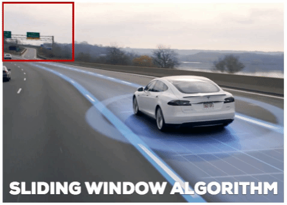

# About This Lecture

이 강의는 한양대학교 대학원생들을 대상으로 "Deep Learning based Object Detection(딥러닝 기반 객체 검출)"이라는 주제로 강의를 합니다. 강의 순서는 다음과 같습니다.

1. **Introduction to Object Detection**: Object Detection에 대한 전반적인 소개를 합니다.
   1. CNN Models: CNN을 활용한 다양한 응용 모델 설명
   2. Problem Definition: 분류, 검출, 분리 문제 정의
   3. Performance Metric: 검출 성능을 나타내는 지표 설명
2. **Two-Stage Detectors**: Two-Stage Detector 모델들을 소개하고 실습해봅니다.
3. **One-Stage Detectors**: One-Stage Detector 모델들을 소개하고 실습해봅니다.
4. **Transformer-Based Detectors**: Transfomer 기반으로 구현된 Detector 모델들을 소개합니다.

이 강의를 통해서 여러분들이 배울 수 있는 것은 다음과 같습니다.

- 객체 검출 모델의 발전 역사
- CNN기반의 classification + regression이 혼합된 지도 학습 방법
- 학습된 모델을 이용한 객체 검출 방법 (실습)

# Introduction to Object Detection

Object Detection(객체 검출)이란 영상(image)에서 객체의 영역과 종류를 알아내는 일이다. 객체 검출은 NLP(자연어 처리)와 함께 딥러닝에서 가장 연구가 활발한 분야 중 하나다. 영상에서 객체를 찾는 일은 인간의 시각적 인식기능을 (일부) 대신할 수 있기 때문에 활용할 수 있는 분야가 광범위하고 모델의 입출력 데이터를 정형화하기 쉬우므로 딥러닝 모델을 적용하기에 적합하기 때문이다. 이번 자료에서는 객체 검출의 문제 정의와 성능 평가 방법, 개략적인 발전사를 다룬다.

## 1. CNN Models

딥러닝 기반 컴퓨터 비전은 거의 대부분 CNN(Convolutional Neural Networks) 기반으로 개발되는데 영상(image) 혹은 동영상(video)을 입력으로 받는 것은 동일하지만 출력은 학습 데이터만 있다면 원하는대로 만들 수 있다. 출력에 따라 모델의 종류가 여러가지로 나뉜다. 

CNN 기반 컴퓨터 비전 기술은 **Image Classification** (영상 분류) 기술로부터 출발했다. 2015년까지만 해도 **ImageNet** 데이터셋에서 누가 어떻게 최고 분류 성능을 내느냐가 학계의 가장 큰 이슈였다. 영상 분류 성능을 끌어올리는 과정에서 지금도 많은 사람들이 가장 많이 쓰는 Backbone 모델들이 개발됐다. Backbone 모델들은 영상에서 다양한 수준의 풍부한 특징(feature)를 추출하기 위해 발전했다. VGG, ResNet, Inception 등의 대표적인 CNN 구조들이 영상 분류를 위해 2014~2016 사이에 집중적으로 만들어졌고 그 이후에도 새로운 구조들이 꾸준히 나오고 있다.

이러한 Backbone 모델들을 기반으로 **Object Detection** (객체 검출) 기술이 발전하기 시작했다. 시작은 2013년 R-CNN이 꼽히지만 제대로 성능을 내면서 성능 경쟁에 불이 붙기 시작한건 Faster R-CNN과 YOLO가 발표된 2015년부터다. 객체 검출은 영상 분류보다는 훨씬 복잡한 문제고 난이도도 높기 때문에 검출 성능을 올리기 위해 다양한 CNN 관련 기술들이 발전했다. 객체 검출은 인공지능의 양대 축인 분류(classification)과 회귀(regression) 문제를 동시에 풀어야 하기 때문에 객체 검출 모델을 이해하면 CNN을 다양한 분야로 적용할 수 있는 통찰력을 얻을 수 있다.  

객체 검출 모델의 성공으로 사람들이 CNN의 다양한 활용성에 눈뜨게 되고 셀 수 없이 많은 분야에 CNN 기술이 응용된다. 그 중 가장 큰 비중을 차지하는 것은 검출 기술을 한 단계 더 발전시킨 **Image Segmentation** (영상 분리) 기술이다. 객체 영역을 픽셀단위로 세밀하게 구분하는 기술로, 2015년 FCN, 2017년 Mask R-CNN 모델 등이 가장 유명하다.  

그 외에도 CNN의 regression 기능을 응용하여 동영상에서 객체를 추적(tracking)하는 기술, 얼굴이나 몸의 구조적 랜드마크를 검출하는 기술, 움직이는 동작을 분석하는 기술 등이 있고 요즘은 주어진 영상을 합성하여 새로운 영상을 합성하는 생성(generative) 모델들이 많이 연구되고 있다.

## 2. Problem Definition

아래 그림은 컴퓨터 비전의 분류, 위치인식, 검출, 분리 네 가지 기술을 비교한 것이다.  

각 기술에 대한 정의는 다음과 같다.  

1. **Image Classification** (영상 분류) : 영상에 들어있는 대표 객체의 종류를 분류한다. 분류해야 할 객체의 종류는 사전에 정의되어야 한다. 정의된 분류에 따라 annotation이 달린 영상 데이터셋으로 딥러닝 모델을 학습시켜서 임의의 영상을 분류할 수 있게 만든다. 모델의 출력은 다음과 같다.
   - $$p_0, ..., p_{K-1}$$ : K개의 클래스에 대한 확률
2. **Localization** (위치인식) : 영상에 들어있는 대표 객체의 영역을 사각형의 bounding box (경계 상자) 형식으로 출력한다. 경계 상자의 출력 형식은 다음 보기와 같이 다양하다.
   1. $$x_1, y_1, x_2, y_2$$ : 상자의 왼쪽 위 좌표와 오른쪽 아래 좌표
   2. $$c_x, c_y, w, h$$ : 상자의 중심 좌표와 너비, 높이
   3. $$x, y, w, h$$ : 상자의 왼쪽 위 좌표와 너비, 높이
3. **Object Detection** (객체 검출) : 영상에서 다수의 객체를 찾는다. 각 객체의 경계 상자를 찾는 위치인식을 하고 그 영역에 대해 객체의 종류를 분류한다. 영상 분류와 위치인식을 여러 객체에 대해 출력하는 것이다. 모델의 출력은 다음과 같다.
   - $$p_0^i, ..., p_{K-1}^i$$ : i번째로 발견된 객체의 클래스 별 확률
   - $$x_1^i, y_1^i, x_2^i, y_2^i$$ : i번째로 발견된 객체의 경계 상자 (표현 형식은 달라질 수 있음)
4. **Image Segmentation** (객체 분리) : 영상에서 다수의 객체 영역을 분리한다. 각 객체의 픽셀별로 객체의 종류를 분류하고 객체(instance)도 구분을 해야한다. 종류만 구분하느냐 객체도 구분하느냐에 따라 semantic segmentation, instance segmentation, panoptic segmentation 등으로 나뉜다. Instance segmentation 모델의 출력은 다음과 같다.  
   - $$p_0^i, ..., p_{K-1}^i$$ : i번째로 발견된 객체의 클래스 별 확률
   - $$x_1^i, y_1^i, x_2^i, y_2^i$$ : i번째로 발견된 객체의 경계 상자 (표현 형식은 달라질 수 있음)
   - $$f^j$$ : i번째 경계 상자 내부의 j번째 픽셀이 전경(foreground)일 확률, 즉 검출된 객체 위의 픽셀일 확률

## 3. Performance Metric

### 3.1. Detection Decision

모델에서 객체 검출을 했을 때 검출이 성공했다는 것을 어떻게 확인할 수 있을까? 검출 모델은 앞서 말한것처럼 분류 확률과 경계 상자 두 가지 출력을 낸다. 경계 상자는 해당 객체의 영역을 나타내고 분류 확률은 영역 안의 객체의 클래스 정보를 나타낸다. 두 가지가 모두 맞아야만 객체를 제대로 검출했다고 볼 수 있다.  

분류가 성공하려면 클래스 별 확률 중에 가장 높은 확률의 클래스와 실제 클래스와 일치해야 한다. 이를 식으로 쓰면 다음과 같다. 
$$
\hat{c}^i == c^i = \underset{x}{\mathrm{argmin}} \ p_k^i
$$
$$\hat{c}^i$$는 i번째 객체에 대한 실제 클래스(Ground Truth, GT)이고 $$c^i$$는 i번째 객체에 대해 모델에서 예측한 클래스다. 클래스 예측은 출력된 확률을 최대화 하는 클래스를 선택한다.  

경계 상자가 실제 객체의 영역과 일치하는지는 IoU (Intersection over Union)를 통해 확인한다. IoU는 두 객체 사이의 겹치는 부분의 비율이다. 아래 그림을 보면 쉽게 이해할 수 있다.  

아래 그림에서는 다양한 IoU 예시를 보여준다. 녹색이 실제 경계 상자고 흰색이 예측된 경계 상자다.

객체 검출 연구에서는 보통 클래스 예측이 맞고 IoU가 50% 이상이면 검출 성공으로 판단한다.  

### 3.2. Recall, Precision

개별 객체가 검출됐는지는 위에서와 같이 판단할 수 있지만 여러 객체가 있는 다수의 영상에서 전체적인 성능은 어떻게 평가해야 할까? 실제 객체와 예측된 객체들이 다수 있을 때 세 가지 경우로 분류할 수 있다.

1. True Positive (TP) : 실제 객체를 예측된 객체가 성공적으로 검출한 경우다. 실제 객체와 예측 객체의 교집합이라고 볼 수 있다.
2. False Positive (FP) : 직역하면 "잘못된 양성"인데 **실제 객체가 없는 곳**에서 발생한 예측 객체들이 여기에 속한다.
3. False Negative (FN) : 직역하면 "잘못된 음성"인데 **예측 객체가 없는 곳**에서 발생한 실제 객체들이 여기에 속한다.

이론적으로 True Negative (TN)도 있지만 객체 검출에서는 "실제로도 없고 예측도 없는" 유형으로 여기에 속하는 객체가 없기 때문에 고려하지 않아도 된다. TP, FP, FN을 가지고 두 가지 검출 성능을 계산할 수 있다.
$$
Recall={TP \over TP + FN}, \ Precision={TP \over TP + FP}
$$

- Recall (재현율): 성공적으로 검출된 객체 수 / 전체 실제 객체 수, recall이 높으면 실제 객체를 빠짐없이 검출했다는 뜻이다.
- Precision (정밀도): 성공적으로 검출된 객체 수 / 전체 예측 객체 수, precision이 높으면 객체 예측을 틀리지 않고 정확하게 한다는 뜻이다.  

Recall과 Precision은 일반적으로 서로 반비례 관계에 있다. 영상에서 객체 예측의 기준을 낮춰서 많은 수의 예측 객체가 나오게 만들면 실제 객체와 일치하는 예측 객체(TP)도 많아질 것이다. 하지만 실제 객체와 일치하지 않는 예측 객체(FP)도 많아질 것이다. 이 경우 Recall은 올라가고 Precision은 떨어질 것이다.  

반대로 객체 예측 기준을 높여서 적은 수의 예측 객체만 나오게 만들면 실제 객체 중에 놓치는 것(FN)도 많아지겠지만 예측된 객체들은 실제 객체와 일치(TP)할 확률이 높아진다. 이 경우 Recall은 떨어지고 Precision이 오르게 된다.  

검출 모델은 가급적 두 가지를 균형있게 개선하는 것이 좋다.

### 3.3. mAP

Recall, Precision으로도 모델의 객체 검출 성능을 표현할 수는 있지만 지표가 두 가지기 때문에 다른 모델과의 비교 우위를 가늠하기가 어렵다. A 모델은 상대적으로 recall이 높고, B 모델은 precision이 높다면 어떤 모델이 더 나은 모델이라고 할 수 있을까? 그런데 사실 같은 모델이라도 예측 기준을 어떻게 잡느냐에 따라 recall과 precision은 크게 달라진다. 예측 기준에 따라 달라지는 recall과 precision으로 두 가지 모델을 비교하는 것은 어려운 일이다.  

그래서 mAP(mean Average Precision)이라는 성능 지표가 나왔다. mean도 평균이고 average도 평균인데 무슨 말일까? mAP는 AP라는 지표의 평균인데 AP는 예측 기준에 따라 달라지는 recall, precision을 종합적으로 평가하기 위해 만들어졌다. 다음은 AP는 예측 기준에 따라 달라지는 recall, precision을 그래프로 그린 것이다. 가로축이 recall, 세로축이 precision이다. 이러한 그래프를 PR curve (precision-recall curve)라고 한다. [(Source)](https://deep-learning-study.tistory.com/407)   

예측 기준이 낮을 때는 recall이 높고 precision이 낮기 때문에 오른쪽 아래에 점이 찍히고 예측 기준이 높아질수록 recall이 낮아지고 precision이 높아지기 때문에 대체로 왼쪽 위로 올라간다. 그렇다고 계속 왼쪽 위로 올라가기만 하는것은 아니고 그림에서 보다시피 국소적으로 내려가는 구간이 생기기도 한다.  

이러한 PR curve에서 아래 그림처럼 왼쪽에서 오른쪽을 갈때 내려가는 구간을 평평하게 잇고 그 아래의 면적을 구한 것이 AP (average precision)이다. [(Source)](https://deep-learning-study.tistory.com/407)  

그래프에서 0~1 범위의 x축에 대해 y축 값을 적분하면 0~1 구간에서 y의 평균값이 된다. 그래서 AP는 모든 recall 범위(0~1)에서 precision의 평균값이라고도 볼 수 있다. 그래서 말 그대로 Average Precision 이다.  

그래프에서 오른쪽 방향으로 내려가는 구간을 평평하게 잇는 이유는 무엇일까? 어떤 모델의 성능이 예측 기준값(score threshold)이 0.8일 때 recall-precison이 (0.8, 0.6)이 나왔는데 기준값을 0.5로 했더니 recall-precision이 (0.6, 0.4)가 나왔다. 이 경우에는 recall과 precision이 모두 떨어졌기 때문에 둘 사이의 trade-off 관계가 없다. 기준값 0.5일 때 성능이 그냥 떨어진다. 이런 사실을 알고 있다면 아무도 기준값 0.5를 쓰지 않을것이다. Precision이 조금이라도 오르기 전까지는 그냥 높은 기준값(0.8)을 유지하는 것이 낫다. 굳이 성능이 낮을때의 값을 AP 계산시에 넣을 필요가 없기 때문에 precision이 낮아지는 구간은 무시한다.  

AP는 각 클래스별로 따로 계산되고 클래스별 AP들을 평균을 낸 것이 바로 mAP (mean Average Precision)이다. 그래서 객체 검출 논문을 보면 실험 결과에 기존 논문들에 비해 mAP가 얼마나 향상되었는지를 비교하는 표가 항상 나온다. 다음은 EfficientDet 논문의 성능 비교표다. 과거 논문들과 mAP와 연산량, 수행속도 등을 비교하는 것을 볼 수 있다. [(Source)](https://arxiv.org/abs/1911.09070)   

## 4. Benchmarks

벤치마크는 여러가지 모델의 성능을 동일한 조건에서 비교할 수 있는 도구가 필요하다. 딥러닝의 경우 성능을 평가하기 위해서는 데이터셋이 필요하다. 벤치마크 데이터셋은 동일한 데이터로 학습하고 평가할 수 있도록 학습/검증/평가 부분으로 나뉘어진다. 대표적으로 딥러닝 기반 컴퓨터 비전의 발전을 이끌었던 ImageNet 데이터셋이 있다. ImageNet은 영상 분류를 위한 것이고 객체 검출에서는 2015년까지는 PASCAL VOC 데이터셋이 주로 사용되다가 이후로는 Microsoft의 COCO 데이터셋이 거의 표준으로 사용되고 있다. 기존 연구에서 모두 COCO 데이터셋으로 성능 비교를 해왔기 때문에 후속 연구도 COCO 데이터셋을 이용해 비교할 수 밖에 없다. 물론 COCO도 2020년 이후로 업데이트가 끝낫기 때문에 새로운 데이터셋이 새로운 표준이 될 가능성은 얼마든지 있다. 다음은 주요 데이터셋의 특징을 요약한 것이다.

|         | PASCAL VOC 2007 | PASCAL VOC 2012 | MS COCO  |
| ------- | --------------- | --------------- | -------- |
| Classes | 20              | 20              | 80       |
| Frames  | 9,963           | 11,530          | 200,000~ |
| Objects | 24,640          | 27,450          | 500,000~ |

## 5. History

Object Detection은 인간의 시각적 인지 기능과 비슷한 역할을 할 수 있기 때문에 오래전부터 영상에서 객체들을 자동으로 검출하기 위한 많은 시도들이 있었다. 비싼 장비 없이 값싼 카메라 하나로 인간 수준의 객체 인식 기능을 구현하는 것은 지금도 많은 연구자들의 꿈이다. 딥러닝 기술이 적용되면서 높은 인식 성능을 가지는 객체 검출 모델이 많아졌지만 그 전에도 다양한 알고리즘이 있었다. 다음 그림은 객체 검출 기술의 역사를 간략히 나타낸 것이다. [(Source)](https://arxiv.org/pdf/1905.05055.pdf)  

### 5.1. Before Deep Learning: HoG

HoG (Histogram of Oriented Gradients)는 영상의 특징을 추출하여 추상화된 벡터로 표현하는 기술이다. 이를 이용한 객체 검출 기술은 다음과 같다.

1. 영상의 모든 영역을 sliding window 방식으로 지나가면서 각 영역이 객체인지를 판단한다. 
2. 각 영역의 영상에서 HoG feature vector를 계산한다.
3. 학습시에는 실제 객체 영역의 HoG와 배경 영역의 HoG를 구분하도록 SVM(Support Vector Machine)을 학습시킨다.
4. 테스트할때는 주어진 영역의 HoG를 SVM 분류기를 이용해 객체와 배경으로 분류한다.

Sliding window는 영상 위에 사각형 영역을 미끄러지듯 움직이며 처리를 하는 방식이다. 그림을 참고하자. [(Source)](https://gchoi.github.io/posts/deep-learning/2019-02-09-object-detection-using-rcnn/)

딥러닝이 본격적으로 발전하기 전까지만 해도 HoG와 SVM을 이용해 사람이나 차량을 검출하는 연구들이 굉장히 활발하게 진행되었다. 하지만 HoG를 이용한 방법은 다음과 같은 문제점이 있다.  

- 경계 상자를 regression 하지 않기 때문에 정확한 객체 영역을 찾기 위해서는 sliding window의 간격을 좁히고 크기를 다양화 해야 하는데 그러다보면 연산량이 지나치게 늘어나서 실시간 검출이 불가능했다.
- Feature vector 추출과 SVM 알고리즘 모두 사람이 직접 설계하다보니 딥러닝과 비교하면 알고리즘의 깊이(복잡도)가 부족하여 다양한 상황의 영상을 처리할 수가 없어 성능이 낮았다.

### 5.2. Two-Stage Detectors: R-CNN Series

딥러닝 기반 객체 검출 기술을 논할 때 항상 제일 먼저 나오는 논문은 R-CNN이다. CNN을 객체 검출에 활용한 R-CNN부터 검출 성능이 크게 올랐고 이후 모델이 Fast R-CNN, Faster R-CNN으로 발전하면서 검출 성능과 속도가 모두 향상되었다. R-CNN 계열의 검출 모델을 Two-Stage Detector 라고 하는데 이는 객체 검출이 2단계에 걸쳐 이뤄지기 때문이다.

1. Region Proposal (영역 제안) : 영상에서 먼저 객체가 있을만한 영역들을 찾는다. 영역은 경계 상자로 표현된다. R-CNN, Fast R-CNN에서는 selective search라는 알고리즘이 사용되었고 Faster R-CNN에서는 이것마저 CNN에 포함시킨다.
2. Classification + Regression : 제안된 영역에서 나온 특징(feature)을 MLP (Multi Layer Perceptron) 모델에 입력하여 클래스 분류 확률과 경계 상자를 출력한다. 경계 상자는 영역 제안에서 이미 나왔지만 MLP를 통해 finetuning (정밀조정) 하여 더 정확한 값을 얻는다.  

다음 그림은 세 가지 모델 구조를 비교한 것이다. [(Source)](https://seongkyun.github.io/papers/2019/01/06/Object_detection/) 모델의 자세한 구조와 작동방식에 대해서는 다음 포스트에서 설명한다.

다음은 세 가지 모델의 성능을 비교한 표다. 성능도 향상되지만 더 중요한 것은 검출 시간이 극적으로 줄어들었다. 요즘은 하드웨어가 더 좋기 떄문에 더 빨리 실행할 수 있다. Faster R-CNN은 실시간으로 검출하는 것이 가능하다. 

Two-Stage Detector는 대체로 중간에 Region Proposal이 들어가기 때문에 알고리즘이 복잡하고 그래서 One-Stage Detector에 비해 시간이 오래 걸린다. 처음에는 검출 성능을 강조한 연구가 많았지만 나중으로 갈수록 상업적 환경에서 사용할 수 있는 가볍고 빠른 모델이 선호되면서 Two-Stage Detector는 점차 경쟁력을 잃었다. 그래도 3D Detection 분야에서는 아직도 Two-Stage Detector 구조가 많이 사용된다.

### 5.3. One-Stage Detector

Faster R-CNN이 역사적인 성공을 거두었지만 곧 그보다 훨씬 더 빠르게 동작하는 One-Stage Detector가 나왔고 지금까지도 계속 발전하고 있다. One-Stage Detector는 Region Proposal 없이 CNN 하나로 검출을 끝내버릴 수 있는 모델이다. 대표적으로 YOLO 계열의 모델이 있고 SSD, RetinaNet, EfficientDet 등도 유명하다. 다음은 YOLO v3의 모델 구조다. [(Source)](https://towardsdatascience.com/yolo-v3-object-detection-53fb7d3bfe6b)  

모두 Convolution, Max-pooling 레이어 등으로만 이뤄져있어서 GPU를 효율적으로 활용할수 있다. One-Stage Detector가 초기에는 Faster R-CNN 보다 속도는 빠르지만 성능을 조금 낮았지만 이후 지속적인 발전으로 이제는 성능과 속도 모든 면에서 One-Stage Detector가 나은 결과를 내고 있다.  

### 5.4. Transformer-Based Detector

Transformer는 원래 자연어나 음성 같은 시계열 데이터를 처리하기 위해 만들어진 구조인데 기존의 RNN이나 LSTM 모델보다 성능이 크게 향상되어 요즘은 자연어처리를 모두 Transformer 기반으로 한다. 이후에 Transformer 모델을 영상 데이터에 적용해보려는 시도들이 생겨났고 DETR, Deformable DETR, ViT와 같은 모델들이 발표되었다. 아직 Tansformer 구조가 컴퓨터 비전에 적용된지 오래되지 않았기 때문에 CNN 기반의 최신 모델보다는 성능이 낮지만 앞으로 더 연구된다면 발전가능성이 높은 분야다.

