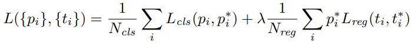

# About This Lecture

이 강의는 한양대학교 대학원생들을 대상으로 "Deep Learning based Object Detection(딥러닝 기반 객체 검출)"이라는 주제로 강의를 합니다. 강의 순서는 다음과 같습니다.

1. **Introduction to Object Detection**: Object Detection에 대한 전반적인 소개를 합니다.
2. **Two-Stage Detectors**: Two-Stage Detector 모델들을 소개합니다.
   1. R-CNN
   2. Fast R-CNN
   3. Faster R-CNN
3. **One-Stage Detectors**: One-Stage Detector 모델들을 소개합니다.
4. **Object Detection Practice**: Google Colab에서 객체 검출 모델을 실습해봅니다.

이 강의를 통해서 여러분들이 배울 수 있는 것은 다음과 같습니다.

- 객체 검출 모델의 발전 역사
- CNN기반의 classification + regression이 혼합된 지도 학습 방법
- 학습된 모델을 이용한 객체 검출 방법 (실습)

# Two-Stage Detectors

이번 자료에서는 객체 검출 모델 중 Two-Stage Detector(이단계 검출기)에 해당하는 모델들을 설명한다. Two-Stage Detector 들은 딥러닝 기반 객체 검출 연구 초기에 혁신을 거듭하며 검출 성능과 속도를 크게 끌어올려 인공지능 역사에 한 획을 그었다. 요즘은 이후에 나온 One-Stage Detector에 경쟁력이 밀렸지만 그래도 여기서 소개하는 논문들은 역사적으로 가장 영향력 있는 연구들이다. Two-Stage Detector들은 모두 "R-CNN"이라는 이름이 들어가는데 Two-Stage Detector의 특성상 항상 Region Proposal 모듈이 필요하기 때문이다. 자세한 사항은 시간순서대로 논문을 소개하면서 보기로 하자.

## 1. R-CNN

<table>
<colgroup>
<col width="10%" />
<col width="90%" />
</colgroup>
<thead>
<tr class="header">
<th>제목</th>
<th>Rich feature hierarchies for accurate object detection and semantic segmentation</th>
</tr>
</thead>
<tbody>
<tr>
<td markdown="span">저자</td>
<td markdown="span">Ross Girshick, Jeff Donahue, Trevor Darrell, Jitendra Malik (UC Berkely)</td>
</tr>
<tr>
<td markdown="span">출판</td>
<td markdown="span">CVPR, 2014</td>
</tr>
</tbody>
</table>

R-CNN은 CNN을 이용한 최초의 객체 검출 모델이다. 역사적으로 매우 중요한 연구긴 하지만 느린 속도로 인해 요즘은 사용되지 않는 방식이다. 그래도 기반 모델을 알아야 이후 모델의 발전을 알 수 있다.

### 1.1. 작동 방식

R-CNN의 작동 방식은 논문 그림에서 설명하고 있다.

1. Selective Search라는 기법을 이용하여 입력 영상에서 객체가 있을법한 영역을 2,000개 정도 찾는다. 이렇게 찾은 영역을 (Region) Proposal이라 한다.
2. 각 proposal 영역의 영상을 일정한 크기로 변형한다. 여기서는 (227, 227) 크기로 만들었다.
3. Proposal의 영상을 AlexNet 구조(5 Convolution + 2 FC*)의 CNN에 입력하여 feature vector를 출력한다.
4. Feature vector를 SVM (Support Vector Machine)으로 클래스를 분류한다.
5. Feature vector에 추가적으로 linear regressor(FC layer)를 붙여 경계 상자 파라미터를 출력한다.  
6. NMS (Non-Maximum Suppression) 기술을 적용하여 중복 객체들을 제거하고 최종 검출 결과를 낸다.

\* Fully Connected (FC) layer = Linear layer = Dense layer  

다음은 논문보다 더 직관적으로 모델 구조를 묘사한 그림이다. 논문에는 없는 "bbox reg" 출력이 있고 proposal 마다 CNN이 적용된다는 것이 한눈에 들어온다. [(Source)](https://towardsdatascience.com/r-cnn-fast-r-cnn-faster-r-cnn-yolo-object-detection-algorithms-36d53571365e)

### 1.2. 세부 내용

#### A. Selective Search

R-CNN에서 region proposal을 찾는 방법으로 Selective Search (SS) 라는 기법을 사용한다. SS는 영상을 객체별 영역으로 분할하는 기법인데 정확한 segmentation을 목표로 하기 보다는 객체 검출을 위해 proposal을 생성하는 기술이다. SS의 과정은 아래 그림에 묘사되어 있다.

우선 영상을 픽셀값의 유사도를 이용해 최대한 작은 영역들로 분할한다. 모든 인접한 영역들 사이의 유사도를 계산하고 유사도가 가장 높은 두 영역을 합친다. 이 과정을 전체 영상이 하나의 영역이 될때까지 반복한다. 이 과정에서 초기의 작게 분할된 영역과 중간과 후반의 어느정도 합쳐진 영역들의 경계 상자(bounding box)를 모아 region proposal로 사용한다.  

R-CNN에서는 SS를 이용해 2,000개의 proposal을 만들어낸다. 이게 많아보일수도 있지만 SS 같은 기술을 쓰기 전에는 모든 영역을 기계적으로 검사하는 sliding window 방식이 사용됐다. Sliding window 방식은 훨씬 더 많은 후보 영역이 나오고 후보 영역의 모양을 다양하게 만들지 못 한다.

#### B. Non-Maximum Suppression (NMS)

Non-Maximum Suppression (NMS)은 거의 모든 CNN 기반 객체 검출 모델에서 사용되는 중요한 기술이다. R-CNN에서는 2,000개의 proposal이 나오는데 이들 모두가 객체라고 할 수 없다. 우선 SVM으로 분류를 할 때 전체 클래스 개수가 K개라면 SVM에서는 객체가 아닌 배경을 하나의 클래스로 추가하여 K+1개의 클래스로 분류한다. 여기서 배경으로 분류된 것들은 버린다. 하지만 그래도 너무 많은 객체들이 검출돼서 중복된 영역을 가진 경계 상자들이 다수 나올 것이다. 클래스도 같고 경계 상자 영역도 비슷하면 하나의 객체를 두 번 검출한 것으로 볼 수 있다. 대부분의 객체 검출 모델에서는 중복 객체를 제거하기 위해 후처리 과정으로 Non-Maximum Suppression (NMS) 라는 알고리즘을 사용한다.  

위 그림(YOLOv1)에서 보다시피 모델에서 객체가 있을거라 예측한 영역이 실제 객체 수보다 훨씬 많이 나올때 NMS 알고리즘을 사용하면 오른쪽 그림처럼 같은 클래스끼리는 중복 객체가 사라진다. 중복 객체를 알아내는 방법은 클래스가 같은 경계 상자들 사이의 IoU를 계산하여 IoU가 높은 경계 상자 쌍(pair)를 찾는 것이다. 한 쌍의 중복 경계 상자가 발견됐을 때 둘 중에 score가 높은 쪽을 살리고 나머지를 제거한다. 여기서 score는 객체를 분류하는 과정에서 나오는데 해당 클래스와의 일치도를 나타낸다. 이후 Faster R-CNN 모델에서는 아예 CNN 자체에서 NMS를 위한 objectness라는 score를 출력한다.  

#### C. Bounding Box Regression

R-CNN에서는 Selective Search 기술을 이용해서 proposal의 경계 상자를 제공하지만 이후 모델에서 경계 상자를 좀 더 finetuning 하면 검출 성능이 개선되었다. (mAP 3~4% 개선) CNN의 출력으로 나오는 feature vector에 FC layer를 추가하여 4차원 경계 상자를 출력하게 한다. 여기서 나온 값이 바로 새로운 경계 상자를 나타내는 것은 아니고 proposal의 경계 상자를 보정해주는 역할을 한다.  

- ground truth bounding box: $$\mathbf{g} = (g_x, g_y, g_w, g_h)$$
- region proposal box: $$\mathbf{p} = (p_x, p_y, p_w, p_h)$$
- predicted box: $$\mathbf{b} = (b_x, b_y, b_w, b_h)$$
- model output to be trained: $$\mathbf{d} = (d_x, d_y, d_w, d_h)$$
- target output: $$\mathbf{t} = (t_x, t_y, t_w, t_h)$$

$$
b_x = p_w d_x + p_x \\
b_y = p_h d_y + p_h \\
b_w = p_w \exp(d_w) \\
b_h = p_h \exp(d_h)
$$

이런 과정을 경계 상자의 디코딩(decoding)이라 하고 디코딩을 하는 이유는 모델의 출력을 scale-invariant 하게 학습시키기 위함이다. Proposal에 비해 상대적인 위치, 크기를 학습하기 때문에 proposal의 크기에 영향을 덜 받게 된다. 만약 이러한 변환 과정없이 직접 경계 상자를 추정한다면 크기가 큰 객체에 대해서는 대체로 오차도 크게 나오므로 크기가 큰 객체 위주로 학습이 되고 크기가 작은 객체의 경계 상자는 상대적으로 덜 학습된다. 작은 객체는 작은 오차에도 IoU가 크게 떨어질 수 있으므로 경계 상자를 좀 더 세밀하게 맞춰줄 필요가 있다. 

모델을 학습하는 손실 함수를 계산할 때는 proposal과 모델 출력이 결합되어 만들어진 $$\mathbf{b}$$와 GT box $$\mathbf{g} $$ 사이의 차이를 이용하지 않는다. 오히려 GT box를 모델 출력 레벨로 변환한 $$\mathbf{t}$$와 실제 모델 출력 $$\mathbf{d}$$ 사이의 차이를 줄이도록 학습하는 것이 더 효과적이다. 경계 상자를 나타내는 값들은 모두 0~1 사이의 값을 가지는데 전반적으로 값이 작아서 학습효과가 떨어진다. 그보다는 디코딩 하기 전의 모델 출력이 값의 범위가 넓으므로 상자 예측 값이 잘못됐을 때 더 큰 손실 함수를 만들어서 학습 효과를 키울 수 있다. 다음은 GT box를 역변환하여 모델에서 나와야 하는 출력을 계산하는 식이다.  
$$
t_x = (g_x - p_x) / p_w \\
t_y = (g_y - p_y) / p_h \\
t_w = \log(g_w / p_w) \\
t_h = \log(g_h / p_h) \\
$$
이를 이용한 손실 함수는 다음과 같다.  
$$
\mathcal{L}_{reg} = \sum_{i \in {x,y,h,w}} (t_i - d_i)^2 + \lambda ||\mathbf{w}||^2
$$

#### D. Classifier

딥러닝 CNN 기술을 쓰면서 왜 마지막에는 SVM을 썼을까? SVM은 이진 분류기(binary classifier)이기 때문에 클래스가 20개면 20개의 SVM을 학습시켜야 한다. (One-versus-All) 이미 나와있는 CNN 분류 모델처럼 최종 출력에 softmax를 적용해서 클래스별 확률을 출력하게 하는게 낫지 않을까? 저자들도 시도해봤지만 성능이 더 낮게 나왔다고 한다. SVM으로는 54.2%의 mAP가 나오는데 softmax를 적용하면 50.9%가 나왔다고 한다. 하지만 R-CNN 이후로는 모두 softmax를 쓰고 성능도 더 잘 나왔다.

### 1.3. 성능과 한계

R-CNN은 객체 검출에 CNN을 처음 적용하여 검출 성능을 대폭 향상시켰다. 아래 표는 기존 기술과 AP를 비교한 것이다. 40% 이하였던 기존 성능에 비해 10%이상 향상됐다.

R-CNN의 단점은 수행시간이다. Selective Search를 이용해 2,000개의 proposal로 후보군을 줄이긴 했지만 각기 따로 CNN에 입력되기 때문에 학습 시간이나 예측 시간이 너무 오래 걸린다. 당시 GPU로 예측 시간만 50여초나 걸렸다고 한다. 너무 오래 걸려서 실시간 어플리케이션에는 쓸 수 없는 모델이다. 

## 2. Fast R-CNN

<table>
<colgroup>
<col width="10%" />
<col width="90%" />
</colgroup>
<thead>
<tr class="header">
<th>제목</th>
<th>Fast R-CNN</th>
</tr>
</thead>
<tbody>
<tr>
<td markdown="span">저자</td>
<td markdown="span">Ross Girshick (microsoft)</td>
</tr>
<tr>
<td markdown="span">출판</td>
<td markdown="span">ICCV, 2015</td>
</tr>
</tbody>
</table>

R-CNN의 성능은 좋았지만 속도가 문제였다. 그래서 후속 연구로 나온 Fast R-CNN은 이름 그대로 R-CNN의 속도를 높이기 위한 아이디어가 추가되어 속도가 대폭 향상되었다. 핵심은 CNN feature map을 이미지 전체에서 한번만 추출하고 여러 proposal에서 이 feature map을 공유하는 것이다. Proposal 마다 CNN에 입력할 필요가 없으니 당연히 속도가 향상될 수밖에 없다.

### 2.1. 작동방식

다음은 논문에 나온 Fast R-CNN의 구조다.

1. CNN backbone에 영상을 입력하여 feature map을 생성한다. 
2. Selective Search에 영상을 입력하여 proposal을 생성한다.
3. 전체 feature map에서 각 proposal 영역을 고정된 크기의 feature map 조각으로 추출한다. (**RoI Pooling**)
4. feature map 조각들을 1차원 벡터로 변환 후 FC layer 2개를 연결한다.
5. 마지막에 두 갈래 FC layer를 연결하는데 하나는 분류 확률을 출력하고 다른 하나는 경계 상자를 출력한다.

다음은 논문 보다 깔끔하게 Fast R-CNN의 구조를 그린 것이다. Fast R-CNN을 이루는 요소들을 보다 명확하게 볼 수 있다. [(Source)](https://d2l.ai/chapter_computer-vision/rcnn.html)

### 2.2. 세부 내용

#### A. RoI Pooling

Fast R-CNN의 핵심이다. 초기 대부분의 CNN에서는 마지막 Conv layer의 출력(H,W,C)을 1차원 벡터(H\*W\*C)로 변환하여 FC layer와 연결한다. Conv layer와 FC layer는 중요한 차이가 있다. Conv layer는 입력 영상의 크기와 상관없이 똑같은 커널을 영상 전체에 적용하여 원본 영상 크기와 비슷한 크기의 feature map을 출력한다. $$(H,W,C_1) \rightarrow (H,W,C_2)$$ 반면 FC layer는 고정된 크기의 입력만 받을 수 있다. R-CNN에서 proposal 영역의 영상을 똑같은 크기로 변환하는 것은 FC layer에 들어가는 feature vector의 크기를 고정시키기 위함이다. 입력 영상의 크기가 같아야 Conv layer 출력의 크기도 일정해지고 그래야 뒤에 FC layer를 붙일 수 있다.  

Fast R-CNN에서는 proposal 영역을 원본 영상이 아닌 feature map(conv layer 출력)에 적용한다. Feature map에서 proposal 영역에 해당하는 부분을 잘라내면 proposal의 크기에 따라서 잘라낸 부분의 크기가 달라질 것이다. 그러면 각 proposal의 feature를 뒤의 FC layer에 연결할 수 없으므로 영상을 크기 변환(resize)하는 것처럼 feature map 조각도 크기를 변형해줘야 한다. 이것이 RoI pooling이다. Fast R-CNN에서는 각 proposal의 feature map의 크기가 7x7이 나오도록 RoI pooling을 적용했다. 아래 그림은 RoI pooling 과정이다. [(Source)](https://blog.deepsense.ai/region-of-interest-pooling-explained/)

1. Region proposal에 해당하는 원본 feature map 영역을 추출한다.
2. 출력하고자 하는 feature map 크기에 맞춰 원본 feature map 영역을 등간격으로 나눈다.
   - 소수점으로 나오면 반올림하여 정수 단위로 나눈다.
3. feature map을 나눈 칸에서 각각 최대값을 뽑아서 출력 feature map을 만든다.

#### B. Classifier

Fast R-CNN에서는 모델을 더 단순하게 만들기 위해 마지막 분류를 SVM 대신 softmax를 사용했다. 여기서도 SVM과 softmax의 성능을 비교해봤는데 작은 모델에서는 SVM의 성능이 좋았지만 CNN backbone을 VGG16으로 키우자 softmax의 성능이 더 좋게 나왔다. 결국에 모델의 복잡도를 늘려주자 CNN 자체의 성능이 좋아진듯 하다.  

#### C. Loss

Fast R-CNN에서는 각 proposal의 feature vector가 FC layer를 통과해 나온 클래스 분류 확률과 경계 상자를 학습시켜야 한다. 여러 Proposal에서 나온 예측(prediction) 객체들을 실제 객체(ground truth)와 비교하여 클래스가 같고 경계 상자의 IoU가 높은 것들을 매칭한다. 매칭된 예측 객체가 실제 객체와 클래스 확률과 경계 상자가 같아지도록 학습을 시킨다.  

학습시키는 손실 함수(loss function)는 클래스 분류 기능을 위한 $$\mathcal{L}_{cls}$$ 와 경계 상자 추정을 위한 $$\mathcal{L}_{loc}$$ 이 있다. $$\mathcal{L}_{cls}$$는 cross-entropy 함수를 사용하고 $$\mathcal{L}_{loc}$$ 은 예측과 실제 값 사이의 차이를 smooth L1 함수를 이용해 계산한다.  

L1 norm은 원점에서 미분 값이 불연속적이고 L2 norm은 큰 오차에 대해 지나치게 큰 값을 출력한다는 단점을 상호 보완하여 만든 것이 Smooth L1 loss 다. 값이 작은 구간에서는 L2 norm을 써서 원점에서 미분이 연속적인 값을 갖게 하고 값이 큰 구간에서는 L1 norm을 써서 손실 함수 값이 지나치게 커지지 않도록 한다.

### 2.3. 성능과 한계

아래 표는 Fast R-CNN과 R-CNN의 속도와 검출 성능을 비교한 표다. 영상 1장 예측 시간(test time)이 100배 이상 빨라진 것을 볼 수 있다. 성능은 **L** 모델에서 소폭 상승한 것을 볼 수 있다. (66.0% → 66.9%)

표를 보면 **L** 모델에서 영상 한장에서 객체 검출을 하는데 0.32초라고 나오지만 이것은 Selective Search를 제외한 시간이다. SS를 포함하면 대략 2초가 걸린다고 한다. 많이 빨라졌지만 아직 실시간 처리를 하기엔 무리다. Fast R-CNN은 CNN에서 걸리는 시간을 대폭 줄였지만 Selective Search라는 알고리즘은 CPU로 처리해야 해서 1초 이상이 걸리기 때문에 아직 속도에서 개선해야 할 여지가 있다.

## 3. Faster R-CNN

<table>
<colgroup>
<col width="10%" />
<col width="90%" />
</colgroup>
<thead>
<tr class="header">
<th>제목</th>
<th>Faster R-CNN: Towards Real-Time Object Detection with Region Proposal Networks</th>
</tr>
</thead>
<tbody>
<tr>
<td markdown="span">저자</td>
<td markdown="span">Shaoqing Ren, Kaiming He, Ross Girshick, Jian Sun (microsoft)</td>
</tr>
<tr>
<td markdown="span">출판</td>
<td markdown="span">NIPS, 2015</td>
</tr>
</tbody>
</table>
R-CNN에서 시작한 Two-Stage Detector는 Faster R-CNN에 이르러서야 속도와 성능 두 가지면에서 모두 완성되었다. Fast R-CNN의 bottleneck이었던 Selective Search를 CNN으로 대체하여 드디어 온전히 딥러닝으로만 구현된 검출 모델이 구현됐다. GPU를 활용할 수 있는 CNN으로만 구현하니 속도도 빨라졌고 mAP도 대폭 향상됐다. 

### 3.1. 작동 방식

Faster R-CNN 논문에는 네트워크 구조에 대한 그림이 없어서 다른 곳에서 그린 그림을 가져왔다.  

1. CNN backbone에 영상을 입력하여 feature map을 생성한다. 
2. Feature map에 몇 차례의 conv layer를 포함한 RPN (Region Proposal Network)을 붙인다.
3. RPN은 각 픽셀 위치의 **anchor**마다 객체인지 아닌지를 판단하는 확률과 경계 상자를 출력한다.
4. RPN 출력에서 객체 확률이 높은 anchor를 고르고 그 중에 영역이 겹치는 객체들을 NMS로 제거하여 region proposal을 생성한다.
5. 전체 feature map에서 각 proposal 영역을 고정된 크기의 feature map 조각으로 추출한다. (**RoI Pooling**)
6. feature map 조각들을 1차원 벡터로 변환 후 FC layer 2개를 연결한다.
7. 마지막에 두 갈래 FC layer를 연결하는데 하나는 분류 확률을 출력하고 다른 하나는 경계 상자를 출력한다.

2~4번만 다르고 나머지는 Fast R-CNN과 같다. 다음은 Faster R-CNN의 모듈 구조를 잘 표현한 그림이다. [(Source)](https://d2l.ai/chapter_computer-vision/rcnn.html)

### 3.2. 세부 내용

#### A. Region Proposal Network (RPN)

RPN은 Backbone의 마지막 feature map에서 2개의 conv layer가 추가된 것이다. 마지막 출력은 (H, W, 6k) 모양이 나오는데 H, W는 feature map의 높이, 너비고 k는 anchor의 개수, 6은 anchor 별로 나와야 하는 객체 확률(positive, negative)과 경계 상자(yxhw)의 차원을 합친 것이다. Feature map의 각 픽셀마다 k=9개의 anchor가 있고 anchor마다 region proposal이 출력될 수 있다.  

**Anchor**는 출력될 수 있는 proposal의 기본 크기를 의미한다. RPN에서는 픽셀에 존재하는 여러가지 크기의 물체들을 크기와 모양별로 나누어 다른 채널에서 학습을 시킨다. 크기가 큰 버스 같은 객체와 크기가 작은 고양이 같은 객체들을 서로 다른 채널에서 학습시켜서 각 크기에 최적화된 학습을 시키는 것이다. Anchor를 나누지 않고 픽셀 마다 하나의 경계 상자만 출력한다면 (anchor가 하나인 경우) 그 안에서 추정해야 할 경계 상자의 범위가 너무 다양해지고 출력 값이 범위도 넓어진다. 반면에 크기와 모양이 다른 anchor 별로 학습을 시키면 경계 상자의 출력 값의 범위를 좁은 구간으로 제한할 수 있고 그 구간에서만 학습이 되기 때문에 경계 상자의 정확도가 높아진다.  

Faster R-CNN의 RPN에서는 3가지 크기와 3가지 비율을 조합하여 총 k=9 개의 anchor를 사용한다. 아래 그림은 RPN의 구조와 anchor의 예시를 보여준다.

#### B. Backbone

Fast R-CNN까지는 AlexNet 구조를 그대로 썼는데 Faster R-CNN 부터는 그보다 발전된 구조인 ZF-Net이나 VGG가 사용되었다.

#### C. Loss

Faster R-CNN의 손실 함수는 두 가지가 있다. 하나는 RPN을 학습시키는 손실 함수고 다른 하나는 Head 부분을 학습시키기 위한 손실 함수다.  

RPN을 위한 손실 함수는 논문에 수식이 있진 않지만 다음과 같은 binary cross entropy로 계산한다.
$$
\mathcal{L}_{rpn} = \sum_i \left( p_{i} \log p_{i}^* + (1-p_{i}) \log (1-p_{i}^*) \right)
$$
RPN과 Head를 학습시키는 손실 함수는 Fast R-CNN과 거의 같다.

RPN을 학습시킬 때, $$p_i, p_i^*$$는 각각 (HWk개의 anchor 중) i 번째 anchor에 객체가 있을 실제 확률과 예측 확률이다. 실제 확률은 객체가 있는 곳에서는 1, 없는 곳에서는 0이다. Anchor에 실제 객체가 있는지는 anchor box와 실제 객체 사이의 IoU를 통해 결정한다. 

- 실제 객체에 대해 IoU가 가장 높은 anchor는 positive anchor다. (실제 객체가 있다고 본다.)
- 실제 객체에 대해 IoU 값이 0.7 이상이면 postive anchor다.
- 실제 객체에 대해 IoU 값이 0.3 이하면 negative anchor다. (실제 객체가 없다고 본다.)
- 실제 객체에 대해 IoU 값이 0.3~0.7 이면 anchor의 확률을 학습시키지 않는다.

Head를 학습시킬 때는 $$p_i, p_i^*$$가 i번째 proposal에서 나온 예측과 실제  클래스 확률이다. (K+1 차원 벡터)

#### D. Training Process

Faster R-CNN은 RPN과 Head 두 가지를 학습시켜야 하므로 학습과정이 다소 복잡하다.

1. Backbone은 이미지넷으로 사전학습 된 모델로 초기화 하고 이후 RPN에서 Backbone까지 end-to-end로 학습시킨다.
2. 1의 RPN에서 출력한 proposal을 가지고 이미지넷으로 사전학습 된 Backbone(1과 상관없음)과 Head를 학습시킨다.
3. 2에서 학습된 Backbone을 쓰고 RPN 부분만 학습을 시킨다.
4. 다시 Head 부분만 학습시킨다. (Backbone은 고정)

### 3.3. 성능과 한계

Selective Search를 썼던 Fast R-CNN에 비해 Fast R-CNN은 10배 정도 빨라진 0.2초 정도의 예측 시간을 보여준다. mAP 성능에서도 6% 이상 개선된 것을 볼 수 있다.

Faster R-CNN이 Two-Stage Detector의 정점을 찍었지만 여전히 속도가 충분히 빠르진 못 했다. 이것은 RPN과 RoI Pooling 등의 복잡한 과정을 거쳐야하기 때문이다. 비슷한 시기에 등장한 YOLO나 SSD 등의 One-Stage Detector가 압도적으로 빠른 성능을 보여주었고 성능도 시간이 지남에 따라 개선되었기 때문에 Two-Stage Detector 방식의 논문이 점차 줄어들게 되었다. 하지만 아직 3D Detection 분야에서는 Two-Stage Detector 방식이 많이 활용되고 있다.

## 참고자료

- <https://towardsdatascience.com/r-cnn-fast-r-cnn-faster-r-cnn-yolo-object-detection-algorithms-36d53571365e>
- <https://medium.com/analytics-vidhya/introduction-to-object-detection-with-rcnn-family-models-310558ce2033>
- <https://d2l.ai/chapter_computer-vision/rcnn.html>
- <https://lilianweng.github.io/lil-log/2017/12/31/object-recognition-for-dummies-part-3.html>
- <https://analyticsindiamag.com/r-cnn-vs-fast-r-cnn-vs-faster-r-cnn-a-comparative-guide/>

