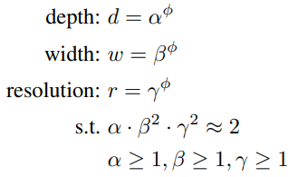

# About This Lecture

이 강의는 "Deep Learning based Object Detection (딥러닝 기반 객체 검출)"이라는 주제로 강의를 합니다. 강의 순서는 다음과 같습니다.

1. **Introduction to Object Detection**: Object Detection에 대한 전반적인 소개를 합니다.
2. **Two-Stage Detectors**: Two-Stage Detector 모델들을 소개합니다.
3. **One-Stage Detectors**: One-Stage Detector 모델들을 소개합니다.
   1. YOLO
   2. SSD
   3. RetinaNet
   4. YOLO v3
   5. EfficientDet
4. **Object Detection Practice**: Google Colab에서 객체 검출 모델을 실습해봅니다.

이 강의를 통해서 여러분들이 배울 수 있는 것은 다음과 같습니다.

- 객체 검출 모델의 발전 역사
- CNN기반의 classification + regression이 혼합된 지도 학습 방법
- 학습된 모델을 이용한 객체 검출 방법 (실습)

# One-Stage Detectors

이번 자료에서는 객체 검출 모델 중 One-Stage Detector(일단계 검출기)에 해당하는 모델들을 설명한다. One-Stage Detector는 Two-Stage 모델에 비해 빠른 속도가 강점이며 이후 지속적인 발전을 통해 성능면에서도 Two-Stage 모델을 넘어섰다. One-Stage 모델은 최근에도 속도와 성능을 개선한 모델들이 논문으로 발표되고 있다.

## 1. YOLO (v1)

<table>
<colgroup>
<col width="10%" />
<col width="90%" />
</colgroup>
<thead>
<tr class="header">
<th>제목</th>
<th>You Only Look Once: Unified, Real-Time Object Detection</th>
</tr>
</thead>
<tbody>
<tr>
<td markdown="span">저자</td>
<td markdown="span">Joseph Redmon, Santosh Divvala, Ross Girshick, Ali Farhadi (University of Washington, FAIR)</td>
</tr>
<tr>
<td markdown="span">출판</td>
<td markdown="span">CVPR, 2016</td>
</tr>
</tbody>
</table>
YOLO는 최초의 One-Stage Detector다. 앞서 발표된 Faster R-CNN 보다 검출 능력은 약간 떨어지지만 속도는 훨씬 빠른 모델이다.  

YOLO에 대해 본격적으로 설명하기 전에 이 논문의 주저자인 Joseph Redmon에 대해 언급하고자 한다. 딥러닝의 역사에 중요한 이름들을 대라면 Geoffrey Hinton, Andrew Ng, Yann Lecunn 등의 이름이 나오겠지만 이분들은 Artificial Neural Network(ANN)의 암흑기를 버텨내고 딥러닝이 개화할 수 있도록 이끈 분들이다. 하지만 CNN 발전기에는 Ross Girshick, Kaiming He, Joseph Redmon 등의 영향력이 컸다. 그 중에 Joseph Redmon은 논문이 많은 편은 아니지만 오늘날까지 객체 검출에 가장 흔하게 사용되는 YOLO 라는 모델을 만들었고 그의 괴짜적인 천재성 때문에 더욱 유명해졌다. 일단 한번 그의 홈페이지를 가보자. <https://pjreddie.com/>

홈페이지에서부터 심상치 않은 아우라가 느껴진다. 다음은 그가 2017년 CVPR이라는 세계에서 가장 권위있는 컴퓨터 비전 학회에서 발표한 슬라이드다.  

그의 TED 강연 영상도 유명하다. <https://www.youtube.com/watch?v=XS2UWYuh5u0>  

그의 범상치 않은 덕력은 연구에서도 느껴진다. 보통의 연구자들은 Tensorflow처럼 잘 갖춰진 딥러닝 프레임워크를 이용해서 개발을 하는데 이 사람은 직접 그런걸 만든다. **Darknet**이라는 YOLO 전용 딥러닝 프레임워크를 직접 만들어서 YOLO를 개발했다. 당연히 Tensorflow처럼 범용성이 뛰어난 건 아니지만 CUDA를 직접 사용했기 때문에 속도는 가장 빠르다. YOLO를 사용하는 다른 연구자들은 Darknet을 받아서 쓰기도 하지만 이 경우 모델 수정이 어렵기 때문에 Tensorflow나 Pytorch로 구현된 버전을 많이 쓴다.

### 1.1. 모델 구조

YOLO는 RPN이나 FC layer로 구성된 별도의 Head 없이 오직 하나의 CNN으로 구성돼있다. 다음은 YOLO의 모델 구조다. 24개의 convolution layer와 2개의 FC layer로 구성돼있다.

YOLO의 작동과정은 다음과 같다.

1. 입력 영상을 224×224 크기로 맞춘다.
2. YOLO 모델에 입력하여 7×7×2=98개의 객체 예측 결과를 얻는다.
3. 98개의 객체 예측에 대해 score thresholding과 NMS를 적용하여 실제 검출 결과를 만든다.

### 1.2. 세부 내용

#### A. Ouput Composition

YOLO 구조의 마지막 출력을 보면 7×7×30 모양의 텐서(tensor)가 나온다. 7×7은 아래 그림처럼 객체가 출력되는 grid 영역을 나타낸다.

뒤에 붙는 30채널은 grid cell 별로 출력되는 정보를 나타낸다.

- (4+1)×2=10 : 셀 마다 2개의 경계 상자를 출력한다. 경계 상자는 x, y, w, h, confidence로 구성된다. Confidence는 해당 셀에 객체가 있을 확률을 예측한 것이다. Objectness라는 용어로도 쓰인다. 주로 NMS 할 때 예측 객체들 사이의 우선 순위를 정하는데 사용된다.
- 나머지 20 : Pascal VOC 2007 데이터셋에서 제공하는 20가지 클래스에 대한 확률이다. 셀 마다 경계 상자는 2개씩 예측하지만 클래스 확률은 한 세트만 출력한다.

#### B. Loss

YOLO를 학습시키기 위한 손실 함수는 다음과 같다.

식을 줄 별로 설명하면 다음과 같다. 여러가지 오차들로 구성되어 있으며 이 손실함수를 줄이기 위해 학습하다보면 클래스와 경계상자 예측이 정확해지게 된다.

1. 실제 객체가 있는 셀에서 경계 상자의 중심점(x, y) 오차
2. 실제 객체가 있는 셀에서 경계 상자의 크기(w, h) 오차
3. 실제 객체가 있는 셀에서 confidence 오차
4. 실제 객체가 없는 셀에서 confidence 오차
5. 실제 객체가 있는 셀에서 클래스 확률 오차

### 1.3. 성능과 한계

YOLO의 검출 성능은 Faster R-CNN보다 6% 정도 떨어지지만 속도는 6배이상 빠르다. 고성능 GPU를 사용하기 힘든 상업적 환경(e.g. 자율주행차, 로봇)에서는 YOLO가 훨씬 매력적인 선택지다. 하지만 성능면에서는 부족한 점이 있기 때문에 이후 많은 One-Stage Detector들이 성능을 끌어올리기 위해 노력한다.

## 2. SSD

<table>
<colgroup>
<col width="10%" />
<col width="90%" />
</colgroup>
<thead>
<tr class="header">
<th>제목</th>
<th>SSD: Single Shot MultiBox Detector</th>
</tr>
</thead>
<tbody>
<tr>
<td markdown="span">저자</td>
<td markdown="span">Wei Liu, Dragomir Anguelov, Dumitru Erhan, Christian Szegedy,
Scott Reed4, Cheng-Yang Fu, and Alexander C. Berg (UNC Chapel Hill, Google 등)</td>
</tr>
<tr>
<td markdown="span">출판</td>
<td markdown="span">ECCV, 2016</td>
</tr>
</tbody>
</table>

SSD는 YOLO 모델에서 다양한 개선 아이디어를 추가하여 One-Stage 모델로는 최초로 Faster R-CNN의 성능을 뛰어넘었다. One-Stage이기 때문에 당연히 실시간 속도로 동작한다. SSD는 이후 YOLO 9000 (YOLO v2)에도 큰 영향을 미친다.

### 2.1. 모델 구조

위 그림은 SSD와 YOLO를 구조를 비교한 것이다. 두 모델의 차이를 요약하면 다음과 같다.

|              | SSD                     | YOLO                     |
| ------------ | ----------------------- | ------------------------ |
| Framework    | Caffe                   | Darknet                  |
| Backbone     | VGG-16                  | Darknet                  |
| Head         | Multi-scale feature map | Single-scale feature map |
| Head layer   | Convolution only        | FC layer                 |
| # Prediction | 8732 per class          | 98 per class             |
| Anchor       | 4 anchor boxes          | Anchorless               |

SSD의 가장 큰 특징은 객체를 multi-scale feature map에서 출력한다는 것이다. 자세한 내용은 세부 내용에서 다루고 SSD의 전체적인 동작 방식은 YOLO와 비슷하다.

1. 입력 영상을 일정 크기(300 × 300)로 맞춘다. (512 × 512도 사용)
2. 모델에 영상을 입력하고 multi-scale feature map에서 8732개의 객체 예측 결과를 얻는다.
3. 객체 예측에 대해 score thresholding과 NMS를 적용하여 실제 검출 결과를 만든다.

### 2.2. 세부 내용

#### A. Default boxes in multi-scale feature maps

영상에 보이는 객체들은 다양한 크기와 모양을 가졌으므로 SSD는 객체를 다양한 스케일에서 다양한 모양의 기본 박스(default box)를 기준으로 출력하고자 했다. 모델 구조를 보면 SSD는 (300 × 300) 영상을 넣었을 때 VGG에서 (38 × 38) feature map이 나온다. 이 상태에서 객체 예측을 출력하고 또 pooling을 통해 feature map을 줄이고 다시 객체를 출력한다. 이것을 feature map의 크기가 (1 × 1)이 될 떄까지 반복한다. 총 6가지 scale의 feature map에서 객체를 출력하는 것을 볼 수 있다. 

CNN의 feature map에서 하나의 셀은 해당 셀과 그 주변부의 정보를 담고 있다. (38 × 38) feature map에서 하나의 셀은 상대적으로 좁은 영역의 정보를 담고 있고 (3 × 3) feature map의 셀은 훨씬 더 넓은 영역의 정보를 담고 있다. 그러므로 크기가 작은 객체는 (38 × 38)에 가까운 고해상도 feature map에서 출력하는 것이 적합하고 크기가 큰 객체는 (1 × 1)에 가까운 저해상도 feature map에서 출력하는 것이 적합할 것이다.

객체의 크기가 비슷하다고 해도 모양이 여러가지일 수 있다. 어떤건 가로로 넓고 어떤건 세로로 길수 있다. 같은 스케일에서도 다양한 모양이 나올 수 있어야 하는데 한 가지 출력으로 다양한 모양을 다 커버하도록 학습하기는 어렵다. 그래서 4가지 모양의 기본 박스(default box)를 두고 셀 마다 4가지 기본 박스를 기반으로 4개의 객체 예측을 출력하게 한다. SSD의 기본 박스는 Faster R-CNN의 Anchor와 같은 개념이다. 다음 그림을 보며 이해해 보자.

(a)는 개와 고양이의 경계 상자를 보여준다. 고양이는 상대적으로 작고 가로폭이 조금 더 넓으므로 (8 × 8) feature map에서 정사각형이나 가로로 넓은 직사각형 기본 박스에 할당한다. 개는 상대적으로 크고 세로로 긴 형태이므로 (3 × 3) feature map에서 세로로 긴 직사각형 기본 박스에 할당한다.   

다음은 feature map의 채널 구성을 그린 것이다. 개를 검출할 수 있는 셀 하나에서는 기본 상자에 따라 4가지 경계상자(BBox)와 클래스 확률(Class prob.)이 출력된다. 그래서 총 채널 수는 4*(4 + C)가 된다. 각각의 객체 예측은 Faster R-CNN처럼 기본 상자를 기반으로 상대적인 위치나 크기의 변화량만을 나타낸다.

Head에서 YOLO와 또 다른 점은 FC layer가 아닌 Conv. layer로만 이루어졌다는 것이다. Conv. layer만 사용하기 때문에 SSD는 이론적으로 임의의 크기의 이미지를 처리할 수 있다. 또한 FC layer는 엄청난 수의 학습 파라미터를 쓰기 때문에 학습이나 예측이 느려진다. 

#### B. Loss

SSD를 학습시키는 손실 함수는 다음과 같다.

$$L_{conf}$$는 출력된 클래스 확률에 대한 cross entropy loss이고, $$L_{loc}$$은 경계 상자의 xywh 값에 대한 오차를 Smooth L1 loss로 구한 것이다. SSD에서는 따로 confidence를 출력하지 않고 클래스 확률 중 가장 높은 값을 confidence로 사용하여 NMS 알고리즘에 활용한다.

### 2.3. 성능

다음은 SSD를 이전 모델과 비교한 표다. 입력 영상의 해상도가 (512×512)일때 모든 모델을 통틀어 검출 성능은 가장 좋지만 속도가 좀 떨어지고 입력 영상의 해상도가 (300×300)이면 Faster R-CNN보다 나은 성능을 보이면서 속도도 매우 빠르게 동작한다.

## 3. RetinaNet

<table>
<colgroup>
<col width="10%" />
<col width="90%" />
</colgroup>
<thead>
<tr class="header">
<th>제목</th>
<th>Focal Loss for Dense Object Detection</th>
</tr>
</thead>
<tbody>
<tr>
<td markdown="span">저자</td>
<td markdown="span">Tsung-Yi Lin, Priya Goyal, Ross Girshick, Kaiming He, Piotr Dollar (FAIR)</td>
</tr>
<tr>
<td markdown="span">출판</td>
<td markdown="span">ICCV, 2017</td>
</tr>
</tbody>
</table>

RetinaNet은 One-Stage 모델 중에서 속도를 좀 버리고 성능을 얻은 모델이라 할 수 있다. SSD에 영감을 받아서 더 많은 multi-scale feature map과 더 많은 anchor를 쓰는 바람에 속도는 느려졌지만 성능은 올릴수 있었다. 논문의 핵심은 Focal Loss 인데 일반적인 cross entropy 학습시 전경(foreground) 보다 배경(background)이 훨씬 많이 나오기 때문에 효과적인 학습이 어려운 점을 개선한 것이다.

### 3.1. 모델 구조

RetinaNet부터 Detector에서는 Backbone - Neck - Head 세 가지 단계를 가진 구조가 일반화된다.

- (a) Backbone: 영상에서 일반적인 feature map을 추출하는 단계, RetinaNet에서는 ResNet이 사용됨
- (b) Neck: 여러 스케일의 feature map들을 결합하여 더 수준 높은 feature map을 만드는 단계, RetinaNet에서는 FPN이 사용됨
- (c) Head: feature map으로부터 객체 출력을 만드는 단계

동작 방식은 SSD와 같다.

### 3.2. 세부 내용

#### A. Focal Loss

Focal loss는 학습이 필요한 곳에만 초점을 맞춰서 집중적으로 학습한다는 뜻이다. One-Stage 모델에서 feature map 전체를 학습시킬 때 대부분의 anchor들은 배경에 해당하고 아주 소수만 실제 객체가 할당된다. Feature map 전체에 대해 cross entropy를 계산 후 단순히 합산하거나 평균을 내서 전체 loss를 구하고 이걸로 학습하면 대부분의 배경은 잘 구분이 될 것이다. 하지만 잘 구분이 되는 배경의 손실 함수가 적다고 해도 이들을 모두 합치면 큰 숫자가 된다. 상대적으로 구분이 잘 안된 배경이나 객체들에서 나오는 손실 함수의 크기는 작다. 이들을 합쳐서 학습을 하게되면 잘 못하고 있는 anchor에서의 분류 개선 보다는 전체적으로 평균적인 손실 함수를 줄이기 위해 노력할 것이다. 전체적인 평균으로 학습하는 것은 이러한 위험이 있기 때문에 이미 분류가 잘 되고 있는 부분은 학습이 덜 되게 하고 잘못하고 있는 부분에 집중하도록 유도하는 것이 focal loss다.

이진 분류(Binary classification)를 가정한 focal loss 식은 다음과 같다. 

$$p_t$$는 이상적으로 1이 되어야 하는 확률 예측 값이다. 원래 cross entropy는 $$CE=-\log{(p_t)}$$ 인데 focal loss는 앞에 $$(1-p_t)^\gamma$$의 가중치를 붙인 것이다. 만약 모델에서 예측을 잘해서 $$p_t$$가 1에 가깝게 나왔다면 가중치가 낮아질 것이고 0에 가깝게 나온다면 가중치가 높을 것이다. 예측은 잘 한 곳은 학습을 덜하고 못 한 부분의 가중치를 높게 줘서 학습률을 높이는 효과를 낸다.  

거기에 $$\gamma$$ 값에 따라서 가중치가 더욱 큰 편차를 갖게 만들수 있다. 다음은 $$\gamma$$ 값에 따라서 달라지는 가중치 값을 나타낸 그래프다. $$\gamma$$ 값이 커질수록 가중치가 급격히 변하는 것을 볼 수 있다.

#### B. FPN

SSD에서는 정보가 한 방향으로만흘러가서 feature map이 줄어들수록 영상 전체적인 특징을 잡아낼 수 있었다. 하지만 고해상도 feature map에서는 작은 물체만 검출하더라도 영상의 전체적인 문맥을 볼 수 있는 기회가 없기 때문에 검출 성능이 떨어졌다. 예를 들면 하늘에는 새가 있고 땅에는 강아지가 있을 확률이 높은데 그러한 배경 문맥을 활용하기 어려운 것이다. 그래서 고수준의 feature map과 저수준의 feature map을 결합하려는 시도가 다양하게 나타났고 그 중에 가장 대표적인 것이 FPN (Feature Pyramid Network) 이다.  

FPN은 구조 그림에서 보다시피 정보가 올라갔다가 다시 내려오면서 고수준 feature와 저수준 feature를 결합하고 Head에서는 conv. layer 몇 개를 연결하여 정보를 섞어서 사용한다. 그럼으로써 작은 객체를 더 정확하게 찾아낼 수 있다.

#### C. Anchor

RetinaNet의 성능이 느린 이유는 너무 많은 anchor를 쓰기 때문이다. RetinaNet은 5개의 스케일을 쓰고 셀 하나당 크기 3가지 모양 3가지를 조합하여 9가지 anchor를 적용하고 입력 영상 크기도 보통 (600 × 600)으로 고해상도를 쓴다. 그래서 영상 당 10만개 정도의 anchor에서 객체 예측이 출력된다. anchor가 많으면 모델에서 객체 예측이 나오는 것도 조금 더 걸리지만 더 큰 문제는 NMS다. NMS는 우선순위 기반으로 중복 객체들을 걸러내기 때문에 GPU로 병렬화가 어렵다. 그래서 입력되는 객체가 많아질수록 NMS로 처리하는데 시간이 많이 든다.

### 3.3. 성능

이쯤부터는 PASCAL VOC 데이터셋이 더 이상 표준 데이터셋으로 사용되지 않고 Microsoft에서 만든 COCO 데이터셋이 표준적인 객체 검출 데이터셋 혹은 벤치마크로 사용된다. PASCAL VOC 보다는 훨씬 종류도 다양하고 난이도도 높기 때문에 기존 모델의 수치가 대폭 낮아진 것을 볼 수 있다. 그래도 Two-Stage Detector인 Faster R-CNN 보다도 RetinaNet의 성능이 확연히 높은 것을 볼 수 있다. 특히 작은 객체에 대한 검출 성능이 높아졌다.  

## 4. YOLO v3

<table>
<colgroup>
<col width="10%" />
<col width="90%" />
</colgroup>
<thead>
<tr class="header">
<th>제목</th>
<th>YOLOv3: An Incremental Improvement</th>
</tr>
</thead>
<tbody>
<tr>
<td markdown="span">저자</td>
<td markdown="span">Joseph Redmon, Ali Farhadi (University of Washington)</td>
</tr>
<tr>
<td markdown="span">출판</td>
<td markdown="span">Arxiv, 2018</td>
</tr>
</tbody>
</table>

YOLO v3는 Joseph Redmon이 발표한 마지막 검출 모델이다. 그리고 정식으로 발표된 논문도 아니다. YOLO v2는 CVPR 2017에서 발표됐고 이후 모델 구조를 조금 더 개선하여 YOLO v3를 공개했지만 학회에 발표하진 않았고 논문 자체도 블로그처럼 캐주얼하게 썼다. 그럼에도 불구하고 현재 Google Scholar 기준 11369회 인용됐다. 이후 YOLO v4, PP YOLO, YOLOX 등 성능을 개선한 다양한 변형들이 나왔지만 그래도 기준이 되는 원형은 YOLO v3라고 할 수 있다.  

### 4.1. 모델 구조

전체적인 모델 구조는 대략 RetinaNet과 비슷하다. 하지만 YOLO는 속도를 중시하기 때문에 출력 feature map의 개수와 anchor 개수를 줄여서 속도를 대폭 개선했다. Backbone도 자체적으로 최적화한 Darknet-53이라는 구조를 만들었는데 이것도 ResNet의 residual block이 들어가 있다. 아래 그림은 RetinaNet과 좀 달라보이지만 상하로 움직이던 정보를 가로로 쭉 펴면 아래와 같이 된다.

### 4.2. 세부 내용

#### A. Anchors

RetinaNet은 5가지 스케일에서 스케일마다 9가지 anchor가 있고 anchor의 모양은 사람이 직접 설계했다. 반면 YO3LO v3는 원본 이미지에 비해 1/8, 1/16, 1/32 등 3가지 스케일의 feature map 마다 3가지 anchor를 사용한다. Anchor의 모양은 전체 경계 상자들의 너비 높이에 대한 k-means clustering을 하여 9가지 anchor를 만들어 3가지 스케일에 분배하였다. 다음은 COCO 데이터셋에서 만든 9가지 anchor다.

> (10×13), (16×30), (33×23), (30×61), (62×45), (59× 119), (116 × 90), (156 × 198), (373 × 326)

#### B. Output

모델의 출력 feature map의 채널 수는 [3 ∗ (4 + 1 + 80)]개다. 숫자별로 의미는 다음과 같다.

- 3 : 3가지 anchor
- 4 : 경계 상자 xywh
- 1 : Objectness (객체 존재 확률)
- 80 : 클래스 개수

다음은 모델의 출력 구조를 그림으로 표현한 것이다. 

모델의 최종 출력은 anchor별로 (bounding box, objectness, category probabilities)가 나와야 하는데 convolution 연산은 이러한 정보를 직접 출력하기에 적합하지 않다. Convolution의 출력은 특정한 범위 안으로 제한하기가 힘들기도 하고 그렇게 한다고 하더라도 출력의 범위를 좁히면 세밀하게 출력을 조절하기가 어려울 수 있다. 그래서 대부분의 DNN에서 convolution 출력은 $$-\infty \sim \infty$$ 범위에서 나오게 하고 이를 최종 출력의 특성에 맞게 변형해주는 activation 함수를 적용한다. Activation 함수를 정하기 위해서는 먼저 모델에서 객체 검출 결과로 나오는 출력과 학습 데이터의 GT 객체 정보의 특성을 알아야 한다.

**Predicted Object**: $$\left[ b_y,b_x,b_h,b_w,o,p_1,...,p_K \right]$$

- $$b_y,b_x \in \left[0, 1\right]$$ : bounding box의 중심 좌표, 이미지 왼쪽 위가 (0, 0), 오른쪽 아래가 (1,1)
- $$b_h,b_w \in \left[0, 1\right]$$ : 이미지에 대한 bounding box의 너비 높이 비율
- $$o$$ : objectness, 해당 grid cell 위치에 anchor와 비슷한 크기의 객체가 존재할 확률
- $$p_1,...,p_K$$ : bounding box 영역이 나타내는 객체의 종류에 대한 확률, 각 클래스별 독립적인 확률이기 떄문에 합이 1이 되어야 하는것은 아님 (multi-label)

YOLO에서는 다음과 같은 activation을 통해 최종 출력을 만든다.

Activation에서 발견할 수 있는 공통적인 특징은 다음과 같다.

- 확률처럼 [0, 1] 범위로 나와야하는 출력은 sigmoid 함수를 쓴다. sigmoid 함수는 일반적인 $$-\infty \sim \infty$$ 범위의 입력을 0~1 사이의 값으로 변환해준다.
- 항상 양수가 나와야하는 출력은 exponential 함수를 쓴다. exponential 함수는 모든 입력에 대해 양수를 출력한다. $$b_h,b_w$$는 0~1 사이의 값이 나와야 하지만 기본 anchor 크기에 배율로 곱해지는 값은 1 근처의 임의의 양수가 될 수 있어야 한다.

GT object에서 category index에 one-hot encoding을 적용하면 "Predicted object"와 같은 형식이 된다. 예측과 실제 데이터의 형식과 스케일을 동일하게 맞췄다면 둘 사이의 차이가 줄어들도록 손실(loss) 함수를 설계해서 학습을 시키면된다. 이때 예측이 feature map 형태로 나오기 때문에 GT 데이터도 그에 맞춰서 feature map 형태로 만들어주면 손실 함수 계산을 편리하게 할 수 있다.

## 5. EfficientDet

<table>
<colgroup>
<col width="10%" />
<col width="90%" />
</colgroup>
<thead>
<tr class="header">
<th>제목</th>
<th>EfficientDet: Scalable and Efficient Object Detection</th>
</tr>
</thead>
<tbody>
<tr>
<td markdown="span">저자</td>
<td markdown="span">Mingxing Tan, Ruoming Pang, Quoc V. Le (Google Reasearch)</td>
</tr>
<tr>
<td markdown="span">출판</td>
<td markdown="span">CVPR, 2020</td>
</tr>
</tbody>
</table>

EfficientDet은 분류 모델인 EfficientNet의 객체 검출에 적용한 모델이다. 먼저 EfficientNet에 대해 알아보고 EfficientDet에 대해 알아보자.

### 5.1. EfficientNet

<table>
<colgroup>
<col width="10%" />
<col width="90%" />
</colgroup>
<thead>
<tr class="header">
<th>제목</th>
<th>EfficientNet: Rethinking Model Scaling for Convolutional Neural Networks</th>
</tr>
</thead>
<tbody>
<tr>
<td markdown="span">저자</td>
<td markdown="span">Mingxing Tan, Quoc V. Le (Google Reasearch)</td>
</tr>
<tr>
<td markdown="span">출판</td>
<td markdown="span">ICML, 2019</td>
</tr>
</tbody>
</table>

EfficientNet은 지금까지 알려진 연산량 증가와 분류 성능 사이의 관계를 체계적으로 분석하고 CNN 성능을 효율적으로 향상시킬수 있는 CNN의 스케일링 방법을 제안한다. CNN의 성능을 올리는 스케일링 방법은 3가지가 있다.

- (b) **Width** scaling: conv. filter 혹은 출력 채널 수를 늘리는 방법, 필터 수가 많은수록 세밀한 특징을 잘 잡아낸다고 한다.
- (c) **Depth** scaling: CNN의 레이어 수를 늘리는 방법, 레이어가 많아질수록 학습이 어렵고 성능 개선 효과도 줄어든다.
- (d) **Resolution** scaling: 입력 영상의 해상도를 올리는 방법, 해상도가 높을수록 세밀한 패턴을 잘 잡지만 아주 높은 해상도에서는 해상도에 따른 성능 차이가 사라진다.

3가지 스케일링 방식을 따로 조절할 수 있지만 경험적으로는 3가지 방식이 연관되어야 한다. 입력 영상의 해상도(resolution)가 올라가면 고해상도의 세밀한 특징을 잘 잡아내기 위해서는 필터 수(width)가 늘어야하고, 영상 전체적인 판단을 하기 위해서는 레이어의 수(depth)가 늘어야한다. 한 가지만 올려도 효과가 있지만 3가지를 동시에 조금씩 올리면 더욱 효과가 좋다. 이것이 바로 논문에서 제안하는 **Compound Scaling**이다. 논문에서는 다음 식으로 3가지 스케일을 $$\phi$$라는 하나의 파라미터로 동시에 조절하였다. ($$\alpha=1.2, \beta=1.1, \gamma=1.15$$)

$$\phi$$ 값에 따라 EfficientNet-B0부터 B7까지 8가지 모델을 만들어 필요한 속도와 성능에 따라 고를수 있게 했다. 다음은 EfficientNet의 8가지 모델과 다른 모델들의 연산량과 분류 성능을 비교한 것이다. EfficientNet이 연산량은 적으면서 높은 성능을 내는 것을 볼 수 있다. Compound scaling을 이용해 증가한 연산량 대비 효율적으로 성능을 향상시켰음을 볼 수 있다.

### 5.2. EfficientDet 세부 내용

EfficientDet은 EfficientNet의 compound scaling을 검출 모델에 적용한 것이다. EfficientNet-B0~B7 모델을 backbone으로 쓰고 Neck과 Head 구조에도 compound scaling을 적용했다. 또한 EfficientDet은 Neck 구조로 BiFPN이라는 새로운 구조를 제안하였다.

#### A. 모델 구조 (BiFPN)

객체 검출의 주요 문제는 다양한 크기와 모양을 가지는 객체들을 모두 잘 찾아낼 수 있는 방법이다. SSD에서는 다양한 스케일의 feature map에서 각각 객체를 검출했지만 이후에는 고수준과 저수준의 feature map 정보를 결합하는 FPN 같은 구조가 주로 사용됐다. 이렇게 backbone과 head 사이에서 다양한 수준의 feature map을 섞는 중간 구조를 neck이라고 한다. 아래 그림은 다양한 neck 구조를 보여준다. 

FPN은 정보의 흐름이 고수준에서 저수준으로 내려가기만 한다. PANet은 FPN에서 다시 저수준에서부터 고수준으로 올라가는 경로를 추가하였다. 이 구조는 YOLO v4에서 활용되었다. NAS-FPN은 자동으로 신경망 구조를 검색하는 NAS (Neural Architecture Search)를 이용하여 최적화한 Neck 구조다. BiFPN은 PANet에서 입력이 하나인 노드를 없애고 원래 입력과 올라가는 경로의 노드를 추가적으로 연결하였다. 게다가 이러한 구조를 하나의 layer로 보고 여러번 반복한다. 반복 횟수는 compound scaling에서 결정한다.  

**Weighted Feature Fusion**  

Feature를 합치는 방법도 여러가지가 있을 수 있는데 기존 FPN, PANet 방식이 다른 feature map을 concat 하는 것이 아니라 feature 사이의 가중합(weighted sum)으로 합치고 가중치도 학습을 통해 얻는다. 가중치도 feature 전체에 하나의 가중치를 줄 수 있고 채널마다 주거나 픽셀마다 주거나 여러 방식이 있을 수 있지만 여기서는 가장 간단한 feature map 하나에 하나의 가중치만 적용했다. Feature에 학습된 가중치를 직접 곱하는 것은 안정성에 문제가 생기므로 가중치를 적절히 정규화해서 써야한다. 논문에서는 여러가지를 시도해봤는데 그 중에 "fast normalized fusion"이라는 방식이 가장 좋았다고 한다.
$$
O=\sum_i { w_i \over \epsilon + \sum_j w_j} \cdot I_i
$$
각각의 가중치는 ReLU를 통과하므로 0이상의 값이 나오는데 분모에 0이 나오면 안되므로 작은 값($$\epsilon$$)을 더해준다.  

EfficientNet backbone과 BiFPN neck을 사용한 EfficientDet의 전체적인 구조는 다음과 같다. BiFPN layer가 3번 반복된 것을 볼 수 있다.

마지막 head는 클래스 분류와 경계상자 추정이 분리된 구조로 되어있다. Head에서는 크기 3가지 모양 3가지를 결합한 9가지 anchor를 사용하고 Faster R-CNN과 같은 방식으로 신경망의 출력을 경계 상자로 변환한다. ([참조](<https://github.com/google/automl/blob/master/efficientdet/object_detection/faster_rcnn_box_coder.py>))

#### B. Compound Scaling

Backbone의 스케일링은 EfficientNet에서 이미 했고 EfficientDet에서는 각각의 backbone 수준에 맞는 neck/head의 스케일을 정하는 것이다. BiFPN에서 정해야 할 것은 각 conv. layer의 채널 수(width)와 BiFPN layer의 반복 횟수(depth)다. 논문에서는 다음과 같은 스케일링 공식을 제안했다.  
$$
W_{bifpn}=64 \cdot (1.35^{\phi}), \quad D=3+\phi
$$
Head에서 conv. layer의 채널 수(width)는 BiFPN과 같게 하고 conv. layer의 수는 $$D_{box}=D_{class}=3 + \lfloor \phi/3 \rfloor$$ 로 정했다.

#### 

### 5.3. 성능

다음 그림은 EfficientDet 시리즈 모델의 성능을 다른 모델과 비교한 것이다. 왼쪽은 검출 성능과 학습 파라미터 수 사이의 관계고 오른쪽은 검출 성능과 검출 시간 사이의 관계를 나타낸다. 모두 EfficientDet이 효율성과 검출 성능을 동시에 개선했다는 것을 볼 수 있다.

## 참고자료

- <https://eehoeskrap.tistory.com/404>

