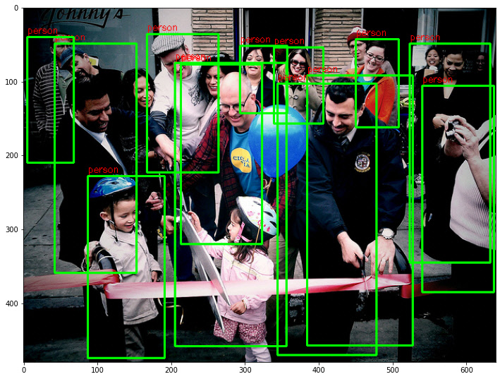
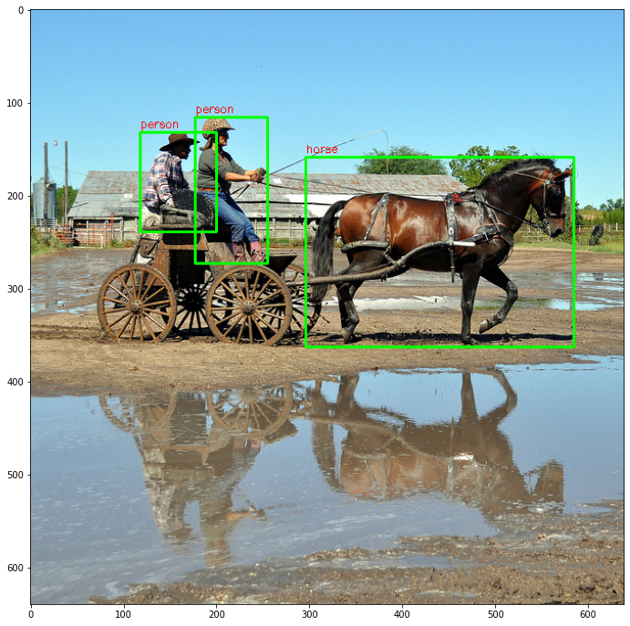

# About This Lecture

이 강의는 한양대학교 대학원생들을 대상으로 "Deep Learning based Object Detection(딥러닝 기반 객체 검출)"이라는 주제로 강의를 합니다. 강의 순서는 다음과 같습니다.

1. **Introduction to Object Detection**: Object Detection에 대한 전반적인 소개를 합니다.
2. **Two-Stage Detectors**: Two-Stage Detector 모델들을 소개합니다.
3. **One-Stage Detectors**: One-Stage Detector 모델들을 소개합니다.
4. **Object Detection Practice**: Google Colab에서 객체 검출 모델을 실습해봅니다.
   1. 시스템 확인 및 데이터 준비
   2. Faster R-CNN 객체 검출 테스트
   3. EfficietDet 객체 검출 테스트


이 강의를 통해서 여러분들이 배울 수 있는 것은 다음과 같습니다.

- 객체 검출 모델의 발전 역사
- CNN기반의 classification + regression이 혼합된 지도 학습 방법
- 학습된 모델을 이용한 객체 검출 방법 (실습)


# Object Detection Practice (Feat. Colab x TF-Hub)

객체 검출 기술을 테스트 해보기 위해서는 이를 구동할 수 있는 시스템이 필요하다. 윈도우보다는 리눅스가 딥러닝을 활용하기에 수월하다. 기본적으로 파이썬과 딥러닝 프레임워크 하나는 설치돼있어야 한다. CPU로도 구동이 가능하지만 결과를 확인하는데 오래걸리므로 GPU가 있어야 한다. 특히 학습은 GPU가 필수다. GPU를 활용하려면 CUDA도 설치해야한다. 그래서 딥러닝을 위한 시스템 하나 세팅하기 위해서는 돈도 많이 들고 시간도 들고 관련 지식도 필요하다.  

간단히 교육/학습 목적으로 딥러닝을 써보고 싶은데 저렇게 시간과 돈을 들이기 어렵다. 이럴 때 적합한 시스템이 구글에서 제공하는 클라우드 서비스인 **Google Colaboratory** (이하 colab)이다. **무료**로 GPU를 사용할 수 있으며 파이썬, 텐서플로(Tensorflow)도 이미 설치돼있다. 사용방식은 이미 많은 사용자들이 쓰고 있는 Jupyter Notebook과 비슷하다.  

시스템이 갖춰졌더라도 딥러닝을 써보려면 어디선가 소스 코드도 받아야하고 학습된 모델 파일도 받아야하고 소스 코드마다 사용법도 배워야 한다. 적당한 소스 코드를 찾는 것도 어려운 일이다. 그래서 텐서플로에서는 TF-Hub, 파이토치(Pytorch)에서는 Model Zoo를 통해 미리 학습된 모델을 제공하고 있다. 여기서는 Colab에서 텐서플로와 **TF-Hub** 모델을 이용하여 실습을 진행한다. [TF-Hub](https://tfhub.dev/)에 들어가서 어떤 모델들이 있는지 둘러보자.


## 1. 시스템 확인 및 데이터 준비

### 1.1. 하드웨어 확인

딥러닝 모델을 받기 전에 시스템 하드웨어를 먼저 확인해보자. 리눅스 명령어를 쓰려면 앞에 **!** 를 붙여서 실행하면 된다.

```
!echo "===== OS 확인 ====="
!cat /etc/issue.net
!echo "===== CPU 확인 ====="
!cat /proc/cpuinfo | grep "model name"
!echo "===== 메모리 확인 ====="
!cat /proc/meminfo | grep "Mem"
!echo "===== 스토리지 확인 ====="
!df -h | grep "/dev/sda1"
!echo "===== 현재 경로 확인 ====="
!pwd
!echo "===== 현재 경로의 내용 확인 ====="
!ls
!echo "===== GPU 모델 확인 ====="
!nvidia-smi --query-gpu=name --format=csv,noheader
!echo "===== GPU 상태 확인 ====="
!nvidia-smi
```

> ```
> ===== OS 확인 =====
> Ubuntu 18.04.5 LTS
> ===== CPU 확인 =====
> model name	: Intel(R) Xeon(R) CPU @ 2.30GHz
> model name	: Intel(R) Xeon(R) CPU @ 2.30GHz
> ===== 메모리 확인 =====
> MemTotal:       13302912 kB
> MemFree:        10317044 kB
> MemAvailable:   12229152 kB
> ===== 스토리지 확인 =====
> /dev/sda1        86G   47G   40G  55% /opt/bin/.nvidia
> ===== 현재 경로 확인 =====
> /content
> ===== 현재 경로의 내용 확인 =====
> sample_data
> ===== GPU 모델 확인 =====
> Tesla K80
> ===== GPU 상태 확인 =====
> Fri Feb 11 18:02:56 2022       
> +-----------------------------------------------------------------------------+
> | NVIDIA-SMI 460.32.03    Driver Version: 460.32.03    CUDA Version: 11.2     |
> |-------------------------------+----------------------+----------------------+
> | GPU  Name        Persistence-M| Bus-Id        Disp.A | Volatile Uncorr. ECC |
> | Fan  Temp  Perf  Pwr:Usage/Cap|         Memory-Usage | GPU-Util  Compute M. |
> |                               |                      |               MIG M. |
> |===============================+======================+======================|
> |   0  Tesla K80           Off  | 00000000:00:04.0 Off |                    0 |
> | N/A   55C    P8    31W / 149W |      0MiB / 11441MiB |      0%      Default |
> |                               |                      |                  N/A |
> +-------------------------------+----------------------+----------------------+
> +-----------------------------------------------------------------------------+
> | Processes:                                                                  |
> |  GPU   GI   CI        PID   Type   Process name                  GPU Memory |
> |        ID   ID                                                   Usage      |
> |=============================================================================|
> |  No running processes found                                                 |
> +-----------------------------------------------------------------------------+
> ```

### 1.2. 소프트웨어 확인

```
!echo "===== 파이썬 버전 확인 ====="
!python --version
!echo "===== 텐서플로 버전 확인 ====="
!python -c "import tensorflow as tf; print(tf.__version__)"
```

> ```
> ===== 파이썬 버전 확인 =====
> Python 3.7.12
> ===== 텐서플로 버전 확인 =====
> 2.7.0
> ```

### 1.3. 샘플 데이터 준비

검출 모델에 입력할 이미지 몇 장을 "/content/data" 경로에 저장한다.

```
!mkdir data
!wget -P ./data https://goodgodgd.github.io/ian-flow/assets/detection/coco_01.jpg
!wget -P ./data https://goodgodgd.github.io/ian-flow/assets/detection/coco_02.jpg
!wget -P ./data https://goodgodgd.github.io/ian-flow/assets/detection/coco_03.jpg
```

### 1.4. 공용 패키지 및 변수 불러오기

공통적으로 사용되는 패키지들을 미리 import 한다. COCO 데이터셋으로 학습한 모델을 사용할 것이므로 클래스 번호를 이름으로 변환해줄 dict 변수로 미리 만들어둔다.

```python
import time
import glob
import numpy as np
import cv2
import tensorflow as tf
import tensorflow_hub as hub
import matplotlib.pyplot as plt

labels_to_names = {1:'person',2:'bicycle',3:'car',4:'motorcycle',5:'airplane',
                   6:'bus',7:'train',8:'truck',9:'boat',10:'traffic light',
                   11:'fire hydrant',12:'street sign',13:'stop sign',14:'parking meter',15:'bench',
                   16:'bird',17:'cat',18:'dog',19:'horse',20:'sheep',
                   21:'cow',22:'elephant',23:'bear',24:'zebra',25:'giraffe',
                   26:'hat',27:'backpack',28:'umbrella',29:'shoe',30:'eyeglasses',
                   31:'handbag',32:'tie',33:'suitcase',34:'frisbee',35:'skis',
                   36:'snowboard',37:'sports ball',38:'kite',39:'baseball bat',40:'baseball glove',
                   41:'skateboard',42:'surfboard',43:'tennis racket',44:'bottle',45:'plate',
                   46:'wine glass',47:'cup',48:'fork',49:'knife',50:'spoon',
                   51:'bowl',52:'banana',53:'apple',54:'sandwich',55:'orange',
                   56:'broccoli',57:'carrot',58:'hot dog',59:'pizza',60:'donut',
                   61:'cake',62:'chair',63:'couch',64:'potted plant',65:'bed',
                   66:'mirror',67:'dining table',68:'window',69:'desk',70:'toilet',
                   71:'door',72:'tv',73:'laptop',74:'mouse',75:'remote',
                   76:'keyboard',77:'cell phone',78:'microwave',79:'oven',80:'toaster',
                   81:'sink',82:'refrigerator',83:'blender',84:'book',85:'clock',
                   86:'vase',87:'scissors',88:'teddy bear',89:'hair drier',90:'toothbrush',
                   91:'hair brush'}
```


## 2. Faster R-CNN 객체 검출 테스트

### 2.1. Minimal Script

먼저 TF-Hub 사용법을 알아보기 위해 최소한의 코드로 검출 결과를 확인해보자. 영상을 불러온 후 `tf.Tensor` 타입으로 변환하고 배치 차원(batch dimension)을 추가한다.

```python
image = cv2.imread('/content/data/coco_01.jpg')
image = image
image_tensor = tf.convert_to_tensor(image, dtype=tf.uint8)[tf.newaxis, ...]
print("image shape:", image_tensor.shape)
```

Faster R-CNN 모델을 불러온다.

```python
detector = hub.load("https://tfhub.dev/tensorflow/faster_rcnn/resnet50_v1_640x640/1")
```

영상을 입력하고 출력의 종류와 모양(shape)을 확인한다.

```python
start_time = time.time()
output_tensors = detector(image_tensor)
print("elapsed time:", time.time()-start_time)
outputs = {key: value.numpy() for key, value in output_tensors.items()}
print("num detections", outputs["num_detections"])
print("output shapes:")
for key in outputs:
  print("  ", key, outputs[key].shape)
```

출력에서 일괄적으로 배치 차원을 없애고 다시 종류와 모양을 확인한다.

```python
outputs = {key: value[0] for key, value in outputs.items()}
print("output shapes without batch dimension:")
for key in outputs:
  print("  ", key, outputs[key].shape)
```

출력 중에 객체들의 score를 확인해본다. (score = confidence = objectness) Score들이 내림차순으로 정렬된 것을 볼 수 있다. 즉 객체들이 score 값을 기준으로 정렬되어있다.

```python
print("detection scores:\n", outputs["detection_scores"][:30])
```

검출 결과를 숫자로 봐서는 이해하기 어렵다. 그림으로 그려서 확인해보자. 그림을 그릴때 주의해야 할 점은 경계 상자의 형식이다. 구현하기에 따라 yxhw (중심점과 크기) 일 수도 있고 tlbr (top=ymin, left=xmin, bottom=ymax, right=xmax) 일 수도 있다. 단위도 영상 전체 영역에 대한 비율일 수도 있고 픽셀 단위일 수도 있다. 여기서 제공하는 경계 상자는 tlbr 형식으로 비율 단위 값을 가진다.

```python
SCORE_THRESH = 0.5
height, width = image.shape[:2]
num_valid_box = np.sum(outputs["detection_scores"] > SCORE_THRESH)
print("num valid box:", num_valid_box)
box_pixel = outputs["detection_boxes"] * np.array([[height, width, height, width]])
box_pixel = box_pixel.astype(int)
res_image = image.copy()
res_image = cv2.cvtColor(res_image, cv2.COLOR_BGR2RGB)

for i in range(num_valid_box):
  box = box_pixel[i]
  score = outputs["detection_scores"][i]
  cls_ind = int(outputs["detection_classes"][i])
  cls_name = labels_to_names[cls_ind]
  print(f"obj{i:02d} : box={box}, score={score:1.3f}, class={cls_ind}, {cls_name}")
  top, left, bottom, right = box
  cv2.rectangle(res_image, (left, top), (right, bottom), color=(0, 255, 0), thickness=2)
  cv2.putText(res_image, cls_name, (left, top - 5), cv2.FONT_HERSHEY_SIMPLEX, 0.4, (255, 0, 0), 1)

plt.figure(figsize=(12, 12))
plt.imshow(res_image)
```

검출 결과를 보면 대부분의 사람들을 잘 찾아낸 것을 볼 수 있다.




### 2.2. Organized Script

이번에는 함수를 써서 코드를 좀 더 정리하고 여러 영상에 대해 객체 검출을 반복해보자.  

먼저 영상과 모델이 주어졌을때 검출 후 결과를 보여주는 함수다.  

```python
def detect_and_show(detector, image, score_thresh):
  image_tensor = tf.convert_to_tensor(image, dtype=tf.uint8)[tf.newaxis, ...]
  print("image shape:", image_tensor.shape)
  height, width = image.shape[:2]

  image_tensor = tf.convert_to_tensor(image, dtype=tf.uint8)[tf.newaxis, ...]
  start_time = time.time()
  output_tensors = detector(image_tensor)
  print("elapsed time:", time.time()-start_time)

  outputs = {key: value.numpy()[0] for key, value in output_tensors.items()}
  print("output shapes:")
  for key in outputs:
    print("  ", key, outputs[key].shape)
  
  res_image = draw_boxes(image, outputs, score_thresh)
  plt.figure(figsize=(12, 12))
  plt.imshow(res_image)
```

위 함수에서 그림을 그리는 기능을 떼어 함수로 정의했다.

```python
def draw_boxes(image, outputs, score_thresh):
  height, width = image.shape[:2]
  num_valid_box = np.sum(outputs["detection_scores"] > score_thresh)
  print("num valid box:", num_valid_box)
  box_pixel = outputs["detection_boxes"] * np.array([[height, width, height, width]])
  box_pixel = box_pixel.astype(int)
  res_image = image.copy()
  res_image = cv2.cvtColor(res_image, cv2.COLOR_BGR2RGB)

  for i in range(num_valid_box):
    box = box_pixel[i]
    score = outputs["detection_scores"][i]
    cls_ind = int(outputs["detection_classes"][i])
    cls_name = labels_to_names[cls_ind]
    print(f"obj{i:02d} : box={box}, score={score:1.3f}, class={cls_ind}, {cls_name}")
    top, left, bottom, right = box
    cv2.rectangle(res_image, (left, top), (right, bottom), color=(0, 255, 0), thickness=2)
    cv2.putText(res_image, cls_name, (left, top - 5), cv2.FONT_HERSHEY_SIMPLEX, 0.4, (255, 0, 0), 1)
  
  return res_image
```

모델을 다운받는다.

```
SCORE_THRESH = 0.5
detector = hub.load("https://tfhub.dev/tensorflow/faster_rcnn/resnet50_v1_640x640/1")
```

위에서 정의한 함수를 이용하여 다운로드 받은 영상들을 순차적으로 입력하여 객체 검출 결과를 확인한다. 

```python
filelist = glob.glob("./data/*.jpg")
for file in filelist:
  print("==========\nfile:", file)
  image = cv2.imread(file)
  detect_and_show(detector, image, SCORE_THRESH)
```


## 3. EfficientDet 객체 검출 테스트

TF-Hub api에서 모델을 불러올떄 모델 주소만 바꾸면 다양한 모델들을 불러올 수 있다. 사용법도 비슷한데 다만 모델마다 출력 형식이 조금씩 다르다. TF-Hub에서 불러온 "efficientdet/lite" 계열 모델은 출력이 dict가 아니고 tuple이다. 또한 경계 상자 형식이 tlbr로 출력되긴 하지만 단위가 픽셀이다. 이러한 차이를 반영하여 함수를 약간 수정했다.

```python
def detect_and_show(detector, image, score_thresh):
  image_tensor = tf.convert_to_tensor(image, dtype=tf.uint8)[tf.newaxis, ...]
  print("image shape:", image_tensor.shape)
  height, width = image.shape[:2]

  image_tensor = tf.convert_to_tensor(image, dtype=tf.uint8)[tf.newaxis, ...]
  start_time = time.time()
  boxes, scores, classes, numdet = detector(image_tensor)
  print("elapsed time:", time.time()-start_time)
  # dict 형식으로 변환
  output_tensors = {"detection_boxes": boxes, "detection_scores": scores, "detection_classes": classes}
  outputs = {key: value.numpy()[0] for key, value in output_tensors.items()}
  print("output shapes:")
  for key in outputs:
    print("  ", key, outputs[key].shape)
  
  res_image = draw_boxes(image, outputs, score_thresh)
  plt.figure(figsize=(12, 12))
  plt.imshow(res_image)
```

```python
def draw_boxes(image, outputs, score_thresh):
  height, width = image.shape[:2]
  num_valid_box = np.sum(outputs["detection_scores"] > score_thresh)
  print("num valid box:", num_valid_box)
  # 출력이 바로 pixel 단위
  box_pixel = outputs["detection_boxes"].astype(int)
  res_image = image.copy()
  res_image = cv2.cvtColor(res_image, cv2.COLOR_BGR2RGB)

  for i in range(num_valid_box):
    box = box_pixel[i]
    score = outputs["detection_scores"][i]
    cls_ind = int(outputs["detection_classes"][i])
    cls_name = labels_to_names[cls_ind]
    print(f"obj{i:02d} : box={box}, score={score:1.3f}, class={cls_ind}, {cls_name}")
    top, left, bottom, right = box
    cv2.rectangle(res_image, (left, top), (right, bottom), color=(0, 255, 0), thickness=2)
    cv2.putText(res_image, cls_name, (left, top - 5), cv2.FONT_HERSHEY_SIMPLEX, 0.4, (255, 0, 0), 1)
  
  return res_image
```


### 3.1. EfficientDet/lite0

TF-Hub에서 "efficientdet/lite0" 모델을 불러온다. "lite"라고 붙은 모델은 Tensorflow Lite를 위해 최적화된 모델이다. Tensorflow Lite는 모바일 및 엣지 기기를 위한 프레임워크다.

```python
SCORE_THRESH = 0.5
detector_d0 = hub.load("https://tfhub.dev/tensorflow/efficientdet/lite0/detection/1")
```

위에서 정의한 함수를 이용해 검출 후 결과를 시각적으로 확인해보자.

```python
filelist = glob.glob("./data/*.jpg")
for file in filelist:
  print("==========\nfile:", file)
  image = cv2.imread(file)
  detect_and_show(detector_d0, image, SCORE_THRESH)
```


검출 결과를 보니 왼쪽의 사람 한 명을 검출하지 못 했다. EfficientDet 모델 중에 가장 가벼운 모델이라 성능이 떨어지는 것 같다.

### 3.2. EfficientDet/lite3x

이번에는 조금 더 성능이 좋은 "efficientdet/lite3x" 모델을 불러오자. EfficientDet-D3 모델을 기반으로 구현한 것으로 추측된다.

```python
detector_d3 = hub.load("https://tfhub.dev/tensorflow/efficientdet/lite3x/detection/1")
```

```python
for file in filelist:
  print("==========\nfile:", file)
  image = cv2.imread(file)
  detect_and_show(detector_d3, image, SCORE_THRESH)
```

검출 결과를 확인해보면 이번에는 모든 사람들을 잘 찾아낸 것을 볼 수 있다.


